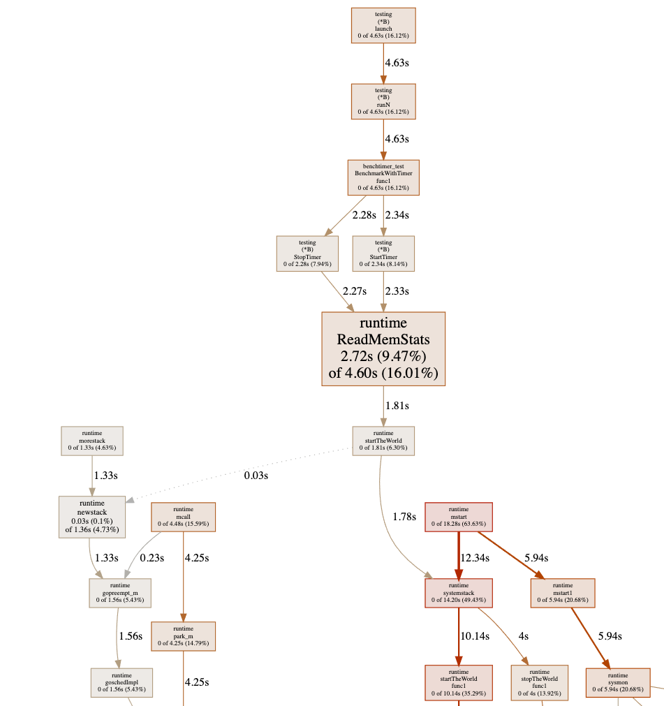
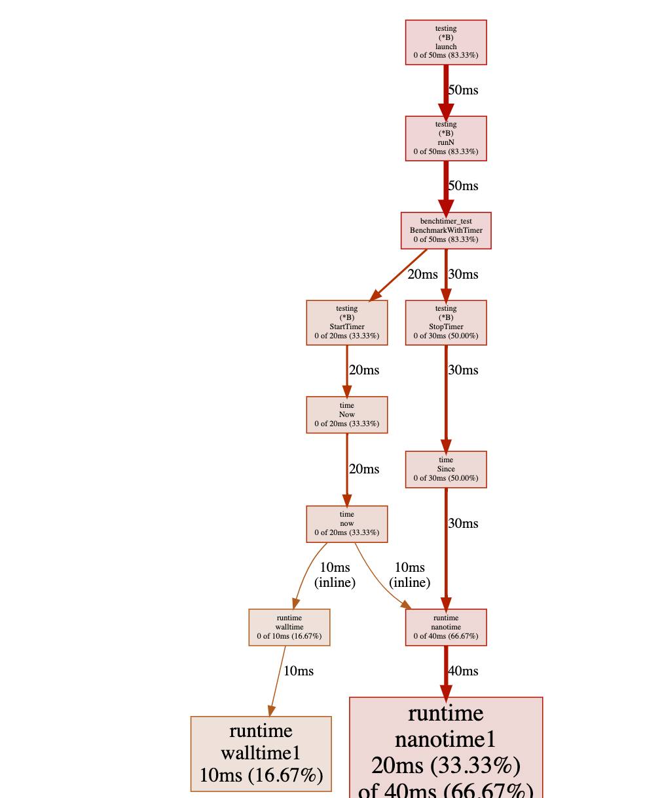

{}

About six months ago, I did a [presentation](https://golang.design/s/gobench)
that talks about how to conduct reliable benchmarking in Go.
Recently, I submitted an issue [#41641](https://golang.org/issue/41641) to the Go project,
which is also a subtle problem that you might need to address in some cases.

The issue is all about the following code snippet:

```go
func BenchmarkAtomic(b *testing.B) {
	var v int32
	atomic.StoreInt32(&v, 0)
	b.Run("with-timer", func(b *testing.B) {
		for i := 0; i < b.N; i++ {
			b.StopTimer()
			// ... do extra stuff ...
			b.StartTimer()
			atomic.AddInt32(&v, 1)
		}
	})
	atomic.StoreInt32(&v, 0)
	b.Run("w/o-timer", func(b *testing.B) {
		for i := 0; i < b.N; i++ {
			atomic.AddInt32(&v, 1)
		}
	})
}
```

<!-- more -->

On my target machine (CPU Quad-core Intel Core i7-7700 (-MT-MCP-) speed/max 1341/4200 MHz Kernel 5.4.0-42-generic x86_64), running the snippet with the following command:

```
go test -run=none -bench=Atomic -benchtime=1000x -count=20 | tee b.txt && benchstat b.txt
```

The result shows:

```
name                         time/op
Atomic/with-timer-8      32.6ns ± 7%
Atomic/w/o-timer-8       6.60ns ± 6%
```

Is it interesting to you? As you can tell, the measurement without
introducing `StopTimer/StartTimer` pair is 26ns faster than the one with
the `StopTimer/StartTimer` pair. How is this happening?

To learn more reason behind it, let's modify the benchmark a little bit:

```go
func BenchmarkAtomic(b *testing.B) {
	var v int32
	var n = 1000000
	for k := 1; k < n; k *= 10 {
		b.Run(fmt.Sprintf("n-%d", k), func(b *testing.B) {
			atomic.StoreInt32(&v, 0)
			b.Run("with-timer", func(b *testing.B) {
				for i := 0; i < b.N; i++ {
					b.StopTimer()
					b.StartTimer()
					for j := 0; j < k; j++ {
						atomic.AddInt32(&v, 1)
					}
				}
			})
			atomic.StoreInt32(&v, 0)
			b.Run("w/o-timer", func(b *testing.B) {
				for i := 0; i < b.N; i++ {
					for j := 0; j < k; j++ {
						atomic.AddInt32(&v, 1)
					}
				}
			})
		})
	}
}
```

This time, we use a loop of variable `k` to increase the number of
atomic operations in the bench loop, that is:

```go
for j := 0; j < k; j++ {
	atomic.AddInt32(&v, 1)
}
```

Thus with higher `k`, the target code grows more costly. Using similar command:

```
go test -run=none -bench=Atomic -benchtime=1000x -count=20 | tee b.txt && benchstat b.txt
```

One can produce similar result as follows:

```
name                          time/op
Atomic/n-1/with-timer-8       34.8ns ±12%
Atomic/n-1/w/o-timer-8        6.44ns ± 1%
Atomic/n-10/with-timer-8      74.3ns ± 5%
Atomic/n-10/w/o-timer-8       47.6ns ± 3%
Atomic/n-100/with-timer-8      488ns ± 7%
Atomic/n-100/w/o-timer-8       456ns ± 2%
Atomic/n-1000/with-timer-8    4.65µs ± 3%
Atomic/n-1000/w/o-timer-8     4.63µs ±12%
Atomic/n-10000/with-timer-8   45.4µs ± 4%
Atomic/n-10000/w/o-timer-8    43.5µs ± 1%
Atomic/n-100000/with-timer-8   444µs ± 1%
Atomic/n-100000/w/o-timer-8    432µs ± 0%
```

What's interesting in the modified benchmark result is that:
By testing target code with a higher cost, the difference between
`with-timer` and `w/o-timer` gets much closer. More specifically,
in the last pair of outputs, when `n=100000`, the measured atomic operation
only has `(444µs-432µs)/100000 = 0.12 ns` time difference,
which is pretty much accurate other than the error
`(34.8ns-6.44ns)/1 = 28.36 ns` when `n=1`.

Why? There are two ways to trace the problem down to the bare bones.

## Initial Investigation Using `go tool pprof`

As a standard procedure, let's benchmark the code that interrupts
the timer and analysis profiling result using `go tool pprof`:

```go
func BenchmarkWithTimer(b *testing.B) {
	var v int32
	for i := 0; i < b.N; i++ {
		b.StopTimer()
		b.StartTimer()
		for j := 0; j < *k; j++ {
			atomic.AddInt32(&v, 1)
		}
	}
}
```

```
go test -v -run=none -bench=WithTimer -benchtime=100000x -count=5 -cpuprofile cpu.pprof
```

Sadly, the graph shows a chunk of useless information where most of
the costs shows as `runtime.ReadMemStats`:



This is because of the `StopTimer/StartTimer` implementation in
the testing package calls `runtime.ReadMemStats`:

```go
package testing

(...)

func (b *B) StartTimer() {
	if !b.timerOn {
		runtime.ReadMemStats(&memStats) // <- here
		b.startAllocs = memStats.Mallocs
		b.startBytes = memStats.TotalAlloc
		b.start = time.Now()
		b.timerOn = true
	}
}

func (b *B) StopTimer() {
	if b.timerOn {
		b.duration += time.Since(b.start)
		runtime.ReadMemStats(&memStats) // <- here
		b.netAllocs += memStats.Mallocs - b.startAllocs
		b.netBytes += memStats.TotalAlloc - b.startBytes
		b.timerOn = false
	}
}
```

As we know that `runtime.ReadMemStats` stops the world, and each call
to it is very time-consuming. Yes, this is yet another known issue
[#20875](https://golang.org/issue/20875) regarding reduce `runtime.ReadMemStats`
overhead in benchmarking.

Since we do not care about memory allocation at the moment,
to avoid this issue, one could just hacking the source code by
comment out the call to `runtime.ReadMemStats`:

```go
package testing

(...)

func (b *B) StartTimer() {
	if !b.timerOn {
		// runtime.ReadMemStats(&memStats) // <- here
		b.startAllocs = memStats.Mallocs
		b.startBytes = memStats.TotalAlloc
		b.start = time.Now()
		b.timerOn = true
	}
}

func (b *B) StopTimer() {
	if b.timerOn {
		b.duration += time.Since(b.start)
		// runtime.ReadMemStats(&memStats) // <- here
		b.netAllocs += memStats.Mallocs - b.startAllocs
		b.netBytes += memStats.TotalAlloc - b.startBytes
		b.timerOn = false
	}
}
```

If we re-run the test again, the pprof shows us:



Have you noticed where the problem is? Obviously, there is a heavy cost
while calling `time.Now()` in a tight loop
(not really surprising because it is a system call).

## Further Verification Using C++

As we discussed in the previous section, the Go's pprof facility has
its own problem while executing a benchmark, one can only edit
the source code of Go to verify the source of the measurement error.
You might want ask: Can we do something better than that? The answer is yes.

Let's write the initial benchmark in C++. This time, we go straightforward
to the issue of calling `now()`:

```cpp
#include <iostream>
#include <chrono>

void empty() {}

int main() {
    int n = 1000000;
    for (int j = 0; j < 10; j++) {
        std::chrono::nanoseconds since(0);
        for (int i = 0; i < n; i++) {
            auto start = std::chrono::steady_clock::now();
            empty();
            since += std::chrono::steady_clock::now() - start;
        }
        std::cout << "avg since: " << since.count() / n << "ns \n";
    }
}
```

compile it with:

```
clang++ -std=c++17 -O3 -pedantic -Wall main.cpp
```

In this code snippet, we are trying to measure the performance of an empty function.
Ideally, the output should be `0ns`. However, there is still a cost in calling
the empty function:

```
avg since: 17ns
avg since: 16ns
avg since: 16ns
avg since: 16ns
avg since: 16ns
avg since: 16ns
avg since: 16ns
avg since: 16ns
avg since: 16ns
avg since: 16ns
```

Furthermore, we could also simplify the code to the subtraction of two `now()` calls:

```cpp
#include <iostream>
#include <chrono>

int main() {
    int n = 1000000;
    for (int j = 0; j < 10; j++) {
        std::chrono::nanoseconds since(0);
        for (int i = 0; i < n; i++) {
            since -= std::chrono::steady_clock::now() - std::chrono::steady_clock::now();
        }
        std::cout << "avg since: " << since.count() / n << "ns \n";
    }
}
```

and you will see that the output remains end in the cost of `avg since: 16ns`.
**This proves that there is an overhead of calling `now()` for benchmarking.**

Thus, in terms of benchmarking, the actual measured time of a target code equals
to the execution time of the target code plus the overhead of calling `now()`,
as showed in the figure below.


Mathematically speaking, assume the target code consumes in `T` ns,
and the overhead of `now()` is `t` ns. Now, let's run the target code `N` times.
The total measured time is `T*N+t`, then the average of a single iteration
of the target code is `T+t/N`. Thus, the systematic measurement error becomes: `t/N`.
Therefore, with a higher `N`, the systematic measurement error gets smaller.

## The Solution

Back to the original question, how can we avoid the measurement error?
A quick and dirty solution is subtract the `now()`'s overhead:

```cpp
#include <iostream>
#include <chrono>

void target() {}

int main() {
    int n = 1000000;
    for (int j = 0; j < 10; j++) {
        std::chrono::nanoseconds since(0);
        for (int i = 0; i < n; i++) {
            auto start = std::chrono::steady_clock::now();
            target();
            since += std::chrono::steady_clock::now() - start;
        }

        auto overhead = -(std::chrono::steady_clock::now() -
                          std::chrono::steady_clock::now());
        since -= overhead * n;

        std::cout << "avg since: " << since.count() / n << "ns \n";
    }
}
```

And in Go, you could do something like this:

```go
var v int32
atomic.StoreInt32(&v, 0)
r := testing.Benchmark(func(b *testing.B) {
  for i := 0; i < b.N; i++ {
    b.StopTimer()
    // ... do extra stuff ...
    b.StartTimer()
    atomic.AddInt32(&v, 1)
  }
})

// do calibration that removes the overhead of calling time.Now().
calibrate := func(d time.Duration, n int) time.Duration {
  since := time.Duration(0)
  for i := 0; i < n; i++ {
    start := time.Now()
    since += time.Since(start)
  }
  return (d - since) / time.Duration(n)
}

fmt.Printf("%v ns/op\n", calibrate(r.T, r.N))
```

As a take-away message, if you are writing a micro-benchmark (whose runs in nanoseconds),
and you must interrupt the timer to clean up and reset some resources for some reason,
then you must do a calibration on the measurement.

If the Go's benchmark facility addresses the issue internally, then it is great;
but if they don't, at least you are aware of this issue and know how to fix it now.

## Further Reading Suggestions

- Changkun Ou. Conduct Reliable Benchmarking in Go. March 26, 2020. https://golang.design/s/gobench
- Changkun Ou. testing: inconsistent benchmark measurements when interrupts timer. Sep 26, 2020. https://golang.org/issue/41641
- Josh Bleecher Snyder. testing: consider calling ReadMemStats less during benchmarking. Jul 1, 2017. https://golang.org/issue/20875
- Beyer, D., Löwe, S. & Wendler, P. Reliable benchmarking: requirements and solutions. Int J Softw Tools Technol Transfer 21, 1–29 (2019). https://doi.org/10.1007/s10009-017-0469-y

{}

{}

大约六个月前，我做了一个关于如何在 Go 中进行可靠基准测试的[演讲](https://golang.design/s/gobench)。
最近，我向 Go 项目提交了一个 issue [#41641](https://golang.org/issue/41641)，
它涉及一个在某些情况下需要处理的隐蔽问题。

问题的核心在于以下代码片段：

```go
func BenchmarkAtomic(b *testing.B) {
	var v int32
	atomic.StoreInt32(&v, 0)
	b.Run("with-timer", func(b *testing.B) {
		for i := 0; i < b.N; i++ {
			b.StopTimer()
			// ... 额外操作 ...
			b.StartTimer()
			atomic.AddInt32(&v, 1)
		}
	})
	atomic.StoreInt32(&v, 0)
	b.Run("w/o-timer", func(b *testing.B) {
		for i := 0; i < b.N; i++ {
			atomic.AddInt32(&v, 1)
		}
	})
}
```

<!-- more -->

在我的测试机（CPU Quad-core Intel Core i7-7700 (-MT-MCP-) speed/max 1341/4200 MHz Kernel 5.4.0-42-generic x86_64）上，用以下命令运行该代码片段：

```
go test -run=none -bench=Atomic -benchtime=1000x -count=20 | tee b.txt && benchstat b.txt
```

结果如下：

```
name                         time/op
Atomic/with-timer-8      32.6ns ± 7%
Atomic/w/o-timer-8       6.60ns ± 6%
```

有趣吧？可以看到，不使用 `StopTimer/StartTimer` 的测量比使用它的快了 26ns。这是怎么回事？

为了深入探究原因，我们稍微修改一下基准测试：

```go
func BenchmarkAtomic(b *testing.B) {
	var v int32
	var n = 1000000
	for k := 1; k < n; k *= 10 {
		b.Run(fmt.Sprintf("n-%d", k), func(b *testing.B) {
			atomic.StoreInt32(&v, 0)
			b.Run("with-timer", func(b *testing.B) {
				for i := 0; i < b.N; i++ {
					b.StopTimer()
					b.StartTimer()
					for j := 0; j < k; j++ {
						atomic.AddInt32(&v, 1)
					}
				}
			})
			atomic.StoreInt32(&v, 0)
			b.Run("w/o-timer", func(b *testing.B) {
				for i := 0; i < b.N; i++ {
					for j := 0; j < k; j++ {
						atomic.AddInt32(&v, 1)
					}
				}
			})
		})
	}
}
```

这次，我们用变量 `k` 控制循环次数来增加测试目标的原子操作数量：

```go
for j := 0; j < k; j++ {
	atomic.AddInt32(&v, 1)
}
```

随着 `k` 增大，目标代码的开销也随之增大。使用类似的命令：

```
go test -run=none -bench=Atomic -benchtime=1000x -count=20 | tee b.txt && benchstat b.txt
```

可以得到类似的结果：

```
name                          time/op
Atomic/n-1/with-timer-8       34.8ns ±12%
Atomic/n-1/w/o-timer-8        6.44ns ± 1%
Atomic/n-10/with-timer-8      74.3ns ± 5%
Atomic/n-10/w/o-timer-8       47.6ns ± 3%
Atomic/n-100/with-timer-8      488ns ± 7%
Atomic/n-100/w/o-timer-8       456ns ± 2%
Atomic/n-1000/with-timer-8    4.65µs ± 3%
Atomic/n-1000/w/o-timer-8     4.63µs ±12%
Atomic/n-10000/with-timer-8   45.4µs ± 4%
Atomic/n-10000/w/o-timer-8    43.5µs ± 1%
Atomic/n-100000/with-timer-8   444µs ± 1%
Atomic/n-100000/w/o-timer-8    432µs ± 0%
```

修改后的基准测试结果中有一个有趣的现象：随着目标代码开销的增大，`with-timer` 和 `w/o-timer` 的差距越来越小。具体来说，在最后一组输出中，当 `n=100000` 时，原子操作的测量时间差仅为 `(444µs-432µs)/100000 = 0.12 ns`，而当 `n=1` 时误差高达 `(34.8ns-6.44ns)/1 = 28.36 ns`。

为什么会这样？以下是两种追根溯源的方法。

## 使用 `go tool pprof` 进行初步排查

作为标准流程，我们对带有计时器中断的代码进行基准测试，并使用 `go tool pprof` 分析性能数据：

```go
func BenchmarkWithTimer(b *testing.B) {
	var v int32
	for i := 0; i < b.N; i++ {
		b.StopTimer()
		b.StartTimer()
		for j := 0; j < *k; j++ {
			atomic.AddInt32(&v, 1)
		}
	}
}
```

```
go test -v -run=none -bench=WithTimer -benchtime=100000x -count=5 -cpuprofile cpu.pprof
```

遗憾的是，图表显示了大量无用信息，大部分开销显示为 `runtime.ReadMemStats`：


这是因为 testing 包中的 `StopTimer/StartTimer` 实现会调用 `runtime.ReadMemStats`：

```go
package testing

(...)

func (b *B) StartTimer() {
	if !b.timerOn {
		runtime.ReadMemStats(&memStats) // <- 此处
		b.startAllocs = memStats.Mallocs
		b.startBytes = memStats.TotalAlloc
		b.start = time.Now()
		b.timerOn = true
	}
}

func (b *B) StopTimer() {
	if b.timerOn {
		b.duration += time.Since(b.start)
		runtime.ReadMemStats(&memStats) // <- 此处
		b.netAllocs += memStats.Mallocs - b.startAllocs
		b.netBytes += memStats.TotalAlloc - b.startBytes
		b.timerOn = false
	}
}
```

众所周知，`runtime.ReadMemStats` 会触发 STW（Stop The World），每次调用开销极大。这是另一个已知问题 [#20875](https://golang.org/issue/20875)，关于减少基准测试中 `runtime.ReadMemStats` 的开销。

由于我们暂时不关心内存分配，为了规避这个问题，可以直接修改源码，注释掉对 `runtime.ReadMemStats` 的调用：

```go
package testing

(...)

func (b *B) StartTimer() {
	if !b.timerOn {
		// runtime.ReadMemStats(&memStats) // <- 此处
		b.startAllocs = memStats.Mallocs
		b.startBytes = memStats.TotalAlloc
		b.start = time.Now()
		b.timerOn = true
	}
}

func (b *B) StopTimer() {
	if b.timerOn {
		b.duration += time.Since(b.start)
		// runtime.ReadMemStats(&memStats) // <- 此处
		b.netAllocs += memStats.Mallocs - b.startAllocs
		b.netBytes += memStats.TotalAlloc - b.startBytes
		b.timerOn = false
	}
}
```

重新运行测试后，pprof 显示：


发现问题所在了吗？在紧密循环中调用 `time.Now()` 开销极大（这并不奇怪，因为它是一个系统调用）。

## 使用 C++ 进一步验证

如上一节所述，Go 的 pprof 工具本身在执行基准测试时存在问题，只能通过修改 Go 源码来验证测量误差的根源。
你可能会问：有没有更好的办法？答案是有的。

我们用 C++ 重写最初的基准测试，这次直接针对 `now()` 调用的开销问题：

```cpp
#include <iostream>
#include <chrono>

void empty() {}

int main() {
    int n = 1000000;
    for (int j = 0; j < 10; j++) {
        std::chrono::nanoseconds since(0);
        for (int i = 0; i < n; i++) {
            auto start = std::chrono::steady_clock::now();
            empty();
            since += std::chrono::steady_clock::now() - start;
        }
        std::cout << "avg since: " << since.count() / n << "ns \n";
    }
}
```

使用以下命令编译：

```
clang++ -std=c++17 -O3 -pedantic -Wall main.cpp
```

这段代码试图测量一个空函数的性能，理论上输出应该是 `0ns`，但仍然存在一定开销：

```
avg since: 17ns
avg since: 16ns
avg since: 16ns
avg since: 16ns
avg since: 16ns
avg since: 16ns
avg since: 16ns
avg since: 16ns
avg since: 16ns
avg since: 16ns
```

进一步地，我们可以将代码简化为两次 `now()` 调用之差：

```cpp
#include <iostream>
#include <chrono>

int main() {
    int n = 1000000;
    for (int j = 0; j < 10; j++) {
        std::chrono::nanoseconds since(0);
        for (int i = 0; i < n; i++) {
            since -= std::chrono::steady_clock::now() - std::chrono::steady_clock::now();
        }
        std::cout << "avg since: " << since.count() / n << "ns \n";
    }
}
```

输出仍然是 `avg since: 16ns`。**这证明了调用 `now()` 本身存在固有开销。**

因此，在基准测试中，目标代码的实际测量时间等于目标代码的执行时间加上调用 `now()` 的开销，如下图所示。


从数学角度来看，假设目标代码耗时 `T` ns，`now()` 的开销为 `t` ns，将目标代码运行 `N` 次，总测量时间为 `T*N+t`，则单次迭代的平均时间为 `T+t/N`，系统性测量误差为 `t/N`。因此，`N` 越大，系统性测量误差越小。

## 解决方案

回到最初的问题：如何避免测量误差？一个简单直接的方案是减去 `now()` 的开销：

```cpp
#include <iostream>
#include <chrono>

void target() {}

int main() {
    int n = 1000000;
    for (int j = 0; j < 10; j++) {
        std::chrono::nanoseconds since(0);
        for (int i = 0; i < n; i++) {
            auto start = std::chrono::steady_clock::now();
            target();
            since += std::chrono::steady_clock::now() - start;
        }

        auto overhead = -(std::chrono::steady_clock::now() -
                          std::chrono::steady_clock::now());
        since -= overhead * n;

        std::cout << "avg since: " << since.count() / n << "ns \n";
    }
}
```

在 Go 中，可以这样处理：

```go
var v int32
atomic.StoreInt32(&v, 0)
r := testing.Benchmark(func(b *testing.B) {
  for i := 0; i < b.N; i++ {
    b.StopTimer()
    // ... 额外操作 ...
    b.StartTimer()
    atomic.AddInt32(&v, 1)
  }
})

// 通过减去 time.Now() 的调用开销来进行校准
calibrate := func(d time.Duration, n int) time.Duration {
  since := time.Duration(0)
  for i := 0; i < n; i++ {
    start := time.Now()
    since += time.Since(start)
  }
  return (d - since) / time.Duration(n)
}

fmt.Printf("%v ns/op\n", calibrate(r.T, r.N))
```

总结：如果你在编写微基准测试（运行时间在纳秒级别），并且因为某些原因必须中断计时器来清理和重置资源，那么你必须对测量结果进行校准。

如果 Go 的基准测试工具未来在内部解决了这个问题，那当然最好；但如果没有，至少你现在已经意识到了这个问题，并知道如何解决它。

## 延伸阅读

- Changkun Ou. Conduct Reliable Benchmarking in Go. March 26, 2020. https://golang.design/s/gobench
- Changkun Ou. testing: inconsistent benchmark measurements when interrupts timer. Sep 26, 2020. https://golang.org/issue/41641
- Josh Bleecher Snyder. testing: consider calling ReadMemStats less during benchmarking. Jul 1, 2017. https://golang.org/issue/20875
- Beyer, D., Löwe, S. & Wendler, P. Reliable benchmarking: requirements and solutions. Int J Softw Tools Technol Transfer 21, 1–29 (2019). https://doi.org/10.1007/s10009-017-0469-y

{}