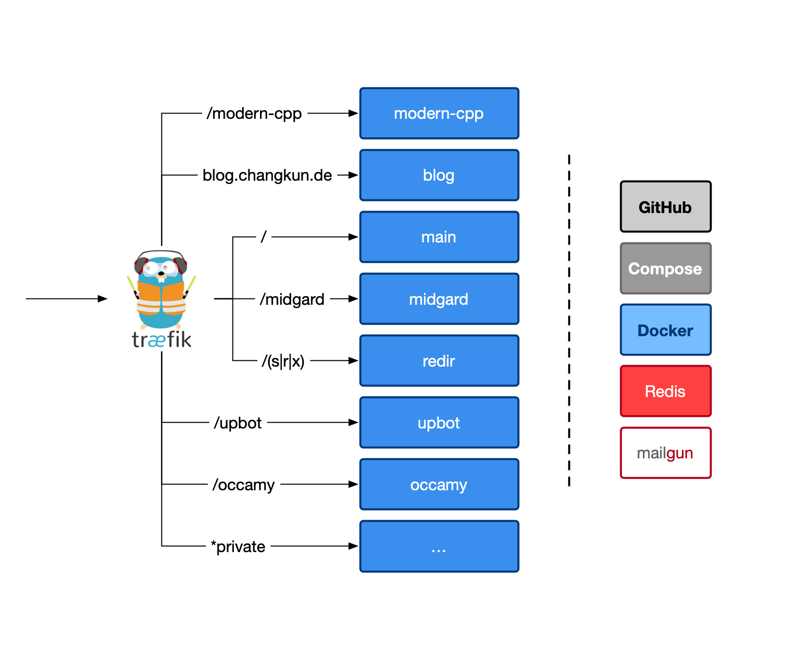
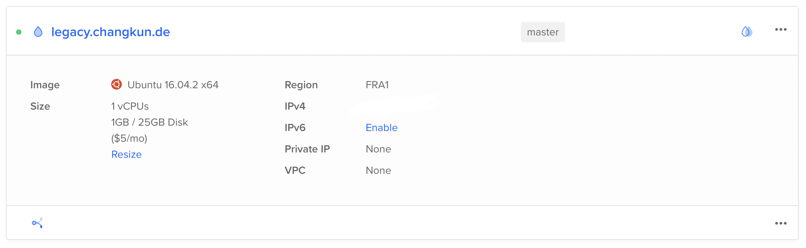
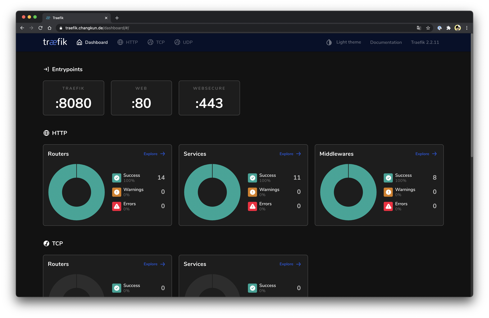
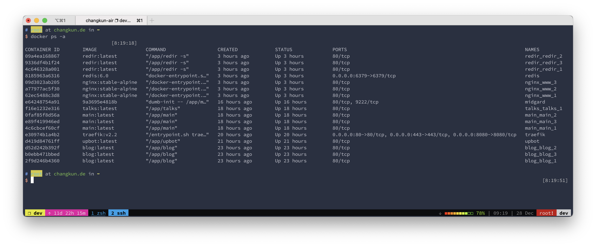

{}
In [this post](https://changkun.de/blog/posts/all-in-go/) I gave an overview of the
restructured architecture of changkun.de, but I didn't go into detail about how the
migration itself was carried out — whether there was any downtime, and so on.
This time, let's take a closer look at the migration process.

<!--more-->

## Migration Checklist

First, a number of services were running on the changkun.de server, including
frequently-used ones like redir and midgard, as shown in the diagram:



These services include:

- https://changkun.de/s/main
- https://changkun.de/s/blog
- https://changkun.de/s/midgard
- https://changkun.de/s/redir
- https://changkun.de/s/upbot
- https://changkun.de/s/modern-cpp-tutorial

And two sites that were previously hosted on changkun.de but now redirect to golang.design:

- https://changkun.de/s/go-under-the-hood
- https://changkun.de/s/gossa

The key challenges of the migration were:

1. How to migrate the data, especially the short-link records stored in redir
2. How to keep the site online during the migration
3. How to update the CI deployment scripts on GitHub Actions

The changkun.de machine was purchased in 2016 and, due to some special circumstances,
could not be smoothly upgraded to the 20.04 release. On top of that, due to technical
limitations in Digital Ocean itself, it wasn't even possible to add a VPC. The machine
was effectively locked down completely:



One straightforward approach is to simply purchase a new machine, migrate all services
to it, and then switch the DNS. However, this approach depends heavily on how tightly
the services are coupled to the host environment. If a service has strong dependencies
on the machine's environment, a great deal of server-side configuration is required —
which is precisely why containerizing all current services is so important: it makes it
possible to spin up a new machine at any time and rapidly deploy existing services.

Let's walk through the operational steps this process requires.

## Configuring Traefik

Our goal is to use Traefik as a reverse proxy. To do that, we need to understand how
Traefik 2 works at a basic level. Traefik's working model is essentially the same as
any traditional reverse proxy — it just introduces a lot of new terminology (old wine
in new bottles), such as static configuration, dynamic configuration, routers, services,
and so on. These concepts all have counterparts in Nginx.

For example, in Nginx you can use:

```
sudo service nginx reload
```

to achieve what Traefik calls a Dynamic Configuration update; and:

```
sudo service nginx restart
```

to achieve what Traefik calls a Static Configuration update.
You can serve static files with a configuration like this:

```
server {
    server_name changkun.de;
    access_log /www/logs/www.changkun.de.access.log;
    error_log  /www/logs/www.changkun.de.error.log;
    root /www;
    index index.html;
    error_page 404 /404.html;
    location / {
        try_files $uri $uri/ =404;
        autoindex on;
    }
    ...
}
```

And configure what Traefik calls a redirect Middleware like this:

```
server {
    ...
    rewrite ^/golang/(.*)$ https://golang.design/under-the-hood/$1 permanent;
    rewrite ^/gossa(.*)$ https://golang.design/gossa/$1 permanent;
    ...
}
```

And even configure what Traefik calls a Service Proxy:

```
server {
    ...
    location ~ ^/(x|s|r)/ {
        proxy_pass http://0.0.0.0:9123;
        proxy_set_header Host            $host;
        proxy_set_header X-Forwarded-For $remote_addr;
    }
    location = /upbot {
        proxy_pass http://0.0.0.0:9120;
        proxy_set_header Host       $host;
        proxy_set_header X-Forwarded-For $remote_addr;
    }
    location /midgard/ {
        proxy_pass          http://0.0.0.0:9124;
        proxy_set_header    Host             $host;
        proxy_set_header    X-Real-IP        $remote_addr;
        proxy_set_header    X-Forwarded-For  $proxy_add_x_forwarded_for;
        proxy_set_header    X-Client-Verify  SUCCESS;
        proxy_set_header    X-Client-DN      $ssl_client_s_dn;
        proxy_set_header    X-SSL-Subject    $ssl_client_s_dn;
        proxy_set_header    X-SSL-Issuer     $ssl_client_i_dn;

        proxy_set_header Upgrade $http_upgrade;
        proxy_set_header Connection "upgrade";

        proxy_read_timeout 1800;
        proxy_connect_timeout 1800;
        client_max_body_size 2M;
    }
}
```

And so on. Of course, this kind of configuration is quite basic — it doesn't handle
load balancing across multiple container instances, for instance. But since we've
already decided to switch to Traefik, we can more conveniently leverage container
isolation to address load balancing concerns.

### Static Configuration

The first thing to sort out when configuring Traefik is the static configuration,
which covers three main concerns:

1. EntryPoints: the externally exposed ports
2. certificatesResolvers: TLS certificates
3. providers: where to source dynamic configuration from

Traefik's Provider is an implementation of configuration discovery and supports
many different mechanisms. I personally prefer the file-based approach, as it makes
things easy to categorize. So I chose the File Provider.

The following configuration, for example, forces HTTPS, sets up the certificate
resolver, and specifies that dynamic configuration should be loaded from files:

```yaml
entryPoints:
  web:
    address: :80
    http:
      redirections:
        entryPoint:
          to: websecure
          scheme: https
  websecure:
    address: :443
certificatesResolvers:
  changkunResolver:
    acme:
      email: hi@changkun.de
      storage: /etc/traefik/conf/acme.json
      httpChallenge:
        entryPoint: web
providers:
  file:
    directory: /etc/traefik/conf/
    watch: truef
```

### Dynamic Configuration

Dynamic configuration primarily covers routing information for the services.
Taking the main site as an example:

```yaml
http:
  routers:
    # github.com/changkun/main
    to-main:
      rule: "Host(`dev.changkun.de`)"
      tls:
        certResolver: changkunResolver
      middlewares:
        - main-errorpages
      service: main
  middlewares:
    main-errorpages:
      errors:
        status:
          - "404"
        service: main
        query: "/404.html"
  services:
    main:
      loadBalancer:
        servers:
        - url: http://main
```

Finally, Traefik is launched via docker compose, together with a `traefik_proxy` Docker network:

```yaml
version: '3'

services:
  traefik:
    container_name: traefik
    image: traefik:v2.2
    ports:
      - "80:80"
      - "443:443"
      - "8080:8080"
    networks:
      - proxy
    volumes:
      - ./traefik.yml:/etc/traefik/traefik.yml
      - ./conf:/etc/traefik/conf
      - ./logs:/logs
networks:
  proxy:
    driver:
      bridge
```

Traefik also comes with a very fancy Dashboard:



And configuring it is entirely painless:

```yaml
http:
  routers:
    dashboard:
      rule: Host(`traefik.changkun.de`) && (PathPrefix(`/api`) || PathPrefix(`/dashboard`))
      service: api@internal
      tls:
        certResolver: changkunResolver
      middlewares:
        - auth
  middlewares:
    auth:
      basicAuth:
        users:
          - "changkun:password"
```

Of course, there is much more to the full dynamic configuration. All of it can be
found at [changkun.de/s/proxy](https://changkun.de/s/proxy).

## Service Deployment

Taking the main site changkun.de/s/main as an example, deploying a containerized
service is extremely straightforward:

```
make build && make up
```

After deploying all services, every container was up and running normally:



As you can see, there are a few single points among the currently running services.
The reasons are:

1. Traefik: only one instance can be deployed per machine
2. Midgard: a stateful service
3. Redis: used as a database

Of these single points, only Redis can be upgraded to a cluster; the other two cannot
be horizontally scaled for the time being.

Midgard itself maintains a global clipboard stored within the application, and also
manages WebSocket connections between the Daemon and Server — it is inherently stateful.

Load balancing comes in many flavors. In a cluster environment, Traefik itself can run
as multiple replicas, distributing load across different nodes — inter-node balancing
can rely on lower-level mechanisms such as DNS, link-layer, or network-layer balancing.
But in changkun.de's single-machine setup, the reverse proxy simply listens on ports 80
and 443 to perform application-layer load balancing across containers on that machine,
with no room for horizontal scaling.

## GitHub Actions Deployment Scripts

### changkun/modern-cpp-tutorial

Deployment for [changkun/modern-cpp-tutorial] is a bit tricky, because the project
requires building a PDF, which depends on [pandoc](https://pandoc.org/) and
[texlive](https://www.tug.org/texlive/).

Back in the day, to speed up the build process and avoid reinstalling a full texlive
on every update, I published a `changkun/modern-cpp-tutorial:build-env` image.
Naturally, since it packages a complete texlive-full, the image size is enormous.
But pulling an image is still more convenient than running `apt install textlive-full`.

In the modern-cpp-tutorial repository's [github-action/workflow](https://github.com/changkun/modern-cpp-tutorial/blob/master/.github/workflows/website.yml),
the deployment approach is quite blunt: it simply scps the built files directly onto
the server.

So how do we adapt this deployment flow to a Traefik setup that doesn't serve static
files on its own? There are two options:

1. Build on the server: log into the server to perform the build whenever a new commit lands

  The downside of this approach is that the server has to pull the latest commit and
  consume server resources to build — which is not fundamentally different from just
  uploading pre-built files.

2. Keep the original deployment approach and run a dedicated Nginx on the server solely
   for serving static files. For example:

  ```yaml
  version: '3'
    services:
    www:
        image: nginx:stable-alpine
        restart: always
        volumes:
        - /www:/usr/share/nginx/html
        deploy:
        replicas: 3
        networks:
        - traefik_proxy
    networks:
    traefik_proxy:
        external: true
  ```

  This serves all assets under the /www directory. You'd then just upload the compiled
  modern-cpp-tutorial files into that directory — no container update required.

> - Why not use a CDN? No budget. Care to make a donation?
> - Why not use Cloudflare? Laziness. On one hand, I'd rather not introduce too many
>   external dependencies for a personal site; on the other hand,
>   [golang.design](https://golang.design) already uses Cloudflare, so it acts as
>   an A/B comparison with changkun.de.

After a bit of thought, I opted for option two, letting modern-cpp serve as a special
case (using Go to bundle static files inside a C++ tutorial seems a bit odd, and
implementing it in C++ would be far more work than doing it in Go).

For this decision, no changes to the modern-cpp-tutorial repository itself are needed —
only the repository secrets need to be updated, such as the server's private key, the
login username, the upload path, and similar details.

### changkun/blog

Besides modern-cpp-tutorial, the other repository using GitHub Actions CI is this
blog itself. Although the blog could also use option two — directly uploading static
files — in order to achieve the original goal, I ultimately went with option one:

```
ssh $USER@$DOMAIN "cd changkun.de/blog && git fetch && git rebase && make build && make up"
```

That is, using GitHub Actions to log into the server, pull the repository, build,
and redeploy — serving as a counterpart to method two.

## DNS Update

Not much to say here. Once the services were confirmed to be running correctly under
the dev.changkun.de domain, I pointed the DNS record for changkun.de to the new
machine.

Throughout the entire migration, [upbot](https://changkun.de/s/upbot) never fired a
single alert, which means the zero-downtime migration was a success for all running
services :)

## Summary

This post described how changkun.de was migrated from one machine to another without
any downtime. In a production setting, database services would typically be deployed
on separate nodes with application services connecting to them via URL.

Fortunately, changkun.de doesn't deal with large amounts of data, so the migration
didn't involve much data movement — it was straightforward to copy data directly from
one machine to the other.

All services were first brought up under dev.changkun.de. Once all services were
confirmed to be working, the DNS for the root domain changkun.de was updated, enabling
a seamless cutover.

For CI-deployed services, two different approaches are currently in use:

1. `modern-cpp`: static files are compiled on GitHub Actions and uploaded directly to the server;
2. `blog`: GitHub Actions SSHes into the server and performs the compile-and-run there.

There is certainly room for more "enterprise-grade" approaches: setting up a private
build system like Jenkins that only accepts GitHub repository webhooks; building
directly on the machine; purchasing extra Docker Registry space, building and pushing
to the registry, then notifying the machine to pull the updated image; or going all-in
with k8s and Helm...

But remember: "premature optimization is the root of all evil."
{}

{}
在[这篇文章](https://changkun.de/blog/posts/all-in-go/) 中我介绍了
changkun.de 重新调整后的一个整体的架构，
但并没有仔细的介绍进行架构升级的过程是怎样的、升级过程中是否有进行停机等等。
这次我们就来简单聊一聊这个迁移过程。

<!--more-->

## 迁移清单

首先，changkun.de 服务器上运行了诸多服务，比如使用频繁的有 redir、midgard
等等，如图所示：


这些服务包括：

- https://changkun.de/s/main
- https://changkun.de/s/blog
- https://changkun.de/s/midgard
- https://changkun.de/s/redir
- https://changkun.de/s/upbot
- https://changkun.de/s/modern-cpp-tutorial

以及这两个曾经在 changkun.de 上部署，但目前已经重定向到 golang.design 的两个网站：

- https://changkun.de/s/go-under-the-hood
- https://changkun.de/s/gossa

迁移面临的几个重要的问题是：

1. 如何完成数据的迁移，尤其是 redir 所存储的短链接记录
2. 如何保证网站不掉线？
3. 如何适配并调整 GitHub Action 上的 CI 部署脚本？

changkun.de 的机器购买于 2016 年，因为一些特殊的原因，无法顺利的更新到 20.04 的发行版。
而且由于 Digital Ocean 本身的技术限制，甚至无法添加 VPC。相当于机器被整个锁死了：


一个比较粗暴的方式就是直接购买一台新的机器，将所有的服务迁移到新的机器上，然后对域名进行切换。
但这种做法非常依赖服务本身对机器的依赖性，如果服务对机器的环境具有强依赖，则需要进行过多服务器
环境的配置，这也是为什么希望对所有现行服务进行容器化的一个重要原因：能够随时启动一台新的机器
并快速部署现有的服务。

接下来我们就来看看这个过程需要进行那些运维操作。

## 配置 Traefik

我们的目标是用上 Traefik 进行反向代理。我们就必须理解 Traefik 2 的基本工作原理。
Traefik 的工作原理本质上跟传统的反向代理并没有多少区别，反倒是发明了许多新的名词（新瓶旧酒），
比如静态配置、动态配置、路由、服务等等。这些概念其实在 Nginx 上也有体现。
比如说，Nginx 可以使用：

```
sudo service nginx reload
```

来实现 Traefik 中所谓 Dynamic Configuration 的更新；也可以通过

```
sudo service nginx restart
```

来实现 Traefik 中所谓 Static Configuration 的更新；
可以通过这样的配置来同时实现静态文件的访问：

```
server {
    server_name changkun.de;
    access_log /www/logs/www.changkun.de.access.log;
    error_log  /www/logs/www.changkun.de.error.log;
    root /www;
    index index.html;
    error_page 404 /404.html;
    location / {
        try_files $uri $uri/ =404;
        autoindex on;
    }
    ...
}
```

以及这样的配置 Traefik 中重定向的 Middleware：

```
server {
    ...
    rewrite ^/golang/(.*)$ https://golang.design/under-the-hood/$1 permanent;
    rewrite ^/gossa(.*)$ https://golang.design/gossa/$1 permanent;
    ...
}
```

甚至和 Traefik 中的 Service Proxy：


```
server {
    ...
    location ~ ^/(x|s|r)/ {
        proxy_pass http://0.0.0.0:9123;
        proxy_set_header Host            $host;
        proxy_set_header X-Forwarded-For $remote_addr;
    }
    location = /upbot {
        proxy_pass http://0.0.0.0:9120;
        proxy_set_header Host       $host;
        proxy_set_header X-Forwarded-For $remote_addr;
    }
    location /midgard/ {
        proxy_pass          http://0.0.0.0:9124;
        proxy_set_header    Host             $host;
        proxy_set_header    X-Real-IP        $remote_addr;
        proxy_set_header    X-Forwarded-For  $proxy_add_x_forwarded_for;
        proxy_set_header    X-Client-Verify  SUCCESS;
        proxy_set_header    X-Client-DN      $ssl_client_s_dn;
        proxy_set_header    X-SSL-Subject    $ssl_client_s_dn;
        proxy_set_header    X-SSL-Issuer     $ssl_client_i_dn;

        proxy_set_header Upgrade $http_upgrade;
        proxy_set_header Connection "upgrade";

        proxy_read_timeout 1800;
        proxy_connect_timeout 1800;
        client_max_body_size 2M;
    }
}
```

等等。当然，这样的配置比较基础，比如说，没有多个容器实例间的负载均衡。
不过既然我们已经决定更换到 Traefik，可以更加方便的利用容器的隔离性来解决均衡的问题。

### 静态配置

配置 Traefik 首先要解决的就是静态配置，这包括解决这几个问题：

1. EntryPoints：即对外开放的 Port
2. certificatesResolvers：即 TLS 证书
3. providers：即从何处获取动态配置的信息

Traefik 的 Provider 是一种配置发现的实现，支持的方式也非常多，
我个人比较偏好配置文件的形式，方便进行归类。所以选择了 File Provider。

比如下面的配置强制启用了 https、设置了证书的 resolver、并确定从文件获取动态配置：

```yaml
entryPoints:
  web:
    address: :80
    http:
      redirections:
        entryPoint:
          to: websecure
          scheme: https
  websecure:
    address: :443
certificatesResolvers:
  changkunResolver:
    acme:
      email: hi@changkun.de
      storage: /etc/traefik/conf/acme.json
      httpChallenge:
        entryPoint: web
providers:
  file:
    directory: /etc/traefik/conf/
    watch: truef
```

### 动态配置

动态配置主要涵盖网站的路由信息，以 main 为例：

```yaml
http:
  routers:
    # github.com/changkun/main
    to-main:
      rule: "Host(`dev.changkun.de`)"
      tls:
        certResolver: changkunResolver
      middlewares:
        - main-errorpages
      service: main
  middlewares:
    main-errorpages:
      errors:
        status:
          - "404"
        service: main
        query: "/404.html"
  services:
    main:
      loadBalancer:
        servers:
        - url: http://main
```

最后 Traefik 通过 docker compose 创建，并附带一个 `traefik_proxy` 的 Docker 网络：

```yaml
version: '3'

services:
  traefik:
    container_name: traefik
    image: traefik:v2.2
    ports:
      - "80:80"
      - "443:443"
      - "8080:8080"
    networks:
      - proxy
    volumes:
      - ./traefik.yml:/etc/traefik/traefik.yml
      - ./conf:/etc/traefik/conf
      - ./logs:/logs
networks:
  proxy:
    driver:
      bridge
```

Traefik 还有非常花哨的 Dashboard：


配置也非常的无痛：

```yaml
http:
  routers:
    dashboard:
      rule: Host(`traefik.changkun.de`) && (PathPrefix(`/api`) || PathPrefix(`/dashboard`))
      service: api@internal
      tls:
        certResolver: changkunResolver
      middlewares:
        - auth
  middlewares:
    auth:
      basicAuth:
        users:
          - "changkun:password"
```

当然，整个动态配置涉及的内容还很多，可以在 [changkun.de/s/proxy](https://changkun.de/s/proxy)
处找到全部的配置。

## 服务的部署

仍然以主网站 changkun.de/s/main 为例，服务容器化后部署非常的直接：

```
make build && make up
```

部署完所有服务后，容器均处于正常运行状态了：


可以看到，目前网站所运行的服务中有几个单点，原因在于：

1. Traefik：一台机器上只能部署一个
2. Midgard：有状态的服务
3. Redis：作为数据库使用

这里面的单点除了 Redis 可以被升级调整为集群之外，其他的两个均暂时无法进行扩展。

Midgard 应用自身包含了一个全局的剪贴板，存储在应用内部；
同时 Midgard 还维系了 Daemon 和 Server 之间的 Websocket 连接，是一个有状态的服务。

负载均衡本身有多种类型， Traefik 在集群环境下可以存在多个副本。
在多个不同的节点上进行负载均衡，而多个节点间的均衡可以利用更加低层级的均衡手段，
比如 DNS、链路层、网络层的均衡等等。但在 changkun.de 的单机环境下进行反向代理，
监听 80 和 433 目的就是对机器上的容器服务进行应用层负载均衡，也无法进行扩展。

## GitHub Action 部署脚本

### changkun/modern-cpp-tutorial

[changkun/modern-cpp-tutorial] 的部署有些棘手，因为项目本身需要构建 PDF，
这依赖了 [pandoc](https://pandoc.org/) 和 [texlive](https://www.tug.org/texlive/)。

早年为了加速构建流程，不必在每次更新的时候去安装一个完整的 textlive-full，
我提交过一个 changkun/modern-cpp-tutorial:build-env 的镜像。显然，容器包含了一个完整的
textlive-full，自然体积也是大得吓人。不过下载一个镜像总比 `apt install textlive-full`
来得方便。

在 modern-cpp-tutorial 这个仓库的 [github-action/workflow](https://github.com/changkun/modern-cpp-tutorial/blob/master/.github/workflows/website.yml) 中，
部署方式非常的粗暴，直接将构建完的文件 scp 到服务器上就完了。

那么不能服务静态文件的 Traefik，怎么适配这个部署流程呢？可以有两种做法：

1. 在服务器上编译：每次有新的提交时，登陆到服务器上完成构建

  这种做法的缺点是服务器必须去拉取最新的提交、消耗服务器资源进行构建，本质上跟直接上传构建文件并
  没有太多本质上的区别。

2. 保持原始的部署方式，在服务器上启动仅用于服务静态文件的 Nginx。比如下面的配置：

  ```yaml
  version: '3'
    services:
    www:
        image: nginx:stable-alpine
        restart: always
        volumes:
        - /www:/usr/share/nginx/html
        deploy:
        replicas: 3
        networks:
        - traefik_proxy
    networks:
    traefik_proxy:
        external: true
  ```

  服务了 /www 目录下的所有 assets。那么只需要将 modern-cpp-tutorial 编译后的文件
  上传到这个目录下就行了，甚至不需要对容器进行更新。

> - 如果你问我为什么不用 CDN？没钱，要不您打个赏？
> - 如果你问我为什么不用 Cloudflare？懒。一方面个人网站不想引入过多依赖；
>   另一方面，[golang.design](https://golang.design) 启用了 Cloudflare，
>   也算是和 changkun.de 做是一个 A/B 对照。

简单的思考后，决定使用第二种方案。让 modern-cpp 作为一个特例（因为在一个 C++ 的教程里面用 Go 来
打包静态文件似乎有些不太合适，用 C++ 实现起来相对来说工作量远大于用 Go 进行实现）存在。

对于这个决策而言，不需要对 modern-cpp-tutorial 仓库本身进行任何更新，只需要更新一下
仓库的 secrets，比如访问服务器的私钥、登陆用户的用户名、上传的路径等信息。

### changkun/blog

除了 modern-cpp-tutorial 之外，另一个使用了 GitHub Action CI 服务的仓库就是这个博客本身。
虽然播客也可以直接用上面提到的第二种方案直接上传静态文件，但为了实现最初的目标，
最终选择了第一种做法：

```
ssh $USER@$DOMAIN "cd changkun.de/blog && git fetch && git rebase && make build && make up"
```

即通过 GitHub Action 登陆到服务器上、拉取仓库、构建、并更新，也算是作为方法 2 的一种对照。

## DNS 更新

没什么可说的，确定服务部署完毕后在 dev.changkun.de 域名下没有访问问题，
把 changkun.de 的 DNS 记录指向新的机器就行了。

整个迁移过程中 [upbot](https://changkun.de/s/upbot) 没有任何报警，
说明对于所有现行服务而言，我们的零宕机迁移是成功的 :)

## 总结

这篇文章介绍了 changkun.de 如何在不宕机的情况下从一台机器迁移到另一台机器。
在生产环境下，数据库服务会被部署到额外的节点上，而应用服务本身会通过 URL 来建立连接。

好在 changkun.de 网站本身在并没有引入太多的数据量，进而这个迁移过程并不涉及太多数据的迁移。
也就能够正常的将数据从一台机器直接拷贝到另一台机器。

所有的服务首先通过 dev.changkun.de 上线，当确定所有的服务都可用时，
再调整根域名 changkun.de 的 DNS，实现无缝切换。

对于使用 CI 部署的服务而言，目前采用了两套不同的方法：

1. `modern-cpp`: 在 GitHub Action 上编译好静态文件，统一上传到服务器上；
2. `blog`: 在 GitHub Action 上直接访问服务器，在服务器上进行编译和运行。

虽然这个过程可以做得更「政治正确」，比如搭建诸如 Jenkins 的私有构建系统，仅接受 GitHub 仓库的
Web Hook；直接在机器上构建并更新；又比如可以购买额外的 Docker Registry 空间，
构建并发布到 Registry 后，再通知机器完成镜像的更新；或是更加优雅的上 k8s，用上 Helm...

但谨记：「过早优化是万恶之源」。
{}
