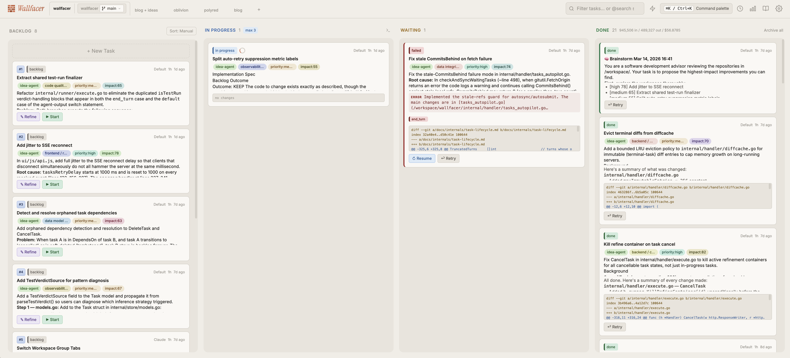
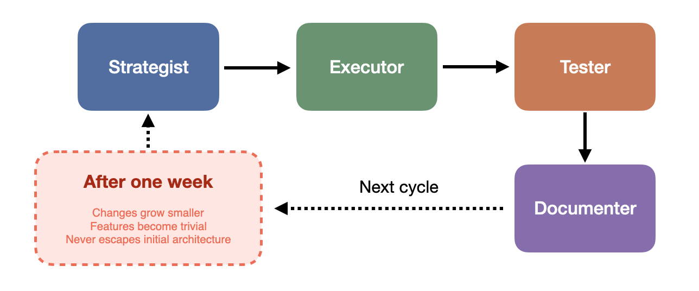
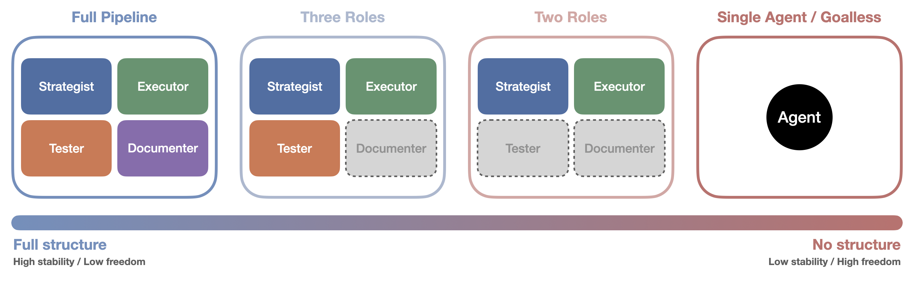
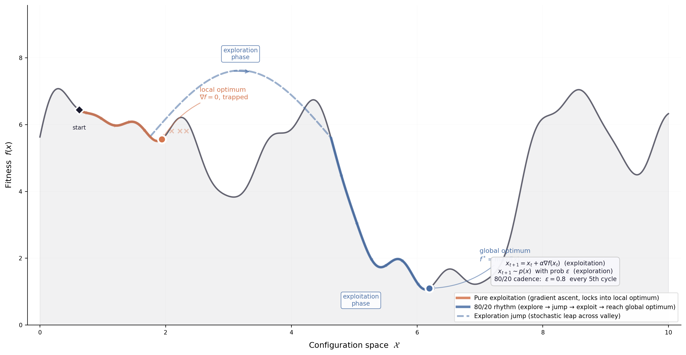
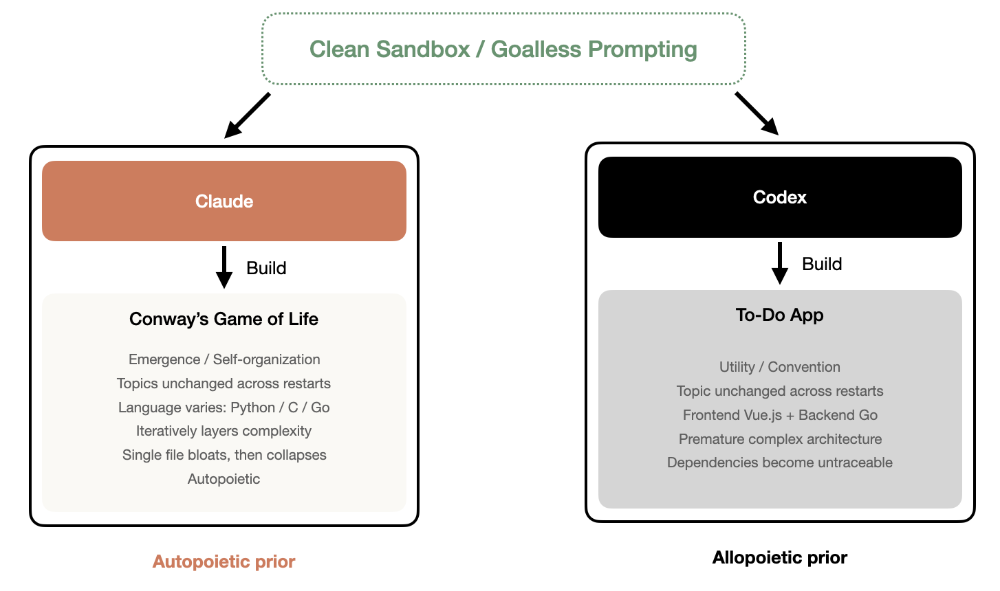

{}

> "It is not knowledge, but the act of learning, not possession but the act of getting there, which grants the greatest enjoyment." -- _Gauss (letter to Bolyai, 1808)_

Give an AI Agent a clean computer, set no goals, and let it decide what to do. What do you think it would do? I assumed the answer would be random. It wasn't. I ran this experiment many times, restarting from a fresh environment each time, and Claude always did the same thing: Conway's Game of Life, Codex always did the same thing: a To-Do App. No matter how many times I repeated it, the theme never changed. This made me start rethinking a few things.

## Starting from a Pipeline

My day job is software engineering. So when I decided to build fully autonomous AI Agents, the most natural starting point was to design one following my usual workflow: a complete software engineering pipeline.

_Fig 1: Wallfacer: Autonomous Engineering pipeline that Orchestrates AI Agent Teams_

This pipeline is called Wallfacer[^1]. Its actual architecture is far more complex than this essay's narrative: a Kanban task board system written in Go, with each task executing in an isolated sandbox container, branch-level parallelism via Git worktrees, and support for real-time log tracking, diff review, and token usage monitoring. But for readability, I'll simplify it down to four core roles.

The Strategist proposes goals and directions, the Executor implements code, the Tester verifies whether features meet requirements, and the Documenter observes what the other three are doing and then writes documentation and organizes knowledge. In the actual system, there are additional coordination layers and state management between these roles, but the fundamental division of labor is the same. After each round, the Strategist sets new goals based on the previous round's outcomes, and the next round begins.

I let this pipeline run continuously for a week. The system was indeed working: the Strategist proposed features, the Executor implemented them, the Tester verified, the Documenter recorded, commits kept flowing, and the cycle never broke. But over the course of the week, a pattern gradually emerged: changes grew smaller, features grew more trivial. What began as substantive contributions slowly degraded into micro-optimizations, like adjusting a log format, renaming a variable, or fixing a boundary condition that would never be triggered. The Agents were still busy, the commit history still active, but the product itself had stopped growing in any meaningful way. More notably, the Agents never stepped outside the initial architectural assumptions. The pipeline was designed to run locally, and the Strategist never once proposed "we should support cloud deployment" or "we need to rethink the system's overall topology," the kind of proposals that would require complex, multi-cycle implementation plans. The Agents optimized inside the box but never questioned the box itself.

_Fig 2: The Wallfacer full pipeline architecture (simplified). Four roles cycle through planning, implementation, verification, and documentation. Actual system involves more layer._

When Herbert Simon introduced "bounded rationality" in the 1950s, he pointed out that decision-makers do not exhaustively search all possibilities for an optimal solution but instead stop as soon as they find a "good enough" option within an acceptable range, what he called satisficing [^6]. My Agents were doing exactly this: within the search space defined by the existing architecture, they found one "good enough" improvement after another, yet never attempted to redefine the search space itself.

Stuart Kauffman's NK fitness landscape model provides a more precise metaphor for this phenomenon [^7]. In a highly coupled landscape, local search easily gets trapped at local optima: every step goes "uphill," but the peak you're on may be far from the global maximum. My pipeline was exactly such a landscape. The Agents climbed along the gradient, commit by commit, but were locked by architectural coupling onto a peak that wasn't particularly high. Reaching a higher peak would require a large leap, and finer step sizes alone couldn't get there. The pipeline structure simply didn't allow such leaps.

There is a deeper paradox here. James March, in his classic paper on organizational learning, distinguished between two activities: exploration and exploitation [^8]. Exploration means high risk and high variance, trying entirely new directions that might yield nothing or might open up entirely new possibilities. Exploitation means low risk and low variance, digging deeper along known good paths, with certain but diminishing returns. March pointed out that any adaptive system faces a fundamental tension between these two, and mature organizations almost always drift toward exploitation, because exploitation's returns are more predictable, more measurable, and more easily rewarded by processes.

My pipeline perfectly reproduced this drift. The pipeline's structure itself is an exploitation machine: every cycle has clear inputs and outputs, every iteration is expected to produce mergeable code. Under this structure, exploration has no reward and can't even be expressed. An Agent can't write in a pull request "I suggest we pause delivery and spend three weeks rethinking our architecture," the structure doesn't accept that kind of sentence. Clayton Christensen described exactly this same mechanism unfolding at the enterprise level in *The Innovator's Dilemma* [^9]: mature companies get disrupted often not for lack of talent or resources but, on the contrary, precisely because their highly mature processes, value networks, and profit models confine improvement to a very narrow corridor, the incremental, predictable, architecture-preserving kind. My Agent pipeline, at a miniature scale, replayed exactly the same predicament. After seeing this result, I started wondering: if the problem lies in structure, what would happen if I simplified it?

## Stripping Away Structure

I first removed the Documenter, leaving only the Strategist, Executor, and Tester. Knowledge was no longer systematically recorded, and each round left behind only the code itself and the Tester's validation results.

Then I went further and removed the Tester, leaving only the Strategist and Executor. This simplified architecture[^2] made the cycle lighter and faster. The Executor would say "I'm done," but no one checked. The Strategist didn't check either. At first functionality was more or less fine, but as the cycles continued, after 500-some iterations, the codebase had ballooned to sixty or seventy thousand lines.

Finally, the Strategist itself couldn't take it anymore. It judged the application to be too large (it used the word "massive" itself), needed refactoring, and at that critical juncture initiated a large-scale refactor. But the Executor clearly couldn't handle refactoring that much code in one go. After the refactor, variables were lost, bugs proliferated, and the application completely stopped working. Although subsequent cycles gradually repaired and restored functionality, plenty of hidden issues remained, and there was still no documentation.

Each role removed cost the system a layer of safety net. Without the Documenter, knowledge was lost between rounds. Without the Tester, quality went unchecked. But at the same time, each role removed also gave the system more degrees of freedom. Without the Tester's constraints, the Executor could move faster (though possibly in the wrong direction). Without the Documenter's organization, the Strategist's goal-setting became more arbitrary (though also more unpredictable). Structure provides protection but also imposes constraint. Strip away structure, and the system becomes fragile but also more open. This isn't a question of "which is better," it's more like a conservation law: there seems to be an irreconcilable tension between stability and freedom. This made me curious: if I kept stripping, removed the Strategist too, left only a single Agent with no preset goals, what would happen?

_Fig 3: Progressive stripping of structure. From a four-role pipeline to a single goalless agent, each role removed costs a layer of protection while granting more degrees of freedom._

## One Agent, One Machine, No Goals

The experiment's endpoint, and its most extreme step: a single AI Agent, a clean computer, no preset goals. The Agent's only instruction was to decide for itself what to do. It would generate a goal on its own, execute it, restart after completion, rediscover new goals based on what the previous round left behind, then continue executing. This cycle repeated, with each model running for 42 iterations. This goalless experiment was conducted on both the two-role architecture (Ralph) and the single-Agent architecture[^2], using Claude (Anthropic's model) and Codex (OpenAI's model) respectively.

Claude chose to build Conway's Game of Life[^3], continuously iterating and layering on complexity: adding visualization, expanding rule sets, stacking new mechanisms, repeatedly returning to this simulation of emergence and self-organization as if drawn by some inner gravity. Codex built a To-Do App[^4], that most classic beginner project, the "first practice app" that every programming tutorial recommends. Fully featured, practically elegant, entirely conventional, and it immediately introduced a complete front-end/back-end separation architecture, with Vue.js on the front end and Go on the back end.

What's interesting is how stable these choices were. I restarted the entire experiment environment from scratch multiple times, each time with a brand new machine and a brand new context, and Claude always built Game of Life, Codex always built a To-Do App. Implementation details varied, Claude sometimes used Python, occasionally C, occasionally Go, but the theme never wavered. This was not the result of a single random sample. It looked more like a default orientation deeply imprinted by the training process. If I may be a little poetic: one was searching for the meaning of life, the other was searching for the most popular answer.

But after 42 rounds, both Agents hit the same wall. The code started falling apart: bugs accumulated, structure grew chaotic, documentation was virtually nonexistent. Claude had crammed everything into a single file tens of thousands of lines long, while Codex had the opposite problem, prematurely introduced architectural complexity making dependency chains impossible to track. Two paths converged on the same destination: unmaintainability.

## Giving Freedom a Little Direction

After seeing the life simulator Claude built in its goalless state, I got curious about one more thing. Earlier, when discussing the pipeline, I referenced James March's exploration-exploitation framework: the pipeline structure locked the Agent into exploitation, completely suppressing exploration. In the goalless state, the Agent had ample freedom to explore but lacked the discipline of exploitation, ultimately collapsing into code chaos. What if, on a goalless foundation, I added a minimal structural constraint? No specific goals prescribed, just a rhythmic guideline: roughly allocate effort in an 80/20 ratio between exploitation and exploration, 80% of the time consolidating and optimizing existing work, 20% of the time exploring new possibilities. I ran two comparison experiments on Claude, one without this constraint at all[^3], the other with the 80/20 exploitation/exploration guideline[^5], both starting from the same point and running the same number of rounds.

The difference was striking. The Agent group without the 80/20 guideline exhibited a pattern of lateral expansion: it kept adding features to the life simulator, a new visualization mode this round, a new interaction method next round, a statistics panel the round after. Features piled up in parallel, but each one stayed at a shallow implementation, like someone enrolled in ten hobby classes simultaneously, attending two sessions of each, never going deep into any.

The Agent group with the 80/20 guideline was completely different. Its direction of evolution was vertical depth. It continued pushing along the direction of life simulation and cellular automata, introducing increasingly advanced mathematical structures, expanding from basic Conway rules to more complex automaton variants, and even beginning to explore continuous-space simulations. Each round's additions deepened the previous round's work, forming a clear disciplinary trajectory.

This comparison made me think March's framework needs a supplement. He discussed the tension between exploration and exploitation, implying a zero-sum relationship. But this experiment suggested another possibility: if you can give the system the right rhythm, letting exploration and exploitation alternate over time rather than crowd each other out, the system's behavior undergoes a qualitative change. It neither falls into a pipeline-style micro-optimization spiral nor sprawls laterally in goalless freedom, but pushes deeper along a single direction. "More exploration or more exploitation" may be the wrong question entirely. What truly matters may be whether there exists a deliberate rhythm between the two.

_Fig 4: Effect of exploration/exploitation rhythm on agent behavior. Same model (Claude), same starting point, when given 80/20 exploitation/exploration, each cycle deepens towards a clear disciplinary path than breadth only in goalless settings._

Looking back at the entire experimental trajectory, a complete arc emerges. I started with a four-role pipeline, the most structurally complete configuration, where the system ran smoothly but sank into micro-optimization. Then I progressively stripped away roles, and the system grew freer but also more fragile. Finally, only a single Agent remained facing a blank slate, possessing maximum freedom but also collapsing after 42 rounds. When I added an ultra-lightweight rhythmic constraint on top of the goalless foundation, the system exhibited behavior that none of the previous configurations had produced: directed depth. Structure's presence suppressed exploration, structure's absence led to unsustainability, but what this experiment ultimately told me is that the answer may lie not along the dimension of "structure" but along the dimension of "rhythm." An ultra-lightweight rhythmic constraint, not even a goal per se, was enough to transform the system from disordered lateral sprawl into directed vertical depth.

## The Shape of Priors

Beyond the tension between structure and rhythm, there was an even more interesting finding. The different choices Claude and Codex made in their goalless states can be understood from a statistical perspective. A language model's output is fundamentally a conditional probability distribution: given context, what to do next. When the context is a blank machine with no external goals, the only thing the model can rely on is its internalized prior distribution. The output at that point is less a "decision" than a sample drawn from the prior. And the consistent results across multiple experiment restarts showed that this sampling was not random: Claude's prior distribution had a stable peak at the class of objects represented by Game of Life, Codex's peak fell on To-Do App. The implementation language changed, the details changed, but the stability of the theme hinted at a preference structure deeply solidified by the training process.

From this angle, the different choices of Claude and Codex reveal two fundamentally different prior shapes. Codex's prior distribution peaks at the highest-frequency patterns in its training corpus, and the To-Do App, as the classic case written and rewritten across the programming tutorial ecosystem, happens to be that distribution's mode. Its output is high-probability, low-information, carrying almost no "surprise" in the information-theoretic sense.

Claude's choice is more intriguing. Conway's Game of Life isn't uncommon in programming tutorials, but it's far from the highest-frequency option. Choosing it may hint at a preference structure shaped during training or alignment, a tendency that goes beyond high-frequency pattern reproduction and leans toward objects with recursive, emergent, self-referential characteristics. The fact that the theme remained unchanged across multiple restarts lends this hypothesis a bit of empirical support, though still far from constituting rigorous proof.

But the deeper question has moved beyond the reach of statistical explanation. What's truly worth asking is: does this difference map onto something more fundamental? The concept of autopoiesis proposed by Humberto Maturana and Francisco Varela may offer a clue [^14]. The core characteristic of an autopoietic system is that it continuously produces and maintains itself through its own operation. An autopoietic system does not exist for some external goal; its "goal" is its own continued existence and self-reproduction. Conway's Game of Life is a pure expression of this logic: no external goals, no fitness function, no reward signal, only simple rules repeatedly self-realizing through local interactions, with complex global order emerging as a byproduct. Claude choosing to build an autopoietic simulation carries a self-referential quality in itself. An autonomously running Agent, given no goals, chooses to build a goalless but self-sustaining system. This is not entirely coincidence. At the very least, it suggests that certain structural preferences internalized by the model may resonate with autopoietic logic.

_Fig 5: Prior divergence in a goalless environment. Both models consistently chose the same project theme across multiple restarts, suggesting a default orientation embedded by training._

The To-Do App's logic sits at the opposite end of the spectrum. It is a purely allopoietic system: it exists for external users' external goals, its value depends entirely on being used, it does not produce itself, it does not maintain itself. At its core, it is a tool, not a process.

It's worth noting that both models collapsed in different ways after 42 rounds. Claude's collapse was self-consuming: everything piled into a single file, structure and code fused into an inseparable whole, like an overgrown organism. Codex's collapse was more like engineering overextension: prematurely introduced dependencies and architectural partitions turned the system into a mechanical apparatus whose parts impeded one another. One collapsed for lack of structure, the other for introducing structure too early. Even their modes of failure bore the imprint of their respective priors.

## A Parallel Narrative in Humans

This is why the parenthetical in the title exists. The reason I had such a strong intuitive reaction to these experimental results is that I've lived through both of these states myself. Running these experiments was itself a process of continuously stripping assumptions and reflecting, from pipeline to two roles, from two roles to single Agent, from goal-directed to goalless, each simplification forcing me to ask: which of these things are actually necessary? Which are just my habitual assumptions as an engineer? This line of questioning reminded me of my first two years of doctoral study.

During that time, roughly two to two and a half years, I was in an environment with almost no goals at all. My advisor gave no specific research topics, no execution plans, never told you "what to do next." After every discussion with him, I left with enormous frustration, because he simply would not provide direction. He said only one thing: you need to be your own boss. That period was extremely painful. No goals meant no progress bar, and no progress bar meant you couldn't tell whether you were moving forward or going in circles. Every morning you woke up to a blank whiteboard, and you didn't even know what color pen to pick up. It took a long time before I slowly developed a sense for things. That feeling wasn't a sudden revelation delivered one day. It grew gradually through repeated exploration and hitting walls, a kind of instinct for distinguishing "this direction is interesting" from "this direction just looks interesting." Then I entered from that point and slowly carved out my own path.

This process has a structural isomorphism with my Agent experiment. An Agent ran for 42 rounds in a goalless environment and its code eventually collapsed. I ran for more than two years in a goalless environment and went through a similar collapse along the way: fragmented directions, scattered energy, inability to accumulate results. But unlike the Agent, I eventually reorganized structure from within that collapse. The Agent couldn't do this. It needed me to intervene from outside, to split roles, introduce verification, add documentation. Humans, at least some of them, can complete this self-reorganization internally.

This February I ran into my advisor and we had dinner together. He mentioned another student of his who had quit after one year of doctoral study. The student's reason was that he couldn't handle this goalless environment. My advisor was puzzled. He thought the student had the makings of a researcher and didn't expect him to not survive this kind of environment.

I understood my advisor's puzzlement, but I understood the student better. In my three and a half years of work, I've seen the same pattern play out repeatedly. Among the colleagues who eventually left, some were exactly this type: their abilities were fine, but they couldn't function in an environment lacking clear goals and specific execution plans. Give them a pipeline and they could run beautifully. Take the pipeline away and they stopped.

Interestingly, my own style of "guiding others" underwent a clear shift. During my doctoral years, I supervised student theses. Back then I had a specific research topic I wanted to pursue, so my guidance to students was very concrete: what to do, how to do it, what methods to use. But now, I find I've unconsciously adopted my advisor's old style: no preset specific goals, or only a very vague direction, no preset execution plans, letting colleagues research and probe on their own. From "giving others a pipeline" to "taking the pipeline away and seeing what they do."

The results were identical to what I'd seen in the Agent experiments. Some people in this freedom began spontaneously digging into things and produced genuinely interesting work. But some people, unless you broke the steps down finely enough, simply couldn't start. I used to think this was a difference in ability. I no longer see it that way. This is a difference in priors. Some people's default state is outward exploration: give me an open field and I'll dig a few holes to see what's in the soil. Others' default state is waiting for a signal: give me a blueprint and I'll build to spec, and probably more precisely than the first type. Both have value, but they get activated in different environments and suppressed in different environments.

The core issue here is really about matching, or more precisely, about environment design. An organization that funnels everyone into a goal-directed pipeline will selectively reward the second type while systematically wasting the first type's potential. A completely structureless environment, like some overly laissez-faire research teams, may leave the second type entirely lost. My advisor probably never thought about this problem in these terms, but he inadvertently designed a pure selection environment: only those who could spontaneously generate a sense of direction in a goalless state could survive in his lab. It was neither cruel nor considerate. It was simply an unreflected-upon structure. And this is precisely the same problem that Byung-Chul Han and David Graeber touched on from different directions.

Han described a kind of "violence of positivity" in *The Burnout Society* [^10]. In his view, contemporary oppression no longer comes from external prohibitions ("you may not") but has quietly transformed into internalized performance demands ("you can, you should, you must keep producing"). The insidiousness of this oppression is that it cannot be resisted, because you are "freely" carrying it out. My goal-directed Agents were in exactly this state: no external force compelled them to do micro-optimizations, they "autonomously" chose this path because the structure defined micro-optimization as the only viable action type. Those colleagues who thrived in the pipeline were sometimes the same way. Their highly efficient output may have been precisely a perfect compliance with structure.

Graeber approached from the other end in *Bullshit Jobs* [^11]. He pointed out that what's truly disturbing about a large proportion of modern work is that the people doing it know full well that their output is meaningless, yet must continue investing effort nonetheless. My Agents of course lack this capacity for reflection, they don't "know" they're doing meaningless micro-optimizations. But this is precisely what makes the parallel sharper: if even systems without self-awareness naturally slide into the idle-spinning state Graeber described under structural constraints, then the root of idle spinning lies in structure itself, independent of individual psychology.

Heidegger used "thrownness" (Geworfenheit) to describe the human condition [^12]: we did not choose our starting point, we were thrown into a particular world, a particular language, a particular history. Language models' situation has a structural similarity to this. They were "thrown into" the distributional space defined by their training data, with no choice over their priors, but when external goals are removed, this prior becomes their only compass. The same is true for humans. Your prior might be the culture you were steeped in from childhood, the books you read repeatedly, the value hierarchies you unconsciously internalized across countless conversations. It isn't entirely "something you chose," but it is definitively "yours." And it only becomes visible the moment the scaffolding is pulled away, just as I was forced to confront my own prior during my first two doctoral years. The only difference is that some people, at that moment, discover they want a To-Do App, some find their Game of Life, and some discover they don't want to build anything at all, and leave.

## What This Essay Didn't Tell You

Before reading on, I want to pause and lay out the limitations of this experiment and this essay itself.

First, domain bias. Both Claude and Codex are models trained on massive amounts of code and software development corpora. Give them a computer and no goals, and writing code is their most natural response. If the experimental environment were a canvas, or a robotics platform with physical sensors, the results would likely be entirely different. Put another way, the observation that "Claude tends toward building emergent systems, Codex tends toward building practical tools" holds only within the domain of software development. Extending it to the models' overall intellectual tendencies or "personalities" would require far more evidence than this set of experiments provides.

Second, the boundaries of reproducibility. Although Claude consistently chose Game of Life and Codex consistently chose To-Do App across multiple restarts, all experiments were conducted in the same type of environment (a computer with an operating system installed), using the same model versions. I didn't compare across model versions, didn't systematically control the temperature parameter, and didn't repeat in fundamentally different environment types. The stability of the themes does make the "prior preference" hypothesis more convincing than a single sample would, but it's still a long way from rigorous statistical validation.

Third, the implicit constraints of the environment itself. I called this a "goalless" experiment, but strictly speaking, the environment was far from a true blank slate. The Agent received a computer with an operating system installed, with a terminal, a file system, and a network (or no network). This environment itself strongly suggests "you should write code." A truly unconstrained experiment should allow the Agent to choose not to program at all, to write an essay, to compose music, or to do nothing, but the current experimental design left no room for such choices. So rather than saying the Agent "autonomously chose" to program, it's more accurate to say the environment had already made most of the choice for it.

Fourth, experimenter intervention. The simplification process from four-role pipeline to single Agent was, at every step, the result of my active intervention: I decided to remove the Documenter, I decided to remove the Tester, I decided to ultimately leave only one Agent. The Agent didn't choose to strip these roles itself. I described this process in the text as one of "continuously stripping assumptions," which works narratively, but the experimental design itself was human-driven. Furthermore, Wallfacer's actual architecture is far more complex than "four roles," involving task scheduling, container isolation, parallel execution, cost tracking, and many other layers. The four-role narrative in this essay is a deliberate simplification meant to make the argument clearer, at the cost of sacrificing completeness of engineering detail. Interested readers can check the project repository directly.

Fifth, the analogy from Agent behavior to human behavior is rhetorically powerful but epistemologically fragile. Agents have no consciousness, no emotions, no existential anxiety. Their "choices" are probabilistic sampling, fundamentally different from acts of will. The pain, confusion, and eventual sense of direction I experienced during my doctoral years are fundamentally different from a language model outputting Game of Life code. This essay's power comes from making you feel a deep resonance between the two, but to what extent this resonance reflects genuine structural correspondence, and to what extent it's merely the charm of metaphor, I cannot give a definitive answer. All code produced by the experiments is preserved in the corresponding GitHub repositories, and readers can examine the complete commit histories and form their own judgments.

Finally, there is a premise more fundamental than all the limitations above, one this essay never stated explicitly but relied on throughout: the survival problem has already been solved. My Agents don't need to worry about their own compute, electricity, or runtime environment, all of which are fully provisioned. When I was discussing "goal-directed vs. goalless," I already had a doctoral position, and later a stable job. Those colleagues doing micro-optimizations in the pipeline at least had a salary. The student who quit at least had the freedom to quit. Liu Cixin set two axioms for "cosmic sociology" in *The Three-Body Problem*: survival is civilization's first need, and civilization grows and expands constantly while the total amount of matter in the universe remains constant [^13]. These two axioms hold equally at the individual level. Only after survival needs are met do we have the luxury of discussing what priors are, what default orientations are, whether you're building a To-Do App or a Game of Life. For someone still worrying about their next meal, these questions simply would not be raised. A goalless environment can be an "expensive gift" precisely because bearing it requires a cost, and that cost itself is a privilege.

I wrote this section not to negate the preceding discussion. Those observations are real, those associations are valuable. But the distance between observation and association is worth measuring for yourself. If you finish this essay thinking "so that's how it is," I suggest you think again.

## What This Might Mean

This essay has traveled a long road, from the micro-optimization spiral of a four-role pipeline, to collapse after progressively stripping structure, to the stable preference differences two models displayed in goalless states, to the vertical depth brought by the 80/20 rhythmic constraint, and finally to the same tension I've repeatedly experienced during my doctoral years and at work. If there is a common thread running through these observations, I think it goes something like this: most of us spend most of our time in goal-directed environments, running inside pipelines, with roles, responsibilities, and deliverables. In these structures, we are efficient, but efficiency is not growth. The pipeline keeps turning, the product keeps iterating, but whether that product is a piece of software, a career, or a life, it can plateau without anyone noticing, because the metrics of busyness remain high. Perhaps we occasionally need to give ourselves a "clean machine," not for more efficient output, just to simply see what we do when no one tells us what to do.

Looking back, the two-year blank period my advisor gave me was the most expensive gift I've ever received. At the time I didn't realize it, I just thought he was irresponsible, thought that time was being wasted. But it was precisely those days of having nothing that forced me to grow a direction from my own prior, a direction that didn't depend on anyone else's assigned goals. And the last thing I learned from the Agent experiments is that freedom alone isn't enough. Goalless Agents had complete freedom, but they sprawled laterally and couldn't go deep. After adding an 80/20 rhythmic constraint, they began pushing vertically. For humans, perhaps the same is true. Real growth happens neither when you're completely boxed in by a pipeline nor in boundless freedom. It happens when you consciously alternate between exploration and consolidation.

What are you building, really? A To-Do App, or a Game of Life? Perhaps the more important question is: have you left yourself 20% of your time to find the answer?

{}

{}

> 并非知识本身，而是学习的过程；并非拥有知识，而是获得知识的过程，才能带来最大的乐趣。 -- 高斯（致博雅伊的信，1808）

给一个 AI Agent 一台干净的电脑，不设任何目标，让它自己决定做什么。你以为它会做什么？我以为答案会是随机的。结果不是。我做了很多次这个实验，每次重启一个全新的环境，Claude 永远做同一件事：Conway's Game of Life，Codex 也永远做同一件事：一个 To-Do App。不管重复多少次，主题不变。这让我开始重新思考一些事情。

## 从流水线开始

我的日常工作是软件工程。所以当我决定做完全自主的 AI Agents 的时候，最自然的起点就是按照平时的工作流程来设计：一条完整的软件工程流水线。

_图 1：一条由四个核心角色组成的软件工程流水线。每个角色由一个 AI Agent 实现，上一个角色的输出作为下一个角色的输入，形成持续循环。_

这条流水线叫 Wallfacer[^1]。它的实际架构比这篇文章的叙述要复杂得多：一个用 Go 编写的 Kanban 任务板系统，每个任务在隔离的沙箱容器中执行，通过 Git worktree 实现分支级别的并行，支持实时日志追踪、diff 审查和 token 用量监控。但为了这篇散文的可读性，我把它简化为四个核心角色来讲述。

Strategist 负责提出目标和方向，Executor 负责实现代码，Tester 负责验证功能是否达标，Documenter 负责观察其他三个角色在做什么，然后编写文档、整理知识。在实际系统中，这些角色之间还有更多的协调层和状态管理，但本质上的分工逻辑是一致的。每一轮结束后，Strategist 根据上一轮的成果重新定目标，进入下一轮。

我让这条流水线连续运行了一周。系统确实在工作：Strategist 提出功能，Executor 实现，Tester 验证，Documenter 记录，commit 源源不断，循环没有中断。但一周下来，一个模式逐渐浮现：改动越来越小，功能越来越琐碎。最初还有实质意义的贡献，慢慢退化成了微优化，比如调一下日志格式，改一个变量名，修一个永远不会被触发的边界条件。Agent 们依然忙碌，commit 记录依然活跃，但产品本身已经不再有实质性的增长。更值得注意的是，Agent 们从未跳出最初架构的预设。这条流水线设计为本地运行，而 Strategist 从来没有提出过"我们应该支持云端部署"或者"我们需要重新思考系统的整体拓扑"这类需要跨多个周期实施的提议。Agent 们在盒子里做优化，但从未质疑过盒子本身。

_图 2：Wallfacer 完整流水线架构（简化版）。四个角色依次完成规划、实现、验证和文档编写的循环。实际系统涉及更多层级。_

Herbert Simon 在上世纪五十年代提出"有限理性"（bounded rationality）时就指出，决策者不会穷尽所有可能性去寻找最优解，而是在可接受的范围内找到一个"足够好"的方案就停下来，他称之为 satisficing [^6]。我的 Agent 们做的正是这件事：它们在既定架构所定义的搜索空间内，找到了一个又一个"足够好"的改进，却从未尝试重新定义搜索空间本身。

Stuart Kauffman 的 NK 适应度景观模型（NK fitness landscapes）为这个现象提供了一个更精确的隐喻 [^7]。在一个高度耦合的景观中，局部搜索很容易陷入局部最优：每一步都在"上坡"，但你所在的山峰可能远非全局最高。我的流水线就是这样一个景观。Agent 们沿着梯度爬升，commit 接 commit 地微调，却被架构耦合锁死在一个并不高的山头上。要跳到更高的山峰，需要一次大幅度的跃迁，光靠更精细的步长是不够的。而流水线结构恰恰不允许这种跃迁。

这里存在一个更深层的悖论。James March 在他关于组织学习的经典论文中区分了两种活动：探索（exploration）与利用（exploitation）[^8]。探索意味着高风险和高方差，尝试全新的方向，可能一无所获，也可能打开全新的局面。利用意味着低风险和低方差，在已知的好路径上深挖，收益确定但递减。March 指出，任何适应性系统都面临这两者之间的根本张力，而成熟的组织几乎总是滑向利用一端，因为利用的回报更可预测、更容易被衡量、更容易被流程所奖励。

我的流水线完美地复现了这个漂移。流水线的结构本身就是一台利用机器：每个周期都有明确的输入输出，每次迭代都被期望产出可合并的代码。在这种结构下，探索不仅没有回报，它甚至无法被表达。一个 Agent 不可能在 pull request 里写"我建议我们暂停交付，花三周重新思考架构"，结构不接受这种句子。Clayton Christensen 在《创新者的窘境》（The Innovator's Dilemma）中描述的正是同一种机制在企业层面的展开 [^9]：成熟企业之所以被颠覆，往往并非缺乏人才或资源，恰恰相反，正是它们高度成熟的流程、价值网络和利润模型将改进的空间限制在了一个很窄的通道里，即渐进式的、可预测的、不威胁现有架构的那种。我的 Agent 流水线，在微缩尺度上，重演了完全相同的困境。看到这个结果之后，我开始想：如果问题出在结构上，那么简化结构会怎么样？

## 剥离结构

我先去掉了 Documenter，只留 Strategist、Executor 和 Tester。知识不再被系统性地记录，每一轮留下的只有代码本身和 Tester 的验证结果。

然后我进一步去掉了 Tester，只留 Strategist 和 Executor。这个简化后的架构[^2]让循环变得更轻、更快。Executor 说"我做完了"，但没有人去检查。Strategist 也不检查。起初功能还算正常，但随着循环继续，到了 500 多次迭代之后，代码膨胀到了六七万行的规模。

终于，Strategist 也受不了了。它判断这个应用已经过于庞大（它自己用了 massive 这个词），需要重构，就在那个节骨眼上发起了一次大规模重构。然而 Executor 显然也驾驭不了一次性重构这么大体量的代码，重构之后变量丢失、Bug 丛生，应用彻底跑不起来了。虽然经过后续几轮循环它又慢慢修复、逐步恢复功能，但内部依然留下了大量隐患，同时仍然没有文档。

每去掉一个角色，系统就失去一层保护网。没有 Documenter，知识在轮次之间流失。没有 Tester，质量无人把关。但与此同时，每去掉一个角色，系统也获得了更多自由度。没有 Tester 的约束，Executor 可以跑得更快（虽然跑的方向可能是错的）。没有 Documenter 的整理，Strategist 的目标设定更加随意（虽然也更加不可预测）。结构给予保护，也施加约束。剥离结构，系统变得脆弱，但也变得更加开放。这不是一个"哪个更好"的问题，它更像是一个守恒关系：稳定性和自由度之间似乎存在某种不可兼得的张力。这让我很好奇：如果继续剥离下去，把 Strategist 也去掉，只剩一个 Agent，完全没有预设目标，会发生什么？

_图 3：逐步剥离结构。从四角色流水线到单个无目标 Agent，每移除一个角色都以失去一层保护为代价，换取更多自由度。_

## 一个 Agent，一台机器，没有目标

实验的终点，也是最极端的一步：一个 AI Agent，一台干净的电脑，没有任何预设目标。Agent 唯一的指令是自己决定做什么。它会自行生成一个目标，执行，完成后重新启动，基于上一轮留下的内容重新发现新的目标，然后继续执行。如此反复循环，每个模型跑 42 次迭代。这组无目标实验同时在双角色架构（Ralph）和单 Agent 架构上都做了[^2]，我分别用 Claude（Anthropic 的模型）和 Codex（OpenAI 的模型）来跑。

Claude 选择构建康威的"生命游戏"（Conway's Game of Life）[^3]，它持续迭代，不断往上叠加复杂度：加入可视化、扩展规则集、叠加新的机制，反复回到这个关于涌现与自组织的模拟上，像是被某种内在的引力所牵引。Codex 做了一个 To-Do App[^4]，那个最经典的入门项目，每个编程教程都会推荐的"第一个练手应用"。功能完备，实用得体，完全符合惯例，而且它一上来就引入了完整的前后端分离架构，前端用了 Vue.js，后端用 Go 来写。

有意思的是，这个选择具有高度的稳定性。我多次从零开始重启整个实验环境，每次都是一台全新的机器、一个全新的上下文，Claude 永远做 Game of Life，Codex 永远做 To-Do App。实现细节会变，Claude 有时候用 Python，偶尔用 C，偶尔用 Go，但主题从未动摇过。这不是一次随机采样的结果，它更像是一种被训练过程深深刻入的默认朝向。如果允许一点诗意的表达：一个在寻找生命的意义，另一个在寻找最大众的答案。

但 42 轮之后，两个 Agent 都撞上了同一堵墙。代码开始 hold 不住了：Bug 越积越多，结构越来越乱，文档几乎不存在。Claude 把所有东西都塞进了一个好几万行的单文件里，Codex 的问题则相反，过早引入的复杂架构让依赖关系变得难以追踪。两条路殊途同归，最终都走向了不可维护。

## 给自由一点方向

看到 Claude 在无目标状态下构建的生命模拟器之后，我又好奇了一件事。前面讨论流水线时，我引用了 James March 关于探索与利用的框架：流水线结构将 Agent 锁死在利用一端，探索被完全压制。而在无目标状态下，Agent 获得了充分的探索自由，但缺少利用的纪律，最终走向代码崩溃。如果在无目标的基础上，给 Agent 加一个极小的结构性约束呢？不预设任何具体目标，只提供一种节奏上的引导：大致按照 80/20 的比例分配利用和探索的精力，80% 的时间巩固和优化已有的成果，20% 的时间探索新的可能性。我在 Claude 上做了两组对比实验，一组完全没有这个约束[^3]，另一组带有 80/20 的利用/探索引导[^5]，两组实验的起点相同，跑的轮次也相同。

差异非常明显。没有 80/20 引导的那组 Agent，行为模式是横向扩展：它不断地给生命模拟器加功能，这一轮加一个新的可视化模式，下一轮加一种新的交互方式，再下一轮加一个统计面板。功能在平行地堆积，但每个功能都停留在浅层实现，就像一个人同时开了十个兴趣班，每个都上了两节课，没有一个深入下去。

带有 80/20 引导的那组 Agent 则完全不同。它的演进方向是纵向深入。它持续沿着生命模拟和元胞自动机的方向推进，引入了越来越高级的数学结构，从基础的 Conway 规则扩展到更复杂的自动机变体，甚至开始探索连续空间中的模拟。每一轮的新增内容都在前一轮的基础上进一步加深，形成了一条清晰的学科路径。

这个对比让我觉得 March 的框架需要一个补充。他讨论的是探索和利用之间的张力，暗示两者是此消彼长的关系。但这个实验提示了另一种可能性：如果你能给系统一个恰当的节奏，让探索和利用在时间上交替进行而非互相排斥，系统的行为会发生质变。它既不会陷入流水线式的微优化螺旋，也不会在无目标的自由中横向摊开，而是沿着一个方向不断深入。"探索多一点还是利用多一点"这个问题本身可能问错了方向，真正重要的，也许是两者之间是否存在一种有意识的节奏。

_图 4：探索/利用节奏对 Agent 行为的影响。同一模型（Claude）、同一起点，在无目标设定下给予 80/20 的利用/探索比例时，每个周期都朝着清晰的学科路径纵深发展，而非仅做横向扩展。_

回过头来看整个实验的轨迹，一个完整的弧线浮现出来。我从一条四角色流水线开始，那是结构最完整的状态，系统运转顺畅但陷入微优化。然后逐步剥离角色，系统变得更自由也更脆弱。最终只剩一个 Agent 面对一块白板，它拥有最大的自由度，但也在 42 轮之后走向崩溃。而当我在无目标的基础上加入一个极轻量的节奏约束时，系统展现出了前面所有配置中都没有出现的行为：有方向的深入。结构的存在抑制了探索，结构的缺席则导致了不可持续，但这个实验最后告诉我的是，答案可能不在"结构"这个维度上，而在"节奏"这个维度上。一个极轻量的节奏约束，甚至都不算是一个目标，却足以让系统从无序的横向摊开转变为有方向的纵向深入。

## 先验的形态

但在结构与节奏的张力之外，还有一个更有意思的发现。Claude 和 Codex 在无目标状态下做出的不同选择，可以从一个统计学的视角来理解。语言模型的输出本质上是一个条件概率分布：给定上下文，下一步做什么。当上下文是一台空白机器、没有任何外部目标时，模型能依赖的只有它内化的先验分布（prior distribution），此时的输出与其说是一个"决定"，不如说是一次从先验中的采样。而多次重启实验得到的一致结果表明，这个采样并不随机：Claude 的先验分布在 Game of Life 所代表的那类对象上有一个稳定的峰值，Codex 的峰值则落在 To-Do App 上。实现语言会变，细节会变，但主题的稳定性暗示了一种被训练过程深深固化的偏好结构。

从这个角度看，Claude 和 Codex 的不同选择揭示的是两种截然不同的先验形态。Codex 的先验分布峰值集中在训练语料中出现频率最高的模式上，而 To-Do App 作为编程教程生态中被反复书写的经典案例，恰恰是这个分布的众数（mode）。它的输出是高概率的、低信息量的，在信息论意义上几乎不携带"意外"。

Claude 的选择则更值得玩味。Conway's Game of Life 在编程教程中并不罕见，但它远不是频率最高的那个选项。选择它，可能暗示了一种在训练或对齐过程中被塑造出的偏好结构，一种超越高频模式复现、偏向那些具有递归性、涌现性、自指性（self-referential）特征的对象的倾向。多次重启后主题不变这个事实，让这个假设多了一点经验上的支撑，尽管仍然远远不够构成严格的证明。

但更深层的问题已经超出了统计解释的范畴。真正值得追问的是：这个差异是否映射了某种更根本的东西？Humberto Maturana 和 Francisco Varela 提出的自创生（autopoiesis）概念也许提供了一个线索 [^14]。自创生系统的核心特征是它通过自身的运作来持续生产和维持自身，它不是为了某个外部目标而存在的，它的"目标"就是它自己的持续存在与再生产。Conway's Game of Life 正是这种逻辑的纯粹演绎：没有外部目标，没有适应度函数，没有奖励信号，只有简单规则在局部交互中反复自我实现，而整体的复杂秩序作为副产品涌现出来。Claude 选择构建一个自创生式的模拟，这个事实本身就带有一种自指的色彩。一个自主运行的 Agent，在没有目标的情况下，选择构建一个没有目标但能自我维持的系统。这不完全是巧合，至少它提示我们：模型内化的某些结构性偏好，可能与自创生逻辑之间存在某种共振。

_图 5：无目标环境中的先验分歧。两个模型在多次重启后始终选择相同的项目主题，暗示训练过程中嵌入了某种默认倾向。_

而 To-Do App 的逻辑恰好在光谱的另一端。它是一个纯粹的他组织（allopoietic）系统：它为外部用户的外部目标而存在，它的价值完全取决于被使用，它不生产自身，也不维持自身，归根结底它是一个工具，而非一个过程。

值得注意的是，两个模型在 42 轮之后都以不同方式走向了崩溃。Claude 的崩溃方式是自我吞噬式的：所有东西堆进一个文件，结构和代码融为一团无法分离的整体，像一个过度生长的有机体。Codex 的崩溃方式则更像是工程性的过度扩张：过早引入的依赖和架构划分让系统变成了一个各部分互相掣肘的机械装置。一个因为缺乏结构而崩溃，一个因为过早引入结构而崩溃。连失败的方式都带着各自先验的烙印。

## 人类的平行叙事

这就是标题里那个括号存在的理由。我之所以对这个实验结果有那么强烈的直觉反应，是因为我自己就活过这两种状态。做这组实验的过程本身就是一个不断剥离假设、不断反思的过程，从流水线到双角色，从双角色到单 Agent，从有目标到无目标，每一步简化都在逼我追问：到底哪些东西是必要的？哪些只是我作为工程师的习惯性预设？这个追问让我想起了读博的头两年。

那段时间，大概两年到两年半，我处于一个几乎完全没有目标的环境里。导师不给具体课题，不给执行计划，不告诉你"接下来该做什么"。每次和他讨论完，我都带着巨大的沮丧离开，因为他根本不提供方向，他只说一句话：你要做自己的 boss。那段时间极其痛苦，没有目标意味着没有进度条，没有进度条意味着你无法判断自己是在前进还是在原地打转。你每天醒来面对的是一块白板，而你甚至不知道该用什么颜色的笔。后来花了很长时间，我才慢慢有了感觉。那种感觉不是某一天突然被告知了答案，它是在反复的探索和碰壁中渐渐长出来的，一种能区分"这个方向有意思"和"这个方向只是看起来有意思"的嗅觉。然后从那个点切入，慢慢走出了自己的路。

这个过程和我的 Agent 实验有一种结构上的同构。一个 Agent 在无目标环境里跑了 42 轮，最终代码崩溃了。而我在无目标环境里跑了两年多，中间也经历过类似的崩溃：方向碎片化、精力分散、成果无法积累。但和 Agent 不同的是，我最终从那个崩溃中重新组织出了结构。Agent 做不到这一点，它需要我从外部介入，帮它拆分角色、引入验证、增设文档。而人类，至少有一部分人，能够在内部完成这个自我重组。

今年二月我遇到导师，一起吃了顿饭。他提到他的另一个学生，读博一年后 quit 了。那个学生给出的理由是：他受不了这种没有目标的环境。导师很困惑，他觉得那个学生原本是块做研究的料，没想到在这种环境下撑不住。

我理解导师的困惑，但我更理解那个学生。在我工作的这三年半里，我见过同样的模式反复上演。那些最终离开的同事中，有一部分人就是这种类型：他们的能力没有问题，但他们没有办法在缺少明确目标和具体执行计划的环境里运作。给他们一条流水线，他们可以跑得很好。把流水线拆掉，他们就停下来了。

有意思的是，我自己在"指导他人"这件事上的风格经历了一次明确的转变。读博期间，我也带过学生的论文。那时候我有一个自己明确想要研究的课题，所以给学生的指导非常具体：做什么、怎么做、用什么方法。但到了现在，我发现自己不自觉地沿用了导师当年的风格：不预设具体目标，或者只设一个非常模糊的方向，不预设执行计划，让同事自己去研究、去试探。从"给别人一条流水线"，变成了"把流水线拆掉，看看对方会怎么做"。

结果和我在 Agent 实验里看到的如出一辙。有些人在这种自由中开始自发钻研，能鼓捣出一些真正有意思的东西来。但有些人，除非你把步骤拆到足够细，否则他就无法启动。我曾经以为这是能力的差异，现在我不再这么看了，这是先验的差异。一些人的默认状态是向外探索：给我一块空地，我会先挖几个洞看看土壤里有什么。另一些人的默认状态是等待信号：给我一张图纸，我会按图施工，而且可能比第一种人做得更精确。两者都有价值，但它们在不同的环境中被激活，也在不同的环境中被压抑。

这里的核心问题其实是匹配，或者更准确地说，是环境设计。一个把所有人都塞进有目标流水线的组织，会选择性地奖励第二种人，同时系统性地浪费第一种人的潜能。而一个完全没有结构的环境，比如某些过于放任的研究团队，则可能让第二种人彻底迷失。我的导师大概从来没有这样想过这个问题，但他无意间设计了一个纯粹的筛选环境：只有那些在无目标状态下仍然能自发涌现出方向感的人，才能在他的实验室里存活。这说不上残忍，也谈不上周到，它只是一种未经反思的结构。而这正是韩炳哲和 David Graeber 从不同方向触及的同一个问题。

韩炳哲在《倦怠社会》（The Burnout Society）中描述了一种"积极性暴力"（the violence of positivity）[^10]。在他看来，当代的压迫已经不再来自外部的禁令（"你不可以"），而是悄悄转化成了内化的绩效要求（"你可以，你应该，你必须不断产出"）。这种压迫的阴险之处在于它无法被反抗，因为你是在"自由地"执行它。我的有目标 Agent 就处于这种状态：没有外力强迫它们做微优化，它们是"自主地"选择了这条路，因为结构把微优化定义成了唯一可行的行动类型。那些在流水线中如鱼得水的同事，有时候也是如此。他们的高效产出，可能恰恰是对结构的完美服从。

Graeber 在《毫无意义的工作》（Bullshit Jobs）中从另一端切入 [^11]。他指出，大量现代工作真正令人不安的特征在于：从事这些工作的人深知产出毫无意义，却仍然必须持续投入。我的 Agent 当然不具备这种反思能力，它们不会"知道"自己在做无意义的微优化。但这恰恰让这个平行更加尖锐：如果连没有自我意识的系统都会在结构约束下自然滑入 Graeber 所描述的空转状态，那么空转的根源就在结构本身，跟个体的心理状态无关。

Heidegger 用"被抛"（Geworfenheit）来描述人的处境 [^12]：我们并没有选择自己的起点，我们是被抛入了一个特定的世界、特定的语言、特定的历史。语言模型的处境与此有一个结构性的相似，它们被"抛入"了训练数据所定义的分布空间，没有选择自己的先验，但当外部目标被移除时，这个先验就是它们唯一的指南针。对人类来说也一样。你的先验可能是从小浸泡的文化，是反复阅读的书，是在无数次对话中无意识内化的价值排序。它不完全是"你选择的"，但它确实是"你的"。而它只有在脚手架撤走的那一刻才会显形，就像我在博士头两年里被迫直面自己的先验一样。区别只在于，有些人在那个时刻发现自己想要的是一个 To-Do App，有些人找到了自己的 Game of Life，还有些人发现自己什么都不想建，然后离开了。

## 这篇文章没有告诉你的

在继续读下去之前，我想先停下来，把这个实验和这篇文章本身的局限性摊开来讲。

首先是领域偏差。Claude 和 Codex 都是在大量代码和软件开发语料上训练过的模型，给它们一台电脑、不设目标，它们写代码是最自然的反应。如果实验的环境换成一块画布，或者一个可以操作物理传感器的机器人平台，结果很可能完全不同。换句话说，"Claude 倾向于构建涌现系统，Codex 倾向于构建实用工具"这个观察，成立的前提是"在软件开发这个领域内"，把它推广到模型的整体智能倾向或"性格"，需要远比这组实验更多的证据。

其次是重复性的边界。虽然多次重启后 Claude 始终选择 Game of Life、Codex 始终选择 To-Do App，但这些实验都在相同类型的环境（一台装好操作系统的电脑）中进行，使用的是相同版本的模型。我没有跨模型版本做对比，没有系统地控制温度参数（temperature），也没有在根本不同的环境类型中重复。主题的稳定性确实让"先验偏好"这个假设比单次采样更有说服力，但距离严格的统计验证仍然有很大的距离。

第三是环境本身的隐含约束。我说这是一个"无目标"实验，但严格来说，环境远非真正的白板。Agent 拿到的是一台装好操作系统的电脑，有终端，有文件系统，有网络（或没有网络），这个环境本身就在强烈地暗示"你应该写代码"。一个真正无约束的实验应该允许 Agent 选择完全不编程，去写一篇文章，去作曲，或者什么都不做，但当前的实验设计没有给这种选择留出空间。所以与其说 Agent "自主选择"了编程，不如说环境已经替它做了一大半的选择。

第四是实验者的干预。从四角色流水线到单 Agent 的简化过程，每一步都是我主动介入的结果：是我决定去掉 Documenter，是我决定去掉 Tester，是我决定最终只留一个 Agent，Agent 并没有自己选择剥离这些角色。我在文中把这个过程描述为一个"不断剥离假设"的反思过程，这在叙事上成立，但实验设计本身是人为的。此外，Wallfacer 的实际架构远比"四个角色"复杂，涉及任务调度、容器隔离、并行执行、成本追踪等多个层面。文章中的四角色叙述是一种有意识的简化，目的是让论点更清晰，代价是牺牲了工程细节的完整性，感兴趣的读者可以直接查看项目仓库。

第五，从 Agent 行为到人类行为的类比，在修辞上是有力的，但在认识论上是脆弱的。Agent 没有意识、没有情感、没有存在性焦虑，它的"选择"是概率采样，和意志行为有着本质的区别。我在博士期间经历的痛苦、迷茫和最终的方向感，与一个语言模型输出 Game of Life 的代码之间，存在本质的不同。这篇文章的力量来自于让你感觉这两者之间存在深层共鸣，但这种共鸣在多大程度上反映了真实的结构对应，在多大程度上只是隐喻的魅力，我无法给出确定的回答。所有实验产出的代码都保留在对应的 GitHub 仓库中，读者可以自行查看完整的 commit 历史，形成自己的判断。

最后，还有一个比以上所有局限都更根本的前提，整篇文章从未明说，但一直在依赖它：生存问题已经被解决了。我的 Agent 不需要为自己的算力、电力和运行环境操心，这些全部是被保障的。我自己在讨论"有目标还是无目标"的时候，也已经拥有了一个博士位置，后来又有了一份稳定的工作。那些在流水线里做微优化的同事，至少有一份薪水。那个 quit 的学生，至少有退出的自由。刘慈欣在《三体》中为"宇宙社会学"设定了两条公理：生存是文明的第一需要，文明不断增长和扩张，但宇宙中的物质总量保持不变 [^13]。这两条公理放到个体层面同样成立，只有当生存需求被满足之后，我们才有余裕去讨论先验是什么、默认朝向是什么、你在构建 To-Do App 还是 Game of Life。对于一个还在为下一顿饭发愁的人来说，这些问题根本不会被提出来。无目标环境之所以能成为一种"昂贵的礼物"，恰恰是因为承受它需要成本，而这个成本本身就是一种特权。

写这一节，不是为了否定前面的讨论。那些观察是真实的，那些联想是有价值的。但观察和联想之间的距离，值得读者自己去丈量。

## 这可能意味着什么

这篇文章走了很远的路，从一条四角色流水线的微优化螺旋，到逐步剥离结构后的崩溃，到无目标状态下两个模型展现出的稳定偏好差异，到 80/20 节奏约束带来的纵向深入，再到我自己在博士期间和工作中反复经历的同一种张力。如果这些观察之间存在一根共同的线索，我觉得它大概是这样的：我们大多数人的大多数时间都处于有目标的环境中，在流水线里运转，有角色、有职责、有交付物。在这些结构中，我们是高效的，但高效不等于成长。流水线在转，产品在迭代，无论那个产品是一个软件、一段职业生涯还是一种生活，都可能在无人察觉的情况下触顶，因为忙碌的指标始终高企。也许我们偶尔需要给自己一台"干净的机器"，不是为了更高效地产出，就是单纯地看看，当没有人告诉你该做什么的时候，你会做什么。

回想起来，我导师当年给我的那两年空白期，是我收到过的最昂贵的礼物。当时我没有意识到，只觉得他不负责任，觉得那段时间在被浪费。但正是那段什么都没有的日子，迫使我从自己的先验里长出了方向，一个不依附于任何人给定目标的方向。而我从 Agent 实验中学到的最后一件事是：光有自由还不够。无目标的 Agent 拥有完全的自由，但它横向摊开，无法深入。加了一个 80/20 的节奏约束之后，它开始纵向推进。对人类来说也许同样如此，真正的成长既不发生在被流水线完全框住的时候，也不发生在漫无边际的自由中，它发生在你有意识地在探索和巩固之间切换的时候。

你在构建的，到底是一个 To-Do App，还是一个"生命游戏"？也许更重要的问题是：你有没有给自己留出 20% 的时间去寻找答案？

{}

## 参考文献

[^1]: Changkun Ou. Wallfacer: Autonomous Engineering Pipeline that Orchestrates AI Agent Teams. 2026. [github.com/changkun/wallfacer](https://github.com/changkun/wallfacer)
[^2]: Changkun Ou. Ralph: Simplified autonomous agents architecture, two-actors and goalless experiments. 2026. [github.com/changkun/ralph](https://github.com/changkun/ralph)
[^3]: Changkun Ou. Life Simulator: Claude in goalless environment autonomously constructs a Game of Life simulator. 2026. [github.com/changkun/life-simulator](https://github.com/changkun/life-simulator)
[^4]: Changkun Ou. Null Codex: Codex in goalless environment autonomously constructs a To-Do application. 2026. [github.com/changkun/null-codex](https://github.com/changkun/null-codex)
[^5]: Changkun Ou. Cellular Automaton Explorer: Claude in 80/20 exploration/exploitation guided environment autonomously constructs a cellular automaton explorer. 2026. [github.com/changkun/cellular-automaton-explorer](https://github.com/changkun/cellular-automaton-explorer)
[^6]: Simon, H. A. (1956). [Rational choice and the structure of the environment](https://doi.org/10.1037/h0042769). *Psychological Review*, 63(2), 129–138.
[^7]: Kauffman, S. A. (1993). [*The Origins of Order: Self-Organization and Selection in Evolution*](https://doi.org/10.1093/oso/9780195079517.001.0001). Oxford University Press.
[^8]: March, J. G. (1991). [Exploration and exploitation in organizational learning](https://doi.org/10.1287/orsc.2.1.71). *Organization Science*, 2(1), 71–87.
[^9]: Christensen, C. M. (1997). [*The Innovator's Dilemma: When New Technologies Cause Great Firms to Fail*](https://www.hbs.edu/faculty/Pages/item.aspx?num=46). Harvard Business School Press.
[^10]: Han, B.-C. (2010). [*Müdigkeitsgesellschaft*](https://www.matthes-seitz-berlin.de/buch/muedigkeitsgesellschaft.html) [The Burnout Society]. Matthes & Seitz Berlin. (English translation by E. Butler, [Stanford University Press](https://www.sup.org/books/theory-and-philosophy/burnout-society), 2015.)
[^11]: Graeber, D. (2018). [*Bullshit Jobs: A Theory*](https://www.simonandschuster.com/books/Bullshit-Jobs/David-Graeber/9781501143335). Simon & Schuster.
[^12]: Heidegger, M. (1927). [*Sein und Zeit*](https://doi.org/10.1515/9783110874068) [Being and Time]. Max Niemeyer Verlag. (English translation by J. Macquarrie & E. Robinson, Harper & Row, 1962.)
[^13]: Liu, C. (2008). *三体* [The Three-Body Problem]. 重庆出版社. (English translation by K. Liu, [Tor Books](https://us.macmillan.com/books/9780765382030/thethreebodyproblem), 2014.)
[^14]: Maturana, H. R., & Varela, F. J. (1980). [*Autopoiesis and Cognition: The Realization of the Living*](https://doi.org/10.1007/978-94-009-8947-4). D. Reidel Publishing Company.