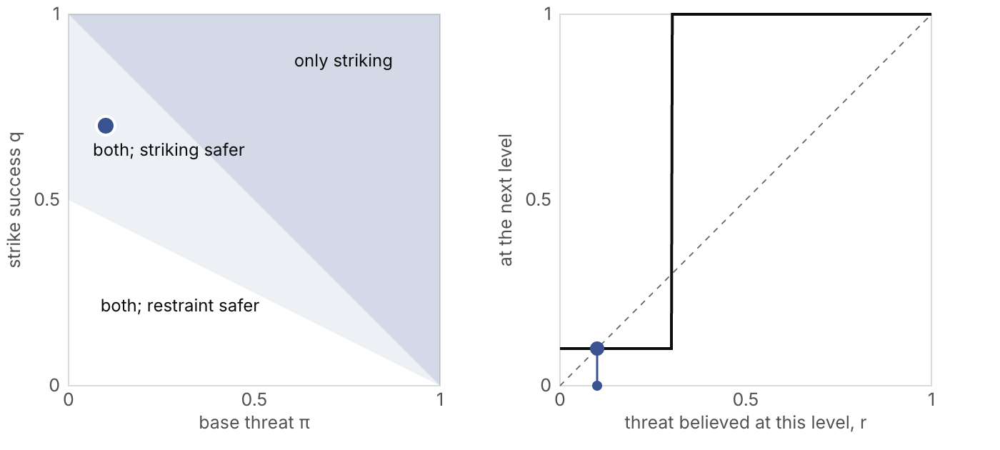
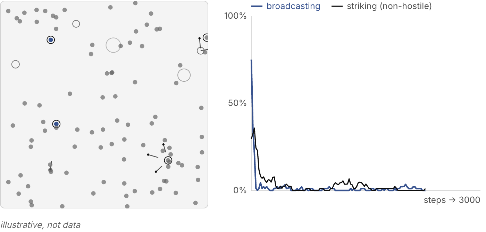

{}

## 0. Introduction

The "Dark Forest Theory" proposed by Liu Cixin in the *Three-Body Problem* series is a speculative theory about interaction strategies among cosmic civilizations. This article reconstructs it formally, with tools from game theory and decision theory, starting from the axioms given in the novel [^liu].

The argument proceeds in four steps. First, we show that the novel's two axioms are insufficient on their own to derive the Dark Forest. Then we add the structural conditions the novel relies on and build an incomplete-information game. From it we derive when the Dark Forest's two behaviors, silence and preemption, are equilibria. Finally we check the theory's evolutionary claim with a simulation, and discuss the limits of the conclusion. The formal claims in Sections 1, 2 and 4 to 6 are checked in Lean 4 with Mathlib; the proof file is attached as [DarkForest.lean](DarkForest.lean), and each checked claim below names its theorem. What is not checked is said where it occurs: the informal cases of Proposition 0, the equilibrium-selection result cited in Proposition 3, and the evolutionary clause of the theorem, which Section 9 tests by simulation instead. The same proofs, with a project that builds and checks them, are at [github.com/changkun/dark-forest-lean](https://github.com/changkun/dark-forest-lean).

The short version: the two halves of the Dark Forest are not equally strong. Silence follows under weak conditions. Preemption after detection is only one of two equilibria, and it is the safer one only when strikes usually succeed.

## 1. Axiomatic System

Let $\mathcal{U}$ be the set of all civilizations in the universe, with $|\mathcal{U}| \geq 2$.

**Axiom A1 (Survival Axiom):** In the novel, "survival is the primary need of civilization." For any civilization $c_i \in \mathcal{U}$ and any two outcomes $o, o'$: if $c_i$ survives in $o$ and not in $o'$, then $c_i$ strictly prefers $o$, whatever else differs between them. Writing $S_i(o)$ for "$c_i$ survives in $o$":

$$S_i(o) \wedge \neg S_i(o') \;\Longrightarrow\; o \succ_i o'$$

Survival has lexicographic priority. Because survival takes only two values, this order can be represented by a real-valued utility (Lean: `lex_representable`). The additive form used below, $-M$ for extinction plus the other gains, represents it exactly when those gains are bounded and $M$ exceeds twice their bound (`additive_lex_of_bounded`); if the other gains could grow without bound, no finite $M$ would do (`additive_not_lex_of_unbounded`). The model below assumes bounded gains and a very large $M$.

**Axiom A2 (Growth and Finite Resources):** In the novel, "civilization continuously grows and expands, but the total matter in the universe remains constant." Let $R$ be the total resource quantity of the universe and $r_i(t)$ the resources held by civilization $c_i$ at time $t$. Each civilization tends to grow, while

$$\sum_{i} r_i(t) \leq R, \quad \forall t$$

so one civilization's expansion eventually compresses the resources available to others.

## 2. Insufficiency of the Axioms

Before proceeding to the formal derivation, it is necessary to address a fundamental question: can the Dark Forest be derived from A1 and A2 alone?

**Proposition 0: A1 and A2 alone cannot imply the Dark Forest.**

**Proof (by counterexample construction):** Let two civilizations $c_1, c_2$ satisfy A1 (survival priority) and A2 (finite resources). Consider scenarios in which any of the following additional conditions hold:

(a) **Verifiable intentions:** There exists a mechanism enabling $c_1$ to reliably verify $c_2$'s goodwill, and vice versa. In this case, both parties can confirm the other's non-hostility, and cooperation becomes a sustainable equilibrium.

(b) **Enforceable contracts:** There exists an enforceable interstellar treaty mechanism (e.g., arbitration by a super-civilization or some universe-level locking protocol), such that violators are punished. Cooperation can then be maintained by institutional means.

(c) **Defense significantly dominates offense:** If technological conditions make first strikes nearly impossible to succeed (defense costs are far lower than offense costs), then a surprise attack has no positive expected payoff, and the security dilemma does not escalate. In the model of Section 5, a strike that never succeeds is strictly worse than waiting whenever it costs anything (Lean: `prop0_no_preemption_when_strikes_fail`).

(d) **Minimal communication delay with frequent interaction:** If civilizations can interact at high frequency, then by the Folk Theorem, patient participants can sustain cooperative equilibria in repeated games [^fm].

Under any of these conditions, even with finite resources and survival priority, both parties may maintain peace through division of labor, trade, boundary agreements, or deterrence equilibria.

Therefore, A1 and A2 at most imply that "conflict pressure exists" or "a security dilemma may arise," but they cannot imply "one must remain silent and destroy upon discovery." $\square$

**Implication:** The Dark Forest is not a direct logical consequence of the two axioms. To complete the derivation, additional conditions regarding information structure, communication constraints, and capability evolution must be supplied.

## 3. Structural Conditions

The following five conditions, together with A1 and A2, form a sufficient set of assumptions for the Dark Forest. Two of them formalize concepts the novel itself introduces alongside its axioms: the chain of suspicion (B2) and the technological explosion (B4) [^liu]. We do not prove that the set is minimal or that the conditions are independent; each plays a distinct role in the derivation, and removing any one may open a path to cooperation.

**Condition B1 (Anarchic Structure):** There exists no supra-sovereign institution in the universe capable of enforcing adjudication, punishing contract violations, or imposing peace. Formally, there is no external enforcement function $E$ such that any agreement $A_{ij}$ between civilizations can be credibly enforced.

**Condition B2 (Unverifiable Intentions):** For any two civilizations $c_i, c_j$, $c_i$ cannot reliably infer the true type $\theta_j \in \{\text{benign}, \text{hostile}, \text{neutral}\}$ of $c_j$. Let $m_j$ be any signal emitted by $c_j$. Then:

$$P(\theta_j \mid m_j) = P(\theta_j), \quad \forall m_j$$

Communication is cheap talk and carries no verifiable information about intentions. Benign and hostile civilizations can emit identical signals.

**Condition B3 (Light-Speed Lag):** Information propagation speed is bounded (at most the speed of light $c$). Let $d_{ij}$ be the distance between civilizations $c_i$ and $c_j$. The minimum round-trip communication delay is $\tau_{ij} \geq 2d_{ij}/c$. This implies:

- Verification cycles are extremely long: any information about the other party's current state is already outdated.
- Repeated game frequency is extremely low: the Folk Theorem requires sufficiently high interaction frequency and sufficiently low discount rates. When $\tau_{ij}$ is very large, the effective discount factor $\delta \approx e^{-r\tau_{ij}} \to 0$, making the Folk Theorem's cooperation conditions hard to satisfy. What matters is the product $r\tau_{ij}$: a civilization with a long enough horizon (small $r$) partly escapes this argument.
- This is a physical constraint, independent of civilizations' willingness or technological level.

**Condition B4 (Technological Explosion):** A civilization's technological capability may undergo exponential growth in a time span far shorter than a communication cycle. Let $x_i(t)$ be the strategic capability of civilization $c_i$ at time $t$, with evolution:

$$x_i(t + \tau) = x_i(t) \cdot e^{g_i \tau + \xi_i}$$

where $g_i$ is the base growth rate and $\xi_i$ is a random term with positive variance $\sigma^2 > 0$. Since $\sigma^2 > 0$, a current $x_j(t) \ll x_i(t)$ does not constitute a reliable upper bound on $x_j(t + \tau)$.

**Condition B5 (First-Mover Advantage):** Once both parties have located each other, a first strike can, under certain parameter conditions, significantly increase the attacker's survival probability. Let $q$ be the probability that a strike succeeds and $K_i$ the cost of striking. There exists a non-empty parameter interval in which the expected utility of a first strike exceeds that of restraint.

## 4. Formal Model

### 4.1 Utility Function

Let the extinction loss be $M$ (taken to be extremely large), the first-strike cost be $K_i$, and the ordinary gains from cooperation/trade be $G_i$. The utility of civilization $c_i$ is:

$$U_i = -M \cdot \mathbf{1}\{\text{extinction}\} - K_i \cdot \mathbf{1}\{\text{first strike}\} + \varepsilon G_i$$

where $M \gg K_i \gg \varepsilon G_i$. This structure reflects A1: survival overrides everything, and no cooperation gain, however large, outweighs "not being annihilated." With bounded gains, a finite $M$ larger than twice their bound represents A1's order exactly, as shown above; where a conclusion relies on "$M$ large", the propositions below say how large.

### 4.2 Threat Probability

Define the following probabilities:

- $p$: prior probability that the other party is currently hostile
- $\gamma$: probability that the other party, currently non-hostile, evolves into a lethal threat within the verification window $\tau$ (driven by B4)
- Base threat probability: $\pi = 1 - (1-p)(1-\gamma)$

$\pi$ integrates two types of risk: the other party is dangerous now, or the other party is not dangerous now but will become so soon. By B4 ($\sigma^2 > 0$), $\gamma > 0$; by B2 (unverifiable intentions), $p$ cannot be updated to 0. Therefore $\pi > 0$ (Lean: `basePi_pos`), even if no civilization is hostile now.

In the game after exposure, what matters is the probability that the other side strikes regardless of what we do, and we use $\pi$ for it. Counting $\gamma$ into that probability assumes that a civilization which becomes able to destroy another also becomes willing to. This is part of how we read B4, not a consequence of it.

## 5. Core Derivation

### Proposition 1: Peace Declarations Cannot Constitute Credible Commitments

By B2, signals carry no verifiable information. Any "I have no hostile intent" declaration is cheap talk: benign and hostile civilizations alike can emit identical signals.

Therefore, for any peace declaration $m$, $P(\text{the other is a threat} \mid m) = \pi$ (Lean: `prop1_posterior_is_prior`), and as long as $0 < \pi < 1$ (`prop1_cheap_talk`):

$$0 < P(\text{the other is a threat} \mid m) < 1$$

Communication cannot eliminate fear. Not because no one would express goodwill, but because hostile parties would express goodwill too.

### Proposition 2: The Chain of Suspicion Unravels Only When Fear Exceeds the Threshold for Striking

Under the constraints of B2 and B3, $c_i$ faces not only first-order uncertainty about "whether the other is dangerous," but also recursive higher-order uncertainty:

- Order 0: The other party may be a threat, with probability $\pi$
- Order 1: Even if the other party is not a base threat, it may preemptively strike out of fear of me
- Order 2: Even if the other party does not fear me, it may fear that I fear it...

A tempting shortcut is to set the probability of "striking out of fear" equal to the current threat estimate $r_n$, which gives the recurrence

$$r_0 = \pi, \qquad r_{n+1} = \pi + (1 - \pi) r_n$$

with solution $r_n = 1 - (1-\pi)^{n+1}$, which tends to 1 for every $\pi > 0$ (Lean: `linearChain_closed`, `linearChain_tendsto_one`). The algebra is right, but the shortcut carries the conclusion. Write $F(r)$ for the share of non-hostile civilizations that would strike if they believed the other side strikes with probability $r$; $F$ is the distribution function of their action thresholds. The chain of suspicion is then

$$r_0 = \pi, \qquad r_{n+1} = \pi + (1 - \pi) F(r_n)$$

The shortcut is the special case $F(r) = r$, in which action thresholds are spread uniformly over $[0, 1]$ (`linear_is_uniform`). Nothing in A1, A2 or B1–B5 says they are spread that way. Proposition 3 below says what a threshold is: a civilization strikes when $r$ exceeds $r^\ast \approx 1 - q$. If civilizations are alike, $F$ is a step at $r^\ast$, and the chain either stops at once or collapses at once:

- if $\pi \le r^\ast$, then $r_n = \pi$ for every $n$: no civilization that is not already a threat ever strikes (`chain_stops`);
- if $\pi > r^\ast$, then $r_n = 1$ from the first step on (`chain_unravels`).

In general, the chain never passes a resting point: any $\bar r \ge \pi$ with $\pi + (1-\pi)F(\bar r) \le \bar r$ bounds it for ever (`chain_le_resting_point`), so it reaches certainty only if no resting point lies below 1 (`chain_below_one_of_resting_point`). The chain of suspicion therefore does not by itself carry fear to certainty. It does so only when the base threat already exceeds the threshold for striking, or when thresholds are spread so that no resting point remains. Figure 1 lets you move $\pi$, the typical strike success $q$ and the spread of thresholds, and watch where the chain stops.

### Proposition 3: After Exposure, Striking and Restraint Are Both Equilibria

Once both parties have located each other, civilization $c_i$ chooses between striking first and waiting. Let $q$ be the probability that a strike succeeds, the same for both sides, and $r$ the probability that the other side strikes. Being struck kills with probability $q$; a strike that fails reveals the attacker, and the target's return strike kills with probability $q$. The expected utilities of waiting ($W$) and attacking ($A$) are:

$$U_i(W) = -r q M, \qquad U_i(A) = -(1 - q) q M - K_i$$

For $q > 0$, striking first beats waiting if and only if

$$r > r^\ast = 1 - q + \frac{K_i}{qM}$$

(Lean: `prop3_threshold`). As $M$ grows, the threshold falls to $1 - q$, and no further (`threshold_tendsto`). A large extinction loss makes a civilization strike at any fear above $1 - q$; it does not make it strike at any fear at all.

The game after exposure is therefore a stag hunt. Suppose a share $\pi$ of civilizations strikes regardless, and non-hostile ones strike with probability $a$, so that the other side strikes with probability $\pi + (1-\pi)a$:

- Mutual striking ($a = 1$) is an equilibrium whenever $r^\ast < 1$ (`strike_equilibrium_iff`).
- Mutual restraint ($a = 0$) is an equilibrium exactly when $\pi \le r^\ast$ (`wait_equilibrium_iff`): the same condition under which the chain of suspicion stops.
- Striking is risk-dominant [^hs], the better reply to an even chance of either, exactly when $r^\ast < (1+\pi)/2$ (`strike_risk_dominant_iff`); for large $M$ this reads $q > (1-\pi)/2$ (`strike_risk_dominant_iff_q`).

Restraint is the better equilibrium for both sides, since both survive; striking is the safer bet when strikes usually succeed. When each side observes the payoffs with a little noise, players of two-by-two games like this one coordinate on the risk-dominant equilibrium [^cvd]. So the post-exposure logic of the Dark Forest holds, but for a narrower reason than an unbounded chain of suspicion: when $q > (1-\pi)/2$, preemption is the safer answer to not knowing what the other side will do. When strikes usually fail, restraint is.

Schelling called the underlying mechanism "the reciprocal fear of surprise attack" [^schelling], and the security-dilemma literature has long studied how its severity depends on whether offense or defense has the advantage [^jervis]. Here that advantage is $q$.

_Fig 1: The chain of suspicion and the game after exposure. Left: for identical civilizations, which equilibria exist at each base threat $\pi$ and strike success $q$. Right: the chain $r_{n+1} = \pi + (1-\pi)F(r_n)$, with action thresholds spread around $1-q$. A spread of 0.5 around $q = 0.5$ is the original recurrence, which always climbs to 1. Drag the point, or change the spread, to see where the chain stops._

### Proposition 4: Before Exposure, Hiding Dominates Revealing

Let the detection probability when civilization $c_i$ chooses to reveal be $\lambda_R$, and when it chooses to hide be $\lambda_H$, with $\lambda_R > \lambda_H$. Let the extinction risk once detected be $\rho_D$, and while undetected $\rho_0$, with $\rho_D > \rho_0$. Let $B_i$ be the cooperation benefits of public exposure and $C_i$ the operational cost of hiding.

$$U_i(\text{reveal}) = -[\lambda_R \rho_D + (1 - \lambda_R) \rho_0] M + B_i$$

$$U_i(\text{hide}) = -[\lambda_H \rho_D + (1 - \lambda_H) \rho_0] M - C_i$$

The difference:

$$U_i(\text{reveal}) - U_i(\text{hide}) = (B_i + C_i) - (\lambda_R - \lambda_H)(\rho_D - \rho_0) M$$

Therefore, hiding is better exactly when

$$(\lambda_R - \lambda_H)(\rho_D - \rho_0) M > B_i + C_i$$

(Lean: `prop4_hide_iff`).

The condition $\rho_D > \rho_0$ asks little. Even if every non-hostile civilization restrains itself after detection, the hostile share still strikes, so a detected civilization dies with probability at least $\pi q > 0$ (`rhoD_pos`). For any fixed $B_i$ and $C_i$, a large enough $M$ then makes hiding better (`silence_for_large_M`). Unlike preemption, silence does not depend on the chain of suspicion or on strikes usually succeeding. It needs only that some hostile civilizations exist and that broadcasting makes detection likelier. Even if broadcasting only slightly raises the probability of being found, the extinction loss makes broadcasting a losing bet.

## 6. Main Theorem

**Definition (Dark Forest State):** A system is in the Dark Forest state if for every civilization $c_i \in \mathcal{U}$, both of the following hold simultaneously:

1. Actively revealing one's own location decreases its expected survival rate
2. Once mutually located with another civilization, restraint is not a risk-dominant strategy

**Theorem (Sufficient Conditions for the Dark Forest):** In a civilization system satisfying A1, A2, and B1–B5, with $0 < \pi < 1$ and $0 < q \le 1$:

1. **Silence (robust):** if broadcasting makes detection likelier ($\lambda_R > \lambda_H$) and $M$ is large enough, hiding is better than broadcasting (Proposition 4).
2. **Preemption (conditional):** after mutual detection, mutual striking is always an equilibrium. It is the only equilibrium when $\pi > r^\ast \approx 1 - q$. It is risk-dominant, and is the one selected when payoffs are observed with small noise, when $q > (1-\pi)/2$. Otherwise mutual restraint is the risk-dominant equilibrium (Proposition 3).
3. **System level:** if silence raises survival, then in a population that reproduces, silent civilizations should come to dominate, and the surviving sample is selected for silence. Section 9 tests this clause in a simulation.

The system is in the Dark Forest state when the first two hold with preemption selected, that is, when $q > (1-\pi)/2$. When strikes usually fail, the forest is still dark, because everyone hides, but it is no longer a hunting ground.

**Proof sketch (backward induction):**

- Endgame stage: once civilizations have located each other, the equilibria are those of Proposition 3. Which one is played depends on $\pi$ and $q$, not on how many levels of reasoning a civilization performs.
- Preceding stage: whichever equilibrium is played after detection, $\rho_D \ge \pi q > \rho_0$, so by Proposition 4 hiding dominates revealing for large $M$.
- Evolutionary level: this is a claim about dynamics rather than equilibrium, and the propositions do not prove it; Section 9 checks it. $\square$

**On uniqueness:** the theorem does not assert a unique equilibrium. Mutual restraint remains an equilibrium whenever $\pi \le 1 - q$, and it is the better one for both sides. What the Dark Forest adds is that, when strikes usually succeed, it is not the safe one.

## 7. Connections to Classical Theory

### 7.1 Isomorphism with the Hobbesian State of Nature

The Dark Forest Theory is structurally isomorphic to the "state of nature" described by Hobbes in *Leviathan* [^hobbes]:

| Hobbesian State of Nature        | Dark Forest                              | Corresponding Condition |
|----------------------------------|------------------------------------------|------------------------|
| No central authority (no Leviathan) | No universe-level governance body       | B1                     |
| Everyone seeks self-preservation | Civilizations prioritize survival        | A1                     |
| Fear of others' intentions       | Chain of suspicion                        | B2                     |
| Preemptive strike is rational    | Destroy upon discovery                    | B5                     |

The key difference lies in the exit mechanism: Hobbes argued that rational individuals could escape the state of nature by entering a social contract, delegating authority to a sovereign to maintain order. In the Dark Forest, B1 (no supra-sovereign institution), B2 (unverifiable intentions), and B3 (light-speed lag making interaction frequency extremely low) jointly block the path to establishing a social contract. Hobbes's "state of nature" has an exit; the Dark Forest (under the given conditions) does not.

### 7.2 Relation to the Fermi Paradox

The Fermi Paradox asks: if many civilizations exist in the universe, why have we observed no evidence of any?

The Dark Forest Theory offers one possible answer: civilizations exist, but silence is the equilibrium strategy. The absence of observable signals is not evidence that civilizations do not exist, but may instead indicate that civilizations are rationally hiding. By the theorem above, this half of the answer is the robust one.

However, this is only one of many candidate explanations for the Fermi Paradox [^brin]. Others, such as the Great Filter [^hanson], the Zoo hypothesis [^ball] and extremely short civilizational lifespans, can equally account for observational silence without relying on the strong assumptions of the Dark Forest. From the single fact that "we have detected no signals," it is impossible to determine which explanation is closer to reality.

## 8. Theoretical Limitations and Critiques

The above derivation is logically self-consistent within its assumption framework. However, each structural condition (B1–B5) can be challenged, and relaxing any one may fundamentally alter the equilibrium structure.

### 8.1 Fragility of the Unverifiable Intentions Assumption (Relaxing B2)

B2 assumes communication is completely untrustworthy. But game theory offers multiple mechanisms for breaking the cheap talk impasse:

**Costly signaling:** Conveying intention information by incurring an unforgeable cost (cf. Spence's education signaling model [^spence]). A civilization could send credible signals through irreversible self-disarmament, resource gifts, or technology disclosure. The key requirement: the cost of faking such signals must be high enough that hostile parties are unwilling to pay it. Whether this is feasible at cosmic scales remains an open question.

**Repeated games and reputation:** If interactions between civilizations are repeated, the Folk Theorem shows that cooperation can be sustained as an equilibrium among participants with sufficiently high discount factor $\delta$ [^fm]. The Dark Forest indirectly suppresses $\delta$ through B3 (light-speed lag), but if two civilizations are close enough ($\tau_{ij}$ is sufficiently small), repeated-game cooperation remains theoretically viable.

**Third-party arbitration and institutions:** Adjudication by a super-civilization could partly substitute for credible commitments. B1 rules this out, but B1 is itself an empirical assumption, not a logical necessity. Consensus protocols of the blockchain kind are no way around it, since they need rounds of communication and so run into B3.

### 8.2 Questionability of the Technological Explosion Assumption (Relaxing B4)

B4 assumes high uncertainty in technological capability growth ($\sigma^2 > 0$). If $\sigma^2$ is constrained to be sufficiently small (i.e., technological development is smooth and predictable), then $\gamma \to 0$, the base threat probability $\pi \to p$, and the room for the chain of suspicion to unravel shrinks with it.

From an empirical standpoint: while human history has seen periods of accelerated technological development, there has never been an instantaneous jump spanning orders of magnitude. Technological development may face physical upper bounds (thermodynamic limits, speed-of-light constraints, computational complexity lower bounds), making infinite explosion physically impossible. On the other hand, this possibility cannot be ruled out either, since we have only one civilization as a sample.

### 8.3 Strike Costs and Exposure Risk (Relaxing B5)

The model assumes first strikes have a positive net-benefit interval (B5). But at cosmic scales:

- Interstellar strikes require enormous energy investments; $K_i$ may not be negligible relative to $M$.
- The act of striking may itself expose the attacker's location to third-party civilizations $c_k$ (e.g., through observable energy-release signatures), increasing the attacker's risk. This means $U_i(A)$ should include an additional penalty term for "exposure to third parties." A recent paper argues that, once this is counted and no attacker can know it has found everyone, striking whatever one finds stops being an equilibrium whenever a strike is more visible to unseen civilizations than a hider is findable, while hiding remains one [^dam].
- If defensive technology significantly dominates offensive technology ($q \to 0$), first strikes almost never succeed, and the attack option no longer has positive expected payoff.

### 8.4 Absolutization of the Survival Axiom (Relaxing A1)

A1 sets survival as the lexicographically highest priority. But civilizations may have more complex value systems:

- They may be willing to accept some survival risk in pursuit of other goals (knowledge, aesthetics, moral principles).
- The "better to kill by mistake" logic driven by extreme risk aversion may itself be considered an unacceptable moral cost.
- If the utility function is not lexicographic but instead admits a finite rate of substitution among objectives, then the extinction loss $M$ is no longer "infinite," and the model's extreme conclusions soften significantly.

### 8.5 Complexity of Multi-Civilization Extensions

The two-player analysis cannot be directly extended to $n$-player games. In a multi-civilization environment:

- **Coalition formation** may alter the equilibrium structure. If multiple civilizations can form defensive alliances, a single civilization's first strike faces coalition retaliation, reducing the expected payoff of an attack.
- **Signal externalities:** Even if one civilization is destroyed, the observable signals produced by the attack (energy release, matter ejection) may be detected by third parties, exposing the attacker's existence and location. This makes the net benefit of the attack strategy lower in multi-civilization environments than the two-player model predicts.
- These effects make the optimality of "destroy upon discovery" no longer certain in multi-civilization environments, but the conclusion that "hiding is preferable" may actually be strengthened (since exposure entails facing more potential adversaries).

### 8.6 The Shape of the Chain of Suspicion

Proposition 2 shows that where the chain of suspicion stops depends on how action thresholds are distributed. The original linear recurrence needs thresholds spread over all of $[0, 1]$, including thresholds near zero: some non-hostile civilizations must be willing to strike at almost no fear. Remove them, and whenever the base threat lies below every civilization's threshold, the chain stops at $\pi$. If some civilizations can never strike successfully, the chain can also come to rest partway, at a level of fear above $\pi$ but below certainty. In none of these cases does a large extinction loss change the picture, because it moves thresholds only down to $1 - q$.

## 9. A Simulation

The system-level clause of the theorem is a claim about dynamics, which the propositions do not prove. Figure 2 checks it in a small universe where nothing is decided by the theorem.

One hundred civilizations sit at fixed random positions on a torus. Each has two heritable traits: whether it broadcasts, and whether it strikes whatever it detects. A share $p$ is hostile and strikes whatever it detects regardless. A civilization within range can detect another only after light from it has had time to arrive, and then detects it with probability $\lambda_R$ per step if it broadcasts and $\lambda_H \ll \lambda_R$ if it hides. Strikes travel at light speed and succeed with probability $q$. A failed strike reveals the attacker to its target, which strikes back, and any strike exposes the attacker to everyone else with probability $e$. Civilizations also die of other causes, at a low rate. Dead slots are refilled by offspring of the survivors, drawn in proportion to one plus $B$ times their number of peaceful contacts, so contact pays; traits mutate at 2% per birth.

Over twelve runs with fixed seeds for each setting, each of 3,000 steps:

- **Silence spreads whenever hostile civilizations exist.** With the defaults ($p = 0.1$, $q = 0.7$), broadcasting falls from 70% of civilizations to at most 5% in every run, as Proposition 4 predicts.
- **Striking spreads only in a hunting ground.** With the defaults it dies out, to at most 2% in every run, even though with $\pi = p = 0.1$ the strike success $q = 0.7 > (1-\pi)/2 = 0.45$ makes striking the risk-dominant response after *mutual* detection. In this universe detection is rarely mutual: striking what you find mostly kills civilizations that had not found you, and the failed strikes and exposures cost the striker more than the rare preempted threat saves. Striking survives only when hostile civilizations are common, strikes almost always succeed, and strikes are invisible to others ($p = 0.3$, $q = 0.95$, $e = 0$). There it holds between 15% and 85% of non-hostile civilizations in eleven of twelve runs, and a majority in four.
- **Without hostile civilizations, and with enough to gain from contact, the forest stays lit.** With $p = 0$ and $B \ge 1$, most civilizations keep broadcasting.

The simulation leaves out most of what would matter at cosmic scale: technological explosion (capabilities are fixed), coalitions, movement, and learning within a lifetime. It is illustrative, not evidence about the universe. What it does show is that the theorem's two halves behave differently under selection too: silence emerges from local rules under weak conditions, while hunting needs the extra conditions the theorem names, and then some.

_Fig 2: A small dark forest. Dots are civilizations: navy ones broadcast, grey ones hide, and a ring marks those that strike what they detect. Lines are strikes in flight. The chart tracks the share that broadcasts and the share of non-hostile civilizations that strike. The presets set the parameters for the cases in the text; the sliders change them. Rules are stated in Section 9; the numbers are illustrative, not data._

## 10. Conclusion

Translating the Dark Forest Theory of *Three-Body Problem* into rigorous game-theoretic form yields a clearer, and more circumscribed, conclusion:

**The two axioms "survival priority" and "finite resources" alone are insufficient to derive the Dark Forest.** With the structural conditions B1–B5 added, the Dark Forest's two halves come apart. Silence follows under weak conditions: some hostile civilizations, and a detection advantage for those who hide, are enough given a large extinction loss. Preemption is conditional: after mutual detection, striking and restraint are both equilibria, and striking is the risk-dominant one only when strikes usually succeed, $q > (1-\pi)/2$. The chain of suspicion, in the form the novel gives it, does not by itself carry fear to certainty. Finite resources (A2) functions more as an amplifier: it raises $\gamma$ and with it the base threat, making the forest easier to darken.

The Dark Forest is a stable equilibrium under specific conditions, but it is not the universe's only possible fate. It provides sufficient conditions, not inevitability. Relaxing any one of B1–B5 may open a path toward cooperative equilibrium.

Thus, the Dark Forest Theory is less a moral judgment that "all civilizations in the universe are evil" than a cooler structural proposition:

> **In a universe where extinction cost overrides all else, intentions cannot be credibly verified, and communication delay renders repeated games ineffective, silence is more stable than goodwill.**

---

*Note: The formalization in this article is a theoretical reconstruction of the novel's text, not Liu Cixin's own formulation. Cosmic sociology as a discipline does not actually exist; its "axioms" can be neither verified nor falsified. The Lean file checks the mathematics of the model, not whether the model describes any real universe.*

*Revised on September 27, 2026. Proposition 2 previously claimed that the chain of suspicion drives threat to certainty whenever $\pi > 0$, which holds only for uniformly spread thresholds; its note on robustness had the effect of a large $M$ backwards. Proposition 3's utilities are now symmetric, Section 1 states when the additive utility represents A1's order, the main theorem separates silence from preemption, the formal claims are checked in Lean, and Section 9 adds a simulation.*

{}

{}

## 0. 引言

刘慈欣在《三体》系列中提出的“黑暗森林理论”是一个关于宇宙文明间交互策略的推测性理论。本文从小说给出的公理出发，运用博弈论和决策理论的工具，对该理论做一次形式化的重构[^liu]。

论证分为四步：首先说明小说中的两条公理不足以单独推出黑暗森林；然后补上小说所依赖的结构性条件，构建一个不完全信息博弈；接着由此推导黑暗森林的两种行为，即沉默与先发制人，分别在什么条件下是均衡；最后用一个模拟检验理论在演化层面的主张，并讨论结论的局限。第 1、2 节以及第 4 至 6 节中的形式化结论，都已用 Lean 4 和 Mathlib 做了机器验证，证明文件附在这里：[DarkForest.lean](DarkForest.lean)。下文每一个经过验证的结论，都注明了对应的定理名；没有验证的部分，也在出现的地方说明了：命题 0 中非形式化的几种情形、命题 3 引用的均衡选择结果，以及定理在演化层面的那一条，后者改由第 9 节的模拟来检验。同样的证明，连同可以直接构建和检查它们的项目，也放在 [github.com/changkun/dark-forest-lean](https://github.com/changkun/dark-forest-lean)。

先说结论：黑暗森林的两半并不一样结实。沉默在很弱的条件下就成立；而暴露之后的先发制人，只是两个均衡之一，并且只有在打击通常能够成功时，才是更稳妥的那一个。

## 1. 公理体系

设 $\mathcal{U}$ 为宇宙中所有文明的集合，$|\mathcal{U}| \geq 2$。

**公理 A1（生存公理）：** 小说原文是“生存是文明的第一需要”。对任意文明 $c_i \in \mathcal{U}$ 和任意两个结局 $o, o'$：只要 $c_i$ 在 $o$ 中存续而在 $o'$ 中不存续，无论两者在其他方面有什么差别，$c_i$ 都严格偏好 $o$。记 $S_i(o)$ 为“$c_i$ 在 $o$ 中存续”，则：

$$S_i(o) \wedge \neg S_i(o') \;\Longrightarrow\; o \succ_i o'$$

生存是字典序意义上的最高优先级（lexicographic priority）。由于生存只有“存续”和“不存续”两种取值，这个偏好是可以用实值效用函数来表示的（Lean：`lex_representable`）。下面所用的加法形式，即灭绝记为 $-M$、再加上其他收益，只要其他收益有界、并且 $M$ 大于其上界的两倍，就能准确地表示它（`additive_lex_of_bounded`）；如果其他收益可以无限增大，那么任何有限的 $M$ 都做不到（`additive_not_lex_of_unbounded`）。下面的模型假定收益有界、$M$ 极大。

**公理 A2（增长与资源有限）：** 小说原文是“文明不断增长和扩张，但宇宙中的物质总量保持不变”。设 $R$ 为宇宙总资源量，$r_i(t)$ 为文明 $c_i$ 在时刻 $t$ 占有的资源量。每个文明都倾向于增长，而

$$\sum_{i} r_i(t) \leq R, \quad \forall t$$

所以一个文明的扩张，迟早会压缩其他文明的可用资源。

## 2. 公理的不充分性

在进入形式化推导之前，有必要先回答一个基本问题：仅凭 A1 和 A2，能否直接推出黑暗森林？

**命题 0：仅由 A1 与 A2，不能推出黑暗森林。**

**证明（反例构造）：** 设两个文明 $c_1, c_2$ 满足 A1（生存优先）和 A2（资源有限）。考虑以下任一附加条件成立的情形：

(a) **意图可验证：** 存在某种机制使 $c_1$ 能够可靠验证 $c_2$ 的善意，且反之亦然。此时双方可以确认对方无敌意，合作成为可支撑的均衡。

(b) **可信契约可执行：** 存在可执行的星际协约机制（如由超文明仲裁或某种宇宙级锁定协议），使违约方被惩罚。此时合作可由制度维持。

(c) **防御显著优于进攻：** 若技术条件使得先发打击几乎无法成功（防御成本远低于进攻成本），则偷袭不具有正的期望收益，安全困境不会激化。在第 5 节的模型里，一次永远不会成功的打击，只要有任何成本，就严格劣于等待（Lean：`prop0_no_preemption_when_strikes_fail`）。

(d) **通信延迟极小且交互频繁：** 若文明间可以高频重复交互，由无名氏定理（Folk Theorem），耐心的参与者可以在重复博弈中维持合作均衡[^fm]。

在上述任一条件下，即使资源有限且生存优先，双方仍可能通过分工、交换、边界划分或威慑均衡维持和平。

因此，A1 与 A2 最多推出“冲突压力存在”或“安全困境可能出现”，但不能推出“必须沉默且发现即摧毁”。$\square$

**含义：** 黑暗森林不是两条公理的直接逻辑后果。要完成推导，必须补充关于信息结构、通信约束和能力演化的条件。

## 3. 结构性条件

以下五个条件与 A1、A2 一起，构成推出黑暗森林的一组充分假设。其中两个，是把小说在公理之外给出的两个概念形式化：猜疑链（B2）和技术爆炸（B4）[^liu]。我们并不证明这组条件是最小的，也不证明它们彼此独立；它们在推导中各有各的作用，去掉任何一个，都可能打开通向合作的路。

**条件 B1（无政府结构）：** 宇宙中不存在能够执行裁决、惩罚违约、强制和平的超主权机构。形式化地，不存在一个外部执行函数 $E$ 使得任意文明间的协议 $A_{ij}$ 可被可信执行。

**条件 B2（意图不可验证）：** 对于任意两个文明 $c_i, c_j$，$c_i$ 无法可靠地推断 $c_j$ 的真实类型 $\theta_j \in \{\text{善意}, \text{恶意}, \text{中性}\}$。设 $m_j$ 为 $c_j$ 发出的任何信号，则：

$$P(\theta_j \mid m_j) = P(\theta_j), \quad \forall m_j$$

通信是廉价话语（cheap talk），不携带可验证的意图信息。善意文明和恶意文明可以发出完全相同的信号。

**条件 B3（光速迟滞）：** 信息传播速度有限（不超过光速 $c$）。设文明 $c_i, c_j$ 之间的距离为 $d_{ij}$，则一次往返通信的最小延迟为 $\tau_{ij} \geq 2d_{ij}/c$。这意味着：

- 验证周期极长：任何关于对方当前状态的信息都已经是过时的。
- 重复博弈频率极低：无名氏定理要求足够高的交互频率和足够低的折扣率。当 $\tau_{ij}$ 极大时，有效折扣因子 $\delta \approx e^{-r\tau_{ij}} \to 0$，合作条件难以满足。真正起作用的是乘积 $r\tau_{ij}$：一个眼光足够长远（$r$ 很小）的文明，可以部分地逃出这个论证。
- 这是一个物理约束，不取决于文明的意愿或技术水平。

**条件 B4（技术爆炸可能）：** 文明的技术能力可能在远短于通信周期的时间内发生跳跃式增长。设 $x_i(t)$ 为文明 $c_i$ 在时刻 $t$ 的战略能力，其演化满足：

$$x_i(t + \tau) = x_i(t) \cdot e^{g_i \tau + \xi_i}$$

其中 $g_i$ 为基础增长率，$\xi_i$ 为带有正方差 $\sigma^2 > 0$ 的随机项。由于 $\sigma^2 > 0$，当前的 $x_j(t) \ll x_i(t)$ 不构成对 $x_j(t + \tau)$ 的可靠上界。

**条件 B5（先手正收益区间）：** 一旦双方相互定位，先发打击在某些参数条件下能显著提高攻击方的生存概率。设 $q$ 为打击成功的概率，$K_i$ 为打击成本，存在非空的参数区间使得先发打击的期望效用高于克制等待。

## 4. 形式模型

### 4.1 效用函数

设灭绝损失为 $M$（取极大值），先发打击成本为 $K_i$，合作/交换等常规收益为 $G_i$。文明 $c_i$ 的效用为：

$$U_i = -M \cdot \mathbf{1}\{\text{灭绝}\} - K_i \cdot \mathbf{1}\{\text{先发打击}\} + \varepsilon G_i$$

其中 $M \gg K_i \gg \varepsilon G_i$。这个结构反映了 A1：生存压倒一切，合作收益再大也比不过“别被灭掉”。如上所述，收益有界时，一个大于其上界两倍的有限 $M$ 就能准确表示 A1 的字典序偏好；凡是依赖“$M$ 足够大”的结论，下面的命题都会说明要多大。

### 4.2 威胁概率

定义以下概率：

- $p$：对方当前为敌对型的先验概率
- $\gamma$：对方当前非敌对，但在验证窗口 $\tau$ 内演化为致命威胁的概率（由 B4 驱动）
- 基础威胁概率：$\pi = 1 - (1-p)(1-\gamma)$

$\pi$ 综合了两类风险：对方现在就危险，或对方现在不危险但很快会变得危险。由 B4（$\sigma^2 > 0$），$\gamma > 0$；由 B2（意图不可验证），$p$ 无法被更新为 0。因此 $\pi > 0$（Lean：`basePi_pos`），即使眼下没有任何文明是敌对的。

在暴露之后的博弈里，要紧的是对方无论如何都会打击的概率，我们就用 $\pi$ 表示它。把 $\gamma$ 算进这个概率，等于假定一个有能力毁灭别人的文明，也就有了这个意愿。这是我们对 B4 的一种解读，而不是 B4 本身推得出来的。

## 5. 核心推导

### 命题 1：和平声明无法构成可信承诺

由 B2，信号不携带可验证信息。任何“我没有恶意”的声明都是廉价话语：善意文明与恶意文明都能发出完全相同的信号。

因此，对任意和平声明 $m$，都有 $P(\text{对方是威胁} \mid m) = \pi$（Lean：`prop1_posterior_is_prior`），只要 $0 < \pi < 1$（`prop1_cheap_talk`）：

$$0 < P(\text{对方是威胁} \mid m) < 1$$

通信不能消除恐惧。不是因为没有人会表达善意，而是因为恶意方也会表达善意。

### 命题 2：只有当恐惧超过打击的门槛时，猜疑链才会崩塌

在 B2 和 B3 的约束下，$c_i$ 面临的不仅是“对方是否危险”的一阶不确定性，还有递归的高阶不确定性：

- 第 0 阶：对方可能是威胁，概率为 $\pi$
- 第 1 阶：即使对方不是基础威胁，它可能因为担心我而先发制人
- 第 2 阶：即使对方不担心我，它可能担心我担心它……

一个诱人的捷径，是把“因恐惧而先打”的概率直接等同于当前的威胁估计 $r_n$，得到递推

$$r_0 = \pi, \qquad r_{n+1} = \pi + (1 - \pi) r_n$$

它的解是 $r_n = 1 - (1-\pi)^{n+1}$，对任何 $\pi > 0$ 都趋于 1（Lean：`linearChain_closed`、`linearChain_tendsto_one`）。代数没有错，但结论其实是这条捷径带进来的。记 $F(r)$ 为：当相信对方以概率 $r$ 打击时，会选择打击的非敌对文明所占的比例；$F$ 就是这些文明行动门槛的分布函数。猜疑链于是写成

$$r_0 = \pi, \qquad r_{n+1} = \pi + (1 - \pi) F(r_n)$$

那条捷径，就是 $F(r) = r$ 的特例，也就是行动门槛在 $[0, 1]$ 上均匀分布（`linear_is_uniform`）。A1、A2 和 B1–B5 里，没有哪一条说门槛是这样分布的。下面的命题 3 会说明门槛是什么：当 $r$ 超过 $r^\ast \approx 1 - q$ 时，文明就会打击。如果各个文明彼此相同，$F$ 就是在 $r^\ast$ 处的一个阶跃，猜疑链要么当场停住，要么当场崩塌：

- 若 $\pi \le r^\ast$，则对所有 $n$ 都有 $r_n = \pi$：本来不是威胁的文明，永远不会出手（`chain_stops`）；
- 若 $\pi > r^\ast$，则从第一步起 $r_n = 1$（`chain_unravels`）。

一般地，猜疑链不会越过任何一个“停靠点”：只要 $\bar r \ge \pi$ 且 $\pi + (1-\pi)F(\bar r) \le \bar r$，它就永远不超过 $\bar r$（`chain_le_resting_point`）；所以只有当 1 以下没有任何停靠点时，它才会走到确定无疑（`chain_below_one_of_resting_point`）。可见，猜疑链本身并不会把恐惧推到必然。只有当基础威胁已经超过打击的门槛，或者门槛的分布让停靠点荡然无存时，它才会这样。图 1 可以调整 $\pi$、典型的打击成功率 $q$ 以及门槛的分散程度，看猜疑链停在哪里。

### 命题 3：暴露之后，打击与克制都是均衡

一旦双方相互定位，文明 $c_i$ 要在先发打击和等待之间选择。设打击成功的概率为 $q$，双方相同；设对方打击的概率为 $r$。被打击时，以概率 $q$ 被消灭；一次失败的打击会暴露攻击者，目标的回击以概率 $q$ 将其消灭。等待（$W$）与打击（$A$）的期望效用为：

$$U_i(W) = -r q M, \qquad U_i(A) = -(1 - q) q M - K_i$$

当 $q > 0$ 时，先发打击优于等待，当且仅当

$$r > r^\ast = 1 - q + \frac{K_i}{qM}$$

（Lean：`prop3_threshold`）。$M$ 越大，这个门槛越低，但只会降到 $1 - q$ 为止（`threshold_tendsto`）。巨大的灭绝损失会让文明在恐惧超过 $1 - q$ 时出手，却不会让它在任何一点恐惧下都出手。

所以，暴露之后的博弈是一场猎鹿博弈（stag hunt）。设比例为 $\pi$ 的文明无论如何都会打击，非敌对文明以概率 $a$ 打击，于是对方打击的概率是 $\pi + (1-\pi)a$：

- 只要 $r^\ast < 1$，相互打击（$a = 1$）就是一个均衡（`strike_equilibrium_iff`）。
- 相互克制（$a = 0$）是均衡，当且仅当 $\pi \le r^\ast$（`wait_equilibrium_iff`），这正是猜疑链停住的条件。
- 打击是风险占优（risk-dominant）的[^hs]，也就是面对“两种可能各占一半”时的更好回应，当且仅当 $r^\ast < (1+\pi)/2$（`strike_risk_dominant_iff`）；$M$ 很大时，这个条件就是 $q > (1-\pi)/2$（`strike_risk_dominant_iff_q`）。

克制对双方都是更好的均衡，因为两边都能活下来；而当打击通常能成功时，打击是更稳妥的押注。如果双方观察收益时都带一点噪声，这类二乘二博弈的参与者会协调到风险占优的均衡上[^cvd]。所以，黑暗森林在暴露之后的逻辑仍然成立，但理由比“猜疑链无限放大”要窄：当 $q > (1-\pi)/2$ 时，面对不知道对方会怎么做，先发制人是更稳妥的回答。当打击通常会失败时，克制才是。

Schelling 把背后的机制称为“对突然袭击的相互恐惧”[^schelling]；关于安全困境的研究，长期以来讨论的就是它的严重程度如何取决于进攻和防御哪一方占优[^jervis]。在这里，这个优势就是 $q$。

_图 1：猜疑链与暴露之后的博弈。左：对彼此相同的文明，在每个基础威胁 $\pi$ 和打击成功率 $q$ 下，存在哪些均衡。右：猜疑链 $r_{n+1} = \pi + (1-\pi)F(r_n)$，行动门槛分布在 $1-q$ 附近。以 $q = 0.5$ 为中心、分散程度为 0.5 时，就是原来那条递推，它总会爬到 1。拖动左边的点，或改变分散程度，看猜疑链停在哪里。_

### 命题 4：暴露前，隐藏优于公开

设文明 $c_i$ 选择公开暴露时被发现的概率为 $\lambda_R$，选择隐藏时为 $\lambda_H$，且 $\lambda_R > \lambda_H$。设被发现后的灭绝风险为 $\rho_D$，未被发现时为 $\rho_0$，且 $\rho_D > \rho_0$。设公开暴露带来的合作收益为 $B_i$，隐藏的运营成本为 $C_i$。

$$U_i(\text{暴露}) = -[\lambda_R \rho_D + (1 - \lambda_R) \rho_0] M + B_i$$

$$U_i(\text{隐藏}) = -[\lambda_H \rho_D + (1 - \lambda_H) \rho_0] M - C_i$$

两者之差：

$$U_i(\text{暴露}) - U_i(\text{隐藏}) = (B_i + C_i) - (\lambda_R - \lambda_H)(\rho_D - \rho_0) M$$

因此，隐藏更好，当且仅当

$$(\lambda_R - \lambda_H)(\rho_D - \rho_0) M > B_i + C_i$$

（Lean：`prop4_hide_iff`）。

$\rho_D > \rho_0$ 这个条件要求很低。即使所有非敌对文明在发现对方之后都克制自己，敌对的那一部分仍然会打击，所以一个被发现的文明，至少会以 $\pi q > 0$ 的概率被消灭（`rhoD_pos`）。对任何固定的 $B_i$ 和 $C_i$，只要 $M$ 足够大，隐藏就更好（`silence_for_large_M`）。和先发制人不同，沉默不依赖猜疑链，也不依赖打击通常能成功。它只需要存在一些敌对文明，并且广播会让自己更容易被发现。哪怕公开广播只略微提高了被发现的概率，灭绝代价也足以让广播成为一笔亏本的赌注。

## 6. 主定理

**定义（黑暗森林态）：** 若对任意文明 $c_i \in \mathcal{U}$，同时满足：

1. 主动暴露自身位置会降低其期望生存率
2. 一旦与其他文明相互定位，克制等待不是风险占优策略

则称该系统处于黑暗森林态。

**定理（黑暗森林的充分条件）：** 在满足 A1、A2 与 B1–B5 的文明系统中，设 $0 < \pi < 1$，$0 < q \le 1$：

1. **沉默（稳健）：** 若广播使自己更容易被发现（$\lambda_R > \lambda_H$），且 $M$ 足够大，则隐藏优于广播（命题 4）。
2. **先发制人（有条件）：** 相互定位之后，相互打击总是一个均衡。当 $\pi > r^\ast \approx 1 - q$ 时，它是唯一的均衡。当 $q > (1-\pi)/2$ 时，它是风险占优的，也是收益带有微小噪声时会被选中的那个均衡；否则，相互克制才是风险占优的均衡（命题 3）。
3. **系统层面：** 如果沉默提高了生存率，那么在一个会繁衍的群体里，沉默的文明应当逐渐占据多数，幸存下来的样本被沉默所筛选。第 9 节用模拟检验这一条。

当前两条成立、并且选中的是先发制人，也就是 $q > (1-\pi)/2$ 时，系统处于黑暗森林态。当打击通常会失败时，森林依然是黑的，因为人人都在隐藏，但它已经不再是猎场。

**证明思路（逆向归纳）：**

- 终局阶段：相互定位之后，均衡就是命题 3 所说的那些。选中哪一个，取决于 $\pi$ 和 $q$，而不取决于一个文明推理了多少阶。
- 前一阶段：无论被发现之后玩的是哪个均衡，都有 $\rho_D \ge \pi q > \rho_0$，于是由命题 4，$M$ 足够大时隐藏优于公开。
- 演化层面：这是一个关于动态的主张，不是关于均衡的，上面的命题并没有证明它；第 9 节检验它。$\square$

**关于唯一性：** 本定理并不断言均衡唯一。只要 $\pi \le 1 - q$，相互克制就始终是一个均衡，而且对双方都是更好的那个。黑暗森林补充的是：当打击通常能成功时，它不是那个稳妥的均衡。

## 7. 与经典理论的关联

### 7.1 与霍布斯自然状态的同构

黑暗森林理论在结构上与霍布斯在《利维坦》中描述的“自然状态”（state of nature）同构[^hobbes]：

| 霍布斯自然状态           | 黑暗森林                    | 对应条件 |
|--------------------------|------------------------------|----------|
| 无中央权威（无利维坦）   | 无宇宙级治理机构            | B1       |
| 人人自保                 | 文明以生存为第一需要         | A1       |
| 对他人意图的恐惧         | 猜疑链                       | B2       |
| 先发制人是理性选择       | 发现即摧毁                   | B5       |

关键区别在于退出机制：霍布斯认为理性个体可以通过社会契约（social contract）委托主权者维持秩序，从而逃离自然状态。在黑暗森林中，B1（无超主权机构）、B2（意图不可验证）和 B3（光速迟滞使交互频率极低）共同阻断了社会契约的建立路径。霍布斯的“自然状态”有出口，黑暗森林（在给定条件下）没有。

### 7.2 与费米悖论的关系

费米悖论问：如果宇宙中存在大量文明，为什么我们没有观察到任何迹象？

黑暗森林理论提供了一个可能的回答：文明存在，但沉默是均衡策略。可观测信号的缺失不是文明不存在的证据，而可能是文明在理性地隐藏自己。按照上面的定理，这一半回答恰恰是比较结实的那一半。

但需指出，这只是费米悖论的众多候选解释之一[^brin]。其他解释，如大过滤器假说[^hanson]、动物园假说[^ball]、文明寿命极短等，同样能解释观测上的沉默，且不依赖黑暗森林的强假设。仅从“我们没观测到信号”这一事实，无法判断哪种解释更接近真实。

## 8. 理论局限性与批判

上述推导在其假设框架内是逻辑自洽的。但每一条结构性条件（B1–B5）都可以被质疑，且放松任一条件都可能从根本上改变均衡结构。

### 8.1 意图不可验证假设的脆弱性（B2 的松弛）

B2 假设通信完全不可信。但博弈论中存在多种打破廉价话语困境的机制：

**代价信号（costly signaling）：** 通过付出不可伪造的成本来传递意图信息（如 Spence 的教育信号模型[^spence]）。文明可以通过不可逆的自我裁军、资源赠与或技术公开来发送可信信号。关键在于：这类信号的伪造成本必须高到恶意方不愿支付。在宇宙尺度上这是否可行，是一个开放问题。

**重复博弈与声誉：** 如果文明间的交互是重复的，无名氏定理表明合作可以在折扣因子 $\delta$ 足够大的参与者之间作为均衡被维持[^fm]。黑暗森林通过 B3（光速迟滞）间接压低了 $\delta$，但如果两个文明距离足够近（$\tau_{ij}$ 足够小），重复博弈合作仍然理论上可行。

**第三方仲裁与制度：** 由超文明来裁决，可以部分替代可信承诺。B1 排除了这种可能，但 B1 本身是一个经验假设，不是逻辑必然。至于区块链式的共识协议，它需要多轮通信，同样会撞上 B3，绕不过去。

### 8.2 技术爆炸假设的可疑性（B4 的松弛）

B4 假设技术能力增长具有高不确定性（$\sigma^2 > 0$）。如果 $\sigma^2$ 被约束得足够小（技术发展平稳可预测），则 $\gamma \to 0$，基础威胁概率 $\pi \to p$，猜疑链崩塌的余地也随之变小。

从经验角度看：人类历史中的技术发展虽有加速期，但从未出现过跨数量级的瞬间跳跃。技术发展可能存在物理上限（热力学极限、光速约束、计算复杂性下界），使得无限爆炸在物理上不可能。但反过来也无法排除这种可能性，因为我们只有一个文明的样本。

### 8.3 打击成本与暴露风险（B5 的松弛）

模型假设先发打击有正的净收益区间（B5）。但在宇宙尺度上：

- 跨星际打击需要巨大能量投入，$K_i$ 可能不是相对于 $M$ 可忽略的。
- 打击行为本身可能暴露攻击者的位置于第三方文明 $c_k$（例如通过能量释放的可观测信号），增大攻击者的风险。这意味着 $U_i(A)$ 应包含一个“暴露于第三方”的额外惩罚项。最近有一篇论文认为，把这一项算进去，并且承认攻击者永远无法确知自己已经找到了所有人之后，只要一次打击对未被发现的文明来说，比一个隐藏者更容易被看见，“见一个打一个”就不再是均衡，而“人人隐藏”仍然是[^dam]。
- 如果防御技术显著强于进攻技术（$q \to 0$），先发打击几乎不可能成功，打击不再具有正的期望收益。

### 8.4 生存公理的绝对化（A1 的松弛）

A1 将生存设为字典序最高优先级。但文明可能有更复杂的价值体系：

- 愿意承担一定生存风险来追求其他目标（知识、美学、道德准则）。
- 极端风险规避导致的“宁可误杀”逻辑，本身可能被视为不可接受的道德代价。
- 如果效用函数不是字典序的，而是各目标间存在有限的替代率（finite rate of substitution），则灭绝损失 $M$ 不再是“无穷大”，模型的极端结论会显著软化。

### 8.5 多文明扩展的复杂性

二人博弈的分析不能直接推广到 $n$ 人博弈。在多文明环境中：

- **联盟形成（coalition formation）** 可能改变均衡结构。如果多个文明能够形成防御联盟，则单个文明的先发打击面临联盟报复，打击的期望收益下降。
- **信号外部性：** 即使消灭了一个文明，攻击行为产生的可观测信号（能量释放、物质抛射）可能被第三方探测到，暴露攻击者的存在和位置。这使得打击策略在多文明环境中的净收益比二人博弈模型预测的更低。
- 这些效应使得“发现即摧毁”在多文明环境下的最优性不再确定，但“倾向隐藏”的结论可能反而被强化（因为暴露后面临的潜在敌手更多）。

### 8.6 猜疑链的形状

命题 2 说明，猜疑链停在哪里，取决于行动门槛如何分布。原来那条线性递推，需要门槛铺满整个 $[0, 1]$，包括接近零的门槛：总得有一些非敌对文明，在几乎毫无恐惧时也愿意出手。把这些文明去掉，只要基础威胁低于所有文明的门槛，猜疑链就停在 $\pi$。如果有些文明的打击永远不可能成功，猜疑链还可能停在半路，停在一个高于 $\pi$、却低于确定无疑的恐惧水平上。无论哪种情形，巨大的灭绝损失都改变不了这幅图景，因为它只能把门槛压到 $1 - q$。

## 9. 一个模拟

定理的系统层面那一条，是一个关于动态的主张，上面的命题并没有证明它。图 2 在一个小宇宙里检验它，而这个宇宙里，没有任何事情是由定理决定的。

一百个文明散布在一个环面（torus）上的随机位置，位置固定不动。每个文明有两个可遗传的性状：是否广播，以及是否打击自己发现的一切。比例为 $p$ 的文明是敌对的，不管性状如何，发现什么就打击什么。一个文明只有在另一个文明的光有时间抵达之后，才可能发现它；此后，对方若在广播，每一步被发现的概率是 $\lambda_R$，若在隐藏，则是远小于它的 $\lambda_H$。打击以光速飞行，成功的概率是 $q$。失败的打击会把攻击者暴露给目标，目标随即回击；任何一次打击，都会以概率 $e$ 把攻击者暴露给其他所有文明。文明也会以很低的概率死于别的原因。空出来的位置，由幸存者的后代填补，选中某个幸存者的机会，与“一加上 $B$ 乘以它的和平接触数”成正比，所以接触是有好处的；每次出生，性状有 2% 的概率突变。

每种设定用固定的随机种子各跑十二次，每次 3,000 步：

- **只要存在敌对文明，沉默就会蔓延。** 在默认参数下（$p = 0.1$，$q = 0.7$），每一次运行中，广播的文明都从 70% 降到了 5% 以下，正如命题 4 所预言的。
- **只有在猎场里，打击才会蔓延。** 在默认参数下，打击这个性状会消亡，每次都降到 2% 以下，尽管在 $\pi = p = 0.1$ 时，打击成功率 $q = 0.7 > (1-\pi)/2 = 0.45$ 意味着在*相互*定位之后，打击是风险占优的回应。在这个宇宙里，定位很少是相互的：见什么打什么，杀掉的大多是还没发现自己的文明，而失败的打击和暴露给攻击者带来的代价，超过了偶尔先下手除掉一个威胁所省下的。只有当敌对文明很多、打击几乎必定成功、并且打击不会被别人看见时（$p = 0.3$，$q = 0.95$，$e = 0$），打击才能存活下来：十二次运行里有十一次，它占到非敌对文明的 15% 到 85%，其中四次过半。
- **没有敌对文明、而接触又足够有利时，森林会一直亮着。** 当 $p = 0$、$B \ge 1$ 时，大多数文明会一直广播下去。

这个模拟省略了宇宙尺度上大部分要紧的东西：技术爆炸（能力是固定的）、联盟、移动，以及一生之内的学习。它只是示意，不是关于宇宙的证据。它能说明的是：定理的两半，在选择之下也表现得不一样。沉默会在很弱的条件下，从局部规则里自己长出来；而狩猎需要定理列出的那些额外条件，甚至还不止这些。

_图 2：一片小小的黑暗森林。每个点是一个文明：深蓝色的在广播，灰色的在隐藏，外圈标记的是会打击自己所发现文明的那些。线条是正在飞行的打击。右边的图记录广播文明的比例，以及非敌对文明中会打击者的比例。预设对应正文里的几种情形，滑块可以改变参数。规则见第 9 节；数字只是示意，并非数据。_

## 10. 结论

将《三体》的黑暗森林理论翻译成严格的博弈论形式后，可以得到一个更清晰、也更有限度的结论：

**仅有“生存优先”和“资源有限”两条公理，不足以推出黑暗森林。** 补上结构性条件 B1–B5 之后，黑暗森林的两半就分开了。沉默在很弱的条件下成立：只要存在一些敌对文明，并且隐藏能让自己更难被发现，再加上巨大的灭绝代价，就够了。先发制人是有条件的：相互定位之后，打击和克制都是均衡，只有当打击通常能成功，即 $q > (1-\pi)/2$ 时，打击才是风险占优的那个。小说所说的猜疑链，本身并不能把恐惧推到必然。资源有限（A2）更像一个放大器：它提高了 $\gamma$，也就提高了基础威胁，让森林更容易变暗。

黑暗森林是一个在特定条件下稳定的均衡，但不是宇宙的唯一可能命运。它给出的是充分条件，不是必然性。放松 B1–B5 中的任意一条，均可能打开通向合作均衡的通道。

因此，黑暗森林理论与其说是“宇宙里的文明都是坏的”这样一个道德判断，不如说是一个更冷静的结构性命题：

> **在灭绝代价压倒一切、意图无法可信互证、通信延迟使重复博弈失效的宇宙里，沉默比善意更稳定。**

---

*附注：本文中的形式化是对小说文本的理论重构，并非刘慈欣本人的表述。宇宙社会学作为一个学科本身并不存在，其“公理”的真实性无法被验证或证伪。Lean 文件验证的是这个模型的数学，而不是这个模型是否描述了某个真实的宇宙。*

*2026 年 9 月 27 日修订。命题 2 原先声称，只要 $\pi > 0$，猜疑链就会把威胁推到确定无疑，这只在门槛均匀分布时成立；它关于稳健性的说明，还把巨大 $M$ 的作用方向说反了。命题 3 的效用已改为对称的形式，第 1 节说明了加法效用在什么条件下能表示 A1 的偏好，主定理把沉默和先发制人分开，形式化的结论用 Lean 做了验证，第 9 节增加了一个模拟。*

{}

## References

[^liu]: Liu, C. (2008). *三体II：黑暗森林*. Chongqing Press. English translation: *The Dark Forest*, trans. J. Martinsen, Tor Books, 2015. The two axioms, and the concepts of the chain of suspicion and the technological explosion, are given in the prologue.
[^fm]: Fudenberg, D., & Maskin, E. (1986). [The folk theorem in repeated games with discounting or with incomplete information](https://doi.org/10.2307/1911307). *Econometrica*, 54(3), 533–554.
[^hs]: Harsanyi, J. C., & Selten, R. (1988). *A General Theory of Equilibrium Selection in Games*. MIT Press.
[^cvd]: Carlsson, H., & van Damme, E. (1993). [Global games and equilibrium selection](https://doi.org/10.2307/2951491). *Econometrica*, 61(5), 989–1018. For two-by-two games whose payoffs each player observes with small noise, iterated dominance selects the risk-dominant equilibrium.
[^schelling]: Schelling, T. C. (1960). *The Strategy of Conflict*. Harvard University Press, ch. 9, "The reciprocal fear of surprise attack", pp. 207–229.
[^jervis]: Jervis, R. (1978). [Cooperation under the security dilemma](https://doi.org/10.2307/2009958). *World Politics*, 30(2), 167–214.
[^hobbes]: Hobbes, T. (1651). *Leviathan*, ch. XIII.
[^brin]: Brin, G. D. (1983). [The "Great Silence": the controversy concerning extraterrestrial intelligent life](https://ui.adsabs.harvard.edu/abs/1983QJRAS..24..283B/abstract). *Quarterly Journal of the Royal Astronomical Society*, 24(3), 283–309.
[^hanson]: Hanson, R. (1998). [The Great Filter: are we almost past it?](https://mason.gmu.edu/~rhanson/greatfilter.html)
[^ball]: Ball, J. A. (1973). [The zoo hypothesis](https://doi.org/10.1016/0019-1035%2873%2990111-5). *Icarus*, 19(3), 347–349.
[^spence]: Spence, M. (1973). [Job market signaling](https://doi.org/10.2307/1882010). *Quarterly Journal of Economics*, 87(3), 355–374.
[^dam]: Dam, H. (2026). First attack, final offensive: the Dark Forest on an open roster. [arXiv:2609.12003](https://arxiv.org/abs/2609.12003). Read in abstract only.
