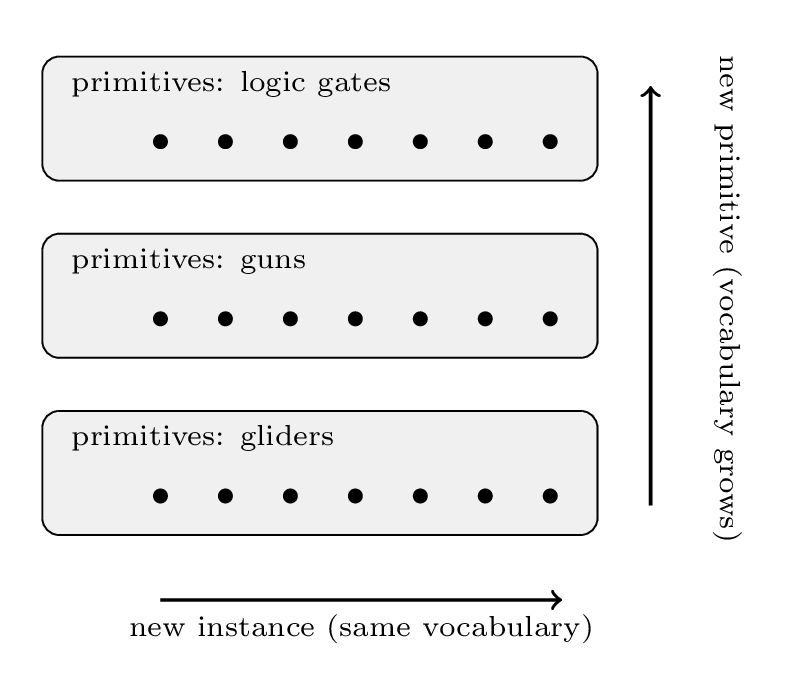
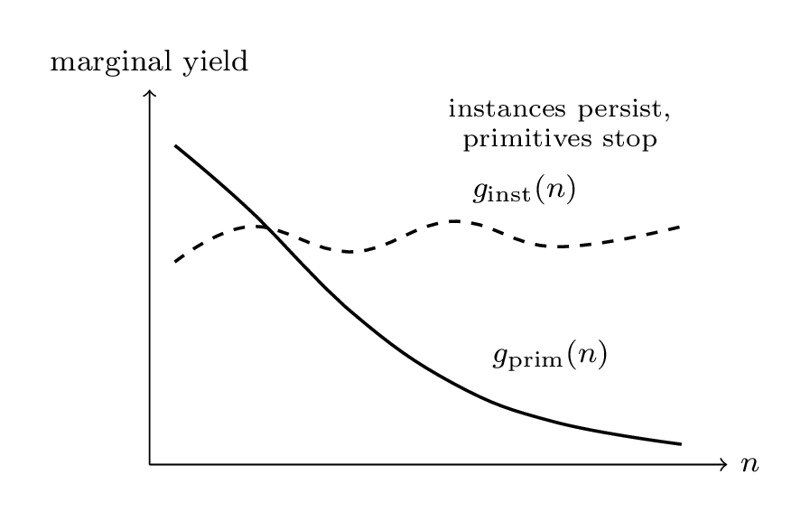
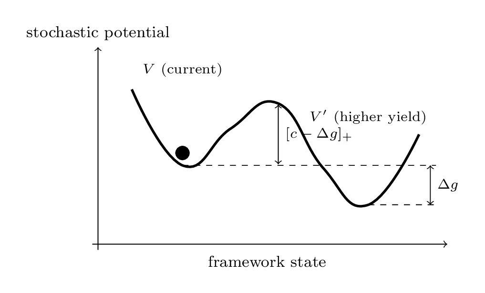
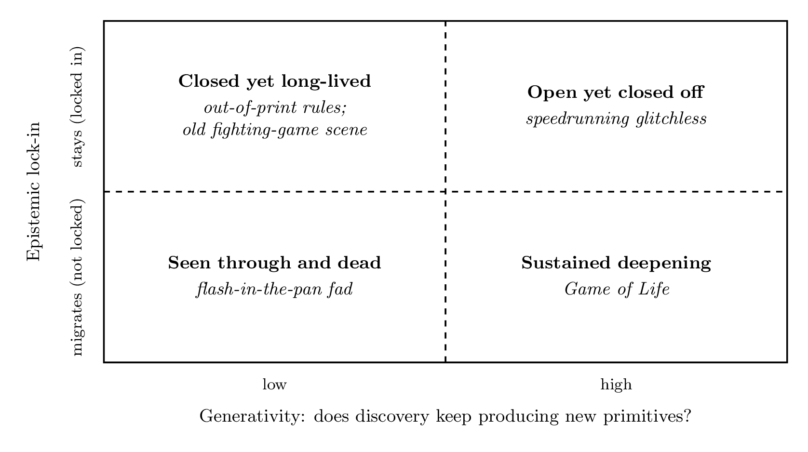

{}

*On instances, primitives, and the difference between novelty that compounds and novelty that merely accumulates.*

> "The limits of my language mean the limits of my world." -- _Wittgenstein, Tractatus 5.6_

At first it looked like progress.

For one week, an AI Agent pipeline kept shipping. Commits arrived roughly every hour. Small fixes landed, minor improvements accumulated, the activity graph looked alive. Only one thing was missing: the product itself did not become larger [^goalless]. It was not broken. It was not idle. It was moving, but inside a vocabulary it already had.

That confusion is not rare. Conway's Game of Life has produced new patterns for half a century, and when its central open question about oscillators was settled in 2023, the community did not wind down; it accelerated. Speedrunning communities deliberately ban whole classes of glitches and still find new routes inside the smaller rule book. Out-of-print fighting games keep tournaments alive on rule sets that have been frozen for decades. Most viral internet ideas, by contrast, are mined out within a month and quietly abandoned.

From the outside, all of these can look like activity. The easy diagnosis is "the well is dry," but that is often too crude. The Game of Life community could be plateauing; the agent pipeline could still be growing; the viral fad might still have another form waiting somewhere. The thing that separates these cases is not visible in the usual busyness metrics, but it is sharp enough to name, and in principle sharp enough to measure.

So the question is: **what is the difference between a system that is producing and a system that is growing?** Between motion and progress? "Vibe" is not a metric. The distinction needs a name.

The uncomfortable part is that the distinction is not subtle. After the next two sections almost everyone will say "yes, of course." And yet most of the systems we actually run, build, and reward are the ones that erase the difference. The point of this essay is less the distinction itself than the structural reason we keep walking into it.

## More Is Not New

The distinction is simple: there are two kinds of novelty, and we routinely confuse them.

The first is **instance novelty**: a previously unseen output. A new solution, a new feature, a new generated artifact. The second is **primitive novelty**: a new reusable building block, something that enters the vocabulary and changes what becomes cheap to say or do next.

A finite grammar can generate infinitely many sentences. That fact is the trap. A system can produce an unbounded stream of genuinely new instances without adding a single new primitive. From the outside it looks open-ended. Underneath, the vocabulary has stopped moving. There is always something new to *say*, and nothing new to *say it with*.

Once the distinction is visible, examples are everywhere. A pop-song generator can produce ten thousand chord progressions without introducing a new chord. A research subfield can publish for a decade, every paper different, while quietly running on the same three theorems it started with. An organization can ship features for years on an architecture nobody is allowed to question. A solo creative practice can jump between one-off experiments where each piece is new and none of them make the next one easier. The outputs are genuinely novel. The vocabulary is frozen. The system is productive, but it is not becoming more generative.

_Fig 1: Instance novelty vs primitive novelty. Filling a level with more instances (horizontal) is not the same as promoting a new reusable primitive that opens a level (vertical). A finite grammar yields unboundedly many instances at fixed primitive height._

The cellular automata world gives the cleanest example, and it is a real result, not just a metaphor. In 2023 it was proven that Conway's Game of Life has an oscillator of *every* period; the system is "omniperiodic" [^omniperiodic]. That closed an entire family of instance questions at once: *is there a thing that blinks with period N?* Yes, for all N.

A community might be expected to slow down after a central open problem is solved. The opposite happened. The *constructions* invented along the way, the reusable techniques for engineering behavior into the grid, were primitives, and the community immediately carried them into new questions. The oscillators were instances. The ways of building them were primitives. They move on different clocks, and mixing them up is one way to misread whether a field, a community, or any system is still alive.

## The Two Curves

One picture is enough for the rest of the argument. Run any open-ended system over time and track two numbers.

$g_{\text{inst}}$ (instance yield): how surprising each new output is, given everything that came before. How much genuinely new *stuff* is arriving.

$g_{\text{prim}}$ (primitive yield): how often a genuinely new reusable building block gets promoted into the vocabulary.

_Fig 2: The two-curve criterion. Instance-level marginal complexity $g_{\text{inst}}$ stays bounded away from zero while primitive-level marginal yield $g_{\text{prim}}$ decays to zero: unboundedly many novel instances, yet generative closure._

The diagnostic is not the level of either curve. It is their **divergence**. The failure mode that looks healthy from a distance goes like this: $g_{\text{inst}}$ stays high, new instances keep coming, while $g_{\text{prim}}$ quietly decays toward zero. There are no new building blocks. Infinitely many instances, generative closure. The busyness metrics can stay green exactly when the thing that matters has flattened.

The same shape appears at very different scales. A research group that keeps publishing variations of the same trick has high $g_{\text{inst}}$ and near-zero $g_{\text{prim}}$: every paper is new, but the toolkit is frozen. A craft practice that moves from one-off experiment to one-off experiment has the same signature: a new piece each week, none of them inheriting much from the last. A late paradigm in science can look similar: work continues, anomalies are absorbed, but no new explanatory primitives enter the canon. In each case, the first useful move is to ask where new primitives could actually form, instead of spending all attention on more instances of the old ones.

So the first practical move is almost embarrassingly simple: **stop watching one curve.** Output volume and instance novelty are vanity metrics. They can look great during a plateau. The number to watch is primitive yield, and it behaves very differently.

## What Counts as a New Primitive

"Reusable building block" is still vague. Here a useful idea from program synthesis does real work, and it is the only formula in this essay worth remembering.

A candidate counts as a primitive only when **adding it to the library makes the total description of past work shorter.** Write the sum of two costs:

$$\text{cost}(\text{library}) \;+\; \text{cost}(\text{work, expressed in terms of the library})$$

Adding an abstraction costs something: the library grows. It pays only if everything written using it gets cheaper. The hard part of this test is that it is *retrospective*. A new "abstraction" cannot be qualified by looking at its design, or by how clean it feels in code review. It has to be applied to old work, and the description has to get shorter. **If past work does not compress, future work probably will not either.** That is the operational form of the distinction the rest of this essay is built on.

This is what library-learning systems like DreamCoder [^dreamcoder] and Stitch [^stitch] do: they comb through a corpus of solutions and promote the abstractions that maximize compression. The useful point is that **this is not mystical and it is not a vibe.** A reusable skill is one that allows past work to be re-described more compactly, because it factors out a pattern that kept being re-derived. That gives an operational test for whether a system is accumulating capability or only accumulating output: is its library compressing its own history, or not?

This also reframes what a good open-ended structure is *for*, whether that structure is a research group, an artistic movement, a software organization, or an autonomous system. For generativity [^openend], task completion is not enough. The system needs a persistent, shared library and an incentive to compress into it: a structural reason for someone, or something, to notice that the same pattern has appeared five times and should become a primitive. Without that, every cycle starts from the same vocabulary, and the primitive curve never lifts off [^prospective].

## Why We Keep Forgetting This

So far this is mostly a definition, and an obvious one. Most systems run by experienced people are run by people who already know, in some form, that mere output is not capability. So why does the same pattern keep reappearing, in shipped product after shipped product, agent system after agent system, lab after lab?

The answer is structural. Every running system has an accounting layer: a changelog, a velocity dashboard, an OKR sheet, an evaluation harness, a paper count. Those layers track *output*. None of them track library compression. **The changelog records what the system did; the library records what it became.** The two are not on the same dashboard, because the second one is hard to define and harder to incentivize, and people optimize what they can see paid out.

In practice that means the things that get rewarded are the things that get measured. A pull request closes a ticket and the closing is visible. An engineer who instead spends a week retiring three modules and adding one cleaner primitive does roughly the same amount of work and produces nothing the system can score as "shipped." Across enough quarters, the incentive ratchet eats the library. The system trends, predictably, toward higher $g_{\text{inst}}$ and lower $g_{\text{prim}}$.

Consider two systems. The first ships a feature every day; its dashboard glows green; its team is celebrated. The second ships nothing for a month while a team rebuilds an internal representation nobody outside the org will ever see. Most accounting layers cannot tell you that, six months on, the second is producing twice as many primitives per quarter as the first, and the first is on a curve toward exhaustion. The honest reading reverses the obvious one.

The same shape recurs in less commercial settings. Research labs that count publications converge on instance work. AI agent benchmarks that score pass rates select for agents that solve more problems with the same vocabulary, not for agents that grow a vocabulary at all. Generative-AI products priced by tokens are economically indifferent to whether the next token came from a compressed concept or a re-derivation. In each case the accounting layer cannot see the variable that actually matters, so the system optimizes a proxy.

So the embarrassing fact is not that "more is not new" is a sophisticated insight some organization might fail to grasp. The fact is that the insight is obvious, almost everyone running these systems will agree with it on a whiteboard, and the systems still produce the wrong answer because nobody has written the right one down in a place that pays out money.

## The Second Trap: Lock-In

Suppose the primitives *are* available. The current way of framing the problem is exhausted, but a better frame exists: a new representation, a new theoretical kit, a new architecture, something that would reopen the primitive curve. Does the system move to it?

Usually not. This is a different failure from "nothing left to find." It is **lock-in**: the system should move and cannot. Kuhn's account of scientific revolutions is largely a study of this [^kuhn]: anomalies accumulate, the community keeps not switching, and eventually the cost of staying exceeds the cost of jumping. The field then reorganizes in a discrete jump rather than a smooth transition.

The math here is only a comparison. A system switches frames when the gain from switching, call it $\Delta g$, exceeds the cost of switching, $c$. It stays locked in whenever $c > \Delta g$. Two flavors matter:

**Pure convention.** The alternatives are about equally good. A system is stuck on one for historical reasons, and the cost of changing is not worth it. QWERTY is the classic case [^arthur]. Often harmless.

**Coordination lock-in.** The new frame is genuinely better ($\Delta g > 0$), but the cost of everyone relearning the shared vocabulary, rebuilding the tooling, and recoordinating evaluation standards exceeds the gain. This is the expensive one. It is the shape of pre-Copernican astronomy carrying epicycles on epicycles for centuries, each patch a competent local fix, the underlying frame left unquestioned. It is also the shape of mature engineering organizations whose process makes the leap unrepresentable, so that "pause delivery for three weeks and rethink the topology" is not a sentence the structure can accept [^wallfacer]. The frame will not question itself.

_Fig 3: Lock-in as a potential landscape. Even when a better framework $V'$ exists ($\Delta g > 0$), the collective stays in $V$ if the escape resistance $[c - \Delta g]_+$ exceeds the available perturbations: a metastable basin. Pure-convention lock-in is the special case $\Delta g \approx 0$._

Put the two traps on perpendicular axes and a richer picture appears.

_Fig 4: Two axes generate four corners. **Generativity** (does discovery keep producing new primitives?) is the horizontal axis. **Epistemic lock-in** (when yield decays, does the collective stay?) is the vertical. Low-generativity, low-lock-in is the flash-in-the-pan fad: once people see through it, they leave. Low-generativity, high-lock-in is the long-lived culture on closed rules: an out-of-print game with a competitive scene that lasts decades. High-generativity, low-lock-in is the open community deliberately bounding itself: speedrunning a still-rich game under "glitchless" rules. High-generativity, high-lock-in is sustained deepening: Game of Life fifty years on._

Most writing about "open-endedness" sees only one axis at a time. For a stalled system it helps to ask both before reaching for an answer. Even a genuinely generative system will plateau if it is welded to a representation whose primitive curve has flattened, and no amount of local cleverness gets it out. Migration is a different operation from optimization. It has a real cost, and someone, usually still a human, has to decide to pay it on purpose.

One sharper thing to say about both traps. What can actually be measured is never a system's raw *capacity* for primitive generation; the measurable quantity is how many primitives were *actualized*, given where attention was spent. Two systems with access to the same material can trace wildly different libraries depending on how attention is allocated [^march]. Lock-in is the special case where attention is pointed at a flat curve and the structure will not let it move.

## The Hard Part Is Not the Idea

The argument has a definition, a test, an explanation for why systems keep failing the test, and a separate trap that catches the ones that pass it. None of the pieces is hard. The hard part, the part that actually matters, is the second one: knowing the distinction does not get a system out of the trap, because the trap is in the accounting layer, not in anyone's understanding.

So the working version of the test is short. A system's real state is not in its output sequence. It is in its library. The changelog says what it did; the library says what it became. Most measurement systems only count the first. A few systems somehow find a way to also count the second. The rest stay busy.

{}

{}

*关于两种"新"：一种会复利，一种只是越堆越多。*

> 我语言的边界，就是我世界的边界。 -- _维特根斯坦《逻辑哲学论》5.6_

最初那一周，它看起来很像在进展。

一条 AI Agent 流水线几乎每小时提交一次 commit，活动图绿得发亮。问题只有一个：产品本身没有变大[^goalless]。它没有崩，也没有停工，但它的运动只发生在自己已经掌握的那点词汇里。

这种错觉并不少见。Conway's Game of Life 持续产出新图样已经半个世纪了，2023 年它关于振子的核心未解问题刚被解决，社区不但没冷下来，反而提了速。speedrunning 的圈子主动把整类 glitch 排除在规则之外，仍能在留下的小框架里挖出新路线。一些绝版的格斗游戏，规则冻结了二十年，比赛照办。与此相对，互联网上绝大多数爆款，往往一个月内就被掏空，悄无声息地被放下。

从外面看，这些情况都叫"活跃"。最顺嘴的解释是"井干了"，但这句话往往太粗：Game of Life 也可能只是在触顶；那条 Agent 流水线也可能还在长；爆款也未必死，只是换了形态。真正把这几种情况分开的东西，不在忙碌指标里；但它也不只是一种直觉，它可以被指认出来，原则上也能被测出来。

所以问题落到一句话上：**一个在产出的系统，和一个在成长的系统，差在哪里？** 运动与进步之间相差的那一截到底是什么？"感觉"不算指标，这个差别值得被起一个名字。

不舒服的地方在于，这个区分本身一点都不微妙。下面两节看完，绝大多数人都会说"这不显然吗"。然而我们真正在跑的系统、在建的组织、在奖励的工作，恰好是把这个差别一并抹掉的那些。换句话说，这篇文章想讲的并不是这个区分本身，而是为什么我们一次又一次地走进它。

## 多不等于新

要把话讲清，先把两种"新"分开。

第一种叫**实例层面的新**（instance novelty）：又一个之前没出现过的输出。新的解法、新的功能、新的产物，都属于这一类。第二种叫**原语层面的新**（primitive novelty）：一块新的可复用积木，它进入词汇表，从此改变了"下一次能轻松说出什么"的边界。

陷阱就在两种新看上去像同一种。有限的语法能生成无穷多句子；同理，一个系统也可以源源不断地产出真正新颖的实例，却没有添加哪怕一个新的原语。表面上看，它像开放、像无界；骨子里，词汇早就停了。永远有新的话可以**说**，却没有新的东西**用来说**。

把这个区分摆出来之后，例子立刻一个接一个浮上来。一个流行歌曲生成器可以产出一万种和弦走向，却没引入过一个新和弦。一个研究子领域可以连发十年论文，每篇都不重样，但它一直只在最初的那三个定理上打转。一家公司能在一个无人敢碰的架构上交付几年新功能。一个人的创作实践也可以在一次性实验之间反复横跳，每件作品都是新的，却没有一件让下一件更轻松。输出确实是新的，词汇却没动过。这种系统在产出，但它并没有变得更会生成。

_图 1：实例层面的新与原语层面的新。在同一层上多塞几个实例（横向），不等于提升出一块能开下一层的可复用原语（纵向）。一个有限的语法，可以在固定的原语高度上产出无穷多实例。_

元胞自动机的世界给出了最干净的例子，而且这不是隐喻，是真结果。2023 年，有人证明了 Conway's Game of Life 拥有**任意**周期的振子，整个系统是"全周期的"（omniperiodic）[^omniperiodic]。一整族实例问题就此关门：*是否存在以周期 N 闪烁的图样？* 存在，对所有 N。

按常理说，刚解决了核心未解问题的社区应该平息下来，可事实恰恰相反。原因在于，解题过程中发明出的那些**构造方法**（把行为工程化进网格的可复用技术）本身就是原语；问题一关门，社区立刻把这些方法带去了新的题目上。也就是说，振子是实例，造振子的方法是原语，二者跑在完全不同的时钟上。把它们混作一谈，就会误判一个领域、一个社区，或任何一个系统是否还活着。

## 两条曲线

只需一张图就够：让任何一个开放性系统跑得足够久，盯两个数字。

$g_{\text{inst}}$（实例产率）：在已知的一切之外，每个新输出有多出人意料；说穿了，就是真正新的**东西**进来得有多快。

$g_{\text{prim}}$（原语产率）：真正新的、可复用的积木被提升进词汇表的频率。

_图 2：两条曲线的判据。实例层的边际复杂度 $g_{\text{inst}}$ 长期高于零，原语层的边际产率 $g_{\text{prim}}$ 却衰减到零：实例无限多，生成性却已经关门。_

要看的不是某一条曲线的高度，而是两条曲线的**背离**。最容易骗人的失败长这样：$g_{\text{inst}}$ 一直高，新实例源源不断；$g_{\text{prim}}$ 却悄悄掉到零，没有新积木了。实例可以无穷无尽，生成性那边已经关门。所有"忙碌"指标偏偏在这种时候还是绿的，而真正要紧的那条曲线已经躺平。

同样的形状会在很不同的尺度上反复出现。一个研究小组只在同一个套路上做变体，看起来就是 $g_{\text{inst}}$ 很高、$g_{\text{prim}}$ 接近零：每篇论文都是新的，工具箱却从未变过。一个创作者反复做一次性实验，也是同样的指纹：每周一件新作品，可没有一件接得上上一件。任何一门科学的晚期范式也带着相似的印记：工作仍在继续，反例被一一吸收，可没有新的解释性原语进入正典。每种情况下，第一个真正有用的问题都是同一个：新原语可能在哪里形成？而不是在旧原语上再多堆几个新实例。

由此得到的第一步实践，简单到有点尴尬：**不要只盯一条曲线。** 输出量和实例新度是虚荣指标，触顶的时候它们依然好看；真正该盯的是原语产率，而它的行为完全不一样。

## 什么算一块新原语

"可复用积木"还是太空。要把话钉实，需要一个来自程序合成（program synthesis）的判据，它也是本文里唯一值得记住的公式。

一个候选积木算不算原语，只看一件事：**把它加进库之后，过去工作的总描述长度有没有变短**。把两份代价加在一起：

$$\text{cost}(\text{library}) \;+\; \text{cost}(\text{work, expressed in terms of the library})$$

加一个抽象是要付钱的，因为库会变大；它要划算，就得让其他一切都跟着变便宜。这个判据真正难的地方在于：它是*回溯性*的。一个新"抽象"成不成立，不能靠看它的设计判断，也不能靠它在 code review 里看起来多干净；必须把它套回过去的工作上，看描述长度有没有掉下来。换句话说，**压不动过去，多半也打不开未来。** 整篇文章后面所有论证，依赖的就是这个区分的这一可操作版本。

这正是 DreamCoder [^dreamcoder] 和 Stitch [^stitch] 这类库学习系统在做的事：把一份解法语料梳一遍，把最能压缩历史的抽象提升进库。其中关键的一点是：**这不玄，也不靠感觉。** 所谓可复用的技能，就是能让过去的工作被更紧凑地重新描述的那种技能，因为它把反复推导过的那个模式整个抽了出去。判一个系统是在积累能力还是只在积累输出，由此就有了一个可操作的入口：它的库有没有在压缩它自己的历史？

由此还能反过来重新界定一个好的开放性结构究竟是**为了什么**，不论那个结构是研究小组、艺术运动、软件组织还是自主系统。如果想要的是生成性[^openend]，光把任务做完是不够的：系统得有一个持久的、共享的库，也得有一个把东西压缩进去的激励：某种问题形状第五次出现时，得有人，或某个机制，把它提升成原语。否则每一轮都从同一份词汇开始，原语曲线永远起不来 [^prospective]。

## 为什么我们一再忘记这件事

到这里为止，论证还只是一个定义，而且是一个明摆着的定义。多数在跑系统、做组织、写论文的人，多少都知道"产出不等于能力"。问题在于：既然如此，同一个模式为什么还是会在一个又一个交付的产品里、一个又一个 Agent 系统里、一个又一个实验室里轮番上演？

答案不在认知层，而在结构层。每一个真正在运转的系统都有一个会计层：changelog、velocity 看板、OKR 表、评估管道、论文数。这些层数的是*产出*，没有一层在数库的压缩。**changelog 记的是它做了什么，library 记的是它变成了什么；** 这两件事永远不在同一张表上，因为后者难以定义、更难奖励，而人会去优化看得见、能换出工资的东西。

落到具体实践：被奖励的事，是被测量的事。一个 pull request 关掉一个 ticket，这个动作是看得见的。但一个工程师如果花一周时间，去掉三个模块，加上一个更干净的原语，做的事差不多，产出的东西却没有任何"已交付"指标能把它记下来。几个季度下来，激励棘轮就把库慢慢吃光；系统的轨迹于是可预见地朝高 $g_{\text{inst}}$、低 $g_{\text{prim}}$ 的方向走。

不妨设想两个系统。第一个每天交付一个新功能，仪表盘绿油油，团队被表扬；第二个一整个月对外不交付任何东西，团队在重构一个外部用户永远看不到的内部表示。绝大多数会计层不会告诉你：半年后，第二个系统每季度产出的原语是第一个的两倍，而第一个正在走向枯竭。诚实的读法，恰好和直觉的读法相反。

非商业场景也长同样的形状。以发表数为指标的实验室，会收敛到实例工作上去；以通过率为指标的 AI Agent benchmark，会选出"用同一套词汇解出更多题"的 Agent，而不是会去长出一套新词汇的 Agent；按 token 计价的生成式 AI 产品，经济上根本无从分辨一个 token 是从一个已被压缩过的概念里出来的，还是又一次被重新推导出来的。在每种场景里，会计层都看不到那个真正要紧的变量，于是系统就去优化代理。

所以真正难堪的事，不是"多不等于新"是一个高深洞察，被某些组织没领会到。难堪在于：这个洞察明摆着，所有在跑这些系统的人在白板前都会点头同意，而系统照样产出错误答案。原因只有一个：没有人把正确答案写在那个能换出工资的位置上。

## 第二个陷阱：锁定

假设那些原语**确实存在**。当下框定问题的方式已经枯竭，但旁边就有一个更好的框架：一种新的表示，一套新的理论工具，一个新的架构，足以重新打开原语曲线。系统会迁过去吗？

通常不会。这是和"已经没东西可找"完全不同的失败，叫**锁定**（lock-in）：系统该动，但动不了。库恩对科学革命的整套描述，本质上就是在研究这件事[^kuhn]：反例一再积累，社区始终不切换，直到留在原地的成本最终压过了跳出去的成本，然后整个领域不是平滑过渡，而是以一次离散的跳跃重新组织。

这里的数学也只是一个比较：当切换带来的增益 $\Delta g$ 超过切换成本 $c$，系统才会切；当 $c > \Delta g$，系统就锁死。锁定可以分成两种：

**纯粹的惯例（Pure convention）。** 几个备选项大致一样好，只是因为历史原因卡在其中一个上，换的成本不值得付。QWERTY 是经典案例[^arthur]，多数情况下无害。

**协调性锁定（Coordination lock-in）。** 新框架确实更好（$\Delta g > 0$），但所有人重新学共享词汇、重建工具链、重新协调评估标准的成本，超过了那个增益。昂贵的是这一种。它像哥白尼之前的天文学，几百年里本轮叠本轮：每一个补丁本身都是合格的局部修正，但底层框架始终未被质疑；也像成熟工程组织里的多数流程：结构让"暂停交付三周，重新思考拓扑"这种句子根本无法被表达[^wallfacer]。框架不会质疑自己。

_图 3：锁定，作为一个势能景观。即便存在一个更好的框架 $V'$（$\Delta g > 0$），只要逃逸阻力 $[c - \Delta g]_+$ 超过了可用的扰动，集体就会停在 $V$ 这个亚稳态的洼地里。纯惯例锁定对应 $\Delta g \approx 0$ 这个特例。_

把这两个陷阱放到一对正交的轴上，更完整的图就出来了。

_图 4：两条轴生出四个角落。**生成性**（探索是否还在持续产出新的原语？）是横轴；**认知锁定**（在产率衰减之后，集体会不会停下来？）是纵轴。低生成性、低锁定，是流星式的爆款：被看穿之后人就走。低生成性、高锁定，是在已封闭规则上长期延续的文化：一款绝版游戏却拥有持续几十年的竞技场。高生成性、低锁定，是一个开放的社区主动给自己设界，比如在仍然内容丰富的游戏中以"无 glitch"规则速通。高生成性、高锁定，是 Game of Life 五十年来一直在的那一格："持续深入"。_

多数关于"开放性"的讨论一次只看一条轴。面对一个触顶的系统，最好把两个问题都问一遍，再急着给答案。哪怕是一个有生成性的系统，如果被焊死在一个原语曲线已经走平的表示上，依然会触顶，再多局部聪明也救不回来。迁移和优化是两件不同的事；迁移有真金白银的代价，而且通常仍然要由人来主动决定是否承担。

关于这两个陷阱，最后再多说一句锋利的：能被实际测量的，从来不是系统**生成原语的原始能力**，而是在注意力真正落到的那条路径上，有多少原语被**实现**了。两个能接触到同样底层材料的系统，会因为注意力如何分配而长出截然不同的库[^march]。锁定不过是这个机制的一种特殊形态：注意力被指向一条已经走平的曲线，而结构不肯让它移动。

## 难的不是这个想法

到这里为止，论证已经完整：一个定义，一个判据，一种解释为什么系统持续考砸这个判据，以及一个额外的陷阱专门抓住通过了判据的那些系统。每一块本身都不难。真正难的、也真正要命的，是第二件事：**知道这个区分救不出系统，因为陷阱不在任何人的理解里，它在会计层。**

所以工作版本的判据可以非常短。一个系统真正的状态，不在它的输出序列里，而在它的库里。changelog 记它做了什么，library 记它变成了什么。绝大多数测量系统只数前者；少数能成长的系统，不知怎么的，找到了也数后者的办法。其余的，只是在忙。

{}

## References

[^goalless]: Changkun Ou. (2026). [AI Agents (or Humans) in Goal-Directed and Goalless Environments](/posts/goalless-agents). The prior essay this one extends.
[^wallfacer]: Changkun Ou. (2026). Wallfacer: Autonomous Engineering Pipeline that Orchestrates AI Agent Teams. [github.com/changkun/wallfacer](https://github.com/changkun/wallfacer)
[^march]: March, J. G. (1991). [Exploration and exploitation in organizational learning](https://doi.org/10.1287/orsc.2.1.71). *Organization Science*, 2(1), 71–87.
[^dreamcoder]: Ellis, K., Wong, C., Nye, M., Sablé-Meyer, M., Morales, L., Hewitt, L., Cary, L., Solar-Lezama, A., & Tenenbaum, J. B. (2023). [DreamCoder: growing generalizable, interpretable knowledge with wake–sleep Bayesian program learning](https://doi.org/10.1098/rsta.2022.0050). *Philosophical Transactions of the Royal Society A*, 381(2251).
[^stitch]: Bowers, M., Olausson, T. X., Wong, L., Grand, G., Tenenbaum, J. B., Ellis, K., & Solar-Lezama, A. (2023). [Top-down synthesis for library learning](https://doi.org/10.1145/3571234). *Proc. ACM Program. Lang.*, 7(POPL). [arXiv:2211.16605](https://arxiv.org/abs/2211.16605)
[^prospective]: Hernandez Cano, L., et al. (2026). Prospective compression in human abstraction learning. [arXiv:2605.09985](https://arxiv.org/abs/2605.09985). On library learning when the task distribution is non-stationary, the case that matters most for agents.
[^openend]: Hughes, E., Dennis, M. D., Parker-Holder, J., Behbahani, F., Mavalankar, A., Shi, Y., Schaul, T., & Rocktäschel, T. (2024). [Open-endedness is essential for artificial superhuman intelligence](https://proceedings.mlr.press/v235/hughes24a.html). *ICML*. [arXiv:2406.04268](https://arxiv.org/abs/2406.04268)
[^omniperiodic]: Brown, N., Cheney, C., Eppstein, D., Goucher, A. P., Hartzer, D., Jacobi, M. D., Knight, A. P., Mead, W. P., Niemiec, M. D., Raucci, S., Riley, M. D., Rokicki, T., Santiago, A., & Vagle, M. (2024). Conway's Game of Life is omniperiodic. [arXiv:2312.02799](https://arxiv.org/abs/2312.02799)
[^arthur]: Arthur, W. B. (1989). [Competing technologies, increasing returns, and lock-in by historical events](https://doi.org/10.2307/2234208). *Economic Journal*, 99(394), 116–131.
[^kuhn]: Kuhn, T. S. (1962). [*The Structure of Scientific Revolutions*](https://press.uchicago.edu/ucp/books/book/chicago/S/bo13179781.html). University of Chicago Press. The original account of frames that stop yielding and the cost of switching them.
