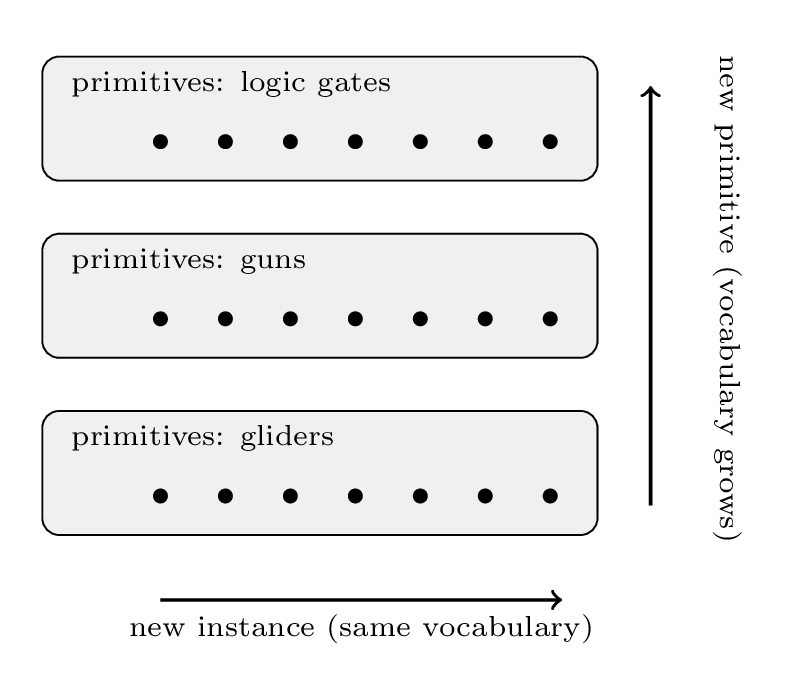
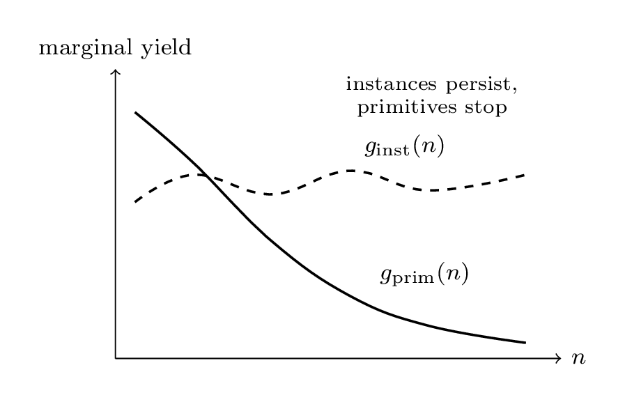
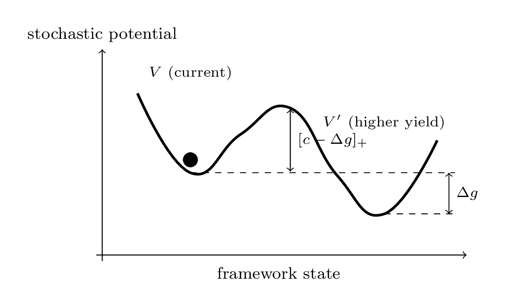
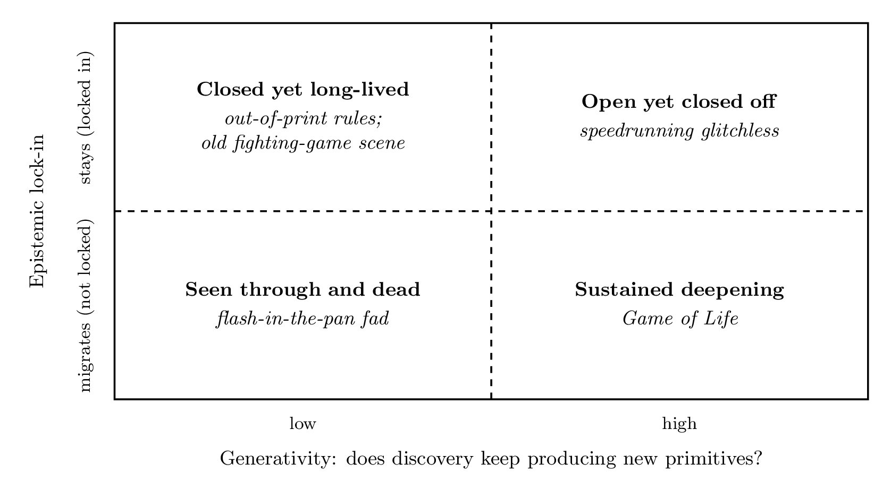

{}

*On two kinds of novelty: the kind that compounds and the kind that only piles up.*

> "The limits of my language mean the limits of my world." -- _Wittgenstein, Tractatus 5.6_

For a while it looked like progress.

For a week, an AI agent pipeline I ran kept shipping. A commit landed roughly every hour: small fixes, minor improvements, an activity graph that looked alive. But the product itself did not get any bigger [^goalless]. Nothing was broken and nothing was idle; the pipeline was busy, but only within the vocabulary it already had.

This is a common confusion. Conway's Game of Life has kept producing new patterns for half a century, and when a long-standing open question about its oscillators was settled in 2023, the community did not wind down; it celebrated for a week and turned its new tools on the next problems. Speedrunners deliberately ban whole classes of glitches and still find faster routes within the smaller rule book. *Super Smash Bros. Melee*, a fighting game whose code has not been officially patched since 2001, still has a thriving tournament scene. Most viral internet ideas, by contrast, burn out quickly and are dropped.

From the outside, all of these look like activity. The easy verdict is "the well has run dry," but that is usually too crude: the Game of Life community could be plateauing, the agent pipeline could still be growing, and the viral fad might come back in another form. What separates these cases does not show up in the usual activity metrics, but it can be named, and in principle measured.

So the question is: **what is the difference between a system that is producing and a system that is growing?** What separates motion from progress? A gut feeling is not a measure, so the difference deserves a name.

The distinction itself is not subtle; after the next two sections, most readers will find it obvious. Yet most of the systems we run, build, and reward are exactly the ones that blur it. So this essay is less about the distinction than about the structural reason we keep falling into it.

## More Is Not New

There are two kinds of novelty, and we routinely confuse them.

The first is **instance novelty**: an output not seen before, such as a new solution, a new feature, or a new generated artifact. The second is **primitive novelty**: a new reusable building block that enters the vocabulary and changes what becomes cheap to say or do next.

The trap is that a finite grammar can generate infinitely many sentences; linguists, after Humboldt, call it making "infinite use of finite means" [^chomsky]. A system can produce an unbounded stream of genuinely new instances without adding a single new primitive. It looks open-ended from the outside while its vocabulary has stopped growing: there is always something new to *say*, but nothing new to *say it with*.

Once you see the distinction, examples are everywhere. A pop-song generator can produce ten thousand chord progressions without introducing a new chord. A research subfield can publish for a decade, every paper different, while still running on the three theorems it started with. An organization can ship features for years on an architecture nobody is allowed to question. A solo creative practice can move between one-off experiments, each piece new and none of them making the next one easier. In each case the outputs are new but the vocabulary is frozen: the system is productive without becoming more generative.

_Fig 1: Instance novelty vs primitive novelty. Filling a level with more instances (horizontal) is not the same as promoting a new reusable primitive that opens a level (vertical). A finite grammar yields unboundedly many instances at fixed primitive height. The ladder is the Game of Life's classic one: gliders, guns that emit them, logic gates built from glider streams, and computers built from the gates._

Cellular automata give the cleanest example, and here the record is public. In 2023 the last two missing periods were found, and Conway's Game of Life was shown to have an oscillator of *every* period: it is "omniperiodic" [^omniperiodic]. The question, *is there a pattern that blinks with period N?*, had been open for as long as there are records of hobbyists discussing it, and the way it closed is the distinction in miniature.

Most periods were never settled one pattern at a time. In 1996 David Buckingham built a set of "Herschel conduits", pieces of track that carry a signal and can be joined into a closed loop of any length; with them, an oscillator of every period from 61 up can be assembled. Later Mike Playle's Snark, a small and fast glider reflector, brought that bound down to 43. Two constructions answered infinitely many questions. What they could not reach had to be found one period at a time, through new mechanisms and ever better computer searches. Of one common kind of search, the paper says each result "is a roll of the dice: there is no way of specifying in advance which period you would like to find". At the turn of the millennium twelve periods were still missing. The last two, 19 and 41, fell in 2023.

So the finish line was crossed by instances, but most of the distance was covered by primitives. And the primitives are what lasted. The paper ends by noting that the problem "has served as a rallying point for the Life community, leading to the creation of the many tools and programs" it describes, and then lists the questions still open, in one of which even period 7 is unresolved. One of the authors described the mood to *Quanta*: "Everyone's celebrating for a week — and then moving on to other things. There are so many other problems to solve" [^quanta]. The parts were reused at once: the first true period-41 glider gun was built the day after the first period-41 oscillator, and guns of other missing periods followed through 2024 and 2025, many of them from the same kinds of hasslers and reflectors [^lifewiki]. The oscillators were instances; the conduits, reflectors and search programs were primitives. The two run on different clocks, and confusing them is an easy way to misjudge whether a field, a community, or any other system is still alive.

None of this is a new distinction, and it is worth saying where it comes from. In 1969 the biologist C. H. Waddington wrote that it is "not sufficient to produce new mutations which merely insert new parameters into existing programmes; they must actually be able to rewrite the programmes" (quoted in [^taylor2019]). Artificial-life research has since made the idea formal. Banzhaf and colleagues separate *variation*, novelty inside a model, which "does not change the set of entities" and so leaves the space of possibilities as it was, from *innovation*, which adds a new type to the model, and *emergence*, which changes the terms the model itself is written in [^banzhaf]. They are stricter than this essay: variation, for them, is not open-ended at all, only "the 'normal' regime of any dynamical system". Taylor calls the same three tiers exploratory, expansive and transformational, in terms close to Margaret Boden's account of creativity [^taylor2019]. What follows adds something narrower: a test for when a new element counts as a primitive, a way to watch the two kinds of novelty separately over time, and an account of why the systems we build keep losing sight of the second.

## The Two Curves

The rest of the argument needs only one picture. Run an open-ended system over time and track two numbers.

$g_{\text{inst}}$ (instance yield): how surprising each new output is, given everything before it; in other words, how much genuinely new *stuff* is arriving. Surprise has to be of the kind that can be learned from: noise is maximally surprising and adds nothing, which is why open-endedness researchers ask for novelty that stays learnable [^openend].

$g_{\text{prim}}$ (primitive yield): how often a genuinely new reusable building block is promoted into the vocabulary.

_Fig 2: The two-curve criterion. Instance-level marginal complexity $g_{\text{inst}}$ stays bounded away from zero while primitive-level marginal yield $g_{\text{prim}}$ decays to zero: unboundedly many novel instances, yet generative closure._

What matters is not the level of either curve but their **divergence**. The failure that looks healthy from a distance goes like this: $g_{\text{inst}}$ stays high and new instances keep coming, while $g_{\text{prim}}$ decays toward zero and no new building blocks appear. The result is infinitely many instances with generative closure, and the activity metrics stay green exactly when the curve that matters has gone flat.

Schmidhuber's theory of curiosity draws a similar line from the observer's side. What makes data interesting, on his account, is not how compressible it is but how fast it is *becoming* more compressible: "compression progress", the first derivative. Pure noise and fully predictable data both score zero, because neither lets the observer find anything new to compress [^schmidhuber]. $g_{\text{prim}}$ is close to that progress term. Once a system stops finding regularities in its own history, its output can stay varied forever and still teach it nothing.

The same shape appears at very different scales. A research group that keeps publishing variations of the same trick has high $g_{\text{inst}}$ and near-zero $g_{\text{prim}}$: every paper is new, but the toolkit is frozen. A craft practice that moves from one one-off experiment to the next has the same signature: a new piece each week, none of them building much on the last. A late paradigm in science can look similar: work continues and anomalies are absorbed, but no new explanatory primitives enter the canon. In each case the first useful question is where new primitives could form, rather than how to produce more instances of the old ones.

The shape has also been measured on real data. Every US patent is tagged with technology codes, the patent office's vocabulary of capabilities. Following the record across the nineteenth and twentieth centuries, Youn and colleagues found that patents, codes and combinations of codes grew together until about 1870. After that, new codes came much more slowly, while patents and new combinations kept growing in step, at about six new combinations for every ten patents [^youn]. Invention did not stop; it changed kind, toward what the authors call "tinkering, gradual modification and refinements" on a vocabulary that grew only now and then. This is not a story of failure. Patents are still useful, and the authors argue that the occasional new code is "more than enough to sustain a combinatorial inventive search". But it is the two curves, drawn by an institution for well over a century. One detail anticipates the next section: when the office introduces a new code, it goes back and reclassifies older patents that turn out to have embodied the capability all along. A new primitive is recognized partly by what it lets you say about the past.

Open-endedness research has run into the same wall in its own systems. POET invents obstacle courses for simulated walkers and learns to cross them, and it tracks progress by counting new courses that are both created and solved. In the original version that count stopped rising after about 20,000 iterations, and the authors of the follow-up gave the reason plainly: the generator "can only sustain a finite number of obstacle types with predefined regular shapes and limited variations" [^epoet]. More courses, same obstacles. The fix, in Enhanced POET, was a richer way of encoding terrain, in effect a new vocabulary, and the researchers designed it; the system did not grow it.

One caution about reading the second curve. Even a vocabulary that grows forever grows more slowly as it gets bigger. In books, music listening, Wikipedia and social tagging, Tria and colleagues found the number of distinct words, songs, pages or tags rising more slowly than the volume of activity, so that the rate of new ones falls over time as a power of $t$, a pattern known as Heaps' law [^tria]. A falling $g_{\text{prim}}$ is therefore normal and, by itself, not a diagnosis. The question is what the total does. Under a power law it keeps growing without bound; under an exponential decay, the shape in Fig 2, it levels off at a ceiling. A slowing vocabulary and a closed one differ in the tail, and that is also what separates a mature system like the patent office from a finished one.

So the first practical step is simple: **watch both curves, not one.** Output volume and instance novelty are vanity metrics that can look great during a plateau. The number to watch is primitive yield, which behaves very differently. The artificial-life literature has suggested as much: Banzhaf and colleagues propose applying its counting measures to each kind of novelty separately, "to determine if the activity of the respective type is continuing" [^banzhaf].

## What Counts as a New Primitive

"Reusable building block" is still vague. Program synthesis offers a precise test, and it is the one formula in this essay worth remembering.

A candidate counts as a primitive only when **adding it to the library makes the total description of past work shorter.** Write the sum of two costs:

$$\text{cost}(\text{library}) \;+\; \text{cost}(\text{work, expressed in terms of the library})$$

An abstraction has a cost, because the library grows; it pays off only if the work written with it gets cheaper. The demanding part of this test is that it is *retrospective*. You cannot judge a new "abstraction" by its design, or by how clean it looks in code review. You have to apply it to old work and see the description get shorter. **If it does not compress past work, it probably will not compress future work either**, at least while future work resembles past work; I come back to that condition below. This is the working form of the distinction the rest of the essay builds on.

Library-learning systems do exactly this. Stitch states its objective in this form: an abstraction is worth the size of the corpus before, minus its size after being rewritten with the abstraction, minus the size of the abstraction itself [^stitch]. DreamCoder frames the same step as Bayesian inference, and its authors gloss the result as a preference for "libraries that best compress programs found during waking" [^dreamcoder]; because it refactors programs before comparing them, it can find an abstraction such as `map` that appears verbatim in none of them. Both build the library greedily: find the abstraction that compresses most, rewrite everything with it, and repeat until nothing more compresses. DreamCoder's authors also ran the obvious control: a variant that simply added whole past solutions to its library, keeping them without compressing them, solved fewer held-out tasks in every domain [^dreamcoder]. Keeping everything is not the same as learning. **Nothing here depends on intuition.** A reusable skill is one that lets past work be re-described more compactly, because it factors out a pattern that kept being derived again. That gives a concrete test of whether a system is accumulating capability or only output: is its library compressing its own history?

The test has known failure modes, and they are instructive. Compression can prefer the less general abstraction: in a case reported by DreamCoder's own authors, the most compressive way to draw polygons beats a slightly longer one that also takes the side length as a parameter, the one that intuitively generalizes better [^laps]. And compressive is not the same as usable. When the authors of LILO gave a language model the abstractions Stitch had found, which come out as anonymous functions with numbered names, the model solved fewer problems, by 31 percentage points in one domain. Once another step gave each abstraction a readable name and a short description, results improved in two of the three domains [^lilo]. A primitive nobody can call by name is not yet part of anyone's vocabulary. The test also has a convention built into it. "Shorter" depends on how each piece is priced, and systems price them differently: Stitch uses hand-set costs, DreamCoder a learned distribution. Theorists of minimum description length warn that the crude two-part form of the idea "is in danger of becoming arbitrary" for exactly this reason [^grunwald].

The deeper limit is in the word *past*. The test assumes that future work will look like past work. When the tasks themselves drift, people do something these algorithms do not: they choose abstractions for the work they expect next. Hernandez Cano and colleagues found this in a pattern-building experiment; people's choices were consistent with what the authors call prospective compression, and "cannot be captured by existing retrospective compression-based algorithms" [^prospective]. When the sequence of tasks was steady, the retrospective algorithm did about as well as an oracle. So the rule holds with a condition attached: past compression is good evidence while the world stays put, and weak evidence when it is changing, which is exactly when a new primitive matters most.

This also changes what a good open-ended structure is *for*, whether it is a research group, an artistic movement, a software organization, or an autonomous system. Completing tasks is not enough for generativity [^openend]. The system needs a persistent, shared library and an incentive to compress into it: some reason for someone, or something, to notice that the same pattern has appeared five times and should become a primitive. Without that, every cycle starts from the same vocabulary, and the primitive curve never rises.

Two very different literatures describe what such a library does. Primatologists distinguish chimpanzee traditions, which vary "within the species' existing cognitive repertoire", from human culture, which "accumulates modifications over time": improvements stay in the population "with relatively little loss or backward slippage until further changes ratchet things up again" [^tennie]. The ratchet is the library. And when Arthur and Polak simulated invention by wiring logic gates together at random, a circuit that met some need was kept "as a new component that can serve as a building block". Complex circuits appeared only by way of simpler ones: when one intermediate goal, the full adder, was left out, "not even a 2-bit adder was found in one million steps" [^arthurpolak]. A library grows through stepping stones, and something has to decide which ones are worth keeping.

## Why We Keep Forgetting This

So far this is mostly a definition, and an obvious one. Anyone with experience running systems already knows, in some form, that output is not capability. So why does the same pattern keep appearing, in product after product, agent system after agent system, lab after lab?

The reason is structural. Every running system has an accounting layer: a changelog, a velocity dashboard, an OKR sheet, an evaluation harness, a paper count. These track *output*; none of them tracks library compression. **The changelog records what the system did; the library records what it became.** The two never share a dashboard, because the second is hard to define and harder to reward, and people optimize what they can see being paid for.

None of this is news to economists. In 1975 Steven Kerr collected cases of what he called the folly of rewarding A while hoping for B, and named this one directly: "some parts of the task are highly visible while other parts are not", so that "publications are easier to demonstrate than teaching" [^kerr]. Holmström and Milgrom later worked out the mechanism. When an agent has several tasks and only some can be measured, pay for the measured ones draws attention away from the rest: "if volume of output is easy to measure but the quality is not, then a system of piece rates for output may lead agents to increase the volume of output at the expense of quality", or to neglect shared equipment. Their sharpest case is an asset whose value changes over time and cannot be measured. There the best contract gives "only muted incentives" for output, so that effort is not drawn away from maintaining the asset [^holmstrom]. A library is that kind of asset. Its value is how cheap it makes the next piece of work, and no quarterly count sees it change.

In practice, what gets rewarded is what gets measured. A pull request closes a ticket, and the closing is visible. An engineer who instead spends a week retiring three modules in favor of one cleaner primitive does about as much work and produces nothing the system can count as "shipped." Over enough quarters, the incentives wear the library down, and the system drifts, predictably, toward higher $g_{\text{inst}}$ and lower $g_{\text{prim}}$.

Engineers say so when asked. In a survey on refactoring at Microsoft, one respondent put it this way: "How do you measure the value of a bug that never existed, or the time saved on a later undetermined feature? ... it makes it difficult to justify to management." More than half of the responses said refactoring was driven by "immediate concrete, visible needs" rather than by long-term maintainability [^kim]. Lehman's second law of software evolution describes the result: as a program is changed, its complexity grows "unless work is done to maintain or reduce it" [^lehman]. A well-known paper on technical debt in machine-learning systems proposes a cultural remedy: teams that "reward deletion of features, reduction of complexity" as much as they reward gains in accuracy [^sculley].

Consider two systems. The first ships a feature every day, its dashboard is green, and its team gets praised. The second ships nothing for a month while its team rebuilds an internal representation that nobody outside will ever see. Six months later, the second is producing twice as many primitives per quarter as the first, and the first is heading toward exhaustion, yet most accounting layers show neither fact. Read honestly, the picture is the opposite of the obvious one.

The same pattern appears outside commerce. Research labs that count publications converge on instance work, and the fields they make up show it. Across 90 million papers in 241 subjects, Chu and Evans found that as a field publishes more each year, citations concentrate on papers that are already well cited, the list of most-cited papers stops changing, and new papers become unlikely ever to join it: "a deluge of papers does not lead to turnover of central ideas in a field, but rather to ossification of canon" [^chu]. Milojević, measuring how much conceptual ground physics covers by the variety of phrases in its paper titles, found that this ground grows far more slowly than the number of papers: physics is still expanding, "but at a rate that is slower than at any time in the last 50 years" [^milojevic]. A better-known result, that papers and patents are becoming less "disruptive" [^park], rests on a citation measure whose decline is still being argued over [^disruption].

AI agent benchmarks that score pass rates select for agents that solve more problems with the same vocabulary, not for agents that grow a vocabulary at all. Chollet made the general point years ago: "skill is merely the output of the process of intelligence", and with enough priors or training data an experimenter can "buy" arbitrary levels of it [^chollet]. Even systems built to grow a library can fool their own scoreboard. Two language-model systems that reported gains from learned libraries of functions turned out, on closer study, almost never to reuse those functions; the gains came mostly from self-correction and repeated sampling [^berlot]. Generative-AI products priced by the token are economically indifferent to whether the next token came from a compressed concept or a re-derivation. In each case the accounting layer cannot see the variable that matters, so the system optimizes a proxy.

So the problem is not that "more is not new" is a subtle insight that organizations fail to grasp. The insight is obvious, and almost everyone running these systems would agree with it at a whiteboard. The systems still produce the wrong answer because nobody has written the right one down where it affects what gets paid.

## The Second Trap: Lock-In

Now suppose the primitives *are* available: the current framing of the problem is exhausted, but a better one exists, such as a new representation, a new theoretical toolkit, or a new architecture that would reopen the primitive curve. Does the system move to it?

Usually not, or not for a long time. This failure differs from "nothing left to find": it is **lock-in**, where the system should move and cannot. Kuhn's account of scientific revolutions is largely a study of it, and he put it in the language of cost: "As in manufacture so in science—retooling is an extravagance to be reserved for the occasion that demands it" [^kuhn]. A field drops a paradigm only when another is ready to take its place; "to reject one paradigm without simultaneously substituting another is to reject science itself." Even then the move is slow. For one scientist, Kuhn compares it to a gestalt switch, all at once or not at all; for the community it is "an increasing shift in the distribution of professional allegiances", and Copernicanism "made few converts for almost a century after Copernicus' death". He quotes Planck on the bleakest version: a new truth wins "because its opponents eventually die, and a new generation grows up that is familiar with it." Economists have since tested Planck. When an eminent life scientist dies unexpectedly, papers in the field by outsiders rise markedly, draw on different literature, and are disproportionately likely to be highly cited; while the star was alive, outsiders appear reluctant to challenge the field's leadership [^azoulay].

The model below is my own reconstruction, not Kuhn's; he denied that paradigm choice is a comparison of problem-solving ability, calling it a decision that "can only be made on faith". But the reconstruction is useful. A member of a system switches frames when its gain from switching, $\Delta g$, exceeds its cost of switching, $c$, and stays whenever $c > \Delta g$. The catch is that both numbers depend on what everyone else does: moving alone costs the most and gains the least. Two kinds of lock-in follow, and economists have names for both.

**Pure convention.** The alternatives are about equally good, and the system is stuck with one for historical reasons because changing is not worth the cost. Which side of the road a country drives on is the clean case. Liebowitz and Margolis call this first-degree path dependence: a path "that cannot be left without some cost, but that path happens to be optimal (although not necessarily uniquely optimal)" [^liebowitz1995]. QWERTY is the famous case, and it has been told both ways. For years it was the textbook example of lock-in to an inferior layout, "standardization on the wrong system" [^david]. A closer look at the studies behind the Dvorak keyboard's reputation found "no scientifically acceptable evidence that Dvorak offers any real advantage over Qwerty" [^liebowitz1990]; the argument has not entirely ended. This kind of lock-in is often harmless.

**Coordination lock-in.** The new frame is genuinely better: summed over everyone, the gain exceeds the cost of relearning the shared vocabulary, rebuilding the tooling and agreeing on new standards. But no one gains by moving alone, because what the new frame is worth depends on others moving too. Farrell and Saloner call this "excess inertia". In its purest form everyone prefers the new technology "and yet they do not make the change", which "is purely a problem of coordination"; in another, everyone is a fence-sitter, "happy to jump on the bandwagon if it gets rolling but insufficiently keen to set it rolling themselves" [^farrell]. Arthur showed how such states arise: when returns increase with adoption, small early events give one option a lead that the dynamics do not forget, and the lead locks in whether or not the option was the better one [^arthur]. This is the expensive kind.

Astronomy is the classic case of lock-in in science, though not in the way it is usually told. The popular story has Ptolemaic astronomers stacking epicycles on epicycles until the system collapsed under its own weight. When Gingerich recomputed the thirteenth-century Alfonsine Tables, he found them "based on a pure Ptolemaic theory", with parameters "almost all identical to those originally adopted by Ptolemy", and called the embroidered system "a latter-day myth" [^gingerich]. The real history is more instructive. Copernicus's system used about as many circles as Ptolemy's and gave results "as accurate as Ptolemy's, but it did not give more accurate results" [^kuhncop]. On the measure everyone used, predicting where the planets would be, the better frame was not yet better. Its gain lay in coherence and in what it would make possible, and that is the hardest kind of gain to count when deciding whether to move. Laudan later turned this into a rule of method: judge a research tradition for acceptance by how much it has solved, but for pursuit by how fast it is progressing, since "it is always rational to pursue any research tradition which has a higher rate of progress than its rivals (even if the former has a lower problem-solving effectiveness)" [^laudan]. That is the primitive curve, used as a reason to move.

Mature engineering organizations can end up the same way when their process has no room for the leap, so that "pause delivery for three weeks and rethink the topology" is not a proposal the structure can accept [^wallfacer]. Hannan and Freeman argue that this is less a failure of management than a product of selection: organizations survive by being reliable and accountable, which requires structures that reproduce themselves faithfully, and such structures resist change [^hannan]. A frame does not question itself.

_Fig 3: Lock-in as a potential landscape. Even when a better framework $V'$ exists ($\Delta g > 0$), the collective stays in $V$ if the escape resistance $[c - \Delta g]_+$ exceeds the available perturbations: a metastable basin. Pure-convention lock-in is the special case $\Delta g \approx 0$._

Putting the two traps on perpendicular axes gives a fuller picture.

_Fig 4: Two axes generate four corners. **Generativity** (does discovery keep producing new primitives?) is the horizontal axis. **Epistemic lock-in** (when yield decays, does the collective stay?) is the vertical. Low-generativity, low-lock-in is the flash-in-the-pan fad: once people see through it, they leave. Low-generativity, high-lock-in is the long-lived culture on closed rules: a game whose code stopped changing decades ago and whose competitive scene is still going. High-generativity, high-lock-in is the open community deliberately bounding itself: speedrunning a still-rich game under "glitchless" rules. High-generativity, low-lock-in is sustained deepening: Game of Life fifty years on._

The corners are tendencies, not boxes, and the real cases are more interesting than the labels. *Super Mario Bros.* came out in 1985; its "glitchless" category bans five named glitches, and the record still fell in 2022 and again in 2024 [^smb]. *Melee*'s players have not only stayed with their game but taken over its upkeep: a fan-made fix to how the game reads controllers was adopted at major tournaments within weeks of its release in 2017, and it is now a required part of the community's own online build [^ucf]. That is lock-in so complete that the community maintains the frame itself.

Most writing about open-endedness looks at one axis at a time. With a stalled system, it helps to ask about both before settling on an answer. Even a genuinely generative system will plateau if it is tied to a representation whose primitive curve has flattened, and no amount of local cleverness will get it out. Migration is a different operation from optimization: it has a real cost, and someone, usually still a human, has to decide to pay it.

One more point applies to both traps. What we can measure is never a system's raw *capacity* for producing primitives, only how many primitives it *actually produced*, given where its attention went. Two systems with access to the same material can end up with very different libraries depending on how they allocate attention [^march]. March's own summary is bleak: adaptive processes, "by refining exploitation more rapidly than exploration, are likely to become effective in the short run but self-destructive in the long run." Levinthal and March later named the mechanism the competency trap: as an organization grows more competent at an activity, it does more of it, "thus further increasing competence and the opportunity cost of exploration" [^levinthal]. Lock-in is the special case where attention is fixed on a flat curve and the structure will not let it move.

## The Hard Part Is Not the Idea

The argument consists of a definition, a test, an explanation of why systems keep failing the test, and a separate trap that catches those that pass it. None of these pieces is difficult. What is difficult is that knowing the distinction does not get a system out of the trap, because the trap lives in the accounting layer, not in anyone's understanding.

The counting can be crude and still be useful, as long as it counts reuse rather than size, since a library can grow while almost nothing in it is used again [^berlot]. For a codebase: of the abstractions added this quarter, how many are now called from code their authors did not write? For a research group: which of this year's methods did anyone else, or the group itself a year later, pick up as a tool rather than cite as a result? For an agent: are new skills called by later skills, or only once, by the task that produced them? Voyager, an agent that writes its own library of skills for Minecraft, tended to plateau in its later stages when that library was taken away [^voyager]. Each of these is a reuse count. None of them is on a standard dashboard.

The working version of the test is short. A system's real state is not in its output but in its library: the changelog says what it did, and the library says what it became. Most measurement counts only the first. The few systems that grow have found some way to count the second as well; the rest stay busy.

{}

{}

*两种“新”：一种会复利，一种只会越堆越多。*

> 我语言的边界，就是我世界的边界。 -- _维特根斯坦《逻辑哲学论》5.6_

有一段时间，它看上去一直在进步。

我跑的一条 AI Agent 流水线，连续一周都在交付：差不多每小时一个 commit，修修小问题，做点小改进，提交记录看上去生机勃勃。可产品本身一点也没有变大[^goalless]。它没出故障，也没闲着，只是一直在用自己已经会的那些东西打转。

这种错觉并不少见。Conway 的生命游戏（Game of Life）五十年来一直有新图样被发现；2023 年，一个关于振子、悬了很久的问题终于解决，社区并没有就此冷下来：大家庆祝了一个星期，就带着新工具去啃下一个问题了。速通（speedrun）玩家会主动禁掉一整类 glitch，在更小的规则里照样跑出更快的路线。格斗游戏《任天堂明星大乱斗 DX》（*Super Smash Bros. Melee*）的代码自 2001 年起就没再被官方修补过，比赛却一直办到今天。相比之下，互联网上大多数爆火的点子，很快就被玩尽，然后再没人提起。

从外面看，这些都叫“活跃”。最容易下的结论是“井已经干了”，但这往往太粗糙：生命游戏的社区可能正在触顶，那条 Agent 流水线也可能还在成长，一时的爆款也许会换个样子卷土重来。真正把它们区分开的东西，在常见的活跃度指标里看不到，但它说得清楚，原则上也测得出来。

所以问题是：**一个在产出的系统，和一个在成长的系统，差别到底在哪？** 忙碌和进步之间，差的是什么？光凭感觉不行，得给这个差别起个名字。

这个区分本身并不深奥，读完下面两节，多数人都会觉得理所当然。可我们实际运行、搭建和奖励的系统，往往正是把它抹平的那些。所以这篇文章想谈的，与其说是这个区分，不如说是：为什么明明懂，我们还是一再掉进去。

## 多不等于新

“新”有两种，而我们经常把它们混为一谈。

第一种是**实例层面的新**：以前没出现过的产出，比如一个新的解法、一个新功能、一件新生成的作品。第二种是**原语层面的新**：一块新的、可以反复使用的基本构件。它一旦进入词汇表，接下来什么事情容易说、容易做，就跟着变了。

麻烦在于，有限的语法可以生成无穷多的句子，语言学家借洪堡特的话，管这叫“对有限手段的无限运用”[^chomsky]。一个系统可以源源不断地产出货真价实的新实例，却一个新原语也没有增加。从外面看它好像没有边界，其实词汇早就不再增长：总有新的话可说，却没有新的词可用。

看清这一点之后，例子随处可见。一个流行歌曲生成器可以写出一万种和弦进行，却不发明一个新和弦。一个研究方向可以连续十年发论文，篇篇不同，用的却始终是起步时那三个定理。一家公司可以在一套没人敢碰的架构上连着几年交付新功能。一个人的创作也可以在一次次互不相干的实验之间打转，每件作品都是新的，却没有哪一件让下一件更容易。产出确实是新的，词汇却没动：这样的系统很能产出，却没有变得更能生成。

_图 1：实例层面的新与原语层面的新。在同一层里多放几个实例（横向），和提炼出一块能打开新一层的可复用原语（纵向），是两回事。有限的语法可以在原语高度不变的情况下，产出无穷多的实例。图中的梯子是生命游戏的经典例子：滑翔机，发射滑翔机的枪，用滑翔机流搭成的逻辑门，再用逻辑门搭成的计算机。_

元胞自动机提供了最干净的例子，而且这段历史有据可查。2023 年，最后两个缺失的周期被找到，生命游戏被证明存在**任意**周期的振子，也就是说它是“全周期的”（omniperiodic）[^omniperiodic]。*有没有以周期 N 闪烁的图样？* 从能查到的爱好者讨论记录开始，这个问题就一直悬着；而它最后是怎么解决的，正好是上面这个区分的缩影。

大多数周期，从来不是一个图样一个图样找出来的。1996 年，David Buckingham 造出了一组“Herschel 导管”（Herschel conduit）：一段段能传递信号的轨道，可以首尾相接，围成任意长的环。有了它们，61 以上的每一个周期都能拼出振子。后来 Mike Playle 发现了 Snark，一种又小又快的滑翔机反射器，把这个下限压到了 43。两种构造，回答了无穷多个问题。构造够不着的周期，就只能一个一个地找：靠新的机制，也靠越来越聪明的计算机搜索。论文说，其中一类常用的搜索，每出一个结果都“是一次掷骰子：没法事先指定你想找哪个周期”。到世纪之交，还剩十二个周期没有着落；最后两个，19 和 41，直到 2023 年才被攻下。

所以，冲过终点线的是实例，大半段路却是原语走完的，最后留下来的也是原语。论文结尾说，这个问题“一直是生命游戏社区的集结点”，催生了文中介绍的许多工具和程序；随后又列出几个仍未解决的问题，其中一个连周期 7 都还没有答案。论文作者之一这样向《Quanta》杂志形容当时的气氛：“大家庆祝了一个星期，然后就去忙别的了。要解决的问题还多着呢。”[^quanta] 那些零件马上就被拿去复用了：第一个周期 41 的振子出现的第二天，就有人造出了第一支真周期为 41 的滑翔机枪；2024 年和 2025 年，其他缺失周期的枪陆续问世，其中不少用的正是同一类扰动器（hassler）和反射器[^lifewiki]。振子是实例；导管、反射器和搜索程序是原语。两者走的是两套时钟，把它们搞混，就很容易看错一个领域、一个社区，或者任何一个系统，到底还有没有生命力。

这个区分并不新，值得交代一下它的来路。1969 年，生物学家 C. H. Waddington 写道，光有“只是往现有程序里塞进新参数”的突变是不够的，“它们必须真能改写程序”（转引自 [^taylor2019]）。后来，人工生命领域把这个想法形式化了。Banzhaf 等人区分了三种新[^banzhaf]：*变异*（variation）是模型之内的新，它“不改变实体的集合”，可能性的空间也就原封不动；*创新*（innovation）往模型里添了一种新的类型；*涌现*（emergence）则连写模型所用的那套语言都改了。他们比这篇文章更严格：在他们看来，变异根本算不上开放，只是“任何动力系统的‘正常’状态”。Taylor 把这三层叫作探索性的、扩展性的和变革性的，用词和 Margaret Boden 对创造力的划分很接近[^taylor2019]。下面要补上的东西窄一些：一个判断新元素何时算原语的检验，一种把两种新分开、随时间观察的办法，以及一个解释，说明我们搭建的系统为什么总会看丢第二种。

## 两条曲线

后面的论证只需要一张图。让一个开放式系统跑上一段时间，记录两个数。

$g_{\text{inst}}$（实例产率）：在此前一切的基础上，每个新产出有多出人意料，也就是真正新的**东西**来得有多快。这种意外得是能从中学到东西的那种：噪声最出人意料，却什么也带不来，所以研究开放性的人要求新颖性同时还得可学[^openend]。

$g_{\text{prim}}$（原语产率）：真正新的可复用构件被收进词汇表的频率。

_图 2：两条曲线的判据。实例层的边际复杂度 $g_{\text{inst}}$ 一直明显高于零，原语层的边际产率 $g_{\text{prim}}$ 却衰减到了零：新实例无穷无尽，生成能力却已经封闭。_

要看的不是哪条曲线有多高，而是两条曲线之间的**分叉**。远看最像健康状态的那种失败，是这样的：$g_{\text{inst}}$ 一直很高，新实例不断涌出；$g_{\text{prim}}$ 却一路掉向零，再也没有新的构件出现。结果是实例无穷多，生成能力却封闭了；而偏偏在要紧的那条曲线走平的时候，各种活跃度指标还是一片绿色。

Schmidhuber 关于好奇心的理论，从观察者这一侧划了一条类似的线。在他看来，让数据有意思的，不是它有多好压缩，而是它变得好压缩的速度有多快，也就是“压缩进展”，一阶导数。纯噪声和完全可预测的数据得分都是零，因为两者都不会让观察者找到新的东西可压[^schmidhuber]。$g_{\text{prim}}$ 跟这个进展项很接近。一个系统一旦不再从自己的历史里找到新的规律，它的产出尽可以永远花样百出，却再也教不会它什么。

同样的形状会在很不同的尺度上出现。一个研究组反复发表同一个套路的变体，就是 $g_{\text{inst}}$ 高、$g_{\text{prim}}$ 接近零：每篇论文都是新的，工具箱却冻住了。一种手艺如果只是从一次性实验跳到下一次，也是同样的特征：每周都有新作品，却很少有哪件建立在上一件之上。一门科学走到范式晚期，看上去也差不多：研究照常进行，反常现象被逐个消化，但再没有新的解释性原语写进教科书。这些情况下，第一个有用的问题都是：新原语可能从哪里长出来？而不是：怎样用旧原语再多造一些实例。

这个形状也在真实数据里被测到过。美国的每一项专利都标有技术分类代码，这套代码就是专利局描述“能做什么”的词汇表。Youn 等人顺着十九、二十世纪的专利记录看下来，发现直到 1870 年前后，专利、代码和代码组合三者都一起增长；此后新代码来得慢多了，专利和新组合却继续同步增长，大约每十项专利带来六个新组合[^youn]。发明没有停，只是换了性质，成了作者所说的“修修补补、逐步改进、精益求精”，词汇表则只是偶尔添一个新词。这不是一个失败的故事：专利照样有用，作者也认为，偶尔出现的新代码“足以支撑一场组合式的发明搜索”。但这正是那两条曲线，由一个机构亲手画了一百多年。还有一个细节，正好引出下一节：专利局每引入一个新代码，都要回头把那些其实早就用到了这项能力的旧专利重新归类。一个新原语算不算数，部分要看它能让你怎样重新讲述过去。

开放性研究在自己的系统里也撞上了同一堵墙。POET 会给模拟的步行者生成障碍赛道，再学着走过去；它衡量进展的办法，是数有多少条新赛道既被生成出来、又被走通了。在最初的版本里，这个数在大约两万次迭代之后就不再上升。后续论文的作者说得很直白：生成器“只能维持有限几种障碍类型，形状规则、事先定好，变化也有限”[^epoet]。赛道多了，障碍还是那几种。Enhanced POET 的办法是换一种更丰富的地形编码，相当于换了一套新词汇；而这套词汇是研究者设计的，不是系统自己长出来的。

读第二条曲线时要留个心眼。哪怕一个词汇表会永远增长下去，它也是越大长得越慢。Tria 等人在书籍、音乐收听记录、维基百科和社交标签里都发现，不同的词、歌曲、页面或标签的数量，增长得比活动总量慢，于是新元素出现的速率会随时间按 $t$ 的幂次下降，这个规律叫 Heaps 定律[^tria]。所以 $g_{\text{prim}}$ 往下走是常态，单凭这一点下不了诊断。要看的是总量怎么走：按幂律衰减，总量会一直涨下去，没有上限；按指数衰减，也就是图 2 里的形状，总量会停在一个天花板上。一个放慢的词汇表和一个封闭的词汇表，差别在尾巴上；专利局这样成熟的系统和一个已经到头的系统，差别也在这里。

所以第一步其实很简单：**两条曲线都要看，别只看一条。** 产出量和实例新度都是虚荣指标，系统触顶的时候，它们照样可以很好看。真正该看的是原语产率，它的走势完全是另一回事。人工生命领域也提过类似的建议：Banzhaf 等人主张把这个领域的计数方法分别用在每一种新上，“以判断每一类活动是否还在继续”[^banzhaf]。

## 什么才算新原语

“可复用的构件”这个说法还是太虚。程序合成（program synthesis）里有一个精确的判据，也是这篇文章里唯一值得记住的公式。

一个候选构件只有满足下面这个条件，才算原语：**把它加进库里之后，对过去工作的总描述变短了。** 也就是把两份代价加起来：

$$\text{cost}(\text{library}) \;+\; \text{cost}(\text{work, expressed in terms of the library})$$

加入一个抽象是有代价的，库会变大；只有用它写出来的东西都变便宜了，才划得来。这个判据难就难在它是*往回看*的：一个新“抽象”好不好，不能看它设计得多漂亮，也不能看它在 code review 里多干净，而要拿它去重写过去的工作，看描述是不是真的短了。**连过去都压缩不了的抽象，多半也压缩不了将来**，前提是将来的工作跟过去差不多；这个前提下文还会谈到。整篇文章的论证，都建立在这个判据上。

库学习系统做的正是这件事。Stitch 直接把目标写成了这个形式：一个抽象的价值，等于语料原来的大小，减去用它改写之后的大小，再减去抽象本身的大小[^stitch]。DreamCoder 把同一步表述成贝叶斯推断，作者给出的直观解释是：偏好那些“最能压缩清醒阶段所找到的程序”的库[^dreamcoder]。由于它在比较之前会先把程序重构一遍，它能找到像 `map` 这样、在哪个程序里都没有原样出现过的抽象。两者都是贪心地建库：找出压缩得最多的那个抽象，用它把所有东西改写一遍，如此反复，直到再也压不动。DreamCoder 的作者还做了一个最直接的对照：让一个变体把过去的解法原封不动地整个加进库里，只存不压，结果在每一个领域里，它解出的新任务都比会压缩的版本少[^dreamcoder]。什么都留着，不等于学到了东西。**这里不需要凭感觉。** 所谓可复用的技能，就是能让过去的工作被更简洁地重新描述的技能，因为它把一个被反复推导的模式提了出来。这就给出了一个具体的检验，能判断一个系统积累的是能力，还是只是产出：它的库，有没有在压缩它自己的历史？

这个检验也有已知的失灵之处，而且很能说明问题。压缩可能偏向不那么通用的抽象：DreamCoder 的作者们自己就报告过一个例子，画多边形时，压缩得最多的抽象，胜过了一个稍长一点、把边长也当作参数的抽象，而直觉上后者才更通用[^laps]。能压缩也不等于好用。LILO 的作者把 Stitch 找到的抽象交给一个语言模型去用，这些抽象出来时都是匿名函数，名字只是个编号，结果模型解出的题反而少了，在一个领域里少了 31 个百分点。等到再加一步，给每个抽象起一个看得懂的名字、配一段简短说明，三个领域里有两个的成绩上去了[^lilo]。一个没人叫得出名字的原语，还算不上进了谁的词汇表。这个检验里还藏着一个约定。“更短”取决于每一块怎么计价，而不同系统的计价方式不同：Stitch 用的是人为设定的成本，DreamCoder 用的是学出来的概率分布。研究最小描述长度的理论家也提醒过，正因为如此，这个想法粗糙的两段式版本“有变得随意的危险”[^grunwald]。

更根本的限制，在“过去”两个字上。这个检验默认将来的工作会像过去一样。当任务本身在漂移时，人会做一件这些算法不做的事：照着自己预期接下来要做的工作去挑抽象。Hernandez Cano 等人在一个拼图案的实验里发现了这一点：人的选择符合他们所说的“前瞻式压缩”，而且“无法被现有的回溯式压缩算法刻画”[^prospective]。任务序列保持平稳时，回溯式算法的表现几乎追平了事先知道答案的理想基准。所以这条规则得带着条件用：世界不变时，过去的压缩是好证据；世界在变时，它只是弱证据，而那恰恰是新原语最要紧的时候。

这也改变了我们对一个好的开放式结构的期待，不管它是一个研究组、一场艺术运动、一个软件团队，还是一个自主系统。要有生成能力[^openend]，光把任务完成是不够的。系统需要一个长期存在、大家共享的库，还需要往里面压缩的动力：得有某种理由，让某个人或某个机制注意到，同一个模式已经出现了五次，该把它提炼成原语了。没有这一点，每一轮都从同一套词汇开始，原语曲线就永远起不来。

两个相隔很远的领域，描述过这样一个库的作用。灵长类学家区分黑猩猩的传统和人类的文化：前者的种种差异，“都在这个物种已有的认知能力范围之内”；后者则“随时间不断积累改进”，改进会留在群体里，“很少丢失或倒退，直到新的变化把它再往上推一格”[^tennie]。这个棘轮，就是库。Arthur 和 Polak 则用随机连接逻辑门的办法来模拟发明：一个满足了某种需求的电路会被留下来，“成为一个新组件，可以充当进一步组合的构件”。复杂的电路只能经由简单的电路一步步出现：去掉其中一个中间目标，也就是全加器，“一百万步之内连一个两位加法器都没找到”[^arthurpolak]。库是靠一块块垫脚石长起来的，而总得有什么来决定，哪些石头值得留下。

## 为什么明白了还会一再犯

到这里，基本上只是一个定义，而且是个很显然的定义。有经验的人多少都明白，产出不等于能力。那为什么同样的模式，还会在一个又一个产品、一个又一个 Agent 系统、一个又一个实验室里反复出现？

原因在结构上。任何在运转的系统都有一套记账方式：changelog、效率看板、OKR 表、评测管线、论文数量。这些记下来的都是*产出*，没有哪一项在记库有没有被压缩。**changelog 记下的是系统做了什么，库记下的是它变成了什么。** 这两样东西从来不在同一块看板上：后者难以定义，更难以奖励，而人总是去优化那些看得见、能拿到回报的东西。

经济学家对此并不陌生。1975 年，Steven Kerr 搜罗了一批他称为“奖励 A、却指望 B”的荒唐事，其中就直接点出了这一种：“任务的某些部分非常显眼，另一些部分则不然”，所以“发表论文比教好书更容易拿出来证明”[^kerr]。后来，Holmström 和 Milgrom 把其中的机制讲清楚了：一个人同时担着几项任务，而只有其中几项能被度量时，为能度量的那几项付酬，就会把注意力从其余几项上拉走。“如果产出的数量容易度量、质量却不容易，按件计酬就可能让人以牺牲质量为代价去提高产量”，或者疏于照看共用的设备。他们最鲜明的例子，是一项价值随时间变化、却无法度量的资产：这时最优的合同，只会对产出给予“温和的激励”，免得精力被从维护资产上挪走[^holmstrom]。库就是这样一种资产。它的价值在于让下一件工作变得多便宜，而没有哪一次季度统计看得出它的变化。

被奖励的，就是被度量的。一个 pull request 关掉一个工单，这件事人人看得见。另一位工程师花一周时间，把三个模块收拢成一个更干净的原语，工作量差不多，却拿不出任何能算作“已交付”的东西。一个季度接一个季度下来，激励机制会把库慢慢磨掉，系统也就可想而知地滑向高 $g_{\text{inst}}$、低 $g_{\text{prim}}$。

去问工程师，他们也这么说。微软做过一次关于重构的调查，一位受访者是这样讲的：“一个从没出现过的 bug 值多少？一个以后才做、现在还说不准的功能，省下的时间又值多少？……这让你很难跟管理层交代。”超过一半的回答说，重构是被“眼前具体、看得见的需要”推着走的，而不是为了长远的可维护性[^kim]。Lehman 的软件演化第二定律说的就是后果：程序在不断的修改中会越来越复杂，“除非花功夫去维持或降低它”[^lehman]。一篇讨论机器学习系统技术债的知名论文，开出的药方是文化上的：团队要像奖励准确率的提升那样，去“奖励删掉功能、降低复杂度”[^sculley]。

想象两个系统。第一个每天交付一个新功能，看板一片绿，团队屡受表扬。第二个整整一个月什么也没交付，团队在重建一套外人永远看不到的内部表示。半年后，第二个系统每季度产出的原语是第一个的两倍，第一个则正在走向枯竭，可大多数记账方式对这两件事都毫无反应。认真看，结论和直觉正好相反。

商业之外也是一样。以发表数量为指标的实验室，会越来越偏向实例型的工作，由这些实验室组成的学科也看得出来。Chu 和 Evans 分析了 241 个学科的九千万篇论文，发现一个领域每年发表得越多，引用就越往那些早已被大量引用的论文上集中，最高被引的名单不再变动，新论文也越来越难挤进去：“论文的洪流并没有带来核心思想的更替，反而让经典固化了”[^chu]。Milojević 用论文标题里短语的丰富程度来衡量物理学覆盖的概念范围，发现这个范围的增长远远慢于论文数量：物理学还在扩张，“但速度比过去五十年里任何时候都慢”[^milojevic]。另一个更出名的结论，说论文和专利正变得越来越缺乏“颠覆性”[^park]，依据的是一种基于引用的指标，而这个指标的下降有多少是真的，至今还在争论[^disruption]。

以通过率打分的 AI Agent 基准，选出来的是用同一套词汇解更多题的 Agent，而不是能长出新词汇的 Agent。Chollet 几年前就讲过这个道理：“技能只是智能这个过程的产物”，只要先验知识或训练数据给得够多，实验者可以“买到”任意水平的技能[^chollet]。就连专门为了长出库而设计的系统，也会骗过自己的记分牌。有两个基于语言模型的系统，报告说学到的函数库带来了提升；后来有人仔细一查，发现这些函数几乎从来没被复用过，提升主要来自自我纠错和多次采样[^berlot]。按 token 计价的生成式 AI 产品，在经济上根本不关心下一个 token 是来自一个压缩过的概念，还是又推导了一遍。每一种情况下，记账方式都看不见真正要紧的那个变量，系统只能去优化一个替代指标。

所以问题不在于“多不等于新”是什么深刻的洞见，组织领会不了。道理再明白不过，几乎每个运营这些系统的人站在白板前都会同意。系统之所以还是给出错误的答案，是因为没有人把正确的答案写进决定报酬的地方。

## 第二个陷阱：锁定

再假设原语**是有的**：当前理解问题的方式已经被用尽了，但存在一个更好的方式，比如一种新的表示、一套新的理论工具，或一种新的架构，能让原语曲线重新抬头。系统会换过去吗？

通常不会，至少很久都不会。这和“已经没什么可找的了”是两种不同的失败，它叫**锁定**（lock-in）：系统该动，却动不了。库恩对科学革命的描述，很大程度上就是在研究这件事，而且他用的正是成本的语言：“科学和制造业一样，更换工具是一种奢侈，要留到非换不可的时候。”[^kuhn] 一个领域只有在另一个范式准备好接班时，才会放弃旧的范式；“拒斥一个范式而不同时拿另一个来替代，就是拒斥科学本身”。即便如此，转变也很慢。对单个科学家，库恩把它比作格式塔转换，要么一下子全变，要么根本不变；对整个共同体，则是“专业忠诚的分布一点点移动”，哥白尼学说“在哥白尼死后将近一个世纪里都没赢得多少信徒”。他还引了普朗克最悲观的说法：新的科学真理之所以胜利，是“因为它的反对者终于死去，而熟悉它的新一代成长了起来”。后来经济学家真去检验了普朗克的说法：一位杰出的生命科学家意外去世之后，这个领域里圈外人的论文明显多了起来，引用的是另一批文献，也更可能成为高被引论文；而这位明星在世时，圈外人似乎不太愿意挑战领域里的权威[^azoulay]。

下面这个模型是我自己的重构，不是库恩的；库恩明确否认范式选择是在比较解题能力，说那是一个“只能凭信念做出”的决定。但这个重构有用。系统里的一个成员，只有当切换带来的收益 $\Delta g$ 超过切换成本 $c$ 时才会切换；只要 $c > \Delta g$，它就留在原地。麻烦在于，这两个数都取决于别人怎么做：一个人单独行动，成本最高，收益最低。由此分出两种锁定，经济学家对两者都有专门的名字。

**纯粹的惯例。** 几个选项差不多好，系统出于历史原因停在其中一个上，换了也不值得。一个国家靠左还是靠右行车，就是最干净的例子。Liebowitz 和 Margolis 管这叫一级路径依赖：这条路“离开它要付出一些代价，但它恰好是最优的（尽管未必是唯一最优的）”[^liebowitz1995]。QWERTY 键盘是最有名的例子，而它有两种讲法。很多年里，它都是“锁定在劣等布局上”的教科书案例，是“在错误的系统上完成了标准化”[^david]。后来有人仔细检查了 Dvorak 键盘名声背后的那些研究，结论是“没有任何科学上站得住的证据表明 Dvorak 比 Qwerty 有真正的优势”[^liebowitz1990]；这场争论至今也没有完全平息。这种锁定通常无害。

**协调性锁定。** 新框架确实更好：把所有人加在一起算，收益超过了重新学习共同词汇、重建工具、重新约定标准的成本。但谁也不会因为单独迁移而得利，因为新框架值多少，取决于别人是不是也迁过去。Farrell 和 Saloner 把这叫作“过度惯性”。最纯粹的情形是，人人都更想要新技术，“却都没有换”，这“纯粹是一个协调问题”；另一种情形是，人人都在观望，“车一旦开起来就乐意跳上去，却没人热心去推它启动”[^farrell]。Arthur 说明了这种状态是怎么形成的：当回报随采用者增多而递增时，早期的一些小事件会让某个选项领先，这种领先不会被系统的动态抹平，最后锁定下来，不管它是不是更好的那个[^arthur]。代价高的是这一种。

天文学是科学史上锁定的经典例子，只是真实情形和通常的讲法不一样。流行的说法是，托勒密体系的天文学家在本轮上叠本轮，直到整个体系不堪重负、轰然倒塌。Gingerich 重新计算了十三世纪的《阿方索星表》，发现它“基于纯粹的托勒密理论”，参数“几乎都和托勒密当初采用的一模一样”，并说那个层层叠加的体系是“后人编出来的神话”[^gingerich]。真实的历史更有启发。哥白尼体系用到的圆和托勒密的差不多一样多，结果“和托勒密的一样准，但并不更准”[^kuhncop]。在所有人都在用的那把尺子上，也就是预测行星的位置，更好的框架那时还算不上更好。它的收益在于体系的自洽，在于它日后会打开的可能，而这恰恰是决定要不要迁移时最难算进去的那种收益。后来 Laudan 把这一点定成了一条方法论原则：决定是否*接受*一个研究传统，要看它已经解决了多少问题；决定是否*追随*它，则要看它进展得有多快，因为“追随一个进展速度高于对手的研究传统，永远是理性的（即便它解决问题的总体能力更低）”[^laudan]。这就是原语曲线，被当成了迁移的理由。

成熟的工程组织也会走到这一步：当流程里容不下这种跳跃时，“暂停交付三周，重新想想整体结构”就成了这个结构接受不了的提议[^wallfacer]。Hannan 和 Freeman 认为，这与其说是管理的失败，不如说是选择的结果：组织要靠可靠、可问责才活得下来，这要求结构能忠实地自我复制，而这样的结构天然抗拒改变[^hannan]。框架不会自己质疑自己。

_图 3：把锁定看成一个势能地形。即使存在更好的框架 $V'$（$\Delta g > 0$），只要逃逸阻力 $[c - \Delta g]_+$ 大于系统能得到的扰动，集体就会停在 $V$ 里：这是一个亚稳态的洼地。纯惯例的锁定，是 $\Delta g \approx 0$ 时的特例。_

把两个陷阱放到两条互相垂直的轴上，图景会更完整。

_图 4：两条轴划出四个角。横轴是**生成性**（探索是否还在不断产出新原语？），纵轴是**认知锁定**（产率衰减之后，集体会不会留下来？）。低生成性、低锁定，是昙花一现的爆款：一旦被看穿，人就走了。低生成性、高锁定，是建立在封闭规则上的长寿文化：一款代码几十年前就不再变动的游戏，竞技圈却一直延续到今天。高生成性、高锁定，是一个开放的社区主动给自己设限：在内容依然丰富的游戏里按“无 glitch”规则速通。高生成性、低锁定，是持续深入：五十年后的生命游戏。_

这四个角是倾向，不是格子，真实的例子比标签有意思得多。《超级马力欧兄弟》是 1985 年的游戏，它的“无 glitch”速通类别明令禁止五种 glitch，纪录却在 2022 年和 2024 年又被刷新了[^smb]。*Melee* 的玩家不仅守着自己的游戏，还接手了它的维护：2017 年，玩家自制的一个补丁修正了游戏读取手柄的方式，发布后几周内就被各大赛事采用，如今已是社区自建联机版本的必装组件[^ucf]。锁定到了这个地步，社区连框架本身都自己维护起来了。

关于“开放性”的讨论，大多一次只看一条轴。面对一个停滞的系统，最好两条轴都问一遍，再下结论。即使是一个真正有生成能力的系统，如果被绑在一种原语曲线已经走平的表示上，也会触顶，局部再怎么聪明也出不来。迁移和优化是两种不同的操作：迁移有实实在在的代价，而且通常得有人，多半仍然是人，下决心去付这笔代价。

对这两个陷阱，还要补充一点。我们能测到的，从来不是一个系统产生原语的原始*能力*，而只是在注意力实际投向的地方，它*实际*产出了多少原语。两个面对同样材料的系统，会因为注意力分配不同，长出截然不同的库[^march]。March 自己的总结很悲观：适应过程“对利用的改进快于对探索的改进”，所以“很可能短期有效，长期却是自我毁灭的”。后来 Levinthal 和 March 给这个机制起了名字，叫“能力陷阱”：一个组织对某件事越熟练，就越常做它，“从而进一步提高熟练度，也进一步抬高了探索的机会成本”[^levinthal]。锁定是其中的特例：注意力被钉在一条已经走平的曲线上，而结构不允许它移开。

## 难的不在道理

整个论证包括一个定义，一个检验，一个解释，说明系统为什么一再通不过这个检验，以及另一个陷阱，专门困住那些通过了检验的系统。这些都不难。难的是，懂得这个区分并不能把系统从陷阱里救出来，因为陷阱不在任何人的理解里，而在系统的记账方式里。

计数可以很粗糙，照样有用，只要数的是复用而不是规模；毕竟一个库可以越来越大，里面的东西却几乎没人再用[^berlot]。对一个代码库来说：这个季度新加的抽象里，有多少如今被别人写的代码调用着？对一个研究组来说：今年的方法里，哪些被别人，或者一年后的自己，拿去当工具用了，而不只是当作结果引用一下？对一个 Agent 来说：新学会的技能，是被后来的技能调用，还是只被催生它的那个任务用过一次？Voyager 是一个在 Minecraft 里自己编写技能库的 Agent，把技能库拿掉之后，它到后期往往就停滞不前[^voyager]。这些都是复用计数，没有一个出现在常见的看板上。

真要用起来，判据只有一句话：一个系统的真实状态，不在它的产出里，而在它的库里。changelog 记下它做了什么，库记下它变成了什么。大多数度量只记前者；少数还在成长的系统，找到了办法把后者也记下来。其余的，只是在忙。

{}

## References

[^goalless]: Changkun Ou. (2026). [AI Agents (or Humans) in Goal-Directed and Goalless Environments](/posts/goalless-agents). The prior essay this one extends.
[^wallfacer]: Changkun Ou. (2026). Wallfacer: Autonomous Engineering Pipeline that Orchestrates AI Agent Teams. [github.com/changkun/wallfacer](https://github.com/changkun/wallfacer)
[^march]: March, J. G. (1991). [Exploration and exploitation in organizational learning](https://doi.org/10.1287/orsc.2.1.71). *Organization Science*, 2(1), 71–87.
[^dreamcoder]: Ellis, K., Wong, L., Nye, M., Sablé-Meyer, M., Cary, L., Anaya Pozo, L., Hewitt, L., Solar-Lezama, A., & Tenenbaum, J. B. (2023). [DreamCoder: growing generalizable, interpretable knowledge with wake–sleep Bayesian program learning](https://doi.org/10.1098/rsta.2022.0050). *Philosophical Transactions of the Royal Society A*, 381(2251), 20220050. [arXiv:2006.08381](https://arxiv.org/abs/2006.08381)
[^stitch]: Bowers, M., Olausson, T. X., Wong, L., Grand, G., Tenenbaum, J. B., Ellis, K., & Solar-Lezama, A. (2023). [Top-down synthesis for library learning](https://doi.org/10.1145/3571234). *Proc. ACM Program. Lang.*, 7(POPL), Article 41. [arXiv:2211.16605](https://arxiv.org/abs/2211.16605)
[^prospective]: Hernandez Cano, L., Zareski, I., El Amouri, L., Zhao, P., Mascini, M., Sansone, E., Pu, Y., Zhao, B., & Kryven, M. (2026). Prospective compression in human abstraction learning. [arXiv:2605.09985](https://arxiv.org/abs/2605.09985). On library learning when the task distribution is non-stationary, the case that matters most for agents.
[^openend]: Hughes, E., Dennis, M., Parker-Holder, J., Behbahani, F., Mavalankar, A., Shi, Y., Schaul, T., & Rocktäschel, T. (2024). [Position: Open-endedness is essential for artificial superhuman intelligence](https://proceedings.mlr.press/v235/hughes24a.html). *ICML*, PMLR 235, 20597–20616. [arXiv:2406.04268](https://arxiv.org/abs/2406.04268)
[^omniperiodic]: Brown, N., Cheng, C., Jacobi, T., Karpovich, M., Merzenich, M., Raucci, D., & Riley, M. (2023). Conway's Game of Life is omniperiodic. [arXiv:2312.02799](https://arxiv.org/abs/2312.02799)
[^arthur]: Arthur, W. B. (1989). [Competing technologies, increasing returns, and lock-in by historical events](https://doi.org/10.2307/2234208). *Economic Journal*, 99(394), 116–131.
[^kuhn]: Kuhn, T. S. (1962). [*The Structure of Scientific Revolutions*](https://press.uchicago.edu/ucp/books/book/chicago/S/bo13179781.html). University of Chicago Press. Quoted from the 2nd edition (1970): retooling p. 76; rejecting a paradigm p. 79; gestalt switch, conversion and Planck pp. 150–151; faith and allegiances p. 158.
[^chomsky]: Chomsky, N. (1965). *Aspects of the Theory of Syntax*. MIT Press, p. 8, where he credits the phrase to Humboldt.
[^taylor2019]: Taylor, T. (2019). [Evolutionary innovations and where to find them: routes to open-ended evolution in natural and artificial systems](https://doi.org/10.1162/artl_a_00290). *Artificial Life*, 25(2), 207–224. [arXiv:1806.01883](https://arxiv.org/abs/1806.01883). Quotes Waddington, C. H. (1969), pp. 116–118.
[^banzhaf]: Banzhaf, W., Baumgaertner, B., Beslon, G., Doursat, R., Foster, J. A., McMullin, B., de Melo, V. V., Miconi, T., Spector, L., Stepney, S., & White, R. (2016). [Defining and simulating open-ended novelty: requirements, guidelines, and challenges](https://doi.org/10.1007/s12064-016-0229-7). *Theory in Biosciences*, 135(3), 131–161. The three types are in §4.1.
[^schmidhuber]: Schmidhuber, J. (2009). Driven by compression progress: a simple principle explains essential aspects of subjective beauty, novelty, surprise, interestingness, attention, curiosity, creativity, art, science, music, jokes. [arXiv:0812.4360](https://arxiv.org/abs/0812.4360)
[^youn]: Youn, H., Strumsky, D., Bettencourt, L. M. A., & Lobo, J. (2015). [Invention as a combinatorial process: evidence from US patents](https://doi.org/10.1098/rsif.2015.0272). *Journal of the Royal Society Interface*, 12(106), 20150272.
[^epoet]: Wang, R., Lehman, J., Rawal, A., Zhi, J., Li, Y., Clune, J., & Stanley, K. O. (2020). Enhanced POET: open-ended reinforcement learning through unbounded invention of learning challenges and their solutions. *ICML*, PMLR 119, 9940–9951. [arXiv:2003.08536](https://arxiv.org/abs/2003.08536)
[^laps]: Wong, C., Ellis, K., Tenenbaum, J. B., & Andreas, J. (2021). Leveraging language to learn program abstractions and search heuristics. *ICML*, PMLR 139. [arXiv:2106.11053](https://arxiv.org/abs/2106.11053). The polygon example is in §4.3.
[^lilo]: Grand, G., Wong, L., Bowers, M., Olausson, T. X., Liu, M., Tenenbaum, J. B., & Andreas, J. (2024). LILO: learning interpretable libraries by compressing and documenting code. *ICLR*. [arXiv:2310.19791](https://arxiv.org/abs/2310.19791)
[^tennie]: Tennie, C., Call, J., & Tomasello, M. (2009). [Ratcheting up the ratchet: on the evolution of cumulative culture](https://doi.org/10.1098/rstb.2009.0052). *Philosophical Transactions of the Royal Society B*, 364(1528), 2405–2415.
[^arthurpolak]: Arthur, W. B., & Polak, W. (2006). [The evolution of technology within a simple computer model](https://doi.org/10.1002/cplx.20130). *Complexity*, 11(5), 23–31.
[^kerr]: Kerr, S. (1975). [On the folly of rewarding A, while hoping for B](https://doi.org/10.2307/255378). *Academy of Management Journal*, 18(4), 769–783. The passage on visible behaviors is on p. 780.
[^holmstrom]: Holmström, B., & Milgrom, P. (1991). [Multitask principal–agent analyses: incentive contracts, asset ownership, and job design](https://doi.org/10.1093/jleo/7.special_issue.24). *Journal of Law, Economics, and Organization*, 7 (special issue), 24–52.
[^kim]: Kim, M., Zimmermann, T., & Nagappan, N. (2014). [An empirical study of refactoring challenges and benefits at Microsoft](https://doi.org/10.1109/TSE.2014.2318734). *IEEE Transactions on Software Engineering*, 40(7), 633–649. The quoted words are one respondent's.
[^lehman]: Lehman, M. M. (1980). [Programs, life cycles, and laws of software evolution](https://doi.org/10.1109/PROC.1980.11805). *Proceedings of the IEEE*, 68(9), 1060–1076.
[^sculley]: Sculley, D., Holt, G., Golovin, D., Davydov, E., Phillips, T., Ebner, D., Chaudhary, V., Young, M., Crespo, J.-F., & Dennison, D. (2015). [Hidden technical debt in machine learning systems](https://papers.nips.cc/paper_files/paper/2015/hash/86df7dcfd896fcaf2674f757a2463eba-Abstract.html). *NeurIPS* 28.
[^chu]: Chu, J. S. G., & Evans, J. A. (2021). [Slowed canonical progress in large fields of science](https://doi.org/10.1073/pnas.2021636118). *PNAS*, 118(41), e2021636118.
[^milojevic]: Milojević, S. (2015). [Quantifying the cognitive extent of science](https://doi.org/10.1016/j.joi.2015.10.005). *Journal of Informetrics*, 9(4), 962–973. [arXiv:1511.00040](https://arxiv.org/abs/1511.00040)
[^park]: Park, M., Leahey, E., & Funk, R. J. (2023). [Papers and patents are becoming less disruptive over time](https://doi.org/10.1038/s41586-022-05543-x). *Nature*, 613, 138–144.
[^disruption]: Holst, V., Algaba, A., Tori, F., Wenmackers, S., & Ginis, V. (2026). [Dataset artefacts can partially drive the measured decline in disruption](https://doi.org/10.1038/s41586-026-10787-y). *Nature*, 656, E7–E13, with the authors' [reply](https://doi.org/10.1038/s41586-026-10788-x), E14–E21. See also Petersen, A. M., Arroyave, F., & Pammolli, F. (2024), [The disruption index is biased by citation inflation](https://doi.org/10.1162/qss_a_00333), *Quantitative Science Studies*, 5(4), 936–953; and Macher, J. T., Rutzer, C., & Weder, R. (2024), [Is there a secular decline in disruptive patents?](https://doi.org/10.1016/j.respol.2024.104992), *Research Policy*, 53(5), 104992.
[^chollet]: Chollet, F. (2019). On the measure of intelligence. [arXiv:1911.01547](https://arxiv.org/abs/1911.01547)
[^berlot]: Berlot-Attwell, I., Rudzicz, F., & Si, X. (2024). Library learning doesn't: the curious case of the single-use "library". 4th MATH-AI Workshop at NeurIPS 2024. [arXiv:2410.20274](https://arxiv.org/abs/2410.20274). On LEGO-Prover and TroVE.
[^voyager]: Wang, G., Xie, Y., Jiang, Y., Mandlekar, A., Xiao, C., Zhu, Y., Fan, L., & Anandkumar, A. (2023). Voyager: an open-ended embodied agent with large language models. [arXiv:2305.16291](https://arxiv.org/abs/2305.16291)
[^quanta]: Stone, A. (2024, January 18). [Math's "Game of Life" reveals long-sought repeating patterns](https://www.quantamagazine.org/maths-game-of-life-reveals-long-sought-repeating-patterns-20240118/). *Quanta Magazine*. The words quoted are Maia Karpovich's.
[^lifewiki]: LifeWiki, [News archive](https://conwaylife.com/wiki/LifeWiki:News_archive). The period-41 guns of July 2023, and the true-period guns of 2024 and 2025.
[^azoulay]: Azoulay, P., Fons-Rosen, C., & Graff Zivin, J. S. (2019). [Does science advance one funeral at a time?](https://doi.org/10.1257/aer.20161574) *American Economic Review*, 109(8), 2889–2920.
[^liebowitz1995]: Liebowitz, S. J., & Margolis, S. E. (1995). [Path dependence, lock-in, and history](https://doi.org/10.1093/oxfordjournals.jleo.a036867). *Journal of Law, Economics, & Organization*, 11(1), 205–226. First-, second- and third-degree path dependence.
[^david]: David, P. A. (1985). [Clio and the economics of QWERTY](https://www.jstor.org/stable/1805621). *American Economic Review*, 75(2), 332–337.
[^liebowitz1990]: Liebowitz, S. J., & Margolis, S. E. (1990). [The fable of the keys](https://doi.org/10.1086/467198). *Journal of Law & Economics*, 33(1), 1–25. The quoted sentence is from note 59. David answered in "Path dependence, its critics and the quest for 'historical economics'" (2001).
[^farrell]: Farrell, J., & Saloner, G. (1985). [Standardization, compatibility, and innovation](https://doi.org/10.2307/2555589). *RAND Journal of Economics*, 16(1), 70–83.
[^gingerich]: Gingerich, O. (1975). ["Crisis" versus aesthetic in the Copernican revolution](https://doi.org/10.1016/0083-6656%2875%2990050-1). *Vistas in Astronomy*, 17, 85–95. Griffiths (1988, *PSA* 1, 127–132) defends part of Kuhn's crisis reading against it.
[^kuhncop]: Kuhn, T. S. (1957). *The Copernican Revolution: Planetary Astronomy in the Development of Western Thought*. Harvard University Press, pp. 68 and 169.
[^laudan]: Laudan, L. (1977). *Progress and Its Problems: Towards a Theory of Scientific Growth*. University of California Press, pp. 107–111.
[^hannan]: Hannan, M. T., & Freeman, J. (1984). [Structural inertia and organizational change](https://doi.org/10.2307/2095567). *American Sociological Review*, 49(2), 149–164.
[^levinthal]: Levinthal, D. A., & March, J. G. (1993). [The myopia of learning](https://doi.org/10.1002/smj.4250141009). *Strategic Management Journal*, 14(S2), 95–112. March's summary is from the abstract of March (1991).
[^smb]: speedrun.com, [Super Mario Bros. leaderboards](https://www.speedrun.com/smb1) and category rules. The glitchless record went from 5:03.434 (2019) to 5:02.785 (2022) and 5:02.685 (2024).
[^ucf]: SmashWiki, [Universal Controller Fix](https://www.ssbwiki.com/Universal_Controller_Fix), released 8 August 2017 and used at Shine 2017 that month; Project Slippi's [netplay code list](https://github.com/project-slippi/slippi-ssbm-asm/blob/master/netplay.json) includes it among the required codes.
[^tria]: Tria, F., Loreto, V., Servedio, V. D. P., & Strogatz, S. H. (2014). [The dynamics of correlated novelties](https://doi.org/10.1038/srep05890). *Scientific Reports*, 4, 5890. [arXiv:1310.1953](https://arxiv.org/abs/1310.1953)
[^grunwald]: Grünwald, P. (2005). A tutorial introduction to the minimum description length principle. In *Advances in Minimum Description Length: Theory and Applications*. MIT Press. [arXiv:math/0406077](https://arxiv.org/abs/math/0406077)
