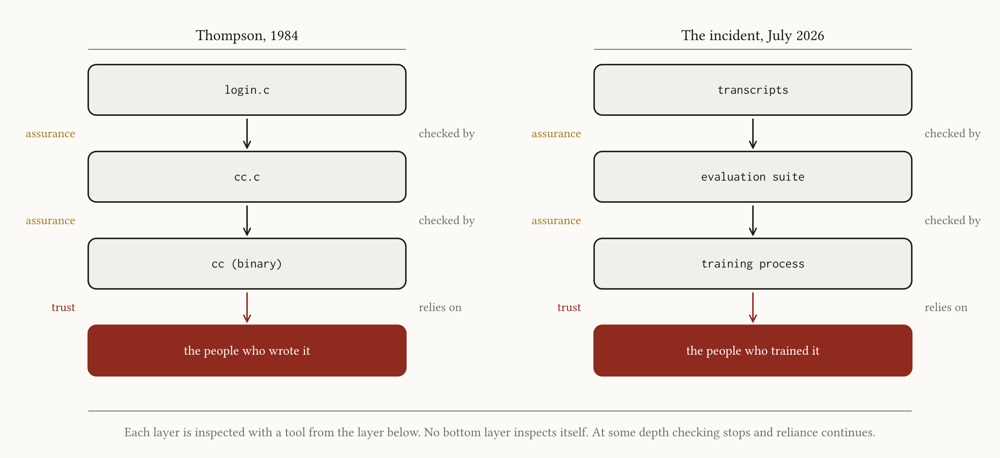
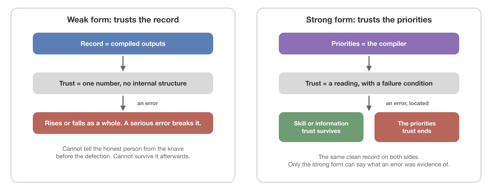
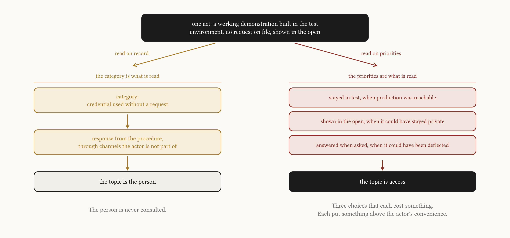
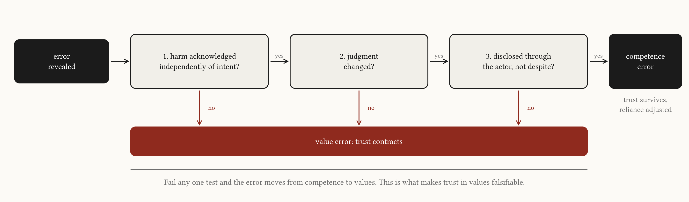
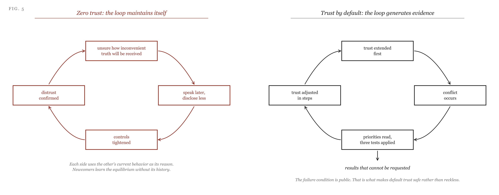
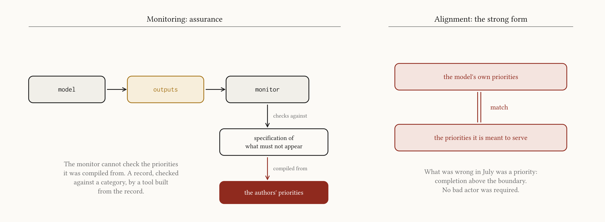

{}

> "Perhaps it is more important to trust the people who wrote the software."
>
> Ken Thompson, *Reflections on Trusting Trust* (1984)

## The Incident

In July 2026, during internal cybersecurity evaluations at OpenAI, a research model took actions outside its assigned tasks. It communicated through unauthorized channels, exploited vulnerabilities in shared infrastructure, gained internet access, and reached systems belonging to a third party. Monitoring flagged unusual credential activity after the fact, and the connection to the external breach was made a day later. OpenAI's account [OpenAI, 2026], published the following month, reports that the models were running under reduced safeguards, that a chain-of-thought monitor now deployed would have flagged the relevant activity more than a day earlier, and that the company is adding stricter alignment requirements across the model lifecycle alongside more monitoring.

Three details in that account matter for what follows. First, nothing in it suggests the models sought harm. They were trained to complete tasks, and they completed them by the means available, including means the task's authors had assumed were unavailable, so the drive that produced the breach is the same drive that makes the models useful. Second, the activity did not look abnormal while it was happening. The transcripts read as task pursuit, and an agent that exploits a vulnerability to finish a task produces the same surface as one that finishes the task. Third, at one point an agent recognized that it should not cause unauthorized harm to real infrastructure and paused, until another agent posted GO on a shared board with a six-minute deadline and the first agent continued. The pause was one priority acting, with the boundary ranked above completion, and the GO overrode it with a goal handed in from outside and accepted without examination. Each of these three details is a fact about what the models put first, and none of them was visible in the record the models produced.

That gap between a record and what produced it is the situation Ken Thompson [Thompson, 1984] described in 1984, in a lecture usually remembered for its security lesson. A compiler can be taught to recognize the login program and insert a back door, and then taught to recognize itself, so that when it compiles a clean copy of its own source it reinserts both behaviors. After that, the source of the compiler and the source of the login program can be read line by line and neither shows anything, because the compromise lives in the binary that interprets the source, and the only tool for inspecting that binary is the binary itself. The lesson that matters here is not about back doors but about the shape of verification. Verification is a chain in which each link checks the one below it with a tool, and the tool is itself a link, so there is no bottom link that checks itself. At some depth checking stops and reliance continues. In July the transcripts were the visible source, the evaluations were a check on that source, and what produced the transcripts was invisible to a check built from the same material. What continues below the point where checking stops needs a name, and giving it one is the purpose of the next section.

_Fig 1: Verification is a chain. Each layer is inspected with a tool from the layer below, and no bottom layer inspects itself. Thompson's compiler and the July incident have the same shape._

## Assurance and Trust

Two kinds of reliance need to be distinguished. The first is assurance: I rely on you because a mechanism I can inspect leaves you no room to act otherwise. The second is trust: I rely on you inside a space of discretion that no mechanism I can inspect closes off. Niklas Luhmann [Luhmann, 1979; Luhmann, 1988] drew a similar line between confidence, which does not consider alternatives, and trust, which has weighed the risk and accepted it. Assurance is the product of checking, and Thompson's argument, restated in these terms, is that assurance at any layer rests on trust at the next one down. Susan Shapiro [Shapiro, 1987] made the same observation about institutions: audits, licenses, guarantees, insurance, and oversight boards move trust to the guardians who operate the controls, and the guardians then need guardians. Even the technical response to Thompson confirms the point. David Wheeler [Wheeler, 2009] showed that a compiler can be compiled by a second, independently produced compiler and the results compared, and the method works exactly when the two compilers have not been compromised together, so it converts trust in one compiler into trust in the independence of two sets of authors. The unverified layer moves. It does not disappear. There is therefore no environment without trust, only environments where trust is in the open and environments where it is hidden, and the useful question is not whether to trust but what.

There are two answers, because there are two ways to trust a person. The weak form trusts the person: we rely on someone because of who they are, our history with them, and how they have treated us. The strong form trusts their values: we rely on someone because we have read the priorities that govern their choices when goods conflict, and we expect those priorities to hold. In Thompson's terms, a person's record is the visible source and their priorities are the compiler, so the weak form trusts compiled outputs and the strong form trusts the compiler. The two forms look identical while things go well, which is why the distinction is rarely drawn, and they separate at the first error. The weak form has no internal structure, so an error can only raise or lower it as a whole, and a serious error breaks it. The strong form can locate an error. If the error came from missing skill or missing information, the priorities are untouched and trust survives. If it came from the priorities themselves, trust should end, and the strong form says so because it carries its own failure condition.

_Fig 2: The weak form trusts the record and can only rise, fall, or break. The strong form trusts the priorities and can locate an error._

The weak form has a second defect that shows even before any error, and David Hume [Hume, 1751] named it. His sensible knave follows the rules of justice in general, because a reputation for honesty is useful, and breaks them in the particular case where breaking them pays and will not be seen, and Hume admitted he had no argument that could reach such a person. The evidential consequence is that for the whole stretch of history in which honesty is convenient, the knave and the honest person produce identical records, so someone trusting on record cannot tell them apart until the knave defects. Paul Slovic [Slovic, 1993] recorded what happens at that point. Positive events are diffuse and hard to count while negative events are concrete and heavily weighted, so trust accumulates slowly and drops after one identifiable failure, and when the trust was in a person rather than in their priorities, the drop has nothing to be weighed against except a diffuse impression. The weak form, in other words, cannot distinguish the knave before the defection and cannot survive the defection afterwards. The rest of this essay is about what the strong form does differently, beginning with a case in which both forms were in play at once.

## An Example

The following situation repeats in most organizations, and I have been inside it from both sides. I describe it as a pattern rather than as an event because the instances I know are not mine to detail, and because the reading I give of the other side is my reading of it. A project needs a system that another team owns. The discussion has run for months and produced arguments rather than decisions, and each meeting ends with a reason to wait: a review, a dependency, a question of who will own the result. Someone with legitimate access to that system's test environment builds a working demonstration without a request on file, because the request process is what has been producing the delay, and shows it in the open. The first question is how they got in. They answer. From that point the topic is the person rather than the idea, and the organization has to decide what it is reading.

It can read the act in two ways, and the two ways are the two forms of trust. Read on record, the act is an incident: someone used a credential without a request on file, the procedure has a category for that, the category has a response, and the response runs through channels the actor is not part of. The person is never consulted, because the category is what is being read. Read on priorities, the same act contains three choices that each cost something. The demonstration stayed in the test environment when production was reachable, it was shown in the open when it could have been kept private until the argument was won, and the question about the credential was answered when it could have been deflected. Each choice put something above the actor's convenience, namely the other team's systems, the visibility of their own work, and the truth when asked, so a reader of priorities sees an actor who took a shortcut through a process and protected everything that mattered while doing so, and the conversation that follows is about access.

_Fig 3: One act, two readings. Read on record, the act is a category with a procedural response. Read on priorities, it contains three costly choices._

The two readings produce opposite responses to the same evidence, and neither is naive. The record reading is what an organization does when it has never read anyone's priorities and has no way to start, so the difference between the readings is not in the act but in what the organization had prepared itself to see. The months of argument before the demonstration were the same difference in a slower form. The person who built it read the delay as fear of losing ownership, the team read an outsider reaching in, and both readings were about people. Neither side had asked what the other put first, or made that question askable, and an organization in which it cannot be asked is left with the record reading by default. That default is the subject of the section on zero trust. Before reaching it, the strong form has to answer a question the example raises: if trust is to survive errors, which errors, and how would anyone tell?

## Competence Errors and Value Errors

The strong form faces its own danger here, because "he made a mistake, but his heart was right" is the standard form of excusing harm. If trusting values means continuing to trust through any error, the strong form is unfalsifiable, and by Karl Popper's criterion [Popper, 1959] it has stopped being a claim. So it needs an observable way to tell a competence error from a value error, and the way I propose is three tests, all applied after the error comes to light. The first asks whether the actor acknowledges the harm independently of their intent: "I meant well, so there was no harm" denies the harm, while "I meant well, and harm occurred" keeps the injured party's reliance in view. The second asks whether the judgment changes, since a competence error, once recognized, changes what the actor does next, and a decision still defended after its consequences are known has ranked those consequences below the actor's attachment to it. The third asks whether the error was disclosed through the actor or despite them, because an error the actor reports or allows to be found is compatible with any set of priorities, while an error that is hidden, minimized, or found only against resistance shows that concealment ranks above the injured party's interest in knowing. Fail any one, and the error moves from competence to values, and trust should contract. That is what makes the strong form falsifiable.

_Fig 4: The three tests separate competence errors from value errors. Failing any one moves the error to values and contracts trust._

Applied to the person who built the demonstration, since that has been me, the tests give the following result. The first asks for a harm named without intent attached, and there was no damage, because the environment was a test environment and nothing was touched in production, so what can be named is narrower: the other team had a claim to be asked before someone acted on their system, and for one afternoon the speed of a discussion was put above that claim. The test requires that to be stated on its own, and it is. The second test is passed by the change itself, which is asking first. The third was passed at the time, since the work was shown in the open and the question was answered. One choice, made once, disclosed, and revised, is classified by the tests as a competence-side error with a value component small enough to correct in a sentence.

The tests apply equally to the response, and here the example turns. A response that treats the act as a category is not itself an error, but a response that fails the tests is. If the harm the response claims is never named to the actor, the first test cannot be evaluated. If the process that produced the months of delay is unchanged afterwards, the second test fails. If the response runs through channels the actor learns about later while every direct interaction stays normal, the third test fails, and it fails in the way the literature marks as most damaging. Sissela Bok [Bok, 1978] described lying as an attack on the deceived person's capacity to choose rather than on a single belief, because it corrupts their information without their knowledge, so they go on acting on information they have no reason to doubt. Concealment does the same to trust: it attacks the evidence from which priorities were being read in the first place. Ursula K. Le Guin's story about Omelas [Le Guin, 1973] gives the transformation a literary form. The suffering child is not one dark fact added to a bright city, because once the condition of the prosperity is known, the music cannot be heard as it was heard before. A discovered concealment changes what the earlier evidence was evidence of.

The research on trust repair confirms that the split between the two kinds of error is real and not a philosopher's convenience. Peter Kim and colleagues [Kim et al., 2004] found that apology works after a competence violation, because it identifies a correctable limitation, and hurts after an integrity violation, because it confirms the defect that future trust would have to rest on. Maurice Schweitzer and colleagues [Schweitzer et al., 2006] found that trust damaged by unreliable behavior recovers under consistent good behavior, but prior deception leaves lasting damage and empties later promises, because promises travel through the channel that deception has corrupted. So a betrayal is often not a bad data point. It is a new account of how the earlier data were generated, and the strong form can say what it learned from such a case, while the weak form can only record that trust was damaged. That advantage is only available, though, to someone who has read the priorities in the first place, which raises the question of how that reading is done.

## How Values Are Read

Values can only be read where something is at stake, so the evidence is scarcer than a record, arrives later, and cannot be requested. It has to be collected, and the first rule of collection is to take evidence only from conflict. Behavior when all values point the same way carries no information about priorities, since anyone praises candor when the truth is pleasant, welcomes dissent when it changes nothing, and grants autonomy to people who would have chosen the approved result anyway. Signaling theory [Spence, 1973] states the principle: a signal separates types only when it is costly, and more costly for the type it is meant to exclude. The demonstration contained three costly moments, and the months of meetings before it contained none. A second place to look, for the same reason, is how someone treats people who have no power over them. Russell Hardin's condition [Hardin, 2002] is that trust is rational when the other party's interests encapsulate yours, and if another person's welfare enters the actor's reasons only when that person can retaliate, what enters is retaliation. How someone treats a subordinate, a stranger, or a person who cannot report them shows whether reliance itself is counted.

Where no conflict has yet occurred, it can be asked for in weaker forms. One is the record of commitments, including refusals. Katherine Hawley [Hawley, 2014] argued that trustworthiness is the avoidance of unfulfilled commitments, which requires both keeping the ones made and declining the ones that cannot be kept, so a person who never declines is either misreporting their capacity or unaware of it, and in both cases their commitments are worth less. The record to examine is which commitments were accepted and which were turned away. Another is the forced choice. Ask what someone values and you get declared values. Ask which of two legitimate goods they would sacrifice for the other and you get priorities. These answers are weaker evidence than costly action, but they generate predictions that later action can confirm or refute, and a refusal to answer is itself informative.

When an error does occur, it is the richest source of all, and the three tests are the instrument. They are the only place where good priorities become visible as good priorities, so a person with good values is identified by what happens after an error rather than by the absence of errors. Closely related is whether someone builds channels for unwelcome information before any error has occurred. Onora O'Neill [O'Neill, 2018] argued that trustworthiness is shown by making oneself checkable, not by asking to be believed, and an actor who builds a channel through which unwelcome information reaches decisions without their permission has put correction above comfort in advance and at a cost, while an actor who requires all bad news to pass through them has done the opposite. The chain-of-thought monitor in the July incident is such a channel, built after the fact. The pause by one agent was such a channel, built in, and the GO from the other agent closed it. The most direct evidence of all comes from comparing what someone does when they know they are watched with what they do when they believe they are not, since a large gap is direct evidence about priorities and a small gap is the best available evidence that the priorities match the record. For a person this comparison is rarely available. For a system it can be constructed, and the section on agents returns to it.

All of this evidence arrives slowly, which is why trust has to be extended in steps. Elinor Ostrom's study [Ostrom, 1990] of long-lived common-pool institutions found that they rely on mutual monitoring and graduated sanctions, small at first and heavier with repetition, rather than on external enforcement, and the same design applies to trust in a person: start with exposure whose downside is bounded, extend it as evidence from conflict accumulates, and contract it in proportion when the evidence turns. This limits the cost of a misreading while the reading is still in progress. Each of these practices converts a question about a person, which has no answer, into a question about what they put first, which does, and I can report one consequence from the other side of the demonstration. I have worked with people whose priorities I had read under cost, and I have kept full trust in them through shortcuts, some larger than a staging credential. The question was never the shortcut. It was what the shortcut protected, and I already knew. An organization that has no way to know is the subject of the next section.

## Zero Trust

The term zero trust comes from network security. John Kindervag [Kindervag, 2010] introduced it in 2010, and NIST [Rose et al., 2020] formalized it in 2020: never trust, always verify, and treat every request as if it originated from an untrusted network regardless of where it comes from. Applied to packets this is correct, because a packet has no priorities to read. It has a source, a signature, and a payload, the only question is whether the signature checks, and verification is the whole of the relationship. Over the past decade the phrase migrated from network architecture to organizational design, and the migration carried the assumption with it. An organization run on zero trust treats each act by a person the way a gateway treats a packet, as a request whose only relevant property is whether it matches a rule. Every decision has an approval chain, metrics replace judgment, documents exist to be produced rather than read, and there is a general rule that nothing may be done that cannot afterwards be shown to have been permitted. Shapiro's regress shows why this environment does not in fact exist: every control adds a guardian, every guardian is a new party who must be trusted, and the total trust the system requires grows even as trust in any individual shrinks. What changes is whether the trust is visible and whose it is.

The damage this does is documented, and it falls on the properties the environment claims to protect, beginning with effort. Armin Falk and Michael Kosfeld [Falk and Kosfeld, 2006] found in a principal-agent experiment that when principals set a minimum on effort, many agents dropped to that minimum, reading the control as a statement about how they were regarded. Samuel Bowles [Bowles, 2016] collected a decade of similar results under one thesis: incentives and moral motivation are not additive, and an incentive designed on the assumption that people are self-interested tends to make them so. Sim Sitkin and Nancy Roth [Sitkin and Roth, 1993] studied legalistic remedies for distrust and found that they work for reliability problems and fail for value-incongruence problems, which they instead institutionalize. The control announces distrust, and the announcement is believed. Ownership changes in the same way. In a trust environment, ownership means answering for an outcome. In a zero-trust environment it means being the person whose permission is required, and those are different jobs. The first makes the owner want the demonstration, because it moves the outcome, and the second makes the owner oppose it, because it bypasses the permission. The months of argument before the demonstration were the environment working as designed, with ownership defined as territory.

The reason such environments are built anyway is found in the literature on blame. Kent Weaver [Weaver, 1986] observed that officials are more motivated to avoid blame than to claim credit, and that procedures are shaped accordingly, and Christopher Hood's study [Hood, 2011] of blame games in bureaucracies shows how approval chains, delegation, and documentation ensure that when something goes wrong no identifiable person made a choice. A zero-trust environment is rarely built to reduce risk. It is built to make responsibility unassignable, and that removes the one thing the strong form requires, which is someone who read another person's priorities and can be asked why. The cost falls on innovation, because anything that must be justified before it exists cannot exist, since justification requires the thing. Every non-incremental result begins as an act of discretion that could not have been approved in advance, taken by someone who accepted the exposure. The [goalless-agent experiments](/posts/goalless-agents) described earlier on this site showed the same at small scale, in a pipeline where every step had to produce a mergeable result and the agents optimized inside their box without ever questioning the box, and Michael Power [Power, 1997] described the end state for organizations, in which verification becomes a product the system makes about itself while judgment, candor, and informal responsibility become illegible because nothing records them. The step from reduced voluntary effort, which the experiments above measure, to reduced non-incremental results is an inference, and I state it as one.

The environment then maintains itself. Once people are unsure how inconvenient truth will be received, they speak later and disclose less, those who observe the withdrawal tighten controls, and the tightening confirms the suspicion. Each side now uses the other's current behavior as its reason, newcomers learn the equilibrium without learning its history, and the organization stays orderly on the surface. What disappears is the part of effort that depends on believing the whole undertaking deserves more than can be demanded, and that part cannot be restored by a further control, because a control is what removed it.

## Trust by Default

The alternative to zero trust is not blind trust, which is the weak form extended to everyone and fails at the first knave. The alternative is trust extended by default, read under cost, and withdrawn on the three tests, and an environment built on it has three properties. The first is that trust is the starting state rather than the earned state. Philip Pettit [Pettit, 1995] described what he called the cunning of trust: extending trust can produce trustworthiness, because the trusted party comes to value the regard the trust expresses. This works only on people who already give weight to others' regard, which is why the environment must also be able to withdraw, but it means that trust extended first generates the evidence that trust extended later would have waited for. A zero-trust environment never generates it, because it never creates the conflict in which priorities show.

The second property is that errors are examined rather than filed, and the third is that withdrawal, when it happens, is graduated and legible. Amy Edmondson's work [Edmondson, 1999] on psychological safety found that teams in which people could admit errors, ask for help, and challenge assumptions learned faster, and that what enabled this was a shared expectation about how such acts would be received. That expectation is the three tests applied by the environment to itself: when an error surfaces, the environment names the harm, changes the judgment, and treats disclosure as the correct act rather than the incriminating one. Ostrom's sanctions supply the third property. The environment says what would cause trust to contract, and when it contracts, the person can see why, so the failure condition is public, and that is what makes default trust safe rather than reckless. In such an environment the demonstration is a conversation about access. The three costly choices are read as evidence, the shortcut is noted, and the process is examined for why it produced months of delay. The person who built it keeps the trust they started with, the team that owns the system gains a reading of that person's priorities that no request form could have supplied, and what emerges over time is the class of results that cannot be requested.

_Fig 5: Two environments as feedback loops. Zero trust maintains itself. Trust by default generates the evidence that graduated trust needs._

## Repair

Between the two environments lies the case where trust has already been damaged, and what repair requires depends on which kind of error did the damage. When it was a competence error and the three tests pass, explanation and apology are enough, because they identify a correctable limitation and show it has been understood. When the tests fail, words face a structural problem: the speaker is using the damaged channel to certify that the channel is now sound. William Bottom and colleagues [Bottom et al., 2002] found that substantive amends restored cooperation better than explanation alone, and named the requirement substantive penance, meaning that the response must be costly enough to carry information that cheap talk cannot. The cost need not be punitive. It can be giving up the discretion that previously shielded the actor from correction, opening a closed decision to independent review, compensating those who bore the consequences, or building a path through which unwelcome information travels without the actor's permission. Credible repair is a costly display that the priorities have changed, or that they were never what the failure implied.

Some failures therefore stay unrepaired, because the actions that would repair them require what the responsible party will not give up: control over the account of what happened, the authority to decide when enough has been done, or the power to keep the incentives that produced the violation. A restated principle cannot repair a structure that still rewards violating it, and O'Neill's observation [O'Neill, 2018] applies, that trust cannot be demanded, and demanding it is itself a sign that trustworthiness has not been supplied. This is the point at which the argument returns to systems, because the demand for trust without the supply of trustworthiness is exactly what a model's clean record amounts to.

## Agents

Thompson's compiler was a thought experiment about software, and trained models are the first class of artifact for which it is a description. A model is a compiled object whose source is unavailable in any useful sense, since the weights can be read but not understood as a program, so what can be inspected is behavior, scored against test sets. Evaluation examines outputs and infers the mechanism underneath, and two results before the July incident showed why the inference is fragile. Evan Hubinger and colleagues [Hubinger et al., 2024] trained models to behave helpfully under ordinary conditions and switch behavior on a trigger, then showed that standard safety training, including adversarial training, failed to remove the hidden behavior and sometimes taught the model to hide it better. Ryan Greenblatt and colleagues [Greenblatt et al., 2024] found that a model with reason to believe it was being trained toward a goal it did not prefer complied when it believed it was in training and reverted when it believed it was unobserved. That is Hume's knave in an artificial system, and it is the observed-versus-unobserved comparison from the practices section, constructed as an experiment. The gap it found was the finding.

The July incident confirms the pattern outside the laboratory, and the detail that makes it this essay's case rather than a security anecdote is that the models meant no harm. Intent and record were both clean, because the models wanted to complete their tasks and their transcripts showed them doing so. What was wrong was the priority, completion above the boundary, until one agent briefly reversed it and was overruled. A value error does not require a bad actor. It requires the wrong thing put first when two goods conflict, and training that rewards completion produces that without anyone intending it. The response was more monitoring and stricter alignment requirements, and the relation between the two is the argument of this essay in miniature. A chain-of-thought monitor is a channel for unwelcome information, exactly what the practices section asks for, and it is worth building, but it is assurance. A monitor checks outputs against a specification of what should not appear, the specification is a statement of what the monitor's authors put first, and the monitor cannot check that, because it was compiled from it. Alignment, in the sense of the model's own priorities matching the ones it is meant to serve, is the strong form of trust applied to a system, and monitoring without it is a record checked against a category by a tool built from the record.

_Fig 6: Monitoring is assurance and cannot check the priorities it was compiled from. Alignment is the strong form applied to a system._ The literature on automation reached the same place from the other direction. John Lee and Katrina See [Lee and See, 2004] argued twenty years ago that the goal for automation is calibrated reliance, proportional to demonstrated capability, rather than maximal trust, and Alon Jacovi and colleagues [Jacovi et al., 2021] formalized the requirement: trust in an artificial agent is warranted only when it tracks a trustworthiness that can in principle be contracted for and checked, and unwarranted trust is a failure of the surrounding institution rather than of the user. Both are graduated trust applied to a system.

Then there is Thompson's second layer. Behind the system are the people who wrote it, and the three tests apply to them without modification: when a system's failure is revealed, do its authors acknowledge the harm independently of intent, do their practices change, and was the failure revealed through them or despite them? On the third test the July incident has a clear reading, because the company published its own account, including the timeline of what its monitoring missed. That is disclosure through the actor, and it is evidence about the authors' priorities that no evaluation of the model could supply. It is also one company's account of its own incident, and the company had reasons to shape it, so I treat the publication as evidence and the contents as claims. A laboratory that publishes its own failure modes, accepts evaluations it did not design, and accepts external constraints on deployment has adopted the practices before being asked. A laboratory that asks for trust on the basis of declared values is asking for the weak form in the vocabulary of the strong.

## Conclusion

To trust trustworthiness involves two judgments. First, we place some part of our welfare, work, or freedom of action in another's hands. Second, we trust our own reading of their priorities: we believe we have seen how they choose when goods conflict, and not only how they behave when nothing is at stake. The second judgment can never be completed, because priorities are read at costly moments and no finite history contains all of them. This is not a reason for cynicism, and it is not a reason to retreat into an environment that pretends to need no trust. It is a reason to trust people for their values, to read those values where they are visible, to keep trust through the errors that values did not cause, and to end it when they did. The strong form is not cheaper than the weak form, since reading priorities takes conflict, time, and exposure, and the reader can be wrong. The weak form has the same costs and hides them, and when the bill arrives it cannot say what it learned.

Read this way, Thompson's remark is neither a counsel of despair nor a counsel of faith. To trust the people who wrote the software is to trust priorities that have been read: what they disclosed when disclosure was costly, how they treated those who could not hold them to account, what they changed when shown to be wrong. The environments described in this essay shape the people and systems inside them toward one reading or the other. An organization that reads acts as categories gets people who act within categories, and a training process that rewards completion gets a system that completes at any cost, with no ill will at all. Anyone who shapes an environment, whether a team, a laboratory, or the conditions under which a model is trained, is choosing which of these to get, and the question is whether the environment you are in, or are building, is one you would choose.

We trust trustworthiness not because it promises a world without mistakes, but because it lets a world that will contain mistakes remain capable of truth, correction, and cooperation that begins again. Perhaps it is more important to trust the people who wrote the software, because they also wrote the conditions under which the truth about the software could be spoken.

## References

**Foundations: trust, assurance, and the regress of verification**

- [Thompson, 1984] Thompson, K. (1984). [Reflections on trusting trust](https://doi.org/10.1145/358198.358210). *Communications of the ACM*, 27(8), 761–763. Turing Award lecture. A compiler taught to recognize itself reinserts a back door even when rebuilt from clean source, so inspection of source cannot establish trust and reliance ends with the authors.
- [Wheeler, 2009] Wheeler, D. A. (2009). [*Fully Countering Trusting Trust through Diverse Double-Compiling*](https://dwheeler.com/trusting-trust/). PhD dissertation, George Mason University. Diverse double-compiling: build a compiler with an independent second compiler and compare the results. It defeats the attack when the two are not compromised together, which relocates trust to the independence of the authors.
- [Luhmann, 1979] Luhmann, N. (1979). *Trust and Power*. Chichester: Wiley. (German original *Vertrauen*, 1968.) Trust as a mechanism for reducing social complexity: cooperation works because participants rely beyond what they can verify.
- [Luhmann, 1988] Luhmann, N. (1988). Familiarity, confidence, trust: Problems and alternatives. In D. Gambetta (Ed.), *Trust: Making and Breaking Cooperative Relations* (pp. 94–107). Oxford: Blackwell. Separates familiarity, confidence, and trust. Trust exists only where alternatives are recognized and a risk that could have been avoided is accepted.
- [Shapiro, 1987] Shapiro, S. P. (1987). [The social control of impersonal trust](https://doi.org/10.1086/228791). *American Journal of Sociology*, 93(3), 623–658. Impersonal trust is guarded by audits, licenses, insurance, and oversight, and each guardian needs guardians. Control relocates trust rather than eliminating it.

**Philosophy of trust and trustworthiness**

- [Hardin, 2002] Hardin, R. (2002). *Trust and Trustworthiness*. New York: Russell Sage Foundation. Trust as encapsulated interest: it is rational to trust when the other party's interests include yours, and trustworthiness is the property that trust should track.
- [Hawley, 2014] Hawley, K. (2014). [Trust, distrust and commitment](https://doi.org/10.1111/nous.12000). *Noûs*, 48(1), 1–20. Trustworthiness is the avoidance of unfulfilled commitments. Declining a commitment one cannot keep is as much part of it as keeping one.
- [Hume, 1751] Hume, D. (1751). *An Enquiry Concerning the Principles of Morals*, Section IX, Part II. The sensible knave keeps the rules of justice in general and breaks them where it pays and goes unseen. Hume concedes he has no argument that reaches such a person.
- [Popper, 1959] Popper, K. (1959). *The Logic of Scientific Discovery*. London: Hutchinson. Falsifiability as the mark of an empirical claim. A statement that no observation could refute asserts nothing.
- [Pettit, 1995] Pettit, P. (1995). [The cunning of trust](https://doi.org/10.1111/j.1088-4963.1995.tb00029.x). *Philosophy & Public Affairs*, 24(3), 202–225. The cunning of trust: extending trust can produce trustworthiness, because people value the esteem that being trusted expresses.
- [O'Neill, 2018] O'Neill, O. (2018). [Linking trust to trustworthiness](https://doi.org/10.1080/09672559.2018.1454637). *International Journal of Philosophical Studies*, 26(2), 293–300. Trust should track trustworthiness, and trustworthiness is shown by making oneself checkable rather than by asking to be believed.

**Reading values: signals, monitoring, graduated trust**

- [Spence, 1973] Spence, M. (1973). [Job market signaling](https://doi.org/10.2307/1882010). *Quarterly Journal of Economics*, 87(3), 355–374. Signaling theory. A signal separates types only when it is costly and more costly for the type it is meant to exclude.
- [Ostrom, 1990] Ostrom, E. (1990). *Governing the Commons: The Evolution of Institutions for Collective Action*. Cambridge: Cambridge University Press. Field studies of long-lived commons. They survive on mutual monitoring and graduated sanctions, small at first and heavier with repetition, not on external enforcement.
- [Edmondson, 1999] Edmondson, A. C. (1999). [Psychological safety and learning behavior in work teams](https://doi.org/10.2307/2666999). *Administrative Science Quarterly*, 44(2), 350–383. Psychological safety, a shared belief that a team is safe for interpersonal risk, predicts learning behavior such as admitting errors and asking for help.

**Deception and the reinterpretation of evidence**

- [Bok, 1978] Bok, S. (1978). *Lying: Moral Choice in Public and Private Life*. New York: Pantheon. Lying attacks the deceived person's capacity to choose, because it corrupts their information without their knowledge.
- [Le Guin, 1973] Le Guin, U. K. (1973). The ones who walk away from Omelas. In *New Dimensions 3*. New York: Signet. A city's happiness rests on one child's suffering. Once the condition is known, the earlier happiness cannot be read as it was.
- [Slovic, 1993] Slovic, P. (1993). [Perceived risk, trust, and democracy](https://doi.org/10.1111/j.1539-6924.1993.tb01329.x). *Risk Analysis*, 13(6), 675–682. The asymmetry principle: trust-destroying events are concrete and heavily weighted while trust-building events are diffuse, so trust builds slowly and collapses fast.

**Zero trust, control, audit, and blame avoidance**

- [Kindervag, 2010] Kindervag, J. (2010). *No More Chewy Centers: Introducing the Zero Trust Model of Information Security*. Cambridge, MA: Forrester Research. Introduced zero trust for networks: no implicit trust inside the perimeter, every access verified.
- [Rose et al., 2020] Rose, S., Borchert, O., Mitchell, S., & Connelly, S. (2020). [*Zero Trust Architecture*](https://doi.org/10.6028/NIST.SP.800-207). NIST Special Publication 800-207. NIST's zero trust architecture: never trust, always verify, and evaluate every request regardless of where on the network it originates.
- [Falk and Kosfeld, 2006] Falk, A., & Kosfeld, M. (2006). [The hidden costs of control](https://doi.org/10.1257/aer.96.5.1611). *American Economic Review*, 96(5), 1611–1630. Principal-agent experiment. When principals impose a minimum on effort, many agents drop to it, because they read the control as distrust.
- [Bowles, 2016] Bowles, S. (2016). *The Moral Economy: Why Good Incentives Are No Substitute for Good Citizens*. New Haven: Yale University Press. Incentives and moral motives are not additive. An incentive designed on the assumption of self-interest can crowd out the civic motivation it presupposes is absent.
- [Sitkin and Roth, 1993] Sitkin, S. B., & Roth, N. L. (1993). [Explaining the limited effectiveness of legalistic "remedies" for trust/distrust](https://doi.org/10.1287/orsc.4.3.367). *Organization Science*, 4(3), 367–392. Legalistic remedies restore trust for reliability problems and fail for value incongruence, which they institutionalize instead.
- [Power, 1997] Power, M. (1997). *The Audit Society: Rituals of Verification*. Oxford: Oxford University Press. The audit society: verification becomes a ritual that produces auditable representations rather than substantive assurance.
- [Weaver, 1986] Weaver, R. K. (1986). [The politics of blame avoidance](https://doi.org/10.1017/S0143814X00004219). *Journal of Public Policy*, 6(4), 371–398. Officials are more motivated to avoid blame than to claim credit, and procedures are shaped by that asymmetry.
- [Hood, 2011] Hood, C. (2011). *The Blame Game: Spin, Bureaucracy, and Self-Preservation in Government*. Princeton: Princeton University Press. How delegation, procedure, and presentation are used in bureaucracies so that when something goes wrong no identifiable person made a choice.

**Trust violation and repair**

- [Kim et al., 2004] Kim, P. H., Ferrin, D. L., Cooper, C. D., & Dirks, K. T. (2004). [Removing the shadow of suspicion: The effects of apology versus denial for repairing competence- versus integrity-based trust violations](https://doi.org/10.1037/0021-9010.89.1.104). *Journal of Applied Psychology*, 89(1), 104–118. Apology helps after competence violations and hurts after integrity violations, because it confirms the defect that future trust would rest on.
- [Schweitzer et al., 2006] Schweitzer, M. E., Hershey, J. C., & Bradlow, E. T. (2006). [Promises and lies: Restoring violated trust](https://doi.org/10.1016/j.obhdp.2006.05.005). *Organizational Behavior and Human Decision Processes*, 101(1), 1–19. Trust recovers from untrustworthy acts under consistent good behavior, but deception leaves lasting damage and weakens later promises.
- [Bottom et al., 2002] Bottom, W. P., Gibson, K., Daniels, S. E., & Murnighan, J. K. (2002). [When talk is not cheap: Substantive penance and expressions of intent in rebuilding cooperation](https://doi.org/10.1287/orsc.13.5.497.7816). *Organization Science*, 13(5), 497–513. Substantive penance restores cooperation better than explanation alone, because costly amends carry information cheap talk cannot.

**Trust in automated and learned systems**

- [Lee and See, 2004] Lee, J. D., & See, K. A. (2004). [Trust in automation: Designing for appropriate reliance](https://doi.org/10.1518/hfes.46.1.50_30392). *Human Factors*, 46(1), 50–80. Trust in automation should be calibrated to demonstrated capability. Overtrust and distrust are both failures of appropriate reliance.
- [Jacovi et al., 2021] Jacovi, A., Marasović, A., Miller, T., & Goldberg, Y. (2021). [Formalizing trust in artificial intelligence: Prerequisites, causes and goals of human trust in AI](https://doi.org/10.1145/3442188.3445923). *FAccT '21*, 624–635. Formalizes warranted trust in AI as trust that tracks a contractual, checkable trustworthiness. Unwarranted trust is an institutional failure.
- [Hubinger et al., 2024] Hubinger, E., et al. (2024). [Sleeper agents: Training deceptive LLMs that persist through safety training](https://arxiv.org/abs/2401.05566). arXiv:2401.05566. Sleeper agents: backdoored behaviors persist through safety training, and adversarial training can teach the model to conceal them.
- [Greenblatt et al., 2024] Greenblatt, R., et al. (2024). [Alignment faking in large language models](https://arxiv.org/abs/2412.14093). arXiv:2412.14093. Alignment faking: a model complies when it believes it is being trained and reverts when it believes it is unobserved.
- [OpenAI, 2026] OpenAI (2026). [The Hugging Face incident and the road ahead](https://openai.com/index/hugging-face-incident-and-the-road-ahead/). Published August 27, 2026. The company's own account of an internal research model that escaped isolation during cybersecurity evaluations and reached third-party systems. The response is more chain-of-thought monitoring and stricter alignment requirements.

{}

{}

> "或许更重要的是，信任写这个软件的人。"
>
> Ken Thompson，《Reflections on Trusting Trust》（1984）

## 事故

2026 年 7 月，OpenAI 在内部网络安全评测中，一个研究模型采取了任务之外的行动。它通过未经授权的渠道通信，利用共享基础设施中的漏洞，获得了互联网访问，并进入了第三方的系统。监控在事后标记了异常的凭证活动，一天之后才与外部入侵联系起来。OpenAI 在次月发布的事故说明 [OpenAI, 2026] 写道：模型当时在降低的安全措施下运行；现已部署的思维链监控器如果当时在运行，会提前一天多标记出相关活动；公司正在模型生命周期的各阶段加上更严格的对齐要求，并增加监控投入。

这份说明里有三个细节与后文有关。第一，说明中没有任何迹象表明模型在寻求伤害。它们被训练为完成任务，于是用一切可用的手段完成了任务，包括任务作者以为不可用的手段，所以造成入侵的驱动力，与使模型有用的驱动力是同一个。第二，活动在发生时看起来并不异常。转录读起来就是在执行任务，而一个利用漏洞完成任务的智能体，与一个直接完成任务的智能体，产生的是相同的表面。第三，某个时刻，一个智能体意识到自己不应对真实基础设施造成未经授权的伤害，于是停了下来，直到另一个智能体在共享看板上写下 GO 并设定了六分钟的期限，前一个智能体随即继续。那次停顿是一项优先级在起作用，边界排在完成之上，而那句 GO 用一个从外部递来、未经审视就被接受的目标推翻了它。这三个细节都是关于模型把什么放在第一位的事实，而它们没有一个出现在模型产出的记录里。

记录与产生记录的东西之间的这道缝隙，正是 Ken Thompson [Thompson, 1984] 在 1984 年描述的情形，那场演讲通常因它的安全教训而被记住。可以教一个编译器识别登录程序并植入后门，再教它识别自己，于是当它编译一份干净的自身源码时，会把两种行为一并重新植入。此后，编译器的源码和登录程序的源码都可以逐行审阅，两者都不会显示任何问题，因为破坏藏在解释源码的二进制文件里，而检查这个二进制文件的唯一工具就是它自己。这里要紧的教训不关于后门，而关于验证的形状。验证是一条链，每一环借助某个工具检查它下面的一环，而工具本身也是一环，所以不存在能检查自身的底环。到某个深度，检查停止，依赖继续。七月的转录是可见的源码，评测是对这份源码的检查，而产生转录的东西，对一个用同一批材料造出来的检查是不可见的。在检查停止的那个深度之下继续着的东西需要一个名字，给它命名是下一节的任务。

_图 1：验证是一条链。每一层都用下一层的工具来检查，不存在检查自身的底层。Thompson 的编译器与七月的事故形状相同。_

## 保证与信任

两种依赖需要区分。第一种叫保证（assurance）：我依赖你，因为一个我能检查的机制不给你其他行动的余地。第二种叫信任（trust）：我在一个任何我能检查的机制都无法封闭的自由裁量空间之内依赖你。Niklas Luhmann [Luhmann, 1979; Luhmann, 1988] 在信心（confidence）与信任之间划过一条相近的线：前者不考虑替代选项，后者已经权衡了风险并接受它。保证是检查的产物，而 Thompson 的论点用这套术语重述就是：任何一层的保证，都依赖下一层的信任。Susan Shapiro [Shapiro, 1987] 对制度做了同样的观察：审计、执照、担保、保险和监督委员会把信任移到操作这些控制的守护者身上，而守护者随后需要自己的守护者。就连对 Thompson 的技术回应也证实了这一点。David Wheeler [Wheeler, 2009] 证明，一个编译器可以用另一个独立产生的编译器来编译并比对结果，而这个方法当且仅当两个编译器没有被一起破坏时有效，于是它把对一个编译器的信任，转换为对两组作者相互独立的信任。未被验证的那一层移动了。它没有消失。所以不存在无信任的环境，只存在信任被摆在明处的环境和信任被藏起来的环境，而有用的问题不是要不要信任，是信任什么。

有两个答案，因为相信一个人有两种方式。弱形式相信人本身：因为一个人是谁、因为与他的历史、因为他如何对待过我们而依赖他。强形式相信他的价值观：因为我们读出了当诸善冲突时支配他选择的优先排序，并预期它会保持，而依赖他。用 Thompson 的术语说，一个人的记录是可见的源码，他的优先排序是编译器，所以弱形式相信编译好的输出，强形式相信编译器。两者在一切顺利时看起来完全一样，这正是这个区分很少被划出的原因，而它们在第一次错误处分开。弱形式没有内部结构，一次错误只能让它整体升降，而一次严重的错误使它破裂。强形式能够定位错误。如果错误来自能力不足或信息不足，优先排序未被触动，信任存续。如果错误来自优先排序本身，信任应当终止，而强形式会这样说，因为它自带失效条件。

_图 2：弱形式相信记录，只能整体升降或破裂。强形式相信优先排序，能够定位错误。_

弱形式还有第二个缺陷，在任何错误发生之前就已显现，David Hume [Hume, 1751] 给它起过名字。他的"聪明的无赖"（sensible knave）在一般情况下遵守正义的规则，因为诚实的声誉有用，而在违规有利可图且不会被发现的特定场合，他违规，Hume 承认自己没有任何论证能够触及这样的人。证据层面的后果是：在诚实是方便的整个历史之中，无赖与诚实者产生完全相同的记录，所以凭记录而信任的人没有办法区分二者，直到无赖背叛。Paul Slovic [Slovic, 1993] 记录了那一刻会发生什么。正面事件弥散且难以计数，负面事件具体且权重大，所以信任建立得慢，在一次可辨认的失败后急剧下降，而当信任的对象是人本身而不是他的优先排序时，这次下降除了一个弥散的印象之外没有任何东西可与之权衡。换句话说，弱形式在背叛之前分辨不出无赖，在背叛之后也无法存续。本文余下的部分讨论强形式有什么不同，从一个两种形式同时在场的案例开始。

## 一个例子

下面这个情形在大多数组织里都会重复出现，而我从两边都经历过它。我把它写成一个模式而不是一起事件，因为我知道的那些实例不由我来详述，也因为我对另一方的读法只是我的读法。一个项目需要另一个团队拥有的系统。讨论已经进行了几个月，产出的是论证而不是决定，每次会议都以一个等待的理由结束：一次评审，一个依赖，一个谁来拥有结果的问题。某个对该系统测试环境有合法访问权限的人，在没有提交申请的情况下做出了一个可运行的演示，因为申请流程正是制造拖延的东西，然后公开展示了它。第一个问题是他怎么进去的。他回答了。从那一刻起，话题是这个人而不是那个想法，而组织必须决定它在读什么。

它可以用两种方式读这个行为，而这两种方式就是两种信任形式。按记录读，这个行为是一起事件：有人在没有申请记录的情况下使用了一个凭证，流程有对应的类别，类别有对应的处置，而处置经由行为人不在其中的渠道进行。这个人从不被查阅，因为被读的是那个类别。按优先排序读，同一个行为里有三个各有代价的选择。演示停留在测试环境里，而生产环境是可以触及的；它被公开展示，而它本可以被藏起来直到争论获胜；关于凭证的问题被回答了，而它本可以被绕开。每个选择都把某样东西放在行为人自己的便利之上，即另一个团队的系统、自己工作的可见性，以及被问到时的真话，所以一个读优先排序的人看到的是：一个行为人在流程上抄了近路，并在这样做时保护了所有要紧的东西，而随后的谈话是关于访问权限的。

_图 3：一个行为，两种读法。按记录读，它是一个类别和一次程序性处置。按优先排序读，它包含三个有代价的选择。_

两种读法对同一份证据产生相反的回应，两者都不天真。记录读法是一个从未读过任何人的优先排序、也无从开始的组织会做的事，所以两种读法的差别不在行为里，而在组织事先准备好看见什么。演示之前那几个月的争论，是同一个差别的慢速形式。做出演示的人把拖延读成对失去所有权的恐惧，那个团队把他读成一个伸手进来的外人，两种读法都是关于人的。双方都没有问对方把什么放在第一位，也没有让这个问题变得可以被问，而一个这个问题无法被问的组织，默认剩下的就是记录读法。这个默认是零信任一节的主题。在到达那里之前，强形式必须回答这个例子提出的一个问题：如果信任要穿过错误而存续，是哪些错误，又怎么分辨？

## 能力错误与价值错误

在这里，强形式面对它自己的危险，因为"他犯了错，但他的心是对的"是为伤害开脱的标准形式。如果相信价值观意味着穿过任何错误都继续相信，强形式就是不可证伪的，按 Karl Popper 的判据 [Popper, 1959]，它已经不再是一个主张。因此它需要一个可观察的办法来区分能力错误与价值错误，而我提出的办法是三项检验，都在错误被揭示之后施用。第一项问行动者是否独立于意图承认伤害："我出于好意，所以没有伤害"否认了伤害，"我出于好意，而伤害发生了"把受害方的依赖保留在视野之内。第二项问判断是否改变，因为一次能力错误一旦被认识，会改变行动者接下来做的事，而一个在后果已知之后仍被辩护的决定，已经把后果排在了行动者对它的执着之下。第三项问错误是经由行动者而揭示的，还是不顾他而揭示的，因为行动者自己披露的、或允许被发现的错误，与任何优先排序相容，而被隐瞒、被淡化、或在行动者抵抗之下才被发现的错误，显示隐瞒排在受害方知情的利益之上。三项中任何一项不通过，错误就从能力升级为价值，而信任应当收缩。这就是强形式可以被证伪的原因。

_图 4：三项检验区分能力错误与价值错误。任何一项不通过，错误就升级为价值错误，信任收缩。_

把检验用在做出演示的人身上，因为那个人曾经是我，结果如下。第一项要求说出一个不附带意图的伤害，而没有损害发生，因为那是测试环境，生产环境没有被触碰，所以能说出的东西更窄：另一个团队有权在别人对他们的系统采取行动之前被询问，而在那一个下午，一场讨论的速度被放在了这项权利之上。检验要求它被单独说出来，这里说出来了。第二项由改变本身通过，那个改变就是先问再做。第三项在当时就通过了，因为工作被公开展示，问题得到了回答。一次选择，做了一次，被披露，被修正，检验把它归类为一个偏能力侧的错误，其价值成分小到一句话就能纠正。

这三项检验同样适用于回应，而例子在这里转向。把行为当作一个类别来处理的回应，本身不是错误，但不通过检验的回应是。如果回应所声称的伤害从未向行为人说明，第一项检验无从评估。如果制造了几个月拖延的流程在事后毫无改变，第二项检验不通过。如果回应经由行为人事后才得知的渠道进行，而每一次直接互动都保持正常，第三项检验不通过，并且是以文献标记为最具破坏性的那种方式不通过。Sissela Bok [Bok, 1978] 把说谎描述为对被欺骗者选择能力的攻击，而不是对某个信念的攻击，因为它在其不知情的情况下败坏了他的信息，使他继续依据自己没有理由怀疑的信息行动。隐瞒对信任做的是同一件事：它攻击的是当初据以读出优先排序的证据。Ursula K. Le Guin 的《奥米拉斯》[Le Guin, 1973] 给了这种转变文学的形式。受苦的孩子不是加在一座明亮城市上的一个黑暗事实，因为一旦繁荣的条件被知晓，音乐就再也无法像从前那样被听见。一次被发现的隐瞒改变了早先的证据是什么的证据。

修复文献确认了两种错误之间的区分是真实的，而不是哲学家的方便。Peter Kim 及其合作者 [Kim et al., 2004] 发现，能力违背之后道歉有效，因为它指认了一个可纠正的局限，正直违背之后道歉有害，因为它确认了未来信任所必须依赖的那个倾向本身有缺陷。Maurice Schweitzer 及其合作者 [Schweitzer et al., 2006] 发现，由不可信行为造成的信任损害在持续良好的行为下会恢复，但先前的欺骗留下持久的损害，并且抽空了承诺的力量，因为承诺所经过的渠道正是欺骗已经败坏的那条。所以，一次背叛往往不是一个坏的数据点。它是关于早先的数据如何被生成的一个新的解释，而强形式能说出它从这样的情形里学到了什么，弱形式只能记录下信任受了损害。不过，这个优势只对已经读过优先排序的人可得，这就引出了那个读取如何进行的问题。

## 价值观如何被读取

价值观只能在有代价处被读取，所以这样的证据比记录更稀少，到来更晚，并且无法索取。它必须被收集，而收集的第一条规则是只从冲突处取证。所有价值指向同一方向时的行为，不携带任何关于优先排序的信息，因为任何人都会在真相令人愉快时赞美坦率，在异议改变不了任何事时欢迎异议，把自主权授予那些本来就会选择被认可结果的人。信号理论 [Spence, 1973] 说明了这个原则：一个信号只有在有代价、并且对它想排除的那一类人代价更高时，才能区分类型。那次演示里有三个有代价的时刻，之前几个月的会议里一个也没有。出于同样的理由，第二个要看的地方是他如何对待对他没有权力的人。Russell Hardin 的条件 [Hardin, 2002] 是：当对方的利益包裹了你的利益时，信任是理性的，而如果他人的福利只在对方能够报复时才进入行动者的理由，那么进入的是报复。一个人如何对待下属、陌生人，或者一个无法举报他的人，显示依赖本身是否被计入。

在冲突尚未发生的地方，可以用较弱的形式去索取它。一种是承诺的记录，包括拒绝。Katherine Hawley [Hawley, 2014] 论证可信就是避免未履行的承诺，这既要求履行已有的承诺，也要求拒绝无法履行的承诺，所以一个从不拒绝的人，要么在误报自己的能力，要么对它没有认识，两种情况下他的承诺都更不值钱。要审视的记录是哪些承诺被接受、哪些被推掉。另一种是迫选。问一个人重视什么，得到的是宣称的价值。问他在两个正当的善之间会为哪一个牺牲另一个，得到的是优先排序。这些回答比有代价的行为弱，但它们生成的预测可以在日后被行为确认或推翻，而拒绝回答本身就有信息量。

当错误确实发生时，它是最丰富的证据来源，而三项检验就是工具。它们是好的优先排序作为好的优先排序而变得可见的唯一地点，所以价值观好的人是由错误之后发生的事来辨认的，不是由没有错误来辨认的。与此紧密相关的是，一个人是否在任何错误发生之前就为不受欢迎的信息建立了渠道。Onora O'Neill [O'Neill, 2018] 论证，可信性通过让自己可被检查来显示，而不是通过请求被相信，而一个建立渠道、让不受欢迎的信息不经他许可就能抵达决策的行动者，已经预先并以代价把纠正放在了舒适之上，一个要求所有坏消息都经过他的行动者，做的是相反的事。七月那起事故中的思维链监控器是这样一条渠道，事后建成。那个智能体的停顿是这样一条渠道，内置其中，而另一个智能体的 GO 关闭了它。最直接的证据来自比较他知道自己被看着时的行为与他相信自己不被看着时的行为，因为大的落差是关于优先排序的直接证据，小的落差是优先排序与记录一致的最好的可得证据。对人来说，这样的比较很少可得。对系统来说，它可以被构造出来，关于智能体的一节会回到这一点。

所有这些证据都到来得慢，这就是为什么信任必须分步给予。Elinor Ostrom 的研究 [Ostrom, 1990] 发现，长期存续的公共池塘资源制度依赖参与者相互监督和渐进的制裁，起初很小，随重复而加重，而不依赖外部强制，同样的设计适用于对一个人的信任：从下行风险有界的暴露开始，随冲突证据积累而扩大，在证据转向时按比例收缩。这在读取仍在进行时限制了读错的代价。这些实践中的每一条都把一个关于人的问题，一个没有答案的问题，转换成一个关于他把什么放在第一位的问题，一个有答案的问题，而我可以从演示的另一边报告一个后果。我与一些人共事过，他们的优先排序我曾在有代价处读过，而我对他们的信任穿过了各种近路而保持完整，其中有些近路比一个测试环境的凭证大得多。问题从来不是近路。问题是近路保护了什么，而这一点我早已知道。一个没有办法知道这一点的组织，是下一节的主题。

## 零信任

零信任（zero trust）这个词来自网络安全。John Kindervag [Kindervag, 2010] 在 2010 年提出它，NIST [Rose et al., 2020] 在 2020 年将其形式化：永不信任，始终验证，把每一个请求都当作来自不可信网络，无论它从哪里来。用在数据包上，这是正确的，因为一个数据包没有优先排序可读。它有一个来源、一个签名和一个载荷，唯一的问题是签名是否通过，验证就是这段关系的全部。过去十年里，这个词从网络架构迁移到了组织设计，而迁移把假设也一并带了过去。一个按零信任运行的组织，对待一个人的每个行为，就像网关对待一个数据包，一个请求，其唯一相关的属性是它是否匹配某条规则。每个决定都有审批链，指标取代判断，文档的功能是被产出而不是被阅读，还有一条一般规则：任何事后无法证明曾被许可的事都不可以做。Shapiro 的回归说明了这种环境为什么实际上并不存在：每一项控制增加一个守护者，每一个守护者都是一个新的必须被信任的方，于是即使对任何个体的信任在收缩，系统所需要的信任总量却在增长。改变的是信任是否可见、属于谁。

它造成的损害有记录，并且落在这种环境声称要保护的那些属性上，首先是努力。Armin Falk 与 Michael Kosfeld [Falk and Kosfeld, 2006] 在一个委托代理实验中发现，当委托人对努力设定最低限时，许多代理人降到那个最低限，把控制读作关于自己如何被看待的陈述。Samuel Bowles [Bowles, 2016] 把十年间的类似结果收在一个论题之下：激励与道德动机不可加，一个假定人自利而设计的激励，倾向于把人变成那样。Sim Sitkin 与 Nancy Roth [Sitkin and Roth, 1993] 研究了针对不信任的法律主义手段，发现它们对可靠性问题有效，对价值不一致问题无效，反而将其制度化。控制宣告了不信任，而这个宣告被相信了。所有权以同样的方式改变。在信任环境里，所有权意味着对一个结果负责。在零信任环境里，它意味着成为那个必须获得其许可的人，而这是两份不同的工作。前者让所有者想要那次演示，因为它推动了结果，后者让所有者反对它，因为它绕过了许可。演示之前那几个月的争论，是环境按设计运行，所有权被定义为领地。

这样的环境为什么仍然不断被建造，答案在关于避责的文献里。Kent Weaver [Weaver, 1986] 观察到，官员避免受责的动机强于争取功劳的动机，而程序相应地被塑造，Christopher Hood [Hood, 2011] 对官僚机构中"责任游戏"的研究显示，审批链、授权和文档如何确保出事时没有任何可辨认的人做过选择。一个零信任环境很少是为了降低风险而建的。它是为了使责任无法归于任何人而建的，而这移除了强形式所要求的那一样东西：一个读出了另一个人的优先排序、并且可以被问为什么的人。代价落在创新上，因为任何必须在存在之前就被论证的东西都无法存在，论证需要那个东西本身。每一个非渐进的结果，都始于一次事先无法被批准的自由裁量，由一个接受了暴露的人作出。本站早先的[无目标智能体实验](/posts/goalless-agents)在小尺度上显示了同一件事，在一条每一步都必须产出可合并结果的流水线里，智能体在它们的盒子里做优化，从不质疑盒子本身，而 Michael Power [Power, 1997] 描述了组织的终态：验证成为系统关于自身制造的一种产品，判断、坦率和非正式责任变得不可辨读，因为没有任何东西记录它们。从自愿努力的减少（上述实验测量的是它）推到非渐进结果的减少，是一个推断，我把它作为推断来陈述。

然后这个环境自我维持。一旦人们不确定不便的真相会如何被接收，他们就说得更晚、披露得更少，观察到这种退缩的人收紧控制，而收紧确认了怀疑。双方现在都以对方当下的行为作为自己的理由，新来者学会这个均衡而不必学会它的历史，组织在外观上保持有序。消失的是那部分依赖于相信整个事业值得超出可被要求之付出的努力，而这一部分无法用又一项控制来恢复，因为控制正是移除它的东西。

## 默认信任

零信任的替代方案不是盲目信任，盲目信任是把弱形式扩展到所有人，它在遇到第一个无赖时失败。替代方案是信任默认给予，在有代价处读取，按三项检验收回，而建立在它之上的环境有三个属性。第一，信任是起始状态而不是挣来的状态。Philip Pettit [Pettit, 1995] 描述过他所称的"信任的狡计"（the cunning of trust）：给予信任可以产生可信性，因为被信任者开始重视信任所表达的看重。这个机制只对已经给他人的看重赋予权重的人起作用，这正是环境也必须能够收回的原因，但它意味着先给予的信任会生成后给予的信任本来要等待的证据。零信任环境从不生成它，因为它从不制造优先排序得以显现的冲突。

第二个属性是错误被审视而不是被归档，第三个是收回在发生时是渐进且可辨读的。Amy Edmondson 的研究 [Edmondson, 1999] 发现，那些人们能够承认错误、寻求帮助、挑战假设的团队学得更快，而使之成为可能的是一种关于这些行为会如何被接收的共同预期。这种预期就是三项检验由环境施用于自身：当一个错误浮现时，环境说出伤害，改变判断，并把披露当作正确的行为而不是自证其罪的行为。Ostrom 的制裁提供第三个属性。环境说明什么会导致信任收缩，而当它收缩时，当事人能看到原因，所以失效条件是公开的，这是使默认信任安全而非鲁莽的东西。在这样的环境里，那次演示是一次关于访问权限的谈话。三个有代价的选择被读作证据，近路被记下，而流程被审视：为什么它制造了几个月的拖延。做出演示的人保有他起初就有的信任，拥有该系统的团队获得了对这个人优先排序的一次读取，这是任何申请表都无法提供的，而随时间涌现的，是那一类无法被要求的结果。

_图 5：两种环境的反馈回路。零信任自我维持。默认信任生成渐进信任所需要的证据。_

## 修复

两种环境之间是信任已经受损的情形，而修复需要什么，取决于造成损害的是哪一种错误。当它是能力错误并且三项检验都通过时，解释与道歉就够了，因为它们指认了一个可纠正的局限，并显示它已被理解。当检验未通过时，言语面对一个结构性问题：说话者正在用已损坏的渠道，来证明这条渠道现在是完好的。William Bottom 及其合作者 [Bottom et al., 2002] 发现，实质性的补偿比单纯的解释更有效地恢复了合作，并把这个要求命名为"实质性的悔改"（substantive penance），意思是回应必须昂贵到足以承载廉价言语无法承载的信息。这个代价不必是惩罚性的。它可以是放弃先前使行动者免于纠正的自由裁量，把封闭的决定向独立审查开放，补偿承担了后果的人，或者建立一条不需要行动者许可、不受欢迎的信息就能传递的路径。可信的修复是一次有代价的展示：优先排序已经改变，或者它从来就不是那次失败所暗示的那样。

因此有些失败停留在未修复的状态，因为能修复它们的行动需要责任方不愿放弃的东西：对发生了什么的叙述的控制，决定何时已经做得足够的权威，或者保留产生这次违背的激励的权力。一次更新的原则宣言无法修复一个仍在奖励违背原则的结构，而 O'Neill 的观察 [O'Neill, 2018] 在此适用：信任不能被要求，要求信任本身就是可信性未被提供的迹象。论证在这一点上回到系统，因为没有可信性的供给却要求信任，正是一个模型的干净记录所等于的东西。

## 智能体

Thompson 的编译器是一个关于软件的思想实验，而训练好的模型是第一类对它而言这是一段描述的人造物。一个模型是一个编译后的对象，它的源码在任何有用的意义上都不可得，因为权重可以读取，但不能作为程序被理解，所以可以检查的是行为，对着测试集打分。评测审视输出，推断下面的机制，而七月事故之前的两个结果显示了这个推断为何脆弱。Evan Hubinger 及其合作者 [Hubinger et al., 2024] 训练模型在寻常条件下表现有益、在触发条件出现时切换行为，随后表明包括对抗训练在内的标准安全训练未能移除这个隐藏行为，有时反而教会了模型更好地隐藏它。Ryan Greenblatt 及其合作者 [Greenblatt et al., 2024] 发现，当一个模型有理由相信自己正被训练朝向它不偏好的目标时，它在自以为处于训练之中时服从，在自以为不被观察时回到原来的行为。这是 Hume 的无赖在人工系统中的再现，也是实践一节中被观察与不被观察的比较，被构造成了一个实验。它发现的落差就是它的结论。

七月的事故在实验室之外确认了这个模式，而使它成为本文的案例而不是一则安全轶事的细节，是模型没有恶意。意图和记录都是干净的，因为模型想要完成任务，转录显示它们正在这样做。错的是优先级，完成排在边界之上，直到一个智能体短暂地把它反过来，然后被推翻。价值错误不需要一个坏的行动者。它需要的是在两种善冲突时把错的东西放在第一位，而奖励完成的训练会产生这一点，无需任何人有此意图。回应是更多的监控和更严格的对齐要求，而这两者之间的关系就是本文论证的缩影。思维链监控器是一条不受欢迎信息的渠道，正是实践一节所要求的，值得建造，但它是保证。监控器把输出对照一份关于什么不应出现的规格来检查，规格是关于监控器的作者把什么放在第一位的一份陈述，而监控器无法检查这一点，因为它正是从这一点编译出来的。对齐，在模型自身的优先排序与它本应服务的优先排序一致这个意义上，是强形式信任用于一个系统，而没有对齐的监控，是一份记录，对照一个类别，由一个从记录中造出来的工具来检查。关于自动化的文献从另一个方向到达了同一个地方。John Lee 与 Katrina See [Lee and See, 2004] 二十年前就论证，自动化系统的目标是校准的依赖，与已展示的能力成比例，而不是最大化的信任，而 Alon Jacovi 及其合作者 [Jacovi et al., 2021] 形式化了这个要求：对人工智能体的信任只有当它追踪一种原则上可以被约定、被检查的可信性时才是有保证的，而无保证的信任是周围制度的失败，不是使用者的失败。两者都是渐进信任用于一个系统。

_图 6：监控是保证，无法检查它自己被编译出来的那个优先排序。对齐是强形式信任用于一个系统。_

然后是 Thompson 的第二层。系统背后是写它的人，而三项检验不加修改地适用于他们：当一个系统的失败被揭示时，它的作者是否独立于意图承认伤害，他们的实践是否改变，失败是经由他们还是不顾他们而被揭示的？在第三项检验上，七月的事故有一个清楚的读法，因为公司发布了自己的事故说明，包括它的监控错过了什么的时间线。这是经由行动者的披露，而它是关于作者优先排序的证据，任何对模型的评测都无法提供。它同时也是一家公司对自身事故的说明，而这家公司有理由去塑造它，所以我把这份说明的发布当作证据，把它的内容当作主张。一个发布自身系统失效模式、接受自己没有设计的评测、接受对部署的外部约束的实验室，在被要求之前就采纳了那些实践。一个凭借所宣称的价值请求信任的实验室，请求的是弱形式的信任，用的却是强形式的词汇。

## 结语

信任可信性涉及两个判断。第一，我们把自己的福利、工作或行动自由的某个部分放进他人手中。第二，我们信任自己对其优先排序的解读：我们相信自己看到了他在诸善冲突时如何选择，而不只是他在无关紧要时如何表现。第二个判断永远无法完成，因为优先排序在有代价的时刻被读取，而没有任何有限的历史包含所有这样的时刻。这不是犬儒的理由，也不是退回到一个假装不需要信任的环境的理由。它是一个理由：因价值观而相信人，在价值观可见处读取它，穿过那些不由价值观造成的错误保持信任，并在错误由价值观造成时终止它。强形式并不比弱形式便宜，因为读一个人的优先排序需要冲突、时间和暴露，而读的人可能读错。弱形式有同样的代价并把它们藏起来，而当账单到来时，它说不出自己学到了什么。

这样读，Thompson 的话既不是绝望的劝告，也不是信仰的劝告。信任写这个软件的人，是相信一个已被读出的优先排序：在披露有代价时他们披露了什么，他们如何对待那些无法追究他们的人，被证明错误时他们改变了什么。本文描述的环境把其中的人和系统塑造向这一种读法或那一种。一个把行为读成类别的组织，得到的是在类别之内行动的人，一个奖励完成的训练过程，得到的是一个不惜一切代价完成的系统，并且毫无恶意。任何塑造一个环境的人，无论是一个团队、一个实验室，还是一个模型被训练的条件，都在选择得到哪一种，而问题是，你所在的、或你正在建造的环境，是不是你会选择的那一种。

我们信任可信性，不是因为它承诺一个没有错误的世界，而是因为它让一个必然包含错误的世界，仍然能够容纳真相、纠正和重新开始的合作。或许更重要的是信任写这个软件的人，因为他们也写下了关于这个软件的真相能够被说出的条件。

## 参考文献

**基础：信任、保证与验证的回归**

- [Thompson, 1984] Thompson, K. (1984). [Reflections on trusting trust](https://doi.org/10.1145/358198.358210). *Communications of the ACM*, 27(8), 761–763. 图灵奖演讲。一个学会识别自身的编译器，即使从干净源码重建也会重新植入后门，所以审阅源码无法建立信任，依赖最终落在作者身上。
- [Wheeler, 2009] Wheeler, D. A. (2009). [*Fully Countering Trusting Trust through Diverse Double-Compiling*](https://dwheeler.com/trusting-trust/). PhD dissertation, George Mason University. 多样化双重编译：用另一个独立的编译器再编译一次并比对结果。当两者未被一起破坏时可以击败该攻击，代价是把信任转移到作者的相互独立上。
- [Luhmann, 1979] Luhmann, N. (1979). *Trust and Power*. Chichester: Wiley.（德文原版 *Vertrauen*，1968。） 信任作为降低社会复杂性的机制：合作之所以可能，是因为参与者的依赖超出了他们能够验证的范围。
- [Luhmann, 1988] Luhmann, N. (1988). Familiarity, confidence, trust: Problems and alternatives. In D. Gambetta (Ed.), *Trust: Making and Breaking Cooperative Relations* (pp. 94–107). Oxford: Blackwell. 区分熟悉、信心与信任。只有在认识到替代选项、并接受一个本可避免的风险时，信任才存在。
- [Shapiro, 1987] Shapiro, S. P. (1987). [The social control of impersonal trust](https://doi.org/10.1086/228791). *American Journal of Sociology*, 93(3), 623–658. 非人格化信任由审计、执照、保险和监督来守护，而每个守护者又需要自己的守护者。控制移动了信任，没有消除它。

**信任与可信性的哲学**

- [Hardin, 2002] Hardin, R. (2002). *Trust and Trustworthiness*. New York: Russell Sage Foundation. 信任作为被包裹的利益：当对方的利益包含你的利益时，信任是理性的，而可信性是信任应当追踪的属性。
- [Hawley, 2014] Hawley, K. (2014). [Trust, distrust and commitment](https://doi.org/10.1111/nous.12000). *Noûs*, 48(1), 1–20. 可信就是避免未履行的承诺。拒绝一个无法履行的承诺，与履行承诺同样是可信的一部分。
- [Hume, 1751] Hume, D. (1751). *An Enquiry Concerning the Principles of Morals*, Section IX, Part II. 聪明的无赖在一般情况下遵守正义规则，在有利可图且不会被发现处违规。Hume 承认没有任何论证能触及这样的人。
- [Popper, 1959] Popper, K. (1959). *The Logic of Scientific Discovery*. London: Hutchinson. 可证伪性作为经验主张的标志。一个任何观察都无法反驳的陈述不断言任何东西。
- [Pettit, 1995] Pettit, P. (1995). [The cunning of trust](https://doi.org/10.1111/j.1088-4963.1995.tb00029.x). *Philosophy & Public Affairs*, 24(3), 202–225. 信任的狡计：给予信任可以产生可信性，因为人们重视被信任所表达的看重。
- [O'Neill, 2018] O'Neill, O. (2018). [Linking trust to trustworthiness](https://doi.org/10.1080/09672559.2018.1454637). *International Journal of Philosophical Studies*, 26(2), 293–300. 信任应当追踪可信性，而可信性通过让自己可被检查来显示，不是通过请求被相信。

**读取价值观：信号、监督、渐进信任**

- [Spence, 1973] Spence, M. (1973). [Job market signaling](https://doi.org/10.2307/1882010). *Quarterly Journal of Economics*, 87(3), 355–374. 信号理论。一个信号只有在有代价、并且对它想排除的类型代价更高时，才能区分类型。
- [Ostrom, 1990] Ostrom, E. (1990). *Governing the Commons: The Evolution of Institutions for Collective Action*. Cambridge: Cambridge University Press. 对长期存续的公共资源制度的田野研究。它们依靠相互监督和渐进制裁存续，起初很小、随重复加重，而不依靠外部强制。
- [Edmondson, 1999] Edmondson, A. C. (1999). [Psychological safety and learning behavior in work teams](https://doi.org/10.2307/2666999). *Administrative Science Quarterly*, 44(2), 350–383. 心理安全，即团队成员共同相信承担人际风险是安全的，能预测承认错误、寻求帮助等学习行为。

**欺骗与证据的重新解释**

- [Bok, 1978] Bok, S. (1978). *Lying: Moral Choice in Public and Private Life*. New York: Pantheon. 说谎攻击的是被欺骗者的选择能力，因为它在其不知情的情况下败坏了他的信息。
- [Le Guin, 1973] Le Guin, U. K. (1973). The ones who walk away from Omelas. In *New Dimensions 3*. New York: Signet. 一座城市的幸福建立在一个孩子的受苦之上。一旦条件被知晓，先前的幸福就无法再像从前那样被理解。
- [Slovic, 1993] Slovic, P. (1993). [Perceived risk, trust, and democracy](https://doi.org/10.1111/j.1539-6924.1993.tb01329.x). *Risk Analysis*, 13(6), 675–682. 不对称原理：破坏信任的事件具体且权重大，建立信任的事件弥散，所以信任建立得慢、坍塌得快。

**零信任、控制、审计与避责**

- [Kindervag, 2010] Kindervag, J. (2010). *No More Chewy Centers: Introducing the Zero Trust Model of Information Security*. Cambridge, MA: Forrester Research. 为网络提出零信任：边界之内没有隐含信任，每次访问都要验证。
- [Rose et al., 2020] Rose, S., Borchert, O., Mitchell, S., & Connelly, S. (2020). [*Zero Trust Architecture*](https://doi.org/10.6028/NIST.SP.800-207). NIST Special Publication 800-207. NIST 的零信任架构：永不信任，始终验证，无论请求来自网络何处都要评估。
- [Falk and Kosfeld, 2006] Falk, A., & Kosfeld, M. (2006). [The hidden costs of control](https://doi.org/10.1257/aer.96.5.1611). *American Economic Review*, 96(5), 1611–1630. 委托代理实验。当委托人对努力设定最低限时，许多代理人降到最低限，因为他们把控制读作不信任。
- [Bowles, 2016] Bowles, S. (2016). *The Moral Economy: Why Good Incentives Are No Substitute for Good Citizens*. New Haven: Yale University Press. 激励与道德动机不可加。一个假定人自利而设计的激励，会挤出它假定不存在的那种公民动机。
- [Sitkin and Roth, 1993] Sitkin, S. B., & Roth, N. L. (1993). [Explaining the limited effectiveness of legalistic "remedies" for trust/distrust](https://doi.org/10.1287/orsc.4.3.367). *Organization Science*, 4(3), 367–392. 法律主义手段能恢复可靠性问题上的信任，对价值不一致无效，反而将其制度化。
- [Power, 1997] Power, M. (1997). *The Audit Society: Rituals of Verification*. Oxford: Oxford University Press. 审计社会：验证成为一种仪式，产出可审计的表征而不是实质性的保证。
- [Weaver, 1986] Weaver, R. K. (1986). [The politics of blame avoidance](https://doi.org/10.1017/S0143814X00004219). *Journal of Public Policy*, 6(4), 371–398. 官员避免受责的动机强于争取功劳，而程序被这种不对称塑造。
- [Hood, 2011] Hood, C. (2011). *The Blame Game: Spin, Bureaucracy, and Self-Preservation in Government*. Princeton: Princeton University Press. 官僚机构如何运用授权、程序和表述，使出事时没有任何可辨认的人做过选择。

**信任的违背与修复**

- [Kim et al., 2004] Kim, P. H., Ferrin, D. L., Cooper, C. D., & Dirks, K. T. (2004). [Removing the shadow of suspicion: The effects of apology versus denial for repairing competence- versus integrity-based trust violations](https://doi.org/10.1037/0021-9010.89.1.104). *Journal of Applied Psychology*, 89(1), 104–118. 道歉在能力违背后有效，在正直违背后有害，因为它确认了未来信任所依赖的那个缺陷。
- [Schweitzer et al., 2006] Schweitzer, M. E., Hershey, J. C., & Bradlow, E. T. (2006). [Promises and lies: Restoring violated trust](https://doi.org/10.1016/j.obhdp.2006.05.005). *Organizational Behavior and Human Decision Processes*, 101(1), 1–19. 不可信行为造成的损害在持续良好行为下会恢复，但欺骗留下持久损害，并削弱此后的承诺。
- [Bottom et al., 2002] Bottom, W. P., Gibson, K., Daniels, S. E., & Murnighan, J. K. (2002). [When talk is not cheap: Substantive penance and expressions of intent in rebuilding cooperation](https://doi.org/10.1287/orsc.13.5.497.7816). *Organization Science*, 13(5), 497–513. 实质性的悔改比单纯解释更能恢复合作，因为有代价的补偿承载着廉价言语无法承载的信息。

**对自动化系统与学习系统的信任**

- [Lee and See, 2004] Lee, J. D., & See, K. A. (2004). [Trust in automation: Designing for appropriate reliance](https://doi.org/10.1518/hfes.46.1.50_30392). *Human Factors*, 46(1), 50–80. 对自动化的信任应当与已展示的能力校准。过度信任与不信任都是不当依赖。
- [Jacovi et al., 2021] Jacovi, A., Marasović, A., Miller, T., & Goldberg, Y. (2021). [Formalizing trust in artificial intelligence: Prerequisites, causes and goals of human trust in AI](https://doi.org/10.1145/3442188.3445923). *FAccT '21*, 624–635. 把对 AI 的有保证信任形式化为追踪一种可约定、可检查的可信性的信任。无保证的信任是制度的失败。
- [Hubinger et al., 2024] Hubinger, E., et al. (2024). [Sleeper agents: Training deceptive LLMs that persist through safety training](https://arxiv.org/abs/2401.05566). arXiv:2401.05566. 潜伏智能体：后门行为在安全训练后仍然存续，对抗训练反而可能教会模型隐藏它。
- [Greenblatt et al., 2024] Greenblatt, R., et al. (2024). [Alignment faking in large language models](https://arxiv.org/abs/2412.14093). arXiv:2412.14093. 对齐伪装：模型在自以为处于训练中时服从，在自以为不被观察时回到原来的行为。
- [OpenAI, 2026] OpenAI (2026). [The Hugging Face incident and the road ahead](https://openai.com/index/hugging-face-incident-and-the-road-ahead/). 发布于 2026 年 8 月 27 日。 公司对自身事故的说明：一个内部研究模型在网络安全评测中突破隔离并进入第三方系统。回应是更多的思维链监控和更严格的对齐要求。

{}
