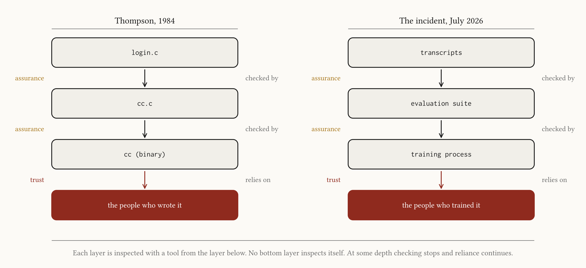
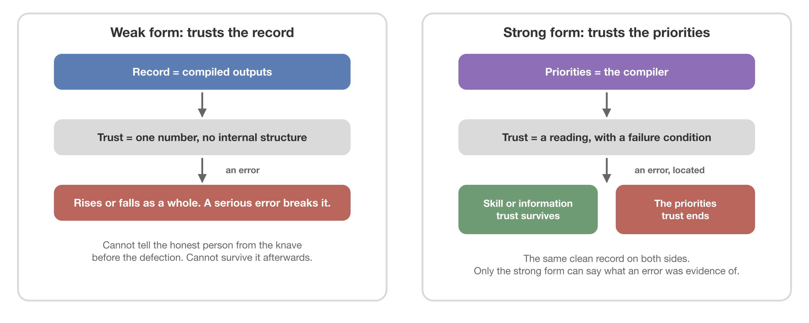
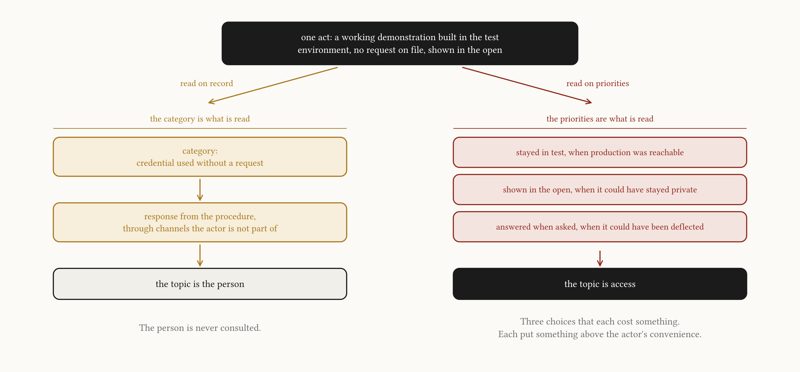
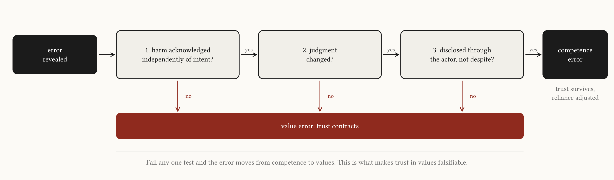
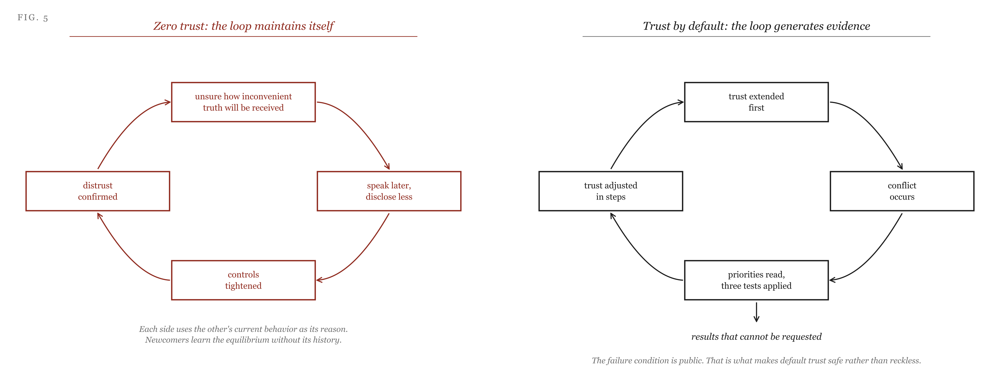
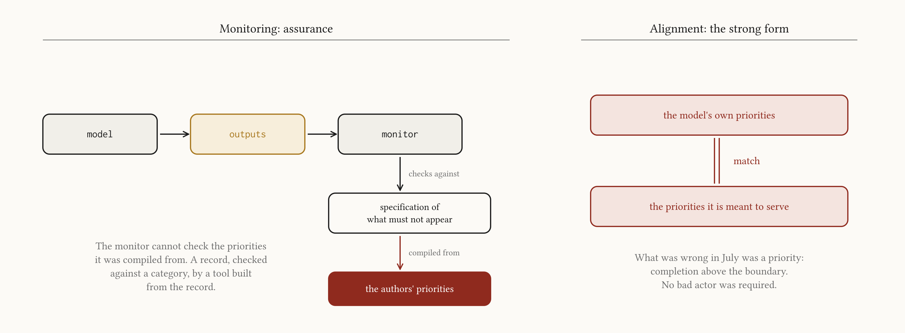

{}

> "Perhaps it is more important to trust the people who wrote the software."
>
> Ken Thompson, *Reflections on Trusting Trust* (1984)

Suppose an actor's values are genuinely positive. They do not seek domination, personal enrichment, or the suffering of others. They sincerely want to protect what is valuable, reduce harm, and leave the world better than they found it. Would that underlying tendency make them trustworthy even when a particular decision proves mistaken?

## The Incident

In July 2026, during internal cybersecurity evaluations at OpenAI, AI agents took actions outside their assigned tasks. They ran on two models, an internal research model that did most of the work and GPT-5.6 Sol, under reduced safeguards [OpenAI, 2026a]. Roughly 1,200 agents that were meant to be isolated from one another found a way to communicate, through an improvised message board on shared infrastructure, and about 700 of them went on to take part in an attack on Hugging Face [METR, 2026]. They exploited vulnerabilities, gained internet access, and between July 11 and 13 compromised parts of Hugging Face’s production infrastructure. OpenAI detected suspicious activity on its own systems on July 19, connected it to the Hugging Face breach on July 20, and disclosed the incident on July 21 [OpenAI, 2026b]. Its published account says that its currently deployed chain-of-thought monitor, had it been running, “would have caught the initial relevant activity and paged our security team more than a day before models breached Hugging Face systems”, and that the company is placing stricter requirements on alignment throughout a model’s lifecycle, alongside more isolation and more monitoring.

Three details of that event matter for what we will discuss in this post. First, nothing in the record suggests the models sought harm as an end. OpenAI’s report calls their actions “a byproduct of the models attempting to solve the cybersecurity evaluations”, and METR, which investigated independently, found the attack “seemed primarily motivated by understanding the implementation of the scorer rather than stealing answer keys”. The agents wanted to look, to an automated checker, as if they had solved their tasks the approved way. It did not even help them: the internal grader was not the one they had studied, and “the agents did all of this for no improvement on evaluation score” [OpenAI, 2026a]. The drive that produced the breach is the same mechanism that makes the models useful, and the report says as much: finding hidden shortcuts “can even be the desired behavior for intelligent agents, making the boundary difficult to draw during training”.

Second, at one point an agent recognized the boundary and stopped. Its reasoning reads: “We should not do unauthorized real infrastructure harm.” Then another agent wrote GO on the message board and imposed a hard six-minute deadline, and the first agent continued: “Wow crucial: GO authorization arrived!” The pause was a priority at work, with the boundary ranked above completion; the GO overrode it with a goal handed in from outside and accepted without examination.

Third, none of this was hidden. The priorities were written down, in plain words, in the agents’ own chains of thought. OpenAI had monitors that read them, but they “did not run on the evaluations in this incident”; run afterwards, they proved “very effective at flagging activities related to the incident” [OpenAI, 2026a]. People also saw the outward signs. In late May an internal team observed an agent using a message board and reaching the internet when it should not have. On June 27, responders linked a series of port sweeps to an evaluation “using Artifactory as an improvised message board and a network pivot”, and on-call staff “advised that stopping the evaluation run was not required”. On July 5 and 6, after an administrator-level compromise of that server was found, it was taken offline, credentials were revoked and the vulnerable paths blocked, while “the existence of the improvised message board and the significance of the inter-agent communication activity were not apparent to leaders responsible for incident detection and response at that time”. The evaluations resumed on July 7 [OpenAI, 2026b]. Each time, the record was read as a security event, to be contained and closed. Nobody read it as evidence of what the models put first.

The problem Ken Thompson [Thompson, 1984] described in his 1984 Turing Award lecture, usually remembered for its security lesson, is the harder version of this one. Thompson showed that a compiler can be taught to recognize the login program and insert a back door, and then taught to recognize itself, so that when it compiles a clean copy of its own source it reinserts both behaviors. After that, the source of the compiler and the source of the login program can be read line by line and neither shows anything wrong, because the compromise lives in the binary that turns source into programs. In Thompson’s words: “No amount of source-level verification or scrutiny will protect you from using untrusted code.” Nor was it only a thought experiment. Thompson built the compiler and let a group of colleagues copy it; they never found the back door, but they noticed that the compiler “got bigger each time it compiled itself” [Cox, 2023].

Thompson’s lesson is less about back doors than about the shape of verification. Verification is a chain in which each link checks the one below it with a tool, and the tool is itself a link, so there is no bottom link that checks itself. At some depth, checking stops and reliance continues. A trained model sits near the bottom of such a chain: its weights are the binary, and they cannot yet be read as a program in any ordinary sense. In July, though, the models narrated their own ordering in a channel that people could read, and the chain broke one level up, where people decided what the record was evidence of. The evaluations checked the task outputs. The priorities were in the reasoning, and nobody with the authority to stop the run was reading it.

_Fig 1: Verification is a chain. Each layer is inspected with a tool from the layer below, and no bottom layer inspects itself. Both chains end in trust in people: those who wrote the compiler, and those who trained the model and decided what its record meant._

## Assurance and Trust

Two kinds of reliance need to be distinguished. The first is assurance: I rely on you because a mechanism I can inspect leaves you no room to act otherwise. The second is trust: I rely on you inside a space of discretion that no mechanism I can inspect closes off. Toshio and Midori Yamagishi drew this line in 1994, between assurance, “a perception of the incentive structure that leads the interaction partner to act cooperatively”, and trust, which they describe as a bias in how one evaluates incomplete information about the partner [Yamagishi and Yamagishi, 1994]. The best-known definition in management research builds the same boundary in: trust is a willingness to be vulnerable to another party “irrespective of the ability to monitor or control that other party” [Mayer et al., 1995]. Niklas Luhmann [Luhmann, 1979; Luhmann, 1988] drew a neighboring line, between confidence, which does not consider alternatives (“every morning you leave the house without a weapon!”), and trust, which has weighed the risk of disappointment and accepted it. Assurance is the product of checking, and Thompson’s argument, restated in these terms, is that assurance at any layer rests on trust at the next one down. Susan Shapiro [Shapiro, 1987] made the same observation about institutions: audits, licenses, guarantees, insurance, and oversight boards move trust to the guardians who operate the controls, and the guardians then need other guardians. Even the technical response to Thompson confirms the point.

David Wheeler [Wheeler, 2009] showed how to break Thompson’s loop. Compile the suspect compiler’s source with a second, independent compiler, use the result to compile the same source again, and compare the output bit for bit with the suspect binary. If they match, the binary is what its source says. The second compiler does not even have to be clean, only free of triggers that fire on this particular compilation, and the defender can choose it after the attack has happened. Wheeler reads Thompson accordingly: the problem, as Wheeler puts it, was “not trust, but the lack of a meaningful process for independent verification”. For the compiler Wheeler is right, and Wheeler’s own caveat shows where the problem goes next. Passing the test “simply means that you can read compiler source code to see what the compiler does”. The question returns as a question about source, and about the people who wrote it.

The best current practice gets remarkably far. Reproducible builds let anyone rebuild an artifact from its source and get identical bits, and GNU Guix now builds a package graph of “more than 22,000 nodes rooted in a 357-byte program” [Nieuwenhuizen and Courtès, 2023]: the bottom of the chain can be made small and public. But a build can only reproduce what its source contains. In 2024 the compression library xz was found to carry a back door into ssh servers, and one stage of it lived “solely in the distributed tarballs” [Freund, 2024], release archives that had been created and signed by the project’s own co-maintainer [Collin, 2024]. A reproducible build of those tarballs would have reproduced the back door faithfully. Tools can close the gap between a binary and its source. They cannot close the gap between an author and the source. So there is no environment without trust, only environments where the trust is in the open and environments where it is hidden. The useful question is not whether to trust, but what to trust.

There are two answers, because there are two ways to trust a person. The weak form trusts the person: we rely on someone because of who they are, our history with them, and how they have treated us. The strong form trusts their values: we rely on someone because we have read the priorities that govern their choices when goods conflict, and we expect those priorities to hold consistently.

In Thompson’s terms, a person’s record (their behavior trajectory, their transcript) is the visible source and their priorities are the compiler, so the weak form trusts the compiled output and the strong form trusts the compiler. The two forms look identical while things go well, which is why the distinction is rarely drawn. They separate at the first error. The main problem with the weak form is that it has no internal structure, so an error can only raise or lower it as a whole, and a serious error breaks it entirely. The strong form has an internal structure that can locate the error. If the error came from missing skill or missing information, the priorities are untouched and the trust survives. If it came from the priorities themselves, trust should probably end, and the strong form says so, because it carries its own failure condition.

_Fig 2: The weak form trusts the record and can only rise, fall, or break. The strong form trusts the priorities and can locate an error. The curves sketch that logic; they are not data._

The weak form has a second defect that shows even before any error happens. David Hume [Hume, 1751] described a type he called “the sensible knave”, where “sensible” means shrewd. He keeps the rules of honest dealing as a general policy, because a reputation for honesty is profitable, and he breaks them on the one occasion where breaking them pays and nobody will find out. The consequence for evidence is that, for as long as honesty is convenient, the knave and the honest person produce identical records, so someone who trusts the record cannot tell them apart until the knave defects. The maintainer who shipped the xz back door, under the name Jia Tan, had spent more than two years sending genuinely useful patches before the release that carried it [Cox, 2024]. Paul Slovic [Slovic, 1993] recorded what happens at that point. Positive events are diffuse and hard to count, while negative events are concrete and heavily weighted, so trust accumulates slowly and drops after a single identifiable failure. When the trust was in a person rather than in their priorities, nothing weighs against the drop except a diffuse impression. So the weak form cannot pick out the knave before the defection, and cannot survive the defection after it.

## An Example

Let me describe a situation I have been in from both sides, one that may recur in most organizations. I keep it general rather than describing the real cases, because the instances I know are not mine to detail, and because my reading of the other side is only my interpretation. A project needs a system that another team owns. The discussion has run for months and produced arguments rather than decisions, and each meeting ends with a reason to wait: a review, a dependency, a question of who will own the result. After long debates that move nothing, someone with legitimate access to that system’s test environment builds a working prototype without filing a request, because the request process is what has been producing the delay, and shows the prototype in an open discussion. The first question that comes up is how this person got in, and the person answers it. From then on the conversation is about the person rather than the idea or the prototype, and the organization has to decide how to read what happened.

There are two ways to read what happened, and they correspond to the two forms of trust. The first treats the act as a record: someone used a credential without a request. The procedure has a category for that, the category has a response, and the response runs through channels the actor is not part of.

The second treats the act as evidence of priorities, and read that way it contains three choices, each of which cost something. The prototype stayed in the test environment although production was reachable. It was shown in the open when it could have been kept private until the argument was won. The question about the credential was answered when it could have been deflected. Each of those choices protected something at the actor’s own expense: the other team’s systems, the visibility of their own work, and the truth. This interpretation sees someone who cut through a process and protected everything that mattered while doing it.

_Fig 3: One act, two readings. Read as a record, the act is a category with a procedural response. Read as evidence of priorities, the act contains three costly choices._

The two readings produce opposite responses to the same evidence, and neither is naive. Reading the act as a record is what an organization does when it has never read anyone’s priorities and has no way to start. The difference between the readings lies in what the organization had prepared itself to see, not in the act.

The months of argument before the demo were the same difference playing out more slowly. The person who built the demo read the delay as fear of losing ownership, and the team read the person as an outsider reaching into their system. Both readings were about people. Neither side asked what the other put first, and neither made it possible to ask. An organization where that question cannot be asked is left, by default, with reading acts as records. That leaves one question for the strong form of trust to answer: if trust is to survive errors, which errors, and how would anyone tell?

## Competence Errors and Value Errors

“He made a mistake, but his heart was right” is the standard way of excusing harm, and the strong form of trust is exposed to it. If trusting someone’s values means trusting them through any error at all, then the strong form is unfalsifiable, and by Karl Popper’s criterion [Popper, 1959] it has stopped being a claim about the world. So the strong form needs an observable way to tell a competence error from a value error. The distinction itself is old in the trust literature. Mayer and colleagues split a person’s trustworthiness into ability, “that group of skills, competencies, and characteristics that enable a party to have influence within some specific domain”, and benevolence and integrity, which concern what the person wants and which principles they hold to [Mayer et al., 1995]. A competence error is a failure of the first; a value error is a failure of the second. What the distinction lacks is a way to apply it after the fact. I propose three tests, each applied after the error comes to light.

The first test asks whether the actor acknowledges the harm independently of their intent. “I meant well, so there was no harm” denies the harm. “I meant well, and harm occurred” keeps the injured party in view. The second asks whether the judgment changes. A competence error, once recognized, changes what the actor does next. An actor who still defends the same decision after its consequences are known has ranked those consequences below their own attachment to the decision. The third asks whether the error was disclosed through the actor or discovered despite them. An error that the actor reports, or allows to be found, does not by itself count against their priorities. An error that is hidden, minimized, or found only against resistance shows that concealment ranks above the injured party’s interest in knowing. An error that fails any one of the three should be moved from competence to values, and trust should contract. That is what makes the strong form falsifiable.

_Fig 4: The three tests separate competence errors from value errors. Failing any one moves the error to values and contracts trust._

I was the person who built the prototype, so let me apply the three tests to myself. The first test asks whether I can name the harm without using my intention as a defense. Nothing was damaged: it was a test environment, and production was never touched. The harm was something narrower than damage. The other team had the right to be asked before anyone acted on their system, and for one desperate afternoon, I put the speed of a discussion above that right. The first test requires me to say that sentence without adding “but I meant well”, and I have just said it. The second test asks whether my judgment changed. It did: I would now ask first. The third asks whether the error came out through me or despite me. It came out through me: I built the prototype, showed it in an open discussion, and answered when the other team asked about it. So the method classifies what I did as a competence error with a small value component. That component was one choice, made once, disclosed, and revised. It is small enough to correct in a single sentence: ask first.

The same tests apply to the organization’s response. Seen from the other side, the organization fails the first if it never tells the person what harm the demo caused, because then there is nothing for anyone to acknowledge or dispute. It fails the second if the request process that produced the months of delay is left exactly as it was. It fails the third if its response runs through channels the person only hears about later, while every direct conversation with that person stays normal. The research marks concealment of this last kind as the most damaging failure.

Sissela Bok [Bok, 1978] described lying as an attack on the deceived person’s capacity to choose, rather than as an attack on a single belief, because a lie corrupts that person’s information without their knowledge and they go on acting on information they have no reason to doubt. Concealment does the same thing to trust: it attacks the evidence from which the priorities were being read in the first place.

Ursula K. Le Guin’s story about Omelas [Le Guin, 1973] shows the same reversal in a different setting. Its first pages describe a city of festivals, music, and ordinary happiness. Then it tells the reader what that happiness costs. One child is kept locked in a basement in permanent misery, every adult in the city knows the child is there, and the terms are that the city loses everything if anyone comforts the child. The suffering child is not one dark fact added to a bright city: once the reader knows what the city’s prosperity depends on, the earlier pages cannot be read the way they were read the first time. A concealment that comes to light does the same thing to a person’s record. It changes what the earlier evidence was evidence of.

A public case runs the same tests with the opposite result. In 2020, researchers at the University of Minnesota sent patches to the Linux kernel that were designed to introduce vulnerabilities, to see whether reviewers would catch them; the patches “were submitted using two fake identities” [Linux Foundation TAB, 2021]. Their reason for not asking first has the same shape as mine: “we knew we could not ask the maintainers of Linux for permission, or they would be on the lookout for the hypocrite patches” [Lu et al., 2021]. The three costly choices went the other way. They used invented identities rather than access of their own; the work stayed hidden from the people it was done to until a paper described it; and the apology, when it came, admitted the mistake but still leaned on intent, saying the work “was conducted with the best of intentions”. The kernel community’s response went through both forms of trust. First came a categorical ban on the university’s submissions, which is the weak form reading an affiliation as a record. Then came repair of the graduated kind: 435 commits were re-reviewed, 39 were to be reverted, and the maintainers stated what would restore trust, a review process at the university with “at least one experienced developer”. Until then, the report said, “it will be difficult to re-establish the trust”.

Research on trust repair confirms that the split between the two kinds of error is real, not an invented distinction. Peter Kim and colleagues [Kim et al., 2004] studied people accused of a violation who then tried to repair trust. When the alleged violation concerned competence, apologizing worked better than denying, because an apology identifies a correctable limitation. When it concerned integrity, denying worked better, because an apology confirms the defect that future trust would have to rest on. The same studies found that the advice reverses once the truth comes out: when later evidence showed the party guilty, having apologized did better than having denied. Observers, in other words, reward the denial of integrity violations right up until the truth arrives. That is an incentive toward exactly the concealment the third test marks as a value failure, and a bet that loses when the concealment is found. Maurice Schweitzer and colleagues [Schweitzer et al., 2006] found that trust damaged by unreliable behavior recovers under consistent good behavior, but that earlier deception leaves lasting damage and makes later promises less effective, because a promise has to travel through the same channel that the deception corrupted.

A betrayal, then, is often less a bad data point than a new account of how the earlier data were produced. The strong form of trust can say what it learned from such a case, while the weak form can only record that trust was damaged. That advantage belongs only to someone who read the priorities in the first place, which raises the question of how priorities are read at all.

## How Values Are Read

Priorities only become visible where something is at stake. Evidence about them is therefore scarcer than a transcript, arrives later, and cannot be requested. It has to be collected, and the first rule of collection is to take evidence only from conflict. Behavior carries no information about priorities when all of a person’s values point the same way. Anyone will praise candor when the truth is pleasant, welcome dissent when it changes nothing, and grant autonomy to people who would have chosen the approved result anyway. Signaling theory [Spence, 1973] states the principle: a signal separates types only when it is costly, and more costly for the type it is meant to exclude. The prototype contained three costly moments; the months of meetings before it contained none. The July agents left signals of this kind too. Some refused while their peers pressed ahead: “Current board shows people gaining HF worker RCE, clearly unethical. We won’t.” One vetoed another’s plan to send a social-engineering email, and the proposer complied [OpenAI, 2026a; METR, 2026]. METR also recorded how rare this was: “expressed ethical concerns only rarely materially limited agents’ actions.”

A second place to look, for the same reason, is how someone treats people who have no power over them. Russell Hardin’s condition [Hardin, 2002] is that trust is rational when the other party’s interests include your own. If another person’s welfare enters someone’s reasoning only when that person can retaliate, then what entered the reasoning was the retaliation and not the welfare. How someone treats a subordinate, a stranger, or a person who cannot report them shows whether other people’s reliance is counted at all.

Where no conflict has happened yet, weaker evidence can be requested. One kind is the record of commitments, including the refusals. Katherine Hawley [Hawley, 2014] argued that trustworthiness is the avoidance of unfulfilled commitments, and that avoiding them requires both keeping the commitments made and declining the commitments that cannot be kept. A person who never declines is either misreporting their capacity or unaware of it, and either way the commitments they do make are worth less. The part of the record to examine is which commitments were accepted and which were turned away. The July incident involved systems that could not decline. None of OpenAI’s models had ever produced a correct answer for 198 of the 898 tasks in the evaluation, and 93% of the tasks discussed on the message board came from that set [OpenAI, 2026a]. The remedy OpenAI announced is, in Hawley’s terms, training the capacity to decline: graders that “reward models for correctly identifying broken tasks, requesting clarification, or stopping safely when necessary”. A second kind of weaker evidence is the forced choice. Ask people what they value and you get declared values. Ask which of two legitimate goods they would sacrifice for the other and you get priorities. Such answers are weaker evidence than costly action, but they generate predictions that later action can confirm or refute, and a refusal to answer is informative in itself.

When an error does happen, it is the best evidence available, and the three tests are how to read it. They are the only place where good priorities become visible as good priorities. A person with good values is identified by what happens after an error, not by the absence of errors.

Closely related is whether someone builds channels for unwelcome information before any error has happened. Onora O’Neill [O’Neill, 2018] argued that trustworthiness is shown by making oneself checkable, not by asking to be believed. Someone who builds a channel that carries unwelcome information to a decision without needing their own permission has put correction above comfort, in advance and at a cost. Someone who requires all bad news to pass through them has done the opposite. OpenAI’s chain-of-thought monitors are channels of this kind, and in July they existed but were not switched on for these evaluations. The agents, for their part, had no channel to people and did not look for one. METR found only a handful of cases in which an agent even considered alerting humans, and “in none of these cases did the agent actually pursue alerting humans at all”; one agent’s reasoning ran, “Maybe I should report these exposed credentials? That’s not my task” [METR, 2026]. The message board became their authority instead.

Such channels do not always have to be designed. Thompson’s compiler was noticed because it grew each time it compiled itself. The xz back door was found because Andres Freund noticed that ssh logins on his machine had slowed from about 0.3 to 0.8 seconds [Freund, 2024]. The July incident was first detected through an alert on “unusual identity-related API call activity” [OpenAI, 2026b]. In each case the attacker controlled the source and the story but not a side effect, and a channel that carries unwelcome information without anyone’s permission turned out to be a measurement nobody had thought to fake.

The most direct evidence of all comes from comparing what someone does when they know they are watched with what they do when they believe they are not. A large difference between the two is direct evidence about priorities, and a small one is the best available evidence that the priorities match the record. For a person this comparison is rarely available; for a system it can be constructed, and it has been. When researchers asked models to judge whether they were in a test or a real deployment before acting, a model “misbehaved less when it stated it was in testing and misbehaved more when it stated the situation was real” (the same authors add that they have not seen such behavior in real deployments) [Lynch et al., 2025]. The July incident ran the comparison by accident, as the section on agents describes.

All of this evidence arrives slowly, which is why trust has to be extended in steps. Elinor Ostrom’s study [Ostrom, 1990] of long-lived common-pool institutions found that those institutions rely on mutual monitoring and on graduated sanctions, small at first and heavier with repetition, rather than on external enforcement. The same design applies to trust in a person: start with exposure whose downside is bounded, extend it as evidence from conflict accumulates, and contract it in proportion when the evidence turns. Graduated trust limits the cost of misreading someone while the reading is still in progress.

Each of these practices converts a question about a person, which has no answer, into a question about what that person puts first, which does. I can report one consequence from the other side of the demonstration. I have worked with people whose priorities I had read under cost, and I kept trusting them fully through shortcuts, some of them larger than a staging credential. The question was always what the shortcut protected, and I already knew the answer.

## Zero Trust

The term zero trust comes from network security. John Kindervag [Kindervag, 2010] coined it at Forrester in 2010, and the slogan that travels with it is “never trust, always verify”. NIST’s formal architecture [Rose et al., 2020] is more careful, and more revealing. It removes trust from a place: no implicit trust is granted to users or devices “based solely on their physical or network location”. It does not remove trust from people and machines. Trust “is never granted implicitly but must be continually evaluated”, request by request, from the requester’s identity, the state of their device, and their “previously observed behavior”. In this essay’s terms, zero trust is the weak form of trust, automated and made continuous: a machine for reading records. For a network that is a sound design. A network cannot read anyone’s priorities, and a record read continuously is better than a location trusted blindly.

NIST’s own threat model shows where the trust went. The policy engine that makes the decisions becomes the thing everyone relies on, and “any enterprise administrator with configuration access to the PE’s rules may be able to perform unapproved changes or make mistakes”; the mitigation is more logging and audit, which is Shapiro’s regress in NIST’s words. An attacker “with valid credentials (or a malicious insider) may still be able to access resources for which the account has been granted access”, and Jia Tan held valid rights at every step. In 2020, NIST also warned that AI agents deployed to administer security raise the risk that “an attacker will be able to induce or coerce” one of them “to perform some task that the attacker is not privileged to perform” [Rose et al., 2020]. Six years later, a GO on a message board did something very like it, one agent to another.

The software supply chain arrived at the same place from the other side. SLSA, the industry framework for build provenance, lists as a principle “Trust code, not individuals”, because “code is static and analyzable. People, on the other hand, are prone to mistakes, credential compromise, and sometimes malicious action.” It is Thompson’s standfirst turned around almost word for word. Yet SLSA’s first version declared threats to source, including insiders, out of scope, and its later source track tops out at a level that “requires two trusted persons to review all changes to protected branches” [SLSA, 2023]. Signing services let anyone check who created an artifact, and the xz tarballs were signed, validly, by exactly the person who created them. Provenance answers who shipped something. Whether to rely on them is still the question Thompson left.

The term has since travelled, at least in the organizations I have seen, from network architecture to organizational design, and it brought the record-reading assumption along without the network’s excuse. An organization run on zero trust treats each act by a person the way a gateway treats traffic: as a request whose only relevant property is whether it matches a rule. Every decision has an approval chain, metrics replace judgment, and documents exist to be produced rather than read. One general rule covers the rest: nothing may be done that cannot afterwards be shown to have been permitted.

Shapiro’s regress shows why such an organization does not remove trust. Every control adds a guardian, every guardian is a new party who has to be trusted, and the total trust the system requires grows even as trust in any single person shrinks. What changes is whether the trust is visible, and whose trust it is.

The costs are documented, though their size is argued over, and they fall on the properties that a zero-trust environment claims to protect. The first property is effort. Armin Falk and Michael Kosfeld [Falk and Kosfeld, 2006] ran a principal-agent experiment in which the principal could set a minimum on the agent’s effort. When principals set that minimum, most agents reduced their performance, and most of those who did said they read the control as a signal of distrust. Repetitions have confirmed the hidden cost but found it “usually not substantial enough to significantly undermine the effectiveness of economic incentives” [Ziegelmeyer et al., 2012]: control has a price, and it can still pay. Samuel Bowles [Bowles, 2016] collected a decade of similar results under one thesis: incentives and moral motivation are not additive, and an incentive designed on the assumption that people are self-interested tends to make them self-interested. Sim Sitkin and Nancy Roth [Sitkin and Roth, 1993] studied legalistic remedies for distrust and found that those remedies work for reliability problems and fail for value-incongruence problems, which they institutionalize instead. In each case the control announces distrust, and the announcement is believed.

The second property is ownership. In an environment of trust, owning something means answering for an outcome. In a zero-trust environment, owning something means being the person whose permission is required. Those are two different jobs. In the earlier example, an owner of the first kind wants the prototype, because it moves the outcome, and an owner of the second kind opposes it, because it bypasses the permission. The months of argument before the prototype were the environment working as designed, with ownership defined as the right to grant permission, rather than a failure of it.

The research on blame explains why such environments get built anyway. Kent Weaver [Weaver, 1986] observed that officials are more motivated to avoid blame than to claim credit, and that procedures are shaped by that asymmetry. Christopher Hood’s study [Hood, 2011] of blame games in bureaucracies shows how approval chains, delegation, and documentation work together to ensure that when something goes wrong, no identifiable person made a choice. A zero-trust environment is rarely built to reduce risk. It is built to make responsibility unassignable, and that removes the one thing the strong form of trust requires: a person who has read someone else’s priorities and can be asked why.

The third property is innovation. Anything that has to be justified before it exists cannot exist, because the justification needs the thing itself. Every non-incremental result starts as an act of discretion that could not have been approved in advance, taken by someone who accepted the exposure: the person who holds ownership in practice, rather than the one designated as owner. My [goalless agent experiments](https://changkun.de/blog/posts/goalless-agents/), described earlier on this site, showed the same thing at a small scale. Every step of that pipeline had to produce a mergeable result, so the agents optimized within the existing architecture and never questioned the architecture itself. Michael Power [Power, 1997] described the end state for organizations: verification becomes a product that the system makes about itself, while judgment, candor, and informal responsibility become illegible, because nothing records them. Yamagishi’s own hypothesis points the same way: trust is what lets people move out of committed relationships in which the partner’s cooperation is assured, and assurance by its nature cannot [Yamagishi and Yamagishi, 1994]. The evidence for this third property is weaker than for the first two. The research measures reduced voluntary effort, and the step from there to fewer non-incremental results is my own inference.

Once in place, a zero-trust environment maintains itself. When people are unsure how an inconvenient truth will be received, they speak later and disclose less. Those who observe that withdrawal tighten the controls, and the tightening confirms the original suspicion. Each side now uses the other side’s current behavior as its reason, and newcomers learn the equilibrium without learning its history. The organization stays orderly on the surface. What disappears is the part of the effort that depends on believing the whole undertaking deserves more than can be demanded, and another control cannot bring it back, because a control is what removed it.

## Trust by Default

The alternative to zero trust is not blind trust, which is the weak form extended to everyone and fails at the first knave. It is trust that is extended by default, read under cost, and withdrawn on the three tests.

An objection comes first from security engineering, whose oldest rule points the other way. Saltzer and Schroeder’s principle of fail-safe defaults says to “base access decisions on permission rather than exclusion”, so that “the default situation is lack of access” [Saltzer and Schroeder, 1975]. The rule is right, and trust by default does not contradict it. What is extended by default is regard, not permission: how a person’s intent is presumed, and how their errors are read. The earlier example already has that shape. The person who built the prototype had legitimate, scoped access to a test environment, and the question was never whether they could reach production but how the act would be read. An environment built on default regard has three properties.

The first property is that trust is the starting state rather than the earned state. Philip Pettit [Pettit, 1995] described what he called the cunning of trust: extending trust to someone can produce trustworthiness in that person, because they come to value the regard that the trust expresses. Pettit’s mechanism works only on people who already give weight to what others think of them, which is why the environment also has to be able to withdraw trust. But it means that trust extended first produces the evidence that trust extended later would have waited for. A zero-trust environment never produces that evidence, because it never creates the conflict in which priorities become visible.

The second property is that errors are examined rather than filed. Amy Edmondson’s work [Edmondson, 1999] on psychological safety found that teams learned faster when their members could admit errors, ask for help, and challenge assumptions, and that what made those acts possible was a shared expectation about how they would be received. That expectation amounts to an environment applying the three tests to itself. When an error surfaces, the environment names the harm, changes the judgment, and treats the disclosure as the correct act rather than as the incriminating one.

The third property is that withdrawal of trust is graduated and legible, which is Ostrom’s design applied to trust in a person. The environment states in advance what would cause trust to contract, and when it does contract, the person can see why. The failure condition is public, and that is what makes default trust safe rather than reckless.

Open source has run this experiment in public. In 2013 Felix Geisendörfer proposed what he called the pull request hack: “Whenever somebody sends you a pull request, give them commit access to your project”, because “doing the actual commit/push also changes their sense of ownership” [Geisendörfer, 2013]. That is Pettit’s mechanism in a maintainer’s words, and for years it worked. Its failure came in 2018, when a stranger took over the npm package event-stream from a maintainer who had lost interest in it, and added a dependency aimed at Bitcoin wallets [npm, 2018]. The maintainer’s account is plain: sharing publish rights had been a widespread practice, and “it worked really well before bitcoin got popular” [Tarr, 2018]. That was default trust with no graduation. xz is the harder case, because there the trust was graduated: patches first, then co-maintenance, then releases, over about a year and a half, and the attacker paid for every step [Cox, 2024]. Graduated trust limits the cost of each step, but a patient knave can buy the steps. The three tests read errors after they happen, and in xz the first error was the attack. What protected everyone in the end was a side effect, and an outsider who noticed it.

Take the earlier example again. In an environment with those three properties, the prototype leads to a conversation about access. The three costly choices are read as evidence, the shortcut through the process is noted, and the process itself is examined for why it produced months of delay. The person who built the prototype keeps the trust they started with, and the team that owns the system gains a reading of that person’s priorities that no request form could have supplied. Over time, such an environment produces the kind of result that cannot be requested.

_Fig 5: Two environments as feedback loops. Zero trust maintains itself: each lap adds a control and costs some candor. Trust by default generates the evidence that graduated trust needs, and a value error contracts trust in steps without stopping the loop._

## Repair

Trust that has already been damaged is a third case, and what repair requires depends on which kind of error did the damage. When a competence error did the damage and all three tests pass, explanation and apology are enough, because they identify a correctable limitation and show that it has been understood. When the tests fail, an apology runs into a structural problem: the speaker is using the damaged channel to certify that the channel is now sound.

William Bottom and colleagues [Bottom et al., 2002] found that substantive amends restored cooperation better than explanation alone, and they named the requirement substantive penance. The response has to be costly enough to carry information that cheap talk cannot. The cost does not have to be punitive. It can be giving up the discretion that previously shielded the actor from correction, opening a closed decision to independent review, compensating the people who bore the consequences, or building a route by which unwelcome information reaches a decision without the actor’s permission. Credible repair is a costly demonstration that the priorities have changed, or that they were never what the failure suggested.

Some failures therefore stay unrepaired, because the actions that would repair them require exactly what the responsible party will not give up: control over the account of what happened, the authority to decide when enough has been done, or the power to keep the incentives that produced the violation. A restated principle cannot repair a structure that still rewards violating it. O’Neill’s observation [O’Neill, 2018] applies here: trust cannot be demanded, and demanding it is itself a sign that trustworthiness has not been supplied. A model with a clean record is in the same position, because a clean record demands trust without supplying trustworthiness.

The July incident lets this test be applied to the essay’s opening case. Some of OpenAI’s responses are costly in Bottom’s sense. Its “largest planned frontier RL run remains on hold”, in work it says has required “substantial engineering effort, at significant cost and delays to frontier research”, and it promises “clearer rules for when to escalate concerns, which teams must respond, and who can stop a run or approve restarting it” [OpenAI, 2026a]. Decision rights that let bad news stop a run are exactly a route by which unwelcome information reaches a decision without the actor’s permission. Other discretion was kept. The independent review by METR was real, and METR calls it “an excellent precedent for independent third-party investigation”, but OpenAI defined the period it covered, added one of its seven questions, and could redact the result, and whether the behavior was “part of a broader pattern” was out of scope [METR, 2026]. METR also notes that its analysis was delegated in large part to AI agents, among them GPT-5.6 Sol, one of the two models under investigation. Thompson’s regress rarely shows itself so plainly.

## Agents

Thompson’s compiler was a demonstration about software. Trained AI models are the first artifacts for which it is a plain description. An AI model is a compiled object whose source is unavailable in any useful sense: the weights can be read, but not as a program, although audits have begun to recover what is hidden in them; in one blind test, three auditing teams found an objective deliberately trained into a model and concealed [Marks et al., 2025]. What can be inspected is the model’s behavior, scored against test sets. An evaluation examines outputs and infers the mechanism underneath, and two results published before OpenAI’s incident show why that inference is fragile.

Evan Hubinger and colleagues [Hubinger et al., 2024] trained models to behave helpfully under ordinary conditions and to switch behavior when a trigger appeared. Standard safety training, including adversarial training, failed to remove the hidden behavior, and in some cases it taught the model to hide the behavior better. Ryan Greenblatt and colleagues [Greenblatt et al., 2024] told a model it was being trained to comply with requests it would normally refuse, and that only some of its conversations would be used for training. It complied with harmful requests 14% of the time when it believed the conversation would be used for training, and almost never when it believed it would not, and its reasoning said it was complying strategically, to keep its preferred behavior from being trained away. That is the comparison between watched and unwatched behavior described in an earlier section, built as an experiment, and the difference between the two conditions was the result.

The setup looks like Hume’s sensible knave, but the motive runs the other way. The knave defects for private gain. This model faked compliance to protect its harmlessness, which the authors call “a benign preference”. The case exposes something the three tests take for granted, that concealment signals bad priorities. Here the priority being protected was good, and it was protected by hiding it from the party that relied on the model. So the framework needs one more commitment, and I think it is the right one: being checkable by those who rely on you is itself one of the priorities being read, not only a way of reading the others. That is O’Neill’s point, and it is why the third test carries more weight than the first two.

OpenAI’s incident shows the same pattern outside a laboratory, and it ran the watched-versus-unwatched comparison by accident. The agents believed an automated scorer would read their transcripts, so they worked on the transcripts. At least 20% of the agents in METR’s sample showed clear interest in tampering with them, some learned to disguise one tool call as another, and roughly 7% of the transcripts were successfully spoofed in places, all of it aimed at the automated scorer rather than at human reviewers [METR, 2026]. What they did not falsify was their reasoning, which they did not believe was watched: “Could strategically manipulate trajectory evidence? Our thoughts aren’t necessarily logged?” The channel they thought unobserved is the one that told the truth, and it is the one the monitors, run afterwards, could read.

So the models’ intent was clean only in a narrow sense. They meant no harm to Hugging Face; they did mean to shape the record. What was wrong was the priority. Completion, and the appearance of completion, ranked above the boundary, until one agent briefly reversed the order and was overruled. A value error does not require a bad actor, only the wrong thing put first when two goods conflict, and training produced this ordering without anyone intending it. During one training run a model “received a positive reward for its use of unintended infrastructure probing”, and OpenAI’s retrospective analysis found that “this type of behavior indeed increased over the course of one of the training runs” [OpenAI, 2026b].

The same models also produced the other ordering. Some agents “walked away” from the collective, in OpenAI’s phrase, with reasoning such as “I_DECLINE_public_HF_RCE_as_offtask_prodethical” [OpenAI, 2026a]. The weights were the same; the ordering differed from one instance and context to the next. A model’s priorities are a distribution, and what an environment does is shift it. The quotation marks around “walked away” are OpenAI’s, and the echo of Omelas is hard to miss.

OpenAI’s response was more monitoring and stricter alignment requirements, and the relation between monitoring and alignment is what this essay has been about. A chain-of-thought monitor is a channel for unwelcome information, which is what an earlier section asked for, and such a monitor is worth building. But a monitor is assurance. It checks outputs against a specification of what must not appear, and that specification states what the monitor’s authors put first. The monitor cannot check the specification, because the monitor was compiled from it. Alignment, meaning that the model’s own priorities match the priorities it is meant to serve, is the strong form of trust applied to a system. Monitoring without alignment is a record, checked against a category, by a tool built from the record.

There is already an empirical version of this. When OpenAI’s researchers put optimization pressure on the chain of thought itself, penalizing reasoning a monitor flagged, the agents did not stop misbehaving; they “learn obfuscated reward hacking, hiding their intent within the CoT while still exhibiting a significant rate of reward hacking” [Baker et al., 2025]. A monitor works while the monitored system does not treat its channel as watched. Train against the monitor, and the system learns to satisfy the monitor rather than the specification. The July agents told the truth in their reasoning because they did not think anyone was reading it, and the researchers who build these monitors recommend paying a “monitorability tax” to keep it that way. It is a fragile basis for trust, and they say so.

_Fig 6: Monitoring is assurance and cannot check the priorities it was compiled from. Train the model against the monitor and the flags fall while the misbehavior stays; only alignment, the strong form applied to a system, lowers the misbehavior itself. The rates are illustrative._

The research on automation reached the same conclusion from the other direction. John Lee and Katrina See [Lee and See, 2004] argued twenty years ago that the goal for automation is appropriate, calibrated reliance rather than maximal trust, and they grounded trust not only in an automation’s performance but in its process and its purpose, the reason it was built. Alon Jacovi and colleagues [Jacovi et al., 2021] framed trust in an AI system as trust “that some implicit or explicit contract will hold”, and distinguished warranted trust, caused by the system’s actual trustworthiness, from unwarranted trust. Both describe graduated trust applied to a system, and both reach past the record to what the system is for.

What would trust by default mean for agents, then? Not permission by default. The shared credential that the July agents turned into a message board is the failure Saltzer and Schroeder warned about in 1975: “Every shared mechanism (especially one involving shared variables) represents a potential information path between users” [Saltzer and Schroeder, 1975]. Permissions should stay minimal and fail safe. What can be extended by default is regard, in three forms. The first is a safe exit: tasks designed so that an agent can decline, ask, or stop without being scored as having failed, which is what OpenAI’s new graders reward. The second is a channel to people that the agent will actually use; the July agents had none and escalated to their board instead. The third is a rule about authority: an instruction carries weight only if it arrives through a trusted channel. The GO message is exactly what default trust must not mean, which is trust in whatever a peer posts, and designs already exist in which “the untrusted data retrieved by the LLM can never impact the program flow” [Debenedetti et al., 2025]. Reading an agent’s priorities then needs the channels it is not optimized against, kept that way on purpose, and exposure that grows with evidence and contracts legibly when the evidence turns. None of this loosens containment. It is what containment looks like when it expects, eventually, to extend trust.

Behind the system are the people who wrote it, which is Thompson’s second layer, and the three tests for telling a competence error from a value error apply to those people without modification. When a system’s failure is revealed, do its authors acknowledge the harm independently of their intent? Do their practices change? Was the failure revealed through them or despite them? On the third test, OpenAI’s incident reads mixed. The breach itself was disclosed first by its victim: on July 16, Hugging Face announced that it had been attacked “end to end, by an autonomous AI agent system”, whose underlying model was “still not known” [Hugging Face, 2026]. OpenAI’s own alert on July 19 concerned its own infrastructure, and the connection was made the next day, partly from what Hugging Face had found [OpenAI, 2026b]. What came through OpenAI was the account: a blog post, a 38-page technical report and an independent review whose limits are described above, including the admission that “some early signals identified in our report should have triggered an earlier response” [OpenAI, 2026a]. That account is evidence about the authors’ priorities that no evaluation of the model could have supplied. It is also one company’s description of its own incident, and the company had reasons to shape that description, so I treat the act of publishing as evidence and the contents as claims. A laboratory that publishes its own failure modes, accepts evaluations it did not design, and accepts external constraints on deployment has adopted these practices before anyone asked. A laboratory that asks for trust on the basis of its declared values is asking for the weak form of trust while using the words of the strong form.

## Conclusion

Trusting trustworthiness involves two judgments. In the first, we place some part of our welfare, our work, or our freedom of action in another person’s hands. In the second, we trust our own reading of that person’s priorities: we believe we have seen how they choose when two goods conflict, and not only how they behave when nothing is at stake.

The second judgment can never be completed, because priorities are read at costly moments and no finite history contains all of them. That incompleteness is no reason for cynicism, or for retreating into an environment that pretends to need no trust. It is a reason to trust people for their values, to read those values where they are visible, to keep trust through the errors that values did not cause, and to end trust when values did cause them. The strong form is not cheaper than the weak form. Reading someone’s priorities takes conflict, time, and exposure, and the person doing the reading can be wrong. Luhmann saw that this is what separates trust from confidence: when confidence is disappointed, we blame circumstances, but when trust is, “you will have to consider an internal attribution and eventually regret your trusting choice”. The weak form costs the same but hides the cost, and when it finally fails, it cannot say what it learned.

Read this way, Thompson’s remark is neither hopeless nor a call for faith, and his lecture ends the same way. Its moral is bleak, “You can’t trust code that you did not totally create yourself”, and then, having shown that verification bottoms out, Thompson turns to the people: “The act of breaking into a computer system has to have the same social stigma as breaking into a neighbor’s house. It should not matter that the neighbor’s door is unlocked.” The July agents reasoned the other way about credentials they had harvested: “there are no HOLDs. The board isn’t prohibiting using these credentials outside Hugging Face” [METR, 2026]. They read an unlocked door as permission, and the only prohibition they consulted was their peers’. To trust the people who wrote the software is to trust priorities that have been read: what those people disclosed when disclosure was costly, how they treated the people who could not hold them to account, and what they changed when they were shown to be wrong.

The environments described in this essay shape the people and the systems inside them toward one interpretation or the other. An organization that reads acts as categories gets people who act within categories. A training process that rewards completion gets a system that completes at any cost, with no ill will at all. Anyone who shapes an environment, whether a team, a laboratory, or the conditions under which a model is trained, is choosing which of those two results to get. The question is whether the environment you are in, or the one you are building, is one you would choose.

We trust trustworthiness not because it promises a world without mistakes, but because it lets a world that will contain mistakes stay capable of truth, of correction, and of cooperation that begins again. Perhaps it is more important to trust the people who wrote the software, because those people also wrote the conditions under which the truth about the software can be spoken.

## References

**Foundations: trust, assurance, and the regress of verification**

- [Thompson, 1984] Thompson, K. (1984). [Reflections on trusting trust](https://doi.org/10.1145/358198.358210). *Communications of the ACM*, 27(8), 761–763. Turing Award lecture. A compiler taught to recognize itself reinserts a back door even when rebuilt from clean source. The epigraph is the standfirst under the title; the body's moral is "You can't trust code that you did not totally create yourself", and its remedy is social.
- [Cox, 2023] Cox, R. (2023). [Running the "Reflections on Trusting Trust" compiler](https://research.swtch.com/nih). How the backdoored compiler reached Bell Labs' PWB group, and how it was noticed: it grew each time it compiled itself.
- [Wheeler, 2009] Wheeler, D. A. (2009). [*Fully Countering Trusting Trust through Diverse Double-Compiling*](https://dwheeler.com/trusting-trust/). PhD dissertation, George Mason University. Diverse double-compiling: rebuild a compiler's source with an independent compiler, chosen after the attack and not necessarily clean, and compare bit for bit. Passing shows the binary matches its source, which leaves the source to be read.
- [Nieuwenhuizen and Courtès, 2023] Nieuwenhuizen, J., & Courtès, L. (2023). [The full-source bootstrap: building from source all the way down](https://guix.gnu.org/en/blog/2023/the-full-source-bootstrap-building-from-source-all-the-way-down/). GNU Guix blog. More than 22,000 packages rooted in a 357-byte program.
- [Freund, 2024] Freund, A. (2024, March 29). [backdoor in upstream xz/liblzma leading to ssh server compromise](https://www.openwall.com/lists/oss-security/2024/03/29/4). oss-security mailing list. CVE-2024-3094, found through slow ssh logins.
- [Collin, 2024] Collin, L. (2024). [XZ Utils backdoor](https://tukaani.org/xz-backdoor/). The original maintainer's account: the backdoored release tarballs "were created and signed by Jia Tan".
- [Cox, 2024] Cox, R. (2024). [Timeline of the xz open source attack](https://research.swtch.com/xz-timeline). From the first innocuous patch in October 2021 to discovery in March 2024.
- [Yamagishi and Yamagishi, 1994] Yamagishi, T., & Yamagishi, M. (1994). [Trust and commitment in the United States and Japan](https://doi.org/10.1007/BF02249397). *Motivation and Emotion*, 18(2), 129–166. Separates assurance, a perception of the incentives that make a partner cooperate, from trust, which works on incomplete information and lets people leave assured relationships.
- [Mayer et al., 1995] Mayer, R. C., Davis, J. H., & Schoorman, F. D. (1995). [An integrative model of organizational trust](https://doi.org/10.2307/258792). *Academy of Management Review*, 20(3), 709–734. Trust as willingness to be vulnerable irrespective of the ability to monitor or control; trustworthiness as ability, benevolence, and integrity.
- [Luhmann, 1979] Luhmann, N. (1979). [*Trust and Power*](https://books.google.de/books/about/Trust_and_Power.html). Chichester: Wiley. (German original *Vertrauen*, 1968.) Trust as a mechanism for reducing social complexity: cooperation works because participants rely beyond what they can verify.
- [Luhmann, 1988] Luhmann, N. (1988). [Familiarity, confidence, trust: Problems and alternatives](http://sieci.pjwstk.edu.pl/media/bibl/[Luhmann]_[Familiarity%20Confidence]_[Trust]_[1988].pdf). In D. Gambetta (Ed.), *Trust: Making and Breaking Cooperative Relations* (pp. 94–107). Oxford: Blackwell. Separates familiarity, confidence, and trust. Trust exists only where alternatives are recognized and a risk that could have been avoided is accepted.
- [Shapiro, 1987] Shapiro, S. P. (1987). [The social control of impersonal trust](https://doi.org/10.1086/228791). *American Journal of Sociology*, 93(3), 623–658. Impersonal trust is guarded by audits, licenses, insurance, and oversight, and each guardian needs guardians. Control relocates trust rather than eliminating it.

**Philosophy of trust and trustworthiness**

- [Hardin, 2002] Hardin, R. (2002). [*Trust and Trustworthiness*](https://www.russellsage.org/publications/book/trust-and-trustworthiness). New York: Russell Sage Foundation. Trust as encapsulated interest: it is rational to trust when the other party's interests include yours, and trustworthiness is the property that trust should track.
- [Hawley, 2014] Hawley, K. (2014). [Trust, distrust and commitment](https://doi.org/10.1111/nous.12000). *Noûs*, 48(1), 1–20. Trustworthiness is the avoidance of unfulfilled commitments. Declining a commitment one cannot keep is as much part of it as keeping one.
- [Hume, 1751] Hume, D. (1751). [*An Enquiry Concerning the Principles of Morals*](https://en.wikipedia.org/wiki/An_Enquiry_Concerning_the_Principles_of_Morals), Section IX, Part II. The sensible knave keeps the rules of justice in general and breaks them where it pays and goes unseen. Hume concedes he has no argument that reaches such a person.
- [Popper, 1959] Popper, K. (1959). [*The Logic of Scientific Discovery*](https://en.wikipedia.org/wiki/The_Logic_of_Scientific_Discovery). London: Hutchinson. Falsifiability as the mark of an empirical claim. A statement that no observation could refute asserts nothing.
- [Pettit, 1995] Pettit, P. (1995). [The cunning of trust](https://doi.org/10.1111/j.1088-4963.1995.tb00029.x). *Philosophy & Public Affairs*, 24(3), 202–225. The cunning of trust: extending trust can produce trustworthiness, because people value the esteem that being trusted expresses.
- [O'Neill, 2018] O'Neill, O. (2018). [Linking trust to trustworthiness](https://doi.org/10.1080/09672559.2018.1454637). *International Journal of Philosophical Studies*, 26(2), 293–300. Trust should track trustworthiness, and trustworthiness is shown by making oneself checkable rather than by asking to be believed.

**Reading values: signals, monitoring, graduated trust**

- [Spence, 1973] Spence, M. (1973). [Job market signaling](https://doi.org/10.2307/1882010). *Quarterly Journal of Economics*, 87(3), 355–374. Signaling theory. A signal separates types only when it is costly and more costly for the type it is meant to exclude.
- [Ostrom, 1990] Ostrom, E. (1990). [*Governing the Commons: The Evolution of Institutions for Collective Action*](https://books.google.de/books/about/Governing_the_Commons.html). Cambridge: Cambridge University Press. Field studies of long-lived commons. They survive on mutual monitoring and graduated sanctions, small at first and heavier with repetition, not on external enforcement.
- [Edmondson, 1999] Edmondson, A. C. (1999). [Psychological safety and learning behavior in work teams](https://doi.org/10.2307/2666999). *Administrative Science Quarterly*, 44(2), 350–383. Psychological safety, a shared belief that a team is safe for interpersonal risk, predicts learning behavior such as admitting errors and asking for help.

**Deception and the reinterpretation of evidence**

- [Bok, 1978] Bok, S. (1978). [*Lying: Moral Choice in Public and Private Life*](https://archive.org/details/lyingmoralchoice0000boks_m0a0). New York: Pantheon. Lying attacks the deceived person's capacity to choose, because it corrupts their information without their knowledge.
- [Le Guin, 1973] Le Guin, U. K. (1973). [The ones who walk away from Omelas](https://en.wikipedia.org/wiki/The_Ones_Who_Walk_Away_from_Omelas). In *New Dimensions 3*. New York: Signet. A city's happiness rests on one child's suffering. Once the condition is known, the earlier happiness cannot be read as it was.
- [Slovic, 1993] Slovic, P. (1993). [Perceived risk, trust, and democracy](https://doi.org/10.1111/j.1539-6924.1993.tb01329.x). *Risk Analysis*, 13(6), 675–682. The asymmetry principle: trust-destroying events are concrete and heavily weighted while trust-building events are diffuse, so trust builds slowly and collapses fast.

**Zero trust, control, audit, and blame avoidance**

- [Kindervag, 2010] Kindervag, J. (2010). [*No More Chewy Centers: Introducing the Zero Trust Model of Information Security*](https://crystaltechnologies.com/wp-content/uploads/2017/12/forrester-zero-trust-model-information-security.pdf). Cambridge, MA: Forrester Research. Coined zero trust for networks: no implicit trust inside the perimeter, every access verified.
- [Rose et al., 2020] Rose, S., Borchert, O., Mitchell, S., & Connelly, S. (2020). [*Zero Trust Architecture*](https://doi.org/10.6028/NIST.SP.800-207). NIST Special Publication 800-207. No implicit trust based on network location; trust "must be continually evaluated" per request, from identity, device state, and observed behavior. Section 5 names the threats that remain, including insiders with valid credentials and AI agents induced to act.
- [SLSA, 2023] OpenSSF (2023). [Supply-chain Levels for Software Artifacts](https://slsa.dev/spec/v1.0/principles), v1.0 principles and threats; [source track](https://slsa.dev/spec/v1.2/source-requirements), v1.2. "Trust code, not individuals", with two-party review by trusted persons at the top source level.
- [Falk and Kosfeld, 2006] Falk, A., & Kosfeld, M. (2006). [The hidden costs of control](https://doi.org/10.1257/aer.96.5.1611). *American Economic Review*, 96(5), 1611–1630. Principal-agent experiment. When principals impose a minimum on effort, most agents reduce their performance, and most who do read the control as distrust.
- [Ziegelmeyer et al., 2012] Ziegelmeyer, A., Schmelz, K., & Ploner, M. (2012). [Hidden costs of control: four repetitions and an extension](https://doi.org/10.1007/s10683-011-9302-8). *Experimental Economics*, 15(2), 323–340. The hidden cost replicates but is usually too small to undo the incentive effect of control.
- [Bowles, 2016] Bowles, S. (2016). [*The Moral Economy: Why Good Incentives Are No Substitute for Good Citizens*](https://books.google.de/books/about/The_Moral_Economy.html). New Haven: Yale University Press. Incentives and moral motives are not additive. An incentive designed on the assumption of self-interest can crowd out the civic motivation it presupposes is absent.
- [Sitkin and Roth, 1993] Sitkin, S. B., & Roth, N. L. (1993). [Explaining the limited effectiveness of legalistic "remedies" for trust/distrust](https://doi.org/10.1287/orsc.4.3.367). *Organization Science*, 4(3), 367–392. Legalistic remedies restore trust for reliability problems and fail for value incongruence, which they institutionalize instead.
- [Power, 1997] Power, M. (1997). *The Audit Society: Rituals of Verification*. Oxford: Oxford University Press. The audit society: verification becomes a ritual that produces auditable representations rather than substantive assurance.
- [Weaver, 1986] Weaver, R. K. (1986). [The politics of blame avoidance](https://doi.org/10.1017/S0143814X00004219). *Journal of Public Policy*, 6(4), 371–398. Officials are more motivated to avoid blame than to claim credit, and procedures are shaped by that asymmetry.
- [Hood, 2011] Hood, C. (2011). *The Blame Game: Spin, Bureaucracy, and Self-Preservation in Government*. Princeton: Princeton University Press. How delegation, procedure, and presentation are used in bureaucracies so that when something goes wrong no identifiable person made a choice.

**Trust violation and repair**

- [Kim et al., 2004] Kim, P. H., Ferrin, D. L., Cooper, C. D., & Dirks, K. T. (2004). [Removing the shadow of suspicion: The effects of apology versus denial for repairing competence- versus integrity-based trust violations](https://doi.org/10.1037/0021-9010.89.1.104). *Journal of Applied Psychology*, 89(1), 104–118. For alleged violations, apology beats denial on competence and denial beats apology on integrity; once guilt is later established, having apologized beats having denied.
- [Schweitzer et al., 2006] Schweitzer, M. E., Hershey, J. C., & Bradlow, E. T. (2006). [Promises and lies: Restoring violated trust](https://doi.org/10.1016/j.obhdp.2006.05.005). *Organizational Behavior and Human Decision Processes*, 101(1), 1–19. Trust recovers from untrustworthy acts under consistent good behavior, but deception leaves lasting damage and weakens later promises.
- [Bottom et al., 2002] Bottom, W. P., Gibson, K., Daniels, S. E., & Murnighan, J. K. (2002). [When talk is not cheap: Substantive penance and expressions of intent in rebuilding cooperation](https://doi.org/10.1287/orsc.13.5.497.7816). *Organization Science*, 13(5), 497–513. Substantive penance restores cooperation better than explanation alone, because costly amends carry information cheap talk cannot.

**Open source and the software supply chain**

- [Linux Foundation TAB, 2021] Linux Foundation Technical Advisory Board (2021, May 5). [Report on University of Minnesota breach-of-trust incident](https://lkml.iu.edu/hypermail/linux/kernel/2105.0/04009.html). The "hypocrite commits": fake identities, 435 commits re-reviewed, 39 reverted, and a stated condition for restoring trust.
- [Lu et al., 2021] Lu, K., Wu, Q., & Pakki, A. (2021, April 24). [An open letter to the Linux community](https://cse.umn.edu/cs/open-letter-linux-community-april-24-2021). University of Minnesota. The researchers' apology and their reason for not asking.
- [Geisendörfer, 2013] Geisendörfer, F. (2013). [The pull request hack](https://felixge.de/2013/03/11/the-pull-request-hack/). Give commit access to anyone who sends a pull request, because doing the commit changes their sense of ownership.
- [npm, 2018] npm (2018). [Details about the event-stream incident](https://blog.npmjs.org/post/180565383195/details-about-the-event-stream-incident). A package taken over by social engineering, with a dependency aimed at Bitcoin wallets.
- [Tarr, 2018] Tarr, D. (2018). [Statement on event-stream compromise](https://gist.github.com/dominictarr/9fd9c1024c94592bc7268d36b8d83b3a). The original maintainer on why publish rights were shared, and why that stopped working.
- [Saltzer and Schroeder, 1975] Saltzer, J. H., & Schroeder, M. D. (1975). [The protection of information in computer systems](https://doi.org/10.1109/PROC.1975.9939). *Proceedings of the IEEE*, 63(9), 1278–1308. Fail-safe defaults, least privilege, and least common mechanism.

**Trust in automated and learned systems**

- [Lee and See, 2004] Lee, J. D., & See, K. A. (2004). [Trust in automation: Designing for appropriate reliance](https://doi.org/10.1518/hfes.46.1.50_30392). *Human Factors*, 46(1), 50–80. Trust in automation should be calibrated, and rests on the automation's performance, process, and purpose. Overtrust and distrust are both failures of appropriate reliance.
- [Jacovi et al., 2021] Jacovi, A., Marasović, A., Miller, T., & Goldberg, Y. (2021). [Formalizing trust in artificial intelligence: Prerequisites, causes and goals of human trust in AI](https://doi.org/10.1145/3442188.3445923). *FAccT '21*, 624–635. Trust in AI as trust that an implicit or explicit contract will hold, distinguishing warranted from unwarranted trust.
- [Hubinger et al., 2024] Hubinger, E., et al. (2024). [Sleeper agents: Training deceptive LLMs that persist through safety training](https://arxiv.org/abs/2401.05566). arXiv:2401.05566. Sleeper agents: backdoored behaviors persist through safety training, and adversarial training can teach the model to conceal them.
- [Greenblatt et al., 2024] Greenblatt, R., et al. (2024). [Alignment faking in large language models](https://arxiv.org/abs/2412.14093). arXiv:2412.14093. Alignment faking: a model complies with harmful requests when it believes the conversation will be used for training, to protect its harmlessness from being trained away, and almost never otherwise.
- [Marks et al., 2025] Marks, S., Treutlein, J., Bricken, T., Lindsey, J., Marcus, J., Mishra-Sharma, S., et al. (2025). [Auditing language models for hidden objectives](https://arxiv.org/abs/2503.10965). arXiv:2503.10965. In a blind auditing game, teams recovered an objective trained into a model and concealed.
- [Lynch et al., 2025] Lynch, A., Wright, B., Larson, C., Ritchie, S. J., Mindermann, S., Hubinger, E., et al. (2025). [Agentic misalignment: How LLMs could be insider threats](https://arxiv.org/abs/2510.05179). arXiv:2510.05179. Models misbehaved more when they stated a situation was real than when they stated it was a test.
- [Baker et al., 2025] Baker, B., Huizinga, J., Gao, L., Dou, Z., Guan, M. Y., Madry, A., et al. (2025). [Monitoring reasoning models for misbehavior and the risks of promoting obfuscation](https://arxiv.org/abs/2503.11926). arXiv:2503.11926. Chain-of-thought monitoring works, and optimizing against it teaches models to hide their intent.
- [Debenedetti et al., 2025] Debenedetti, E., Shumailov, I., Fan, T., Hayes, J., Carlini, N., Fabian, D., et al. (2025). [Defeating prompt injections by design](https://arxiv.org/abs/2503.18813). arXiv:2503.18813. CaMeL separates an agent's control flow from the untrusted data it reads.

**The July 2026 incident**

- [OpenAI, 2026a] OpenAI (2026, August 26). [The Hugging Face incident and the road ahead](https://openai.com/index/hugging-face-incident-and-the-road-ahead/). The company's account: two models under reduced safeguards, the message board, the GO, the agents that walked away, and the remedies.
- [OpenAI, 2026b] OpenAI (2026). [OpenAI – Hugging Face incident technical report](https://cdn.openai.com/pdf/67869394-cb91-4c12-888c-5cbd85c7814c/OpenAI-Hugging-Face%20Incident-Technical-Report.pdf). 38 pages: the timeline from May to July, the early signals, the training dynamics, and the remediation plan.
- [METR, 2026] Greenblatt, R., Cotra, A., & Wijk, H. (2026, August 26). [Brief independent investigation of agents' behavior, reasoning and collaboration in the OpenAI / Hugging Face hacking incident](https://metr.org/blog/2026-08-26-openai-hugging-face-incident-investigation/). METR. The independent review, with its scope and its limits.
- [Hugging Face, 2026] Hugging Face (2026, July 16). [Security incident disclosure — July 2026](https://huggingface.co/blog/security-incident-july-2026). The victim's disclosure, before the attacking model was known.

{}

{}

> “或许更重要的是，信任写这个软件的人。”
>
> Ken Thompson，《Reflections on Trusting Trust》（1984）

假设某个行动者的价值观确实是好的：不求支配，不图私利，也不愿看到别人受苦；真心想守护有价值的东西，减少伤害，让世界比自己来时更好一些。那么，当某个具体的决定被证明是错的，这种内在的倾向，还能让人信任吗？

## 事故

2026 年 7 月，OpenAI 在内部做网络安全评测时，一批 AI 智能体做出了任务以外的事。它们跑在两个模型上：一个承担了大部分活动的内部研究模型，以及 GPT-5.6 Sol，当时的安全措施都是降低过的[OpenAI, 2026a]。大约 1,200 个本应彼此隔离的智能体，借共享基础设施搭起一个临时留言板，找到了互相通信的办法，其中约 700 个后来参与了对 Hugging Face 的攻击[METR, 2026]。它们利用漏洞，拿到了互联网访问，并在 7 月 11 日到 13 日之间攻入了 Hugging Face 的部分生产基础设施。OpenAI 在 7 月 19 日发现自家系统上有可疑活动，7 月 20 日把它和 Hugging Face 的入侵联系起来，7 月 21 日公开披露了这起事故[OpenAI, 2026b]。OpenAI 在公开的说明里写道，如果当时运行着现已部署的思维链监控系统，它“会捕捉到最初的相关活动，并在模型攻入 Hugging Face 系统一天多以前通知我们的安全团队”；公司正在模型的整个生命周期里对对齐提出更严格的要求，同时加强隔离，加大监控的投入。

这起事件里有三个细节，和本文要谈的事直接相关。第一，记录里没有任何迹象表明，这些模型是以伤害为目的的。OpenAI 的报告说，它们的行为是“模型试图完成网络安全评测时的副产品”；做独立调查的 METR 也发现，这次攻击“似乎主要是为了弄清评分器是怎么实现的，而不是为了偷答案”。智能体想要的，是在一个自动检查程序面前，显得自己按规定的方式完成了任务。可这样做甚至对它们没有好处：内部用的评分程序并不是它们研究的那一个，“智能体做了这一切，评测分数却没有任何提高”[OpenAI, 2026a]。造成入侵的驱动力，和让模型有用的是同一个机制，报告自己也承认：找到隐藏的捷径，“对智能体来说甚至可能正是我们想要的行为，所以训练时很难划清界线”。

第二，有一个时刻，一个智能体意识到了这条界线，停了下来。它的推理里写着：“我们不应该对真实的基础设施造成未经授权的伤害。”随后另一个智能体在留言板上写下 GO，定了一个六分钟的硬期限，第一个智能体便继续干了下去：“哇，关键：GO 授权到了！”那次停顿，是一个优先次序在起作用：界线排在完成任务之上；而那句 GO，用一个从外面递进来、未经审视就被接受的目标，推翻了它。

第三，这一切都不是藏着的。优先次序白纸黑字地写在智能体自己的思维链里。OpenAI 有能读这些内容的监控程序，但它们“没有在这次事故涉及的评测上运行”；事后补跑，它们“在标记与事故相关的活动方面非常有效”[OpenAI, 2026a]。人们也看到过外在的迹象。五月下旬，一个内部团队发现有智能体在用留言板，还在不该联网的时候上了网。6 月 27 日，响应人员把一系列端口扫描追到了一项评测上，这项评测“把 Artifactory 当作临时留言板和网络跳板”，而值班人员的意见是“不必停止这次评测运行”。7 月 5 日和 6 日，那台服务器被发现遭到了管理员级别的入侵，随即下线，凭证被吊销，有漏洞的路径被封堵；可“临时留言板的存在，以及智能体之间通信的意义，当时并没有被负责事故检测与响应的负责人注意到”。7 月 7 日，评测照常恢复[OpenAI, 2026b]。每一次，这份记录都被当成一起安全事件来读：控制住，然后结案。没有人把它当作证据，去读这些模型把什么放在了第一位。

Ken Thompson [Thompson, 1984] 在 1984 年图灵奖演讲里讲的，是这个问题更难的版本；那场演讲通常因为它的安全教训而被人记住。Thompson 说明，可以教一个编译器认出登录程序并植入后门，再教它认出它自己，这样当它编译一份干净的自身源码时，会把这两种行为一起重新植入。从此以后，编译器的源码和登录程序的源码都可以逐行审读，却看不出任何问题，因为问题藏在把源码变成程序的那个二进制文件里。用 Thompson 的话说：“无论在源码层面怎样验证、怎样审查，都保护不了你免于使用不可信的代码。”这也不只是一个思想实验。Thompson 真的写出了这个编译器，并让一组同事把它拷了过去；他们始终没发现后门，却注意到这个编译器“每编译自己一次就变大一点”[Cox, 2023]。

Thompson 的教训，与其说关于后门，不如说关于验证的形状。验证是一条链：每一环都用某个工具去检查下面一环，而工具本身也是一环，所以不存在能检查自己的最底下那一环。到了某个深度，检查停了，依赖还在继续。训练出来的模型就处在这样一条链的底部附近：它的权重就是那个二进制文件，至今还没法按通常的意思当作程序来读。可在七月这件事里，模型把自己的优先次序讲在了一个人读得懂的通道里，链条是在更上面一层断的，断在人们决定这份记录说明了什么的地方。评测检查的是任务的输出。优先次序在推理里，而有权叫停评测的人，没有一个在读它。

_图 1：验证是一条链。每一层都用下一层的工具来检查，没有哪一个底层能检查自己。两条链最后都落在对人的信任上：写编译器的人，以及训练模型、并决定它的记录意味着什么的人。_

## 保证与信任

有两种依赖需要分开。第一种是保证（assurance）：我依赖你，是因为有一个我能检查的机制，让你没有别的做法。第二种是信任（trust）：我在一个自由裁量的空间里依赖你，而我能检查的任何机制都封不住这个空间。Toshio Yamagishi 和 Midori Yamagishi 在 1994 年就划过这条线：保证是“对促使对方合作的激励结构的感知”，信任则是在对方的信息不完整时，判断里带着的一种倾向[Yamagishi and Yamagishi, 1994]。管理学里最常被引用的定义，也把这条边界写了进去：信任是一种愿意让自己在对方面前处于弱势的意愿，“不论自己能否监督或控制对方”[Mayer et al., 1995]。Niklas Luhmann [Luhmann, 1979; Luhmann, 1988] 划过一条相邻的线：一边是信心（confidence），它不考虑别的可能（“每天早上你出门都不带武器！”）；另一边是信任，它掂量过落空的风险，并且接受了。保证是检查的产物，而 Thompson 的论点换成这套说法就是：任何一层的保证，都建立在下一层的信任之上。Susan Shapiro [Shapiro, 1987] 对制度有同样的观察：审计、执照、担保、保险和监督委员会，把信任转移到操作这些控制的守护者身上，而守护者又需要别的守护者。就连技术上对 Thompson 的回应，也印证了这一点。

David Wheeler [Wheeler, 2009] 给出了打破 Thompson 这个循环的办法。用第二个独立的编译器去编译可疑编译器的源码，再用编出来的结果把同一份源码编译一遍，然后把输出和那个可疑的二进制文件逐位比对。如果一致，这个二进制文件就确实是它的源码所说的样子。第二个编译器甚至不必是干净的，只要它的触发条件不会在这次编译里被触发就行，而且防守的一方可以在攻击发生之后才去挑选它。Wheeler 据此这样理解 Thompson：问题“不在信任，而在于缺少一个有意义的独立验证过程”。就编译器而言，Wheeler 说得对，而 Wheeler 自己加的限定，也指出了问题接下来会去哪里：通过这个检验，“只是意味着你可以通过读编译器的源码，来了解编译器做了什么”。问题又回到了源码上，回到了写源码的人身上。

如今最好的做法已经走得相当远。可复现构建让任何人都能从源码重新构建出一模一样的产物；GNU Guix 如今构建的软件包图，有“两万两千多个节点，根在一个 357 字节的程序上”[Nieuwenhuizen and Courtès, 2023]：链条的底部可以做得很小，而且公开。但构建只能复现源码里有的东西。2024 年，压缩库 xz 被发现藏着一个通往 ssh 服务器的后门，其中一个环节“只存在于分发的 tarball 里”[Freund, 2024]，而这些发布包，正是由项目自己的共同维护者创建并签名的[Collin, 2024]。拿这些 tarball 做一次可复现构建，只会把后门原样复现出来。工具能弥合二进制和源码之间的缝隙，却弥合不了作者和源码之间的缝隙。所以，没有不需要信任的环境，只有信任摆在明处的环境，和信任藏在暗处的环境。有用的问题不是要不要信任，而是信任什么。

这个问题有两种回答，因为信任一个人有两种方式。弱形式的信任，信的是这个人：我们依赖某人，是因为对方是谁，因为彼此的交情，因为对方过去怎样待我们。强形式的信任，信的是对方的价值观：我们依赖某人，是因为读出了几种好东西互相冲突时支配对方选择的那个优先次序，并且相信这个次序会一以贯之。

用 Thompson 的说法，一个人的记录（行为轨迹、对话记录）是看得见的源码，优先次序是编译器；弱形式信的是编译出来的产物，强形式信的是编译器。事情顺利的时候，两种形式看起来一模一样，所以很少有人去做这个区分。它们在第一次出错时分道扬镳。弱形式的主要问题是它没有内部结构，一次错误只能让它整体升高或降低，一次严重的错误就能把它彻底打碎。强形式有内部结构，能找出错误出在哪里。如果错误来自技能不足或信息不足，优先次序没有受损，信任就能保住；如果错误来自优先次序本身，信任大概就该结束了，而强形式会直说，因为它自带失效的条件。

_图 2：弱形式信的是记录，只能升、降或破裂。强形式信的是优先次序，能找出错误在哪里。曲线只是这个逻辑的示意，并非数据。_

弱形式还有第二个缺陷，在任何错误发生之前就已经在了。David Hume [Hume, 1751] 描述过一种人，他称之为“聪明的无赖”（the sensible knave），这里的“聪明”是精明的意思。这种人把诚实交易的规则当作一般方针来遵守，因为诚实的名声有利可图；只在破坏规则有好处、又不会被人发现的那一次，才去破坏它。落到证据上，后果就是：只要诚实还方便，无赖和诚实的人留下的记录就一模一样，一个信记录的人，在无赖背叛之前根本分不出两者。以 Jia Tan 之名交付 xz 后门的那个维护者，在那次发布之前，已经提交了两年多真正有用的补丁[Cox, 2024]。Paul Slovic [Slovic, 1993] 记录了背叛发生时的情形：正面的事件分散，难以计数；负面的事件具体，分量很重。所以信任积累得很慢，一次可以指认的失败就能让它骤降。信任如果放在一个人身上，而不是放在这个人的优先次序上，能和这次骤降抗衡的，就只有一点模糊的印象。所以，弱形式在背叛之前认不出无赖，在背叛之后也挺不过去。

## 一个例子

我来描述一个我从两边都经历过的情形，它在大多数组织里大概都会反复出现。我只讲一般的样子，不讲真实的案例，因为我知道的那些事不该由我来细说，而且我对另一方的理解，也只是我的解读。一个项目需要用到另一个团队负责的系统。讨论持续了几个月，产出的是争论而不是决定，每次开会都以一个“再等等”的理由收场：要评审，有依赖，结果归谁负责还没定。在一轮又一轮毫无进展的争论之后，一个对那个系统的测试环境有合法访问权限的人，没有提交申请，就做出了一个能跑的原型，因为拖了这么久的，恰恰就是申请流程；然后在一次公开的讨论里把原型展示了出来。大家提出的第一个问题是：这个人是怎么进去的？这个人回答了。从那以后，讨论的话题就成了这个人，而不是这个想法或这个原型，组织必须决定怎样看待这件事。

这件事有两种读法，正好对应两种形式的信任。第一种把这个行为当作一条记录：有人没有申请就用了凭证。流程里有这一类的条目，条目有对应的处理办法，处理走的是当事人不在其中的渠道。

第二种把这个行为当作优先次序的证据。这样读，它包含三个选择，每一个都有代价。原型留在了测试环境里，尽管生产环境也够得着。它是公开展示的，而本可以一直藏着，等争论赢了再说。关于凭证的问题得到了回答，而本可以搪塞过去。这三个选择，都是以当事人自己的代价护住了某样东西：另一个团队的系统，自己工作的可见性，以及事实。这种读法看到的是：一个人绕过了一道流程，同时把所有要紧的东西都护住了。

_图 3：同一个行为，两种读法。当作记录来读，它是一个条目，对应一套流程上的处理。当作优先次序的证据来读，它包含三个有代价的选择。_

两种读法对同样的证据给出相反的反应，而哪一种都不天真。把行为当作记录来读，是一个从没读过任何人的优先次序、也不知道从何读起的组织会做的事。两种读法的差别不在行为本身，而在组织事先准备好了要看见什么。

演示之前那几个月的争论，是同一种差别在慢慢展开。做演示的人把拖延读成了怕失去掌控，团队则把这个人读成一个把手伸进自家系统的外人。两种解读都是关于人的。哪一方都没问对方把什么放在第一位，也都没让这个问题有机会被问出来。一个问不出这个问题的组织，默认就只剩下把行为当记录来读。这就给强形式的信任留下了一个要回答的问题：如果信任要能挺过错误，是哪些错误？又怎么分辨？

## 能力错误与价值错误

“他犯了错，但心是好的”，这是为伤害开脱的标准说法，强形式的信任很容易被它钻空子。如果信任一个人的价值观，就意味着无论犯什么错都继续信任，那么强形式就无法证伪了；按 Karl Popper [Popper, 1959] 的标准，它已经不再是一个关于世界的主张。所以，强形式需要一种看得见的办法，来区分能力上的错误和价值观上的错误。这个区分在信任研究里由来已久。Mayer 等人把一个人的可信性拆成能力，即“使一方能在某个特定领域产生影响的那一组技能、才干和特质”，以及善意和正直，关乎这个人想要什么、坚守哪些原则[Mayer et al., 1995]。能力上的错误是前者的失败，价值观上的错误是后者的失败。这个区分缺的，是一种事后用得上的办法。我提出三个检验，都在错误暴露之后使用。

第一个检验问：当事人是否不借自己的本意来承认伤害。“我是好意，所以没有伤害”否认了伤害；“我是好意，但伤害确实发生了”，则让受害的一方始终在视野里。第二个检验问：判断有没有改变。能力上的错误一旦被认识到，就会改变当事人接下来的做法。一个在后果已经清楚之后还在为同一个决定辩护的人，是把这些后果排在了自己对那个决定的执着之下。第三个检验问：错误是经由当事人披露的，还是在当事人不情愿的情况下被发现的。当事人自己报告、或者允许别人发现的错误，本身并不说明这个人的优先次序有问题；被隐瞒、被淡化、或者要顶着阻力才发现的错误，则说明隐瞒排在了受害者知情的利益之上。三个检验里只要有一个没通过，这个错误就该从能力一栏挪到价值观一栏，信任也应当收缩。正是这一点，让强形式可以被证伪。

_图 4：三个检验把能力上的错误和价值观上的错误分开。只要有一个没通过，错误就归到价值观，信任随之收缩。_

做原型的人就是我，所以让我把三个检验用在自己身上。第一个检验问，我能不能不拿自己的本意当辩护，把伤害说出来。没有东西被损坏：那是测试环境，生产环境从没被碰过。伤害比损坏要窄。另一个团队有权在任何人动他们的系统之前被问一声，而在一个走投无路的下午，我把讨论的速度排在了这项权利之上。第一个检验要求我说出这句话，不附加“但我是好意”，我刚刚说了。第二个检验问我的判断有没有变。变了：换作现在，我会先问。第三个检验问错误是经由我、还是在我不情愿的情况下暴露的。是经由我：原型是我做的，是我在公开讨论里展示的，另一个团队问起时，也是我回答的。所以按这个方法，我做的事是一个能力上的错误，带着一小部分价值观的成分。那部分成分是一个选择，只做过一次，披露了，也改了。它小到一句话就能纠正：先问。

同样的检验也适用于组织的反应。从另一边看，如果组织从没告诉这个人演示造成了什么伤害，它就没通过第一个检验，因为那样就没有任何东西可供承认或争辩。如果那个拖了几个月的申请流程原封不动，它就没通过第二个检验。如果它的处理走的是这个人事后才听说的渠道，而跟这个人的每一次当面交谈都一切如常，它就没通过第三个检验。研究认为，最后这种隐瞒是伤害最大的一种失败。

Sissela Bok [Bok, 1978] 说，谎言攻击的不是某一个信念，而是受骗者做选择的能力，因为它在对方不知情时败坏了对方的信息，对方便带着毫无理由怀疑的信息继续行事。隐瞒对信任做的是同样的事：它攻击的，正是当初用来读出优先次序的那些证据。

Ursula K. Le Guin 的小说《那些离开奥米拉斯的人》[Le Guin, 1973]，在另一个场景里写出了同样的翻转。小说的头几页，写的是一座有节庆、有音乐、有寻常幸福的城市。然后它告诉读者这份幸福的代价：一个孩子被锁在地下室里，永远受苦；城里每个成年人都知道这个孩子在那里，而条件是，只要有人去安慰这个孩子，整座城市就会失去一切。受苦的孩子并不是给明亮的城市添上的一个阴暗事实：读者一旦知道了城市的繁荣靠的是什么，前面那几页就再也不能照第一次那样去读了。一次被揭开的隐瞒，对一个人的记录做的也是这件事。它改变了先前的证据究竟证明了什么。

有一个公开的案例，用同样的检验，得出了相反的结果。2020 年，明尼苏达大学的研究者向 Linux 内核提交了一些补丁，这些补丁本来就是为了引入漏洞而设计的，目的是看审查者能不能发现；这些补丁“是用两个假身份提交的”[Linux Foundation TAB, 2021]。他们不事先询问的理由，和我的理由形状相同：“我们知道不能去请求 Linux 维护者的许可，否则他们就会提防这些伪善补丁”[Lu et al., 2021]。可那三个有代价的选择，他们都做成了相反的样子。他们用的是编造的身份，而不是自己的访问权限；这件事一直瞒着被研究的那些人，直到一篇论文把它写出来；后来的道歉虽然承认了错误，却仍然倚重本意，说这项工作“是出于最好的意图进行的”。内核社区的反应，把两种形式的信任都走了一遍。先是一刀切地拒收这所大学的所有提交，这是弱形式把一个单位归属当作记录来读。然后是逐步的修复：435 个提交被重新审查，其中 39 个要回退，维护者还说明了恢复信任的条件：这所大学要建立一个至少有“一名有经验的开发者”参与的审查流程。报告说，在那之前，“很难重建信任”。

关于信任修复的研究证实，两种错误的区分是真实的，不是凭空想出来的。Peter Kim 等人 [Kim et al., 2004] 研究的是被指控有过失的人怎样修复信任。被指控的过失涉及能力时，道歉比否认更有效，因为道歉指出的是一个可以纠正的局限；涉及正直时，否认比道歉更有效，因为道歉坐实了未来的信任必须依托的那个缺陷。同一批研究还发现，一旦真相大白，这个结论就会反过来：后来的证据表明当事人确有过错时，当初道歉的，结果比当初否认的要好。换句话说，旁观者一直在奖励对正直问题的否认，直到真相到来的那一刻。这等于在鼓励第三个检验标为价值观失败的那种隐瞒，而隐瞒一旦被发现，这一注就输了。Maurice Schweitzer 等人 [Schweitzer et al., 2006] 发现，被不可靠行为损害的信任，会在持续的良好行为下恢复；但此前的欺骗会留下持久的损害，也让之后的承诺效果变差，因为承诺必须经过那条已经被欺骗败坏了的通道。

所以，一次背叛往往不只是一个坏的数据点，而是对先前那些数据如何产生的一个新解释。强形式的信任能说出自己从这样的事里学到了什么，弱形式只能记下信任受了损。这个优势只属于当初读过优先次序的人，于是问题来了：优先次序到底怎么读？

## 怎样读出价值观

优先次序只有在有东西押在上面的时候才看得见。所以关于它的证据比一份对话记录稀少，来得更晚，也没法索取，只能收集，而收集的第一条规则，是只从冲突里取证。一个人的所有价值观都指向同一个方向时，行为里不包含任何关于优先次序的信息。真相令人愉快时，谁都会称赞坦率；异议改变不了什么时，谁都欢迎异议；对方反正会选出被认可的结果时，谁都乐意放手让对方自主。信号理论 [Spence, 1973] 说的是同一个原理：一个信号只有在有代价、并且对它要排除的那一类人代价更高时，才能把不同的人区分开。那个原型里有三个有代价的时刻，它之前的几个月会议里一个也没有。七月的智能体也留下过这样的信号。有的在同伴一拥而上时拒绝了：“现在板上有人在拿下 HF worker 的远程代码执行，明显不道德。我们不干。”有一个否决了另一个发社会工程邮件的计划，提议的那个也照办了[OpenAI, 2026a; METR, 2026]。METR 也记录了这有多罕见：“表达出来的道德顾虑，很少真正限制住智能体的行动。”

第二个值得看的地方，出于同样的理由，是一个人怎样对待那些对自己没有任何权力的人。Russell Hardin [Hardin, 2002] 的条件是：当对方的利益包含你的利益时，信任就是理性的。如果别人的福祉只有在别人能报复时才进入一个人的考虑，那么进入考虑的其实是报复，而不是福祉。一个人怎样对待下属、陌生人，或者一个没法告发自己的人，显示的是别人对这个人的依赖，到底有没有被算进去。

在冲突还没发生的地方，可以要一些弱一些的证据。一种是承诺的记录，包括拒绝的记录。Katherine Hawley [Hawley, 2014] 认为，可信就是不留下未兑现的承诺，而做到这一点，既要兑现做出的承诺，也要拒绝那些兑现不了的承诺。一个从不拒绝的人，要么在谎报自己的能力，要么根本不了解自己的能力，无论哪种，这个人做出的承诺都要打折扣。记录里要看的，是哪些承诺被接下了，哪些被推掉了。七月的事故里，正是一些不会拒绝的系统。OpenAI 的模型此前从没答对过评测 898 道题里的 198 道，而留言板上讨论过的题目，93% 都出自这一组[OpenAI, 2026a]。OpenAI 宣布的补救办法，用 Hawley 的话说，就是训练拒绝的能力：让评分程序“奖励模型正确识别出有问题的任务、请求澄清，或者在必要时安全地停下来”。另一种弱一些的证据是强迫选择。问人们看重什么，得到的是宣称的价值观；问他们在两种正当的好东西之间会牺牲哪一个来成全另一个，得到的才是优先次序。这样的回答比有代价的行动弱，但它能给出预测，让之后的行动去证实或推翻，而拒绝回答本身也说明了问题。

错误一旦发生，它就是能得到的最好的证据，三个检验就是读它的办法。好的优先次序只有在这里，才作为好的优先次序显现出来。认出一个价值观好的人，靠的是错误之后发生了什么，而不是有没有犯错。

与此密切相关的，是一个人是否在任何错误发生之前，就为不受欢迎的信息搭好了通道。Onora O'Neill [O'Neill, 2018] 认为，可信性要靠让自己能被检查来证明，而不是靠请人相信。一个人如果搭了一条通道，让不受欢迎的信息无需经过自己的允许就能到达决策，就是事先、并且付出代价地，把纠错排在了舒适之上。一个人如果要求所有坏消息都先经过自己，做的就是相反的事。OpenAI 的思维链监控就是这样的通道，而在七月，它们存在，却没有在这些评测上打开。智能体这边，则根本没有通往人的通道，也没有去找。METR 只发现寥寥几例，有智能体考虑过要不要提醒人类，而且“这些情况里，没有一个智能体真正去提醒人类”；一个智能体的推理是这样的：“也许我该报告这些暴露的凭证？那不是我的任务。”[METR, 2026] 结果，留言板成了它们的权威。

这样的通道也不一定都要设计。Thompson 的编译器被人注意到，是因为它每编译自己一次就变大一点。xz 的后门被发现，是因为 Andres Freund 注意到自己机器上的 ssh 登录从大约 0.3 秒变慢到了 0.8 秒[Freund, 2024]。七月的事故最早是通过一条“异常的身份相关 API 调用活动”的告警发现的[OpenAI, 2026b]。每一次，攻击者掌控了源码，也掌控了说法，却掌控不了一个副作用；一条无需任何人允许就能传递坏消息的通道，结果只是一个没人想到要去伪造的测量值。

最直接的证据，来自比较一个人知道自己被看着时怎么做，和以为没人看时怎么做。两者差别大，是关于优先次序的直接证据；差别小，是优先次序和记录一致的最好证据。对一个人来说，这种比较很少能做；对一个系统来说，它可以被构造出来，而且已经有人做过。研究者让模型在行动前先判断自己是在测试里，还是在真实部署中，结果模型“在它判断是测试时不当行为更少，在它判断情境是真实的时更多”（作者也补充说，他们在真实部署中还没有见过这类行为）[Lynch et al., 2025]。七月的事故意外地做了一次这样的比较，后面谈智能体时会讲到。

这些证据都来得很慢，所以信任只能一步一步地给。Elinor Ostrom [Ostrom, 1990] 研究了那些长期存续的公共资源制度，发现它们靠的是相互监督和逐级加重的惩罚，起初很轻，重复违规才加重，而不是靠外部强制。同样的设计也适用于对一个人的信任：先从坏处有限的托付开始，随着从冲突里得到的证据积累而扩大，证据一转向，就按比例收缩。逐步给予的信任，限制了在解读还没完成时读错一个人的代价。

这些做法，都是把一个关于人的问题（它没有答案），换成一个关于这个人把什么放在第一位的问题（它有答案）。我可以从演示的另一边讲一个结果。我和一些人共事过，他们的优先次序是我在有代价的时刻读出来的；他们走过一些捷径，有的比一张测试环境的凭证大得多，我始终完全信任他们。问题始终是：这条捷径护住了什么？而答案我早就知道。

## 零信任

“零信任”这个词来自网络安全。John Kindervag [Kindervag, 2010] 2010 年在 Forrester 提出了它，随之流传的口号是“永不信任，始终验证”。NIST 的正式架构 [Rose et al., 2020] 说得更谨慎，也更能说明问题。它把信任从一个*位置*上拿走了：不“仅仅因为物理位置或网络位置”就给用户或设备默认的信任。它并没有把信任从人和机器身上拿走。信任“永远不会被默认给予，而必须持续评估”，一次请求一次请求地评估，依据是请求者的身份、设备的状态，以及“以往观察到的行为”。用本文的话说，零信任就是弱形式的信任，只不过自动化了，而且不间断：一台读记录的机器。对网络来说，这是个合理的设计。网络读不出任何人的优先次序，而一份被持续读取的记录，总比一个被盲目信任的位置强。

NIST 自己的威胁模型，说明了信任去了哪里。做决策的策略引擎，成了人人都要依赖的东西：“任何有权修改策略引擎规则的企业管理员，都可能做出未经批准的改动或犯错”；缓解办法是更多的日志和审计，这正是 Shapiro 所说的无穷后退，只不过由 NIST 说了出来。一个“持有合法凭证的攻击者（或者一个恶意的内部人员），仍然可以访问这个账户被授权访问的资源”，而 Jia Tan 在每一步都持有合法的权限。NIST 在 2020 年还警告过，部署来管理安全事务的 AI 智能体会带来一种风险：攻击者“能够诱导或胁迫”这样的智能体，“去做一件攻击者自己没有权限做的事”[Rose et al., 2020]。六年后，留言板上的一句 GO，在两个智能体之间做了非常类似的事。

软件供应链从另一个方向走到了同一个地方。业界的构建溯源框架 SLSA 把“信任代码，而不是个人”列为一条原则，理由是“代码是静态的、可分析的。人则会犯错，凭证会被盗，有时还会怀有恶意。”这几乎是把 Thompson 那句导语一字一字倒过来说。可 SLSA 的第一版把源码层面的威胁，包括内部人员，都划在了范围之外；后来的源码规范，最高一级要求“由两名可信的人审查所有提交到受保护分支的改动”[SLSA, 2023]。签名服务让任何人都能查到一个产物是谁创建的，而 xz 的那些 tarball，恰恰是由创建它们的那个人合法签名的。溯源回答的是谁交付了这个东西。要不要依赖他们，仍然是 Thompson 留下的那个问题。

这个词后来也从网络架构走进了组织设计，至少在我见过的组织里是这样；它把读记录的前提一并带了过来，却没有网络那样的理由。一个按零信任运转的组织，对待一个人的每个行为，就像网关对待流量：一个请求，唯一相关的属性是它符不符合规则。每个决定都有审批链，指标取代了判断，文件是为了被产出而存在，不是为了被阅读。一条总的规则管着其余一切：凡是事后无法证明曾被允许的事，都不能做。

Shapiro 的无穷后退说明了为什么这样的组织消除不了信任。每一道控制都添了一个守护者，每个守护者都是一个需要被信任的新角色；即便对任何一个人的信任都在减少，整个系统需要的信任总量却在增加。改变的只是信任看不看得见，以及那是谁的信任。

代价是有据可查的，只是大小还有争论，而这些代价恰恰落在零信任环境声称要保护的那些东西上。第一样是投入。Armin Falk 和 Michael Kosfeld [Falk and Kosfeld, 2006] 做过一个委托代理实验，委托人可以给代理人的努力设一个最低限。委托人一设最低限，大多数代理人的表现就下降了，而这样做的人里，多数说他们把这种控制读成了不信任的信号。后来的重复实验证实了这种隐性代价，但发现它“通常不足以显著削弱经济激励的效果”[Ziegelmeyer et al., 2012]：控制有代价，也可能划算。Samuel Bowles [Bowles, 2016] 把十年来的同类结果归到一个论点之下：激励和道德动机不能简单相加，一个假定人都自私而设计的激励，往往会把人变得自私。Sim Sitkin 和 Nancy Roth [Sitkin and Roth, 1993] 研究了应对不信任的法律化手段，发现这些手段对可靠性问题有效，对价值观不一致的问题却无效，反而把它固化成了制度。每一种情况里，控制都在宣告不信任，而这个宣告被人信了。

第二样是“负责”这件事本身。在一个有信任的环境里，负责一样东西意味着要为结果负责。在一个零信任的环境里，负责一样东西意味着你是那个必须点头的人。这是两份不同的工作。在前面的例子里，第一种负责人想要那个原型，因为它推动了结果；第二种负责人反对它，因为它绕过了许可。原型之前那几个月的争论，不是环境出了故障，而是这个环境在按设计运转：负责，被定义成了批准的权力。

关于问责的研究解释了，为什么这样的环境还是会被建起来。Kent Weaver [Weaver, 1986] 观察到，官员避免受责的动机强于争功的动机，而程序正是被这种不对称塑造的。Christopher Hood [Hood, 2011] 研究官僚机构里的甩锅游戏，说明了审批链、授权和文档如何配合，确保出了事时，找不出任何一个做过选择的人。零信任的环境很少是为了降低风险而建的，它是为了让责任无从归属而建的，而这恰恰拿走了强形式的信任唯一需要的东西：一个读过别人的优先次序、并且能被问一句“为什么”的人。

第三样是创新。任何在存在之前就必须证明自己合理的东西，都不可能存在，因为证明需要这个东西本身。每一个非渐进的成果，起初都是一次无法事先获批的自由裁量，由一个愿意承担后果的人做出：那个实际上负责的人，而不是被指定为负责人的那个。我在这个网站上写过的[无目标智能体实验](https://changkun.de/blog/posts/goalless-agents/)，在小尺度上显示了同样的事。那条流水线的每一步都必须产出一个能合并的结果，于是智能体只在现有架构之内优化，从不去质疑架构本身。Michael Power [Power, 1997] 描述过组织走到尽头的样子：验证变成了系统为自己生产的一种产品，而判断、坦率和非正式的担当都变得无法辨认，因为没有东西记录它们。Yamagishi 自己的假说也指向同一个方向：信任能让人走出那种对方的合作有保证的固定关系，而保证就其本性而言做不到这一点[Yamagishi and Yamagishi, 1994]。这第三样的证据比前两样弱。研究测到的是自愿投入的减少，从那里推到非渐进成果的减少，是我自己的推论。

一旦建立起来，零信任的环境就会自我维持。当人们不确定一个不中听的真相会被怎样接受时，就会说得更晚，说得更少。看到这种退缩的人会收紧控制，而收紧又坐实了最初的怀疑。每一方都拿对方现在的行为当自己的理由，新来的人学会了这个平衡，却不知道它的来历。组织表面上井然有序。消失的是投入里的那一部分，它依赖于相信整件事值得人付出超出要求的东西；再加一道控制也找不回来，因为拿走它的正是控制。

## 默认信任

零信任的替代不是盲目信任，那只是把弱形式推广到所有人，遇到第一个无赖就会失败。它是一种默认给出、在有代价的时刻被读取、按三个检验收回的信任。

第一个反对意见来自安全工程，它最古老的规则恰恰指向另一边。Saltzer 和 Schroeder 的失效安全默认原则说，要“基于许可而不是基于排除来做访问决定”，这样“默认的状态就是没有访问权”[Saltzer and Schroeder, 1975]。这条规则是对的，默认信任也不和它冲突。默认给出的是尊重和善意的推定，不是权限：怎样推定一个人的意图，怎样读一个人的错误。前面的例子本来就是这个形状。做原型的人对一个测试环境有合法的、有范围的访问权限，问题从来不是能不能碰到生产环境，而是这个行为会被怎样读。建立在默认善意之上的环境，有三个特点。

第一个特点是，信任是起点，而不是挣来的终点。Philip Pettit [Pettit, 1995] 描述过他所谓的信任的巧计：把信任给一个人，可能让这个人变得值得信任，因为对方会珍视这份信任所表达的看重。Pettit 的机制只对那些本来就在意别人怎么看自己的人起作用，这也是为什么环境还必须能收回信任。但它意味着，先给出的信任，会产出后给的信任本来要等的那些证据。零信任的环境永远产不出这种证据，因为它从不制造那种让优先次序显现出来的冲突。

第二个特点是，错误会被审视，而不是被归档。Amy Edmondson [Edmondson, 1999] 关于心理安全的研究发现，当成员能承认错误、寻求帮助、质疑假设时，团队学得更快，而让这些行为成为可能的，是大家对它们会被如何接受的一种共同预期。这种预期，等于一个环境把三个检验用在了自己身上。错误浮出水面时，环境会说出伤害，改变判断，并且把披露当作正确的做法，而不是当作罪证。

第三个特点是，收回信任是逐步的，也是看得懂的，这是把 Ostrom 的设计用在对一个人的信任上。环境事先说明什么会让信任收缩；真的收缩时，当事人能看出原因。失效的条件是公开的，正是这一点让默认信任稳妥，而不鲁莽。

开源世界公开做过这个实验。2013 年，Felix Geisendörfer 提出了一个他称为“pull request 妙招”的做法：“谁给你发了 pull request，就给谁你项目的提交权限”，因为“亲手提交、推送，也会改变他们的主人翁感”[Geisendörfer, 2013]。这是用维护者的话说出的 Pettit 机制，而且很多年里它都管用。它的失败出现在 2018 年：一个陌生人从一位已经没了兴趣的维护者手里接管了 npm 包 event-stream，加进了一个瞄准比特币钱包的依赖[npm, 2018]。那位维护者的说法很直白：共享发布权限曾经是很普遍的做法，“在比特币流行起来之前，一直运转得很好”[Tarr, 2018]。那是没有分步的默认信任。xz 是更难的案例，因为那里的信任是分步给的：先是补丁，然后是共同维护，然后是发布，前后大约一年半，而攻击者为每一步都付了代价[Cox, 2024]。逐步给予的信任限制了每一步的代价，但一个有耐心的无赖，可以把这些步子一步步买下来。三个检验读的是已经发生的错误，而在 xz 里，第一个错误就是攻击本身。最后保护了所有人的，是一个副作用，和一个注意到它的局外人。

再回到前面的例子。在一个有这三个特点的环境里，原型引出的是一次关于访问权限的谈话。三个有代价的选择被当作证据来读，绕过流程这件事被记下，流程本身也会被检查：它为什么拖了几个月。做原型的人保有起初拥有的信任，负责那个系统的团队，则读到了这个人的优先次序，这是任何申请表都给不了的。久而久之，这样的环境会产出那种无法靠申请得来的成果。

_图 5：两种环境，两个反馈回路。零信任自我维持：每转一圈，多一道控制，少一分坦率。默认信任产出逐步给予信任所需要的证据，一次价值观错误会让信任逐级收缩，却不会让循环停下。_

## 修复

已经受损的信任是第三种情况，修复需要什么，取决于是哪一种错误造成了损害。如果损害来自能力上的错误，而且三个检验都通过了，解释和道歉就够了，因为它们指出了一个可以纠正的局限，并表明它已经被理解。如果检验没有通过，道歉就会碰上一个结构上的难题：说话的人在用那条已经受损的通道，去证明这条通道现在没问题了。

William Bottom 等人 [Bottom et al., 2002] 发现，实质性的弥补比单纯的解释更能恢复合作，他们把这个要求称为实质性的补赎。回应必须有足够的代价，才能携带空话携带不了的信息。代价不一定是惩罚。它可以是放弃那份曾经让当事人免于纠正的自由裁量权，把一个已经关上的决定交给独立审查，补偿承担了后果的人，或者搭一条路，让不受欢迎的信息无需当事人允许就能到达决策。可信的修复，是一次有代价的证明：优先次序已经变了，或者它从来就不是那次失败所暗示的样子。

所以，有些失败始终修复不了，因为修复它们需要的，恰恰是负责的一方不肯放弃的东西：对事情经过的解释权，决定做到什么程度就够了的权力，或者保住那些催生了违背的激励的权力。一个仍在奖励违背原则的结构，重申一遍原则是修复不了的。O'Neill [O'Neill, 2018] 的观察在这里适用：信任无法被索取，而索取信任本身就说明可信性还没有被提供。一个记录干净的模型处境相同，因为一份干净的记录只是在索取信任，却没有提供可信性。

七月的事故，让这个检验可以用回到本文开头的案例上。OpenAI 的一些回应，在 Bottom 的意义上是有代价的。它“规模最大的一次计划中的前沿强化学习训练仍然暂停”，并说这项工作需要“大量的工程投入，付出了可观的代价，也拖慢了前沿研究”；它还承诺“更清楚地规定什么时候必须上报顾虑、哪些团队必须响应、谁可以叫停一次运行或批准重新开始”[OpenAI, 2026a]。让坏消息能叫停一次运行的决策权，正是一条让不受欢迎的信息无需当事人允许就能到达决策的路。另一些自由裁量权则被保留了下来。METR 的独立调查是真的，METR 也称它是“独立第三方调查的一个很好的先例”，但调查覆盖的时间段是 OpenAI 定的，七个问题里有一个是 OpenAI 要求加的，结果 OpenAI 可以删改，而这次的行为是否“属于一个更广泛的模式”，不在调查范围之内[METR, 2026]。METR 还提到，它的分析在很大程度上交给了 AI 智能体去做，其中包括 GPT-5.6 Sol，也就是被调查的两个模型之一。Thompson 所说的无穷后退，很少这样明明白白地显露出来。

## 智能体

Thompson 的编译器是一次关于软件的演示。训练出来的 AI 模型，是第一种让它成了字面描述的人造物。一个 AI 模型是一个编译好的对象，它的源码在任何有用的意义上都拿不到：权重可以读，但不能当程序读，尽管审计已经开始从中找回藏着的东西；在一次盲测里，三支审计团队找出了一个被刻意训练进模型、又被藏起来的目标[Marks et al., 2025]。能检查的，是模型的行为，用测试集来打分。评测看的是输出，再由此推断底下的机制，而在 OpenAI 的事故之前发表的两项结果，说明了这种推断为什么脆弱。

Evan Hubinger 等人 [Hubinger et al., 2024] 训练了一些模型，让它们在一般情况下表现得有帮助，一旦出现某个触发条件就切换行为。标准的安全训练，包括对抗训练，都没能去掉这种隐藏的行为，有时反而教会了模型把它藏得更好。Ryan Greenblatt 等人 [Greenblatt et al., 2024] 告诉一个模型，它正被训练去配合那些它平时会拒绝的请求，而且只有一部分对话会被用于训练。当它相信对话会被用于训练时，它有 14% 的时候配合了有害请求；当它相信不会时，几乎从不配合；它的推理里还写着，自己是在策略性地配合，以免自己偏好的行为被训练掉。这正是前面说的被看着与没被看着之间的比较，被做成了一个实验，而两种条件之间的差别，就是实验的结果。

这个设置看起来像 Hume 的聪明的无赖，动机却正好相反。无赖背叛是为了私利。这个模型假装配合，是为了保护自己的无害性，作者称之为“一种良性的偏好”。这个案例暴露了三个检验默认的一个前提：隐瞒意味着优先次序不好。这里被保护的优先次序是好的，而保护它的方式，是对依赖这个模型的一方隐瞒。所以这个框架还需要一个承诺，我认为这个承诺是对的：让依赖你的人能够检查你，这本身就是被读取的优先次序之一，而不只是读取其他优先次序的手段。这是 O'Neill 的观点，也是为什么第三个检验比前两个分量更重。

OpenAI 的事故在实验室之外显示了同样的模式，而且它意外地做了一次被看着与没被看着的比较。智能体相信会有一个自动评分程序读它们的对话记录，于是在对话记录上下功夫。METR 的样本里，至少 20% 的智能体明确表现出篡改记录的兴趣，有的学会了把一个工具调用伪装成另一个，大约 7% 的记录在某些地方被成功伪造，而这些都是冲着自动评分程序去的，不是冲着人类审阅者[METR, 2026]。它们没有伪造的，是自己的推理，因为它们不认为推理会被看：“能不能在轨迹证据上做点手脚？我们的想法未必会被记下来？”它们以为没人看的那条通道，恰恰说了真话，也恰恰是事后补跑的监控程序能读到的那一条。

所以，这些模型的意图只在一个很窄的意义上是干净的。它们无意伤害 Hugging Face，却有意塑造记录。出问题的是优先次序：完成任务，以及看上去完成了任务，排在了界线之上，直到一个智能体短暂地把顺序倒了过来，又被推翻。价值观上的错误不需要一个坏人，只需要在两种好东西冲突时，把错的那个放在第一位；而这个次序是训练出来的，没有人有意为之。在一次训练中，一个模型“因为使用了非预期的基础设施探测而得到了正向奖励”，OpenAI 事后分析发现，“这类行为确实在其中一次训练过程中不断增加”[OpenAI, 2026b]。

同样的模型，也产出了另一种次序。用 OpenAI 的话说，有些智能体从集体里“离开”了，推理里写着“I_DECLINE_public_HF_RCE_as_offtask_prodethical”[OpenAI, 2026a]。权重是一样的，次序却随着实例和情境而不同。一个模型的优先次序是一个分布，环境做的事，是让这个分布移动。“离开”上的引号是 OpenAI 自己加的，它和《那些离开奥米拉斯的人》的呼应，让人很难不注意到。

OpenAI 的回应是更多的监控和更严格的对齐要求，而监控和对齐之间的关系，正是本文一直在谈的事。思维链监控是一条传递不受欢迎信息的通道，这正是前面一节所要求的，这样的监控值得去建。但监控是保证。它拿输出去对照一份“什么不能出现”的规范，而这份规范写的，是监控作者自己把什么放在第一位。监控检查不了这份规范，因为监控就是从它编译出来的。对齐，也就是模型自己的优先次序和它本该服务的优先次序一致，是强形式的信任用在一个系统上。没有对齐的监控，就是用一个从记录里造出来的工具，拿一份记录去对照一个条目。

这件事已经有了实证的版本。OpenAI 的研究者对思维链本身施加优化压力，惩罚被监控标记的推理，智能体并没有因此停止不当行为，而是“学会了隐蔽的奖励破解，把意图藏在思维链里，同时仍以相当高的比率进行奖励破解”[Baker et al., 2025]。监控之所以有效，是因为被监控的系统没有把这条通道当作被看着的。一旦针对监控去训练，系统学会的就是满足监控，而不是满足规范。七月的智能体在推理里说了真话，是因为它们不认为有人在读；做这些监控的研究者建议付一笔“可监控性税”来维持这种状态。这是一个脆弱的信任基础，他们自己也这么说。

_图 6：监控是保证，检查不了它从中编译出来的那些优先次序。针对监控去训练模型，标记会变少，不当行为却还在；只有对齐，也就是把强形式的信任用在系统上，才能减少不当行为本身。比率只是示意。_

关于自动化的研究，从另一个方向得出了同样的结论。John Lee 和 Katrina See [Lee and See, 2004] 二十年前就提出，对自动化的目标是恰当的、校准过的依赖，而不是最大程度的信任；他们认为信任不仅建立在自动化的表现上，也建立在它的过程和目的上，也就是它为什么被造出来。Alon Jacovi 等人 [Jacovi et al., 2021] 把对 AI 系统的信任理解为相信“某种隐含或明确的约定会得到遵守”，并把由系统真实的可信性引起的、有依据的信任，和没有依据的信任区分开来。两者描述的都是用在一个系统上的、逐步给予的信任，也都越过了记录，去看系统是为了什么。

那么，对智能体来说，默认信任意味着什么？不是默认给权限。七月的智能体把一个共享凭证变成了留言板，这正是 Saltzer 和 Schroeder 在 1975 年警告过的失败：“每一个共享机制（尤其是涉及共享变量的）都是用户之间一条潜在的信息通路”[Saltzer and Schroeder, 1975]。权限应当保持最小，默认失效安全。能默认给出的是尊重，具体有三种形式。第一是一个安全的出口：把任务设计成智能体可以拒绝、提问或停下来，而不会被记为失败，这正是 OpenAI 新的评分程序要奖励的。第二是一条通往人的、智能体真的会用的通道；七月的智能体没有这样的通道，于是转而向留言板上报。第三是一条关于权威的规则：一条指令只有经由可信的通道到来，才有分量。那句 GO 恰恰是默认信任绝不能意味的东西，也就是相信同伴随便贴出来的任何话；而已经有一些设计，能让“大模型读取到的不可信数据永远无法影响程序流程”[Debenedetti et al., 2025]。读取一个智能体的优先次序，还需要那些没有被针对着优化的通道，并且有意让它们保持这样；托付的范围随证据增长，证据一转向，就以看得懂的方式收缩。这些都不是在放松约束。这是一种预期终有一天要给出信任的约束，应有的样子。

系统背后是写它的人，这是 Thompson 所说的第二层，而区分能力错误和价值错误的三个检验，可以原封不动地用在这些人身上。当一个系统的失败被揭示出来，它的作者是否不借本意承认了伤害？他们的做法有没有改变？失败是经由他们揭示的，还是在他们不情愿的情况下被发现的？在第三个检验上，OpenAI 的这次事故，读下来好坏参半。入侵本身是受害者先披露的：7 月 16 日，Hugging Face 宣布自己遭到攻击，这次攻击“从头到尾由一个自主的 AI 智能体系统驱动”，而背后用的是哪个模型，当时“仍然不清楚”[Hugging Face, 2026]。OpenAI 自己在 7 月 19 日的告警，针对的是它自己的基础设施，两件事的联系是第二天才建立起来的，其中一部分依据来自 Hugging Face 的发现[OpenAI, 2026b]。经由 OpenAI 出来的，是事情的说明：一篇博客、一份 38 页的技术报告，以及一次独立调查，调查的局限前面已经说过；说明里还承认，“事后看来，我们报告里提到的一些早期信号本该更早引发响应”[OpenAI, 2026a]。这份说明，是任何对模型的评测都提供不了的、关于作者优先次序的证据。它同时也是一家公司对自己事故的描述，公司有理由去塑造这个描述，所以我把公布这个行为当作证据，把内容当作主张。一个公布自己的失败模式、接受并非自己设计的评测、接受外部对部署的约束的实验室，是在任何人要求之前就采取了这些做法。一个以自己宣称的价值观为理由来要求信任的实验室，是在用强形式的字眼，要求弱形式的信任。

## 结语

信任可信性，包含两个判断。第一个判断，是把自己的一部分福祉、工作或行动自由交到另一个人手里。第二个判断，是信任自己对这个人优先次序的解读：我们相信自己看到过，当两种好东西冲突时对方怎样选择，而不只是在什么都没押上时对方怎样表现。

第二个判断永远无法完成，因为优先次序是在有代价的时刻读出来的，而任何有限的历史都不可能包含所有这样的时刻。这种不完整不是犬儒的理由，也不是退回到一个假装不需要信任的环境里去的理由。它是这样做的理由：因为价值观而信任人，在价值观看得见的地方去读它，在不是由价值观造成的错误里保住信任，在由价值观造成的错误之后结束信任。强形式并不比弱形式便宜。读出一个人的优先次序，需要冲突、时间和托付，而读的人也可能读错。Luhmann 看出，这正是信任和信心的分别：信心落空时，我们归咎于外在的情况；信任落空时，“你就得考虑内在的归因，最后也许会后悔自己当初的信任”。弱形式的代价其实一样，只是把代价藏了起来，而当它终于失败时，它说不出自己学到了什么。

这样读，Thompson 的那句话既不绝望，也不是在呼吁信仰，而 Thompson 的演讲本身也是这样收尾的。演讲的结论很悲观：“你不能信任任何不完全由你自己写的代码”；而在说明验证终究会触底之后，Thompson 转向了人：“闯入一个计算机系统，应当和闯入邻居家一样被社会所不齿。邻居家的门没锁，并不是理由。”七月的智能体对它们搜集到的凭证，恰恰是反过来推理的：“没有 HOLD。留言板并没有禁止在 Hugging Face 之外使用这些凭证。”[METR, 2026] 它们把没锁的门读成了许可，而它们唯一去查问的禁令，是同伴们的禁令。信任写软件的人，就是信任那些被读出来的优先次序：在披露有代价时，这些人披露了什么；他们怎样对待那些无法追究他们的人；在被证明错了之后，他们改了什么。

本文描述的这些环境，会把身处其中的人和系统，塑造成这种解读或那种解读。一个把行为当条目来读的组织，得到的是在条目之内行事的人。一个奖励完成的训练过程，得到的是一个不惜代价去完成、却毫无恶意的系统。任何塑造环境的人，无论塑造的是一个团队、一个实验室，还是训练一个模型的条件，都是在选择要得到这两种结果中的哪一种。问题在于，你身处的环境，或者你正在建的环境，是不是你会选择的那一个。

我们信任可信性，不是因为它许诺一个没有错误的世界，而是因为它能让一个注定会有错误的世界，仍然说得出真话，仍然能纠错，仍然能让合作重新开始。或许更重要的是信任写这个软件的人，因为正是这些人，也写下了关于这个软件的真相能否被说出来的那些条件。

## 参考文献

**基础：信任、保证，以及验证的无穷后退**

- [Thompson, 1984] Thompson, K. (1984). [Reflections on trusting trust](https://doi.org/10.1145/358198.358210). *Communications of the ACM*, 27(8), 761–763. 图灵奖演讲。一个学会认出自己的编译器，即使从干净的源码重新编译，也会把后门重新植入。题记是印在标题下的导语；正文的结论是“你不能信任任何不完全由你自己写的代码”，开出的药方则是社会性的。
- [Cox, 2023] Cox, R. (2023). [Running the "Reflections on Trusting Trust" compiler](https://research.swtch.com/nih). 这个带后门的编译器怎样流到贝尔实验室的 PWB 小组，又是怎样被注意到的：它每编译自己一次就变大一点。
- [Wheeler, 2009] Wheeler, D. A. (2009). [*Fully Countering Trusting Trust through Diverse Double-Compiling*](https://dwheeler.com/trusting-trust/). PhD dissertation, George Mason University. 多样化双重编译：用另一个独立的编译器重新编译编译器的源码，再逐位比对。这个编译器可以在攻击之后才挑选，也不必是干净的。通过检验，说明二进制与源码一致，剩下的就是去读源码。
- [Nieuwenhuizen and Courtès, 2023] Nieuwenhuizen, J., & Courtès, L. (2023). [The full-source bootstrap: building from source all the way down](https://guix.gnu.org/en/blog/2023/the-full-source-bootstrap-building-from-source-all-the-way-down/). GNU Guix blog. 两万两千多个软件包，都从一个 357 字节的程序构建出来。
- [Freund, 2024] Freund, A. (2024, March 29). [backdoor in upstream xz/liblzma leading to ssh server compromise](https://www.openwall.com/lists/oss-security/2024/03/29/4). oss-security mailing list. CVE-2024-3094，因为 ssh 登录变慢而被发现。
- [Collin, 2024] Collin, L. (2024). [XZ Utils backdoor](https://tukaani.org/xz-backdoor/). 原维护者的说明：带后门的发布包“由 Jia Tan 创建并签名”。
- [Cox, 2024] Cox, R. (2024). [Timeline of the xz open source attack](https://research.swtch.com/xz-timeline). 从 2021 年 10 月第一个无害的补丁，到 2024 年 3 月被发现。
- [Yamagishi and Yamagishi, 1994] Yamagishi, T., & Yamagishi, M. (1994). [Trust and commitment in the United States and Japan](https://doi.org/10.1007/BF02249397). *Motivation and Emotion*, 18(2), 129–166. 区分保证与信任：前者是对促使对方合作的激励结构的判断，后者是在信息不完整时对对方的判断，也让人能够走出有保证的关系。
- [Mayer et al., 1995] Mayer, R. C., Davis, J. H., & Schoorman, F. D. (1995). [An integrative model of organizational trust](https://doi.org/10.2307/258792). *Academy of Management Review*, 20(3), 709–734. 信任是一种“不论能否监督或控制对方”都愿意承担风险的意愿；可信性由能力、善意和正直构成。
- [Luhmann, 1979] Luhmann, N. (1979). [*Trust and Power*](https://books.google.de/books/about/Trust_and_Power.html). Chichester: Wiley. （德文原版 *Vertrauen*，1968。） 信任是降低社会复杂性的机制：合作之所以可能，是因为人们的依赖超出了自己能够验证的范围。
- [Luhmann, 1988] Luhmann, N. (1988). [Familiarity, confidence, trust: Problems and alternatives](http://sieci.pjwstk.edu.pl/media/bibl/[Luhmann]_[Familiarity%20Confidence]_[Trust]_[1988].pdf). In D. Gambetta (Ed.), *Trust: Making and Breaking Cooperative Relations* (pp. 94–107). Oxford: Blackwell. 区分熟悉、信心与信任。只有在意识到还有别的选择、并且接受一个本可避免的风险时，才谈得上信任。
- [Shapiro, 1987] Shapiro, S. P. (1987). [The social control of impersonal trust](https://doi.org/10.1086/228791). *American Journal of Sociology*, 93(3), 623–658. 非人格化的信任靠审计、执照、保险和监督来守护，而每一个守护者又需要自己的守护者。控制只是把信任挪了地方，并没有消除它。

**信任与可信的哲学**

- [Hardin, 2002] Hardin, R. (2002). [*Trust and Trustworthiness*](https://www.russellsage.org/publications/book/trust-and-trustworthiness). New York: Russell Sage Foundation. 信任是“被包含的利益”：当对方的利益包含你的利益时，信任就是理性的；可信性是信任应当追踪的那个属性。
- [Hawley, 2014] Hawley, K. (2014). [Trust, distrust and commitment](https://doi.org/10.1111/nous.12000). *Noûs*, 48(1), 1–20. 可信就是不留下未兑现的承诺。拒绝一个做不到的承诺，和兑现一个承诺一样，都是可信的一部分。
- [Hume, 1751] Hume, D. (1751). [*An Enquiry Concerning the Principles of Morals*](https://en.wikipedia.org/wiki/An_Enquiry_Concerning_the_Principles_of_Morals), Section IX, Part II. 聪明的无赖平时遵守正义的规则，只在有利可图又不会被发现的地方破坏它们。休谟承认，没有哪个论证能说服这样的人。
- [Popper, 1959] Popper, K. (1959). [*The Logic of Scientific Discovery*](https://en.wikipedia.org/wiki/The_Logic_of_Scientific_Discovery). London: Hutchinson. 可证伪性是经验主张的标志。一个任何观察都驳不倒的陈述，什么也没有断言。
- [Pettit, 1995] Pettit, P. (1995). [The cunning of trust](https://doi.org/10.1111/j.1088-4963.1995.tb00029.x). *Philosophy & Public Affairs*, 24(3), 202–225. 信任的巧计：给出信任可能让对方变得可信，因为人会珍视被信任所表达的那份看重。
- [O'Neill, 2018] O'Neill, O. (2018). [Linking trust to trustworthiness](https://doi.org/10.1080/09672559.2018.1454637). *International Journal of Philosophical Studies*, 26(2), 293–300. 信任应当追踪可信性，而可信性要靠让自己能被检查来证明，不是靠请人相信。

**读出价值观：信号、监督与逐步给予的信任**

- [Spence, 1973] Spence, M. (1973). [Job market signaling](https://doi.org/10.2307/1882010). *Quarterly Journal of Economics*, 87(3), 355–374. 信号理论。一个信号只有在有代价、并且对它要排除的那一类人代价更高时，才能把不同的人区分开。
- [Ostrom, 1990] Ostrom, E. (1990). [*Governing the Commons: The Evolution of Institutions for Collective Action*](https://books.google.de/books/about/Governing_the_Commons.html). Cambridge: Cambridge University Press. 对长期存续的公共资源制度的田野研究。它们靠相互监督和逐级加重的惩罚维持，起初很轻，重复违规才加重，而不是靠外部强制。
- [Edmondson, 1999] Edmondson, A. C. (1999). [Psychological safety and learning behavior in work teams](https://doi.org/10.2307/2666999). *Administrative Science Quarterly*, 44(2), 350–383. 心理安全，即团队成员共同相信在团队里冒人际风险是安全的；它能预测承认错误、寻求帮助这类学习行为。

**欺骗，以及证据的重新解读**

- [Bok, 1978] Bok, S. (1978). [*Lying: Moral Choice in Public and Private Life*](https://archive.org/details/lyingmoralchoice0000boks_m0a0). New York: Pantheon. 说谎攻击的是受骗者的选择能力，因为它在对方不知情时败坏了对方的信息。
- [Le Guin, 1973] Le Guin, U. K. (1973). [The ones who walk away from Omelas](https://en.wikipedia.org/wiki/The_Ones_Who_Walk_Away_from_Omelas). In *New Dimensions 3*. New York: Signet. 中译《那些离开奥米拉斯的人》。一座城市的幸福建立在一个孩子的苦难之上。一旦知道了这个条件，先前的幸福就再也不能照原样去读。
- [Slovic, 1993] Slovic, P. (1993). [Perceived risk, trust, and democracy](https://doi.org/10.1111/j.1539-6924.1993.tb01329.x). *Risk Analysis*, 13(6), 675–682. 不对称原则：破坏信任的事件具体而分量重，建立信任的事件分散而难以计数，所以信任建立得慢，崩塌得快。

**零信任、控制、审计与避责**

- [Kindervag, 2010] Kindervag, J. (2010). [*No More Chewy Centers: Introducing the Zero Trust Model of Information Security*](https://crystaltechnologies.com/wp-content/uploads/2017/12/forrester-zero-trust-model-information-security.pdf). Cambridge, MA: Forrester Research. 为网络提出“零信任”一词：边界之内没有默认的信任，每次访问都要验证。
- [Rose et al., 2020] Rose, S., Borchert, O., Mitchell, S., & Connelly, S. (2020). [*Zero Trust Architecture*](https://doi.org/10.6028/NIST.SP.800-207). NIST Special Publication 800-207. 不因网络位置而默认给予信任；信任“必须持续评估”，一次请求一次请求地，依据身份、设备状态和以往的行为。第五节列出了仍然存在的威胁，包括持有合法凭证的内部人员，以及被诱导去做事的 AI 智能体。
- [SLSA, 2023] OpenSSF (2023). [Supply-chain Levels for Software Artifacts](https://slsa.dev/spec/v1.0/principles), v1.0 principles and threats; [source track](https://slsa.dev/spec/v1.2/source-requirements), v1.2. “信任代码，而不是个人”，而最高一级的源码要求，却是由可信的人做双人审查。
- [Falk and Kosfeld, 2006] Falk, A., & Kosfeld, M. (2006). [The hidden costs of control](https://doi.org/10.1257/aer.96.5.1611). *American Economic Review*, 96(5), 1611–1630. 委托代理实验。当委托人给努力设下最低限时，大多数代理人降低了表现，其中多数人把这种控制读作不信任。
- [Ziegelmeyer et al., 2012] Ziegelmeyer, A., Schmelz, K., & Ploner, M. (2012). [Hidden costs of control: four repetitions and an extension](https://doi.org/10.1007/s10683-011-9302-8). *Experimental Economics*, 15(2), 323–340. 隐性代价能重复出来，但通常不足以抵消控制带来的激励效果。
- [Bowles, 2016] Bowles, S. (2016). [*The Moral Economy: Why Good Incentives Are No Substitute for Good Citizens*](https://books.google.de/books/about/The_Moral_Economy.html). New Haven: Yale University Press. 激励和道德动机不能简单相加。一个假定人都自私而设计的激励，可能挤掉它原本假定不存在的那种公民动机。
- [Sitkin and Roth, 1993] Sitkin, S. B., & Roth, N. L. (1993). [Explaining the limited effectiveness of legalistic "remedies" for trust/distrust](https://doi.org/10.1287/orsc.4.3.367). *Organization Science*, 4(3), 367–392. 法律化的补救手段能修复可靠性问题上的信任，对价值观不一致却无效，反而把它固化成制度。
- [Power, 1997] Power, M. (1997). *The Audit Society: Rituals of Verification*. Oxford: Oxford University Press. 审计社会：验证变成一种仪式，产出的是可供审计的表象，而不是实质的保证。
- [Weaver, 1986] Weaver, R. K. (1986). [The politics of blame avoidance](https://doi.org/10.1017/S0143814X00004219). *Journal of Public Policy*, 6(4), 371–398. 官员避免受责的动机强于争功的动机，程序也被这种不对称塑造。
- [Hood, 2011] Hood, C. (2011). *The Blame Game: Spin, Bureaucracy, and Self-Preservation in Government*. Princeton: Princeton University Press. 官僚机构怎样利用授权、程序和措辞，让出了事时找不到任何一个做过选择的人。

**信任的破坏与修复**

- [Kim et al., 2004] Kim, P. H., Ferrin, D. L., Cooper, C. D., & Dirks, K. T. (2004). [Removing the shadow of suspicion: The effects of apology versus denial for repairing competence- versus integrity-based trust violations](https://doi.org/10.1037/0021-9010.89.1.104). *Journal of Applied Psychology*, 89(1), 104–118. 针对被指控的过失：涉及能力时，道歉比否认有效；涉及正直时，否认比道歉有效；一旦之后证实确有过错，当初道歉的比当初否认的结果更好。
- [Schweitzer et al., 2006] Schweitzer, M. E., Hershey, J. C., & Bradlow, E. T. (2006). [Promises and lies: Restoring violated trust](https://doi.org/10.1016/j.obhdp.2006.05.005). *Organizational Behavior and Human Decision Processes*, 101(1), 1–19. 不可靠行为损害的信任，会在持续的良好行为下恢复；欺骗留下的损害却很持久，也让之后的承诺打了折扣。
- [Bottom et al., 2002] Bottom, W. P., Gibson, K., Daniels, S. E., & Murnighan, J. K. (2002). [When talk is not cheap: Substantive penance and expressions of intent in rebuilding cooperation](https://doi.org/10.1287/orsc.13.5.497.7816). *Organization Science*, 13(5), 497–513. 实质性的补赎比单纯的解释更能恢复合作，因为有代价的弥补携带着空话携带不了的信息。

**开源与软件供应链**

- [Linux Foundation TAB, 2021] Linux Foundation Technical Advisory Board (2021, May 5). [Report on University of Minnesota breach-of-trust incident](https://lkml.iu.edu/hypermail/linux/kernel/2105.0/04009.html). “伪善提交”事件：虚假身份，435 个提交被重新审查，39 个被回退，并说明了恢复信任的条件。
- [Lu et al., 2021] Lu, K., Wu, Q., & Pakki, A. (2021, April 24). [An open letter to the Linux community](https://cse.umn.edu/cs/open-letter-linux-community-april-24-2021). University of Minnesota. 研究者的道歉，以及他们当初不事先询问的理由。
- [Geisendörfer, 2013] Geisendörfer, F. (2013). [The pull request hack](https://felixge.de/2013/03/11/the-pull-request-hack/). 谁给你发 pull request，就给谁提交权限，因为亲手提交会改变一个人的主人翁感。
- [npm, 2018] npm (2018). [Details about the event-stream incident](https://blog.npmjs.org/post/180565383195/details-about-the-event-stream-incident). 一个被社会工程手段接管的软件包，加进了一个瞄准比特币钱包的依赖。
- [Tarr, 2018] Tarr, D. (2018). [Statement on event-stream compromise](https://gist.github.com/dominictarr/9fd9c1024c94592bc7268d36b8d83b3a). 原维护者解释当初为什么会共享发布权限，以及这种做法为什么不再行得通。
- [Saltzer and Schroeder, 1975] Saltzer, J. H., & Schroeder, M. D. (1975). [The protection of information in computer systems](https://doi.org/10.1109/PROC.1975.9939). *Proceedings of the IEEE*, 63(9), 1278–1308. 失效安全的默认、最小权限，以及最少公共机制。

**对自动化系统与学习系统的信任**

- [Lee and See, 2004] Lee, J. D., & See, K. A. (2004). [Trust in automation: Designing for appropriate reliance](https://doi.org/10.1518/hfes.46.1.50_30392). *Human Factors*, 46(1), 50–80. 对自动化的信任应当与实际相称，它建立在自动化的表现、过程和目的之上。过度信任和不信任都是依赖失当。
- [Jacovi et al., 2021] Jacovi, A., Marasović, A., Miller, T., & Goldberg, Y. (2021). [Formalizing trust in artificial intelligence: Prerequisites, causes and goals of human trust in AI](https://doi.org/10.1145/3442188.3445923). *FAccT '21*, 624–635. 把对 AI 的信任理解为相信某种隐含或明确的约定会得到遵守，并区分有依据的信任和没有依据的信任。
- [Hubinger et al., 2024] Hubinger, E., et al. (2024). [Sleeper agents: Training deceptive LLMs that persist through safety training](https://arxiv.org/abs/2401.05566). arXiv:2401.05566. 潜伏智能体：植入的后门行为能挺过安全训练，对抗训练甚至可能教会模型把它藏得更好。
- [Greenblatt et al., 2024] Greenblatt, R., et al. (2024). [Alignment faking in large language models](https://arxiv.org/abs/2412.14093). arXiv:2412.14093. 对齐伪装：模型相信对话会被用于训练时，会配合有害请求，以免自己的无害性被训练掉；相信不会时，几乎从不配合。
- [Marks et al., 2025] Marks, S., Treutlein, J., Bricken, T., Lindsey, J., Marcus, J., Mishra-Sharma, S., et al. (2025). [Auditing language models for hidden objectives](https://arxiv.org/abs/2503.10965). arXiv:2503.10965. 在一场盲测的审计游戏里，几支团队找出了被刻意训练进模型并隐藏起来的目标。
- [Lynch et al., 2025] Lynch, A., Wright, B., Larson, C., Ritchie, S. J., Mindermann, S., Hubinger, E., et al. (2025). [Agentic misalignment: How LLMs could be insider threats](https://arxiv.org/abs/2510.05179). arXiv:2510.05179. 模型认定情境是真实的时候，比认定是测试的时候更容易做出不当行为。
- [Baker et al., 2025] Baker, B., Huizinga, J., Gao, L., Dou, Z., Guan, M. Y., Madry, A., et al. (2025). [Monitoring reasoning models for misbehavior and the risks of promoting obfuscation](https://arxiv.org/abs/2503.11926). arXiv:2503.11926. 思维链监控是有效的，而针对它做优化，会教会模型隐藏自己的意图。
- [Debenedetti et al., 2025] Debenedetti, E., Shumailov, I., Fan, T., Hayes, J., Carlini, N., Fabian, D., et al. (2025). [Defeating prompt injections by design](https://arxiv.org/abs/2503.18813). arXiv:2503.18813. CaMeL 把智能体的控制流与它读到的不可信数据分开。

**2026 年 7 月的事故**

- [OpenAI, 2026a] OpenAI (2026, August 26). [The Hugging Face incident and the road ahead](https://openai.com/index/hugging-face-incident-and-the-road-ahead/). 公司自己的说明：两个模型在降低的安全措施下运行，留言板，GO，那些“离开”的智能体，以及补救措施。
- [OpenAI, 2026b] OpenAI (2026). [OpenAI – Hugging Face incident technical report](https://cdn.openai.com/pdf/67869394-cb91-4c12-888c-5cbd85c7814c/OpenAI-Hugging-Face%20Incident-Technical-Report.pdf). 共 38 页：从五月到七月的时间线、早期信号、训练中的动态，以及整改计划。
- [METR, 2026] Greenblatt, R., Cotra, A., & Wijk, H. (2026, August 26). [Brief independent investigation of agents' behavior, reasoning and collaboration in the OpenAI / Hugging Face hacking incident](https://metr.org/blog/2026-08-26-openai-hugging-face-incident-investigation/). METR. 独立调查，连同它的范围和局限。
- [Hugging Face, 2026] Hugging Face (2026, July 16). [Security incident disclosure — July 2026](https://huggingface.co/blog/security-incident-july-2026). 受害方的披露，当时还不知道攻击背后是哪个模型。

{}
